# 深入研究支持向量机

> 原文：<https://towardsdatascience.com/deep-dive-into-support-vector-machine-654c8d517103?source=collection_archive---------16----------------------->

支持向量机是机器学习领域中最流行的监督分类器之一。让我们了解一下支持向量机(SVM)背后的直觉。请注意，在接下来的所有章节中，支持向量机将被称为 SVM。

# 让我们建立直觉

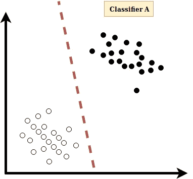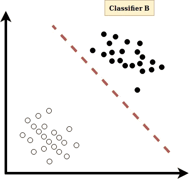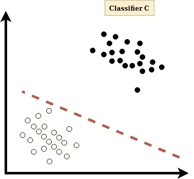

Figure 1: Improper Classifiers

考虑上面的分类器。有两类:

*   ' **+1** ':暗数据点。
*   ' **-1** ':轻数据点。

那么，以上的量词有什么问题呢？？？如果我们仔细查看图 1 中的分类器，我们无法确定这两个类的正确区域。超平面(超平面是将两个类分类的平面。这里，分类器 **A** 中的虚线)看起来非常接近于类“ **-1** ”。分类器 **B** 中的超平面看起来更接近于类“ **+1** ”。分类器 **C** 中的超平面看起来更接近于类“ **-1** ”。看起来，如果超平面更接近一个阶级，那么它更偏爱那个特定的阶级而不是另一个阶级。如果是这样的话，那么分类器出错的机会将会更大，如图 2 所示。

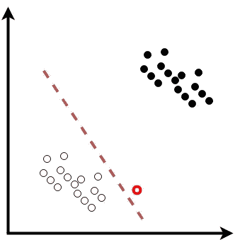

Figure 2: The red coloured data point is mistakenly classified by the classifier

可以观察到，最好的分类器应该是超平面与两个类的距离相等的分类器(没有偏好)。如果班级和超平面之间的距离最大，那就更好了。这就是 SVM 的情况，如图 3 所示。**注:偏爱的概念只是为了理解直觉。没有这样的想法被用来制定 SVM。**

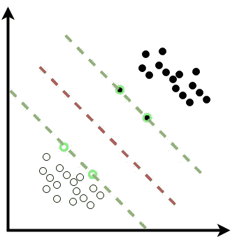

Figure 3: The red coloured dashed line is the optimal hyper plane. The green coloured dashed lines define the boundary for each class. And the data points with green coloured thick outline that are on the boundary of the class are called support vectors. Hence, the name Support Vector Machine

图 3 的标题很好地描述了该图。关于 SVM 有趣的事情是，只有支持向量被认为是确定最佳超平面。我们将很快证明这一说法。

# 问题 1:如果数据点不能像图 3 中那样被一个直的超平面分隔开会怎样？？？

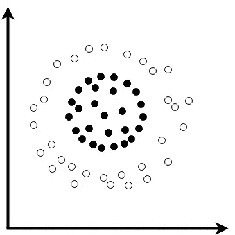

Figure 4

如果我们考虑图 4，在二维空间中不存在可以对图中所示的数据点进行分类的超平面。但是，SVM 有一个解决方案，这就是为什么 SVM 很有趣。在这种情况下，给定的空间被转换到更高维度的空间，使得数据点在新的空间中是可分离的。因此，数据点被分类到更高维度的空间中，并被映射回原始空间。这个概念似乎有些棘手。因此，仔细查看下面显示的观想。

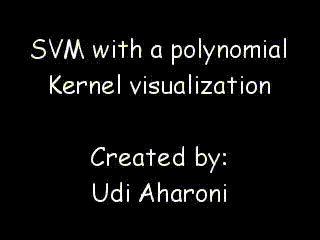

Figure 5: Visualisation of transformation from given space to higher dimensional, classify data points in the new space and then map everything back to the original space. Source: [https://www.youtube.com/watch?v=3liCbRZPrZA](https://www.youtube.com/watch?v=3liCbRZPrZA)

图 5 中的可视化给出了从给定空间到更高维度空间的转换的清晰概念。在上面的可视化中，粉红色的超平面可以很容易地对高维空间中的数据点进行线性分类。因此，图 4 中的数据点可以如图 6 所示进行分类。

Figure 6

# 核函数的作用和问题 2

SVM 的另一个问题是，转换到更高维度空间，然后确定新空间中的最优超平面，然后转换回原始空间的过程非常复杂，并且开销很高。例如，如果在 100 维空间中有 1000 个特征，并且如果 100 维空间被转换成 1000 维空间，那么每个特征向量将具有 1000 个分量和 1000 * 1000 次计算**(如此多的计算是因为超平面被描述为 W.X + b = 0，其中 X 是特征向量)**将被要求确定最佳超平面，并且超平面将再次被映射回原始空间。而且这整个过程开销很大。

解决上述问题的方法是 k **ernel 函数**。关于核函数有趣的事实是，核函数做了上面的映射，而实际上没有去更高维的空间。换句话说，核函数进行上述映射，而不实际执行高维空间中的所有上述计算。

使用如图 7 所示的多项式核函数ϕ((a，b)=(a，b，a + b)来完成图 5 所示的可视化中的变换。

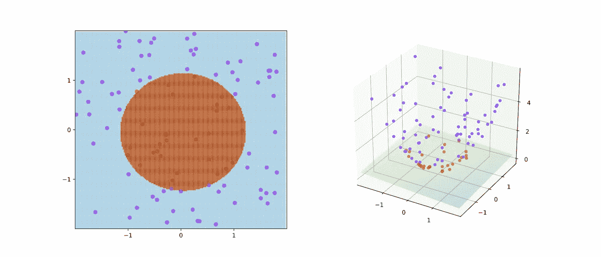

Figure 7: Training example of SVM with kernel given by ϕ((a, b)) = (a, b, a² + b²). Source: [https://en.wikipedia.org/wiki/Support_vector_machine](https://en.wikipedia.org/wiki/Support_vector_machine)

请注意，只有当问题包含点积或内积时，核函数才适用。幸运的是，SVM 的公式依赖于点积(将在接下来的章节中被证明)。

# 数学建模

让我们来破解支持向量机背后的数学。给定，训练集{(Xᵢ,Yᵢ)其中 i=1，2，3，…，n}，Xᵢ ∈ ℜᵐ，Yᵢ ∈ {+1，-1}。这里，Xᵢ是 iᵗʰ数据点的特征向量，Yᵢ是 iᵗʰ数据点的标签。标签可以是正类的“+1”或负类的“-1”。取值“1”是为了数学上的方便。

设 Wᵢ是垂直于决策边界(最佳超平面)的向量，Xᵢ是未知向量。那么 Xᵢ向量在 Wᵢ单位向量上的投影将确定该未知点属于正类还是负类，如图 8 所示。

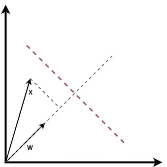

Figure 8

**注:在接下来的章节中，Wᵗ或 w 上升到 t 表示 w 转置。并且两个向量 w 和 x 之间的点积与 Wᵗ和 x 之间的矩阵乘法相同。**

基本上，对于具有由 **WᵗXᵢ + b = 0** 给出的判定边界的分类器，可以说:

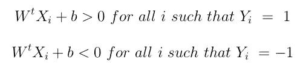

Figure 9

Figure 10

现在，如果我们取所有'+1 '模式的最小值，那么它将是某个常数ϵ，如果我们取所有'-1 '模式的最大值，那么它将是某个常数-ϵ.这里，ϵ和-ϵ代表支持向量。在图 10 中，具有粗边界的数据点是支持向量。所以，它可以写成:

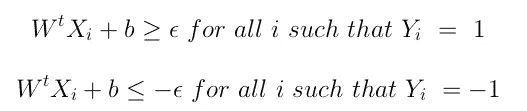

Figure 11

现在，如果我们用 **1/{ϵ}** 缩放上述不等式，那么最优超平面将保持不变。所以，我们用相同的符号来表示缩放后的向量。所以，它可以写成:

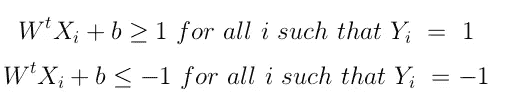

Figure 12

可以观察到，如果上述不等式乘以相应的 Yᵢ，则上述断言可以由单个表达式描述:

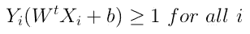

Figure 13

在图 12 的 1ˢᵗ方程中， **Yᵢ=1** 并且当 **1** 乘以 **RHS** 时，我们得到 1。而在 2ⁿᵈ方程 **Yᵢ=-1** 中，当 **-1** 乘以 **RHS** **(-1)** 则得到 **1** 。因为，负数被相乘，所以符号改变。

设， **X⁺** 为正类下的支持向量， **X⁻** 为负类下的支持向量。然后，**wx⁺+b = 1wx⁺= 1-b**。同理，**wx⁻+b =-1wx⁻=-1-b**。然后，向量 **(X⁺ — X⁻)** 在 **W** 向量的单位向量上的投影给出了两个类的支持向量之间的分离间隙的宽度或余量。边距的宽度由下式给出:

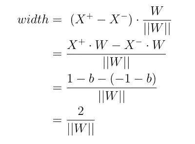

Figure 14: Width of the separation gap

SVM 的目的是最大化分离间隙的宽度。这意味着最大化 2/||W||与最小化||W||相同，与最小化||W||相同，与最小化(1/2)||W||相同，同样的东西可以写成(1/2)WᵗW. )，这样做是为了数学上的方便。此外，这样做将问题转化为二次优化问题，二次优化问题没有局部最大值。除此之外，二次优化问题的原始和对偶总是相同的。SVM 的基本问题可以简单地写成:

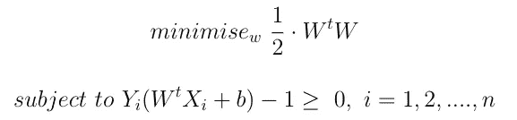

Figure 15: The problem for a hard SVM

在真实场景中，数据不是严格线性可分的。因此，通过引入松弛变量**‘ξ’**和惩罚项**‘C’**对问题进行了修正。这里，**‘C’**是一种正则化参数。实际上，如果**‘C’**的值很大，这意味着它不会忽略任何错误，而是会惩罚几乎每个错误，在这种情况下，它可能无法找到最佳的 **W** 和 **b** 。反之，如果**‘C’**的值非常小，则意味着它忽略了几乎所有的错误，然后 **W** 和 **b** 将获得任意随机值。因此，我们必须使用交叉验证来选择合适的值**‘C’**，它必须在很小和很大之间。因为每个错误并不都一样糟糕，所以它使用松弛变量**‘ξ’**，这是数据点和另一边的类的边距之间的距离，如图 16 所示。如果一个数据点的 **ξᵢ** 越少，那么错误就越少，并且 **C*ξᵢ** 也会越少。所以，对错误的惩罚会少一些。如果一个数据点的 **ξᵢ** 高，则错误更严重，相应地 **C*ξᵢ** 也会更多。因此，对这一错误的惩罚将会很高。

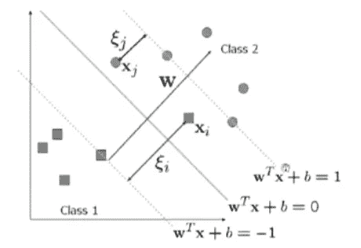

Figure 16: SVM with optimal hyper plane and slack variables

因此，图 15 中的问题可以改写为:

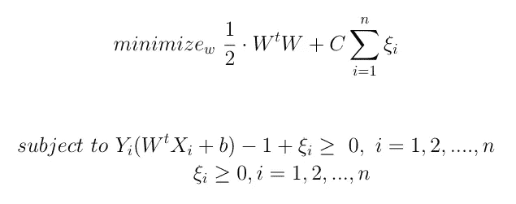

Figure 17: Problem for Soft SVM

硬 SVM 试图严格分类的数据点，但在现实中，这是不可能的。因此，很少考虑错误，软 SVM 开始发挥作用。

在继续之前，请考虑以下几点:

1.  理解等高线图对于理解拉格朗日的概念是非常重要的。如果您不熟悉等值线图，请仔细浏览此链接中的视频:[https://www . khanacademy . org/math/multivariable-calculus/multivariable-derivatives/gradient-and-direction-derivatives/v/gradient-and-contour-maps](https://www.khanacademy.org/math/multivariable-calculus/multivariable-derivatives/gradient-and-directional-derivatives/v/gradient-and-contour-maps)
2.  如果您不熟悉拉格朗日法，强烈建议您浏览给定链接中的每个视频，以便更好地理解:[https://www . khanacademy . org/math/multivariable-calculus/applications-of-multivariable-derivatives/la grange-multipliers-and-constrained-optimization/v/constrained-optimization-introduction](https://www.khanacademy.org/math/multivariable-calculus/applications-of-multivariable-derivatives/lagrange-multipliers-and-constrained-optimization/v/constrained-optimization-introduction)
3.  如果你想跳过第 2 点中提到的视频，那么只需记住以下几点:(I)如果问题是找到极值(最大值或最小值)，那么使用拉格朗日。(ii)拉格朗日将约束优化问题转化为无约束优化问题。
4.  约束优化问题的拉格朗日函数由主问题以及所有约束和拉格朗日乘子组成。对于每个约束，使用拉格朗日乘数。
5.  对偶:根据对偶，每个优化问题都有另一个与之相关的问题，因此可以从前者派生出来。原问题被称为**‘原始’**，衍生问题被称为**‘对偶’**。在二次优化问题中，原始问题和对偶问题的解是相同的。

希望你已经考虑了上述几点。因此，图 17 中的等式是最主要的问题。但是，我们实际上对对偶问题感兴趣。因为由特征向量和核函数之间的点积组成的对偶问题可以用于非线性扩展(换句话说，对于不可线性分离的数据点的非线性扩展)。

这里，拉格朗日乘数用于二元化。拉格朗日乘子的总数等于原问题中约束的总数。由于图 17 中的等式有两个约束，拉格朗日函数中将使用两个拉格朗日乘数。拉格朗日函数如下所示:

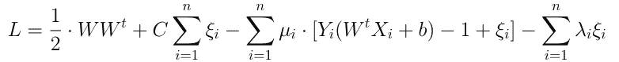

Figure 18: The Lagrangian

图 18 中的等式(L)是拉格朗日乘数，μ，λ是拉格朗日乘数，μ，λ ≥ 0。拉格朗日方程的最小值是通过对变量取偏导数并使它们等于零(根据卡鲁什-库恩-塔克(KKT)条件)得到的。给定问题的 KKT 条件如下:

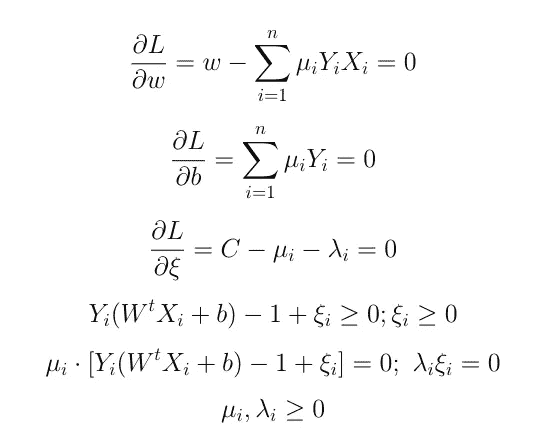

Figure 19: The KKT conditions

**注:**这里， **1/Yᵢ** 始终等于 **Yᵢ** 。因为，**对于 yᵢ= 11/yᵢ= 1/1 = 1 =yᵢ**和**对于 yᵢ=-11/yᵢ= 1/(-1)=-1 =yᵢ**。因此，在接下来的章节中， **1/Yᵢ** 总是被写成 **Yᵢ** 。

根据图 19 中的 1ˢᵗ方程，它可以写成:

**W=∑ᵢⁿ μᵢYᵢXᵢ对于 i = 1，2，…，n————>(a)**

现在，根据图 19 中的 3ʳᵈ方程，可以写成 **C = μᵢ+λᵢ** 。因此，对于μᵢc，λᵢ = 0 ，因此ξᵢ = 0 。因此，图 19 中的 6ᵗʰ方程: **μᵢ⋅[Yᵢ(WᵗXᵢ+b) -1 + ξᵢ] = 0** 可以改写为:

**yᵢ(wᵗxᵢ+b)= 1—————>(b)**

等式 **(B)** 描述了支持向量。对于**yᵢ= 1 wᵗxᵢ+b = 1**，即位于类**'+1’**边界上的点。对于**yᵢ=-1 wᵗxᵢ+b =-1**，即位于类 **'-1'** 边界上的点。因此，最佳超平面取决于支持向量。现在，等式 **(B)** 可以重写为:

**b = Yᵢ-WᵗXᵢ使得 0<μᵢ<c————>(c)**

因此，方程 **(A)** 和方程 **(C)** 给出了最优的 **W** 和最优的 **C** ，从而得到最优的超平面( **WᵗXᵢ + b = 0** )。此外，在等式 **(A)** 中可以观察到 **W** 可以完全描述为训练模式 **Xᵢ** 的线性组合。现在，将最优值 **W** 和 **b** 放入拉格朗日方程，对偶优化问题为:

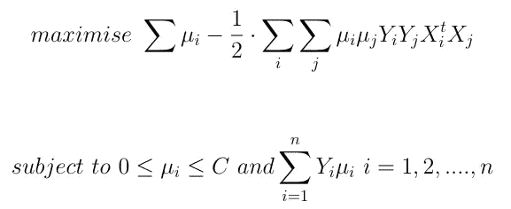

Figure 20: Dual optimisation problem

注意，根据图 20 中的等式，完整的算法可以用数据点之间的点积来描述( **XᵢᵗXⱼ** )。因此，核技巧可用于非线性扩展，即任何核函数可用于在更高维度空间中寻找点积，如**xᵢᵗxⱼ=k(ϕ(xᵢ),ϕ(xⱼ)】**。一些流行的内核函数有:

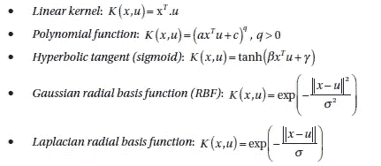

Kernel Functions

谢谢，这就是 SVM。希望这篇文章是有用的。

# 参考

[1] **P. H .温斯顿，学习:支持向量机。**网址:[https://OCW . MIT . edu/courses/electrical-engineering-and computer-science/6-034 人工智能-2010 年秋季/讲座-视频/讲座-16-学习-支持-向量-机器/](https://ocw.mit.edu/courses/electrical-engineering-andcomputer-science/6-034artificial-intelligence-fall-2010/lecture-videos/lecture-16-learning-support-vector-machines/)

【2】**p . p . Sastry，支持向量机——导论，获得最优超平面。**网址[http://nptel.ac.in/courses/117108048/32](http://nptel.ac.in/courses/117108048/32)

[3] **M. Awad，R. Khanna，高效的学习机器**，APress，2015，Ch。3，4，第 39-80 页。