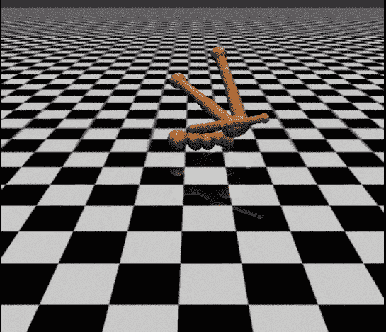
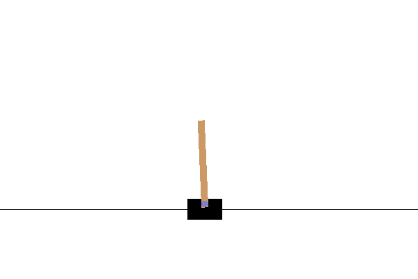
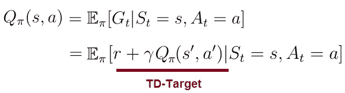
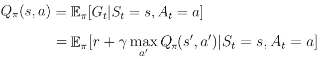
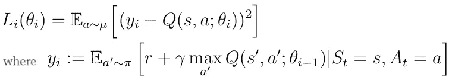
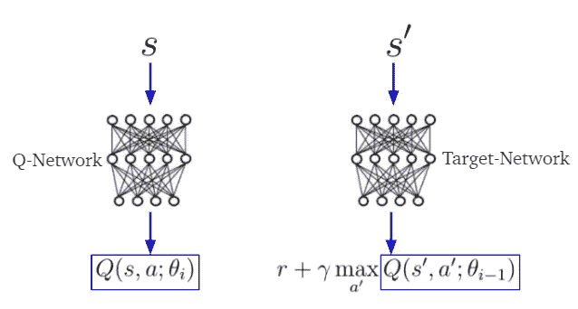
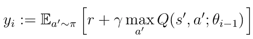
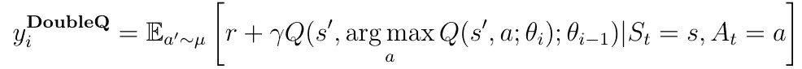
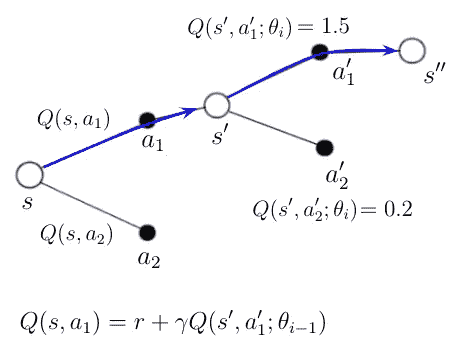
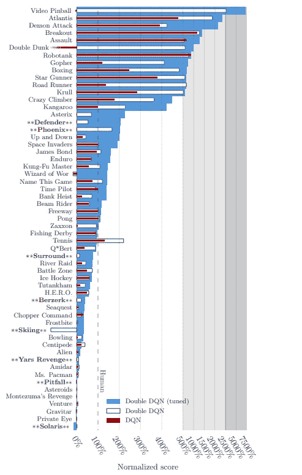

# 自我学习人工智能代理 III:深度(双)Q 学习

> 原文：<https://towardsdatascience.com/deep-double-q-learning-7fca410b193a?source=collection_archive---------2----------------------->

## 让深度 Q 学习再次变得伟大。关于自学习人工智能代理的系列文章的第三部分。

## 自学习人工智能代理系列—目录

*   [第一部分:马尔可夫决策过程](/self-learning-ai-agents-part-i-markov-decision-processes-baf6b8fc4c5f)
*   [第二部分:深度 Q 学习](/self-learning-ai-agents-part-ii-deep-q-learning-b5ac60c3f47)
*   第三部分:深(双)问学习(**本文**)
*   第四部分:持续行动空间的政策梯度
*   第五部分:决斗网络
*   第六部分:异步演员-评论家代理
*   …

## 如果你喜欢这篇文章，想分享你的想法，问问题或保持联系，请随时通过 LinkedIn 与我联系。

## 0.介绍

在“自我学习 AI-Agents”系列的第二篇文章中，我向您介绍了作为一种算法的深度 Q-Learning，它可以用来教会 AI 在离散动作空间中的行为和解决任务。然而，这种方法并不是没有缺点，有可能导致人工智能代理的性能降低。

在下文中，我将介绍一个常见的问题**深度 Q-Learning** ，并向您展示如何将普通实现扩展到我们所说的**双重深度 Q-Learning** ，这通常会提高 AI 代理的性能。

## 怎么才能练成深度双 Q 学习？

> OpenAI 的体操横竿问题的这个例子是用这里介绍的双 Q 学习算法解决的——以及上一篇文章中的一些技术。文档齐全的源代码可以在我的 [GitHub 库](https://github.com/artem-oppermann/Deep-Reinforcement-Learning/tree/master/src/double%20q%20learning)中找到。我选择了 CartPole 作为一个例子，因为这个问题的训练时间非常短，你可以很快地自己重现它。克隆存储库并执行 **run_training.py** 来启动算法。

## 1.动作值函数

在本系列的前两部分中，我介绍了动作值函数 ***Q(s，a)*** 作为期望回报***G _ t***AI 代理将通过从状态 ***s*** 开始，采取动作 ***a*** ，然后遵循某个策略 ***π* 来获得。**

Eq. 1 Action value function **Q(s,a)**.

等式的右边部分也被称为*时间差目标*(TD-目标)。TD-Target 是代理人在状态*中为动作 ***a*** 获得的即时奖励与贴现值***Q(s ')****a '*之和，贴现值是代理人将在下一个状态 ***s'*** 中采取的动作。*

****Q(s，a)*** 告诉代理一个可能动作的值(或质量)****s***。给定一个状态 ***s*** ，动作值函数计算该状态下每个可能动作 ***a_i*** 的质量/值作为标量值。更高的质量意味着对于给定的目标更好的行动。对于一个人工智能代理，一个可能的目标是学习如何走路或如何与人类棋手下棋。**

**遵循贪婪策略 w.r.t ***Q(s，a)*** ，意味着采取导致 **Q(s，a’)**的最高值的动作*导致*贝尔曼最优性方程，*给出了 ***Q(s，a)*** ( [参见第一篇](/self-learning-ai-agents-part-i-markov-decision-processes-baf6b8fc4c5f)[贝尔曼方程也可用于递归计算任何给定动作或状态的所有值***【Q(s，a)】***。](/self-learning-ai-agents-part-i-markov-decision-processes-baf6b8fc4c5f)***

****

**Eq.2 *Bellmann Optimality Equation.***

**在系列文章的[第二篇文章中，介绍了*时间差异学习*作为估计值 ***Q(s，a)*** 的更好方法。时间差异学习的目标是最小化 TD 目标和***【s，a】***之间的距离，这表明 ***Q(s，a)*** 向其在给定环境中的真实值收敛。这被称为 *Q-Learning* 。](/self-learning-ai-agents-part-ii-deep-q-learning-b5ac60c3f47)**

## **2.深度 Q-网络**

**我们已经看到，神经网络方法被证明是估计 ***Q(s，a)*** 的更好方法。主要目标保持不变。它是 ***Q(s，a)*** 与 TD-Target 的距离(或 ***Q(s，a)*** 的时态距离)的最小化。这个目标可以表示为误差损失函数的最小化:**

****

**Eq. 3 Squared error loss function.**

**在**深度 Q 学习**TD-Target***y _ I***和 ***Q(s，a)*** 分别由两个不同的神经网络估计，这两个网络通常称为 Target-和 Q-网络(图 4)。参数 ***θ(i-1)*** (权重、偏差)属于目标网络，而 ***θ(i)*** 属于 Q 网络。**

**根据*行为策略* ***(a|s)选择 AI 代理的动作。*** 另一边，贪婪目标策略 **π(a|s)** 只选择动作***【a’***即最大化***【Q(s)***，即用于计算 TD-Target。**

****

**Fig. 1 Target,- and Q-Network. **s** being the current and **s’** the next state.**

**误差损失函数的最小化可以通过深度学习中使用的常用梯度下降算法来实现。**

> *****即将推出* :** *面向软件开发人员、数据分析师、学者和行业专家的高级深度学习教育，旨在加快向人工智能职业的过渡。***
> 
> ***更多详情请看:*[*www.deeplearning-academy.com*](https://www.deeplearning-academy.com/)**

****

**[www.deeplearning-academy.com](https://www.deeplearning-academy.com/)**

## **3.深度 Q 学习的问题**

****深度 Q 学习**已知有时会学习不切实际的高行动值，因为它包括对估计行动值的最大化步骤，这往往倾向于高估而不是低估的值，这可以在 TD-Target***y _ I***的计算中看到。**

****

**在实践中，高估是否会对人工智能代理的性能产生负面影响，这仍然是一个或多或少有待解决的问题。过于乐观的价值估计本身并不一定是一个问题。如果所有的值都一致地更高，那么相对的动作偏好被保留，并且我们不期望得到的策略会更差。**

**然而，如果高估并不一致，也没有集中在我们希望了解更多的州，那么它们可能会对最终政策的质量产生负面影响。**

****

## **4.双重深度 Q 学习**

****双 Q 学习**的思路是通过将目标中的 *max* 运算分解为**动作选择**和**动作评估**来减少高估。**

**在普通实现中，动作选择和动作评估是耦合的。我们使用目标网络来选择行动，同时评估行动的质量。这意味着什么？**

**目标网络为状态 ***s*** 中的每个可能动作 ***a_i*** 计算 ***Q(s，a_i)*** 。贪婪策略决定选择最高值 ***Q(s，a_i)*** 哪个动作 ***a_i*** 。这意味着目标网络**选择**动作 ***a_i*** ，同时**通过计算 ***Q(s，a_i)来评估***其质量。双 Q 学习试图将这两个过程相互分离。****

**在**双 Q 学习**中，TD 目标看起来如下:**

****

**正如您所看到的，目标中的最大运算消失了。虽然具有参数 ***θ(i-1)*** 的目标网络评估动作的质量，但是动作本身由具有参数 ***θ(i)的 Q 网络确定。*** 该过程与深度 Q 学习的普通实现形成对比，在深度 Q 学习中，目标网络负责动作选择和评估。**

**新 TD-Target***y _ I***的计算可以总结为以下步骤:**

*   **Q-网络使用下一个状态***【s’***来计算质量***Q(s’，a)*** 对于每个可能的动作 ***a*** 处于状态***【s’*****
*   ***argmax* 操作应用于***Q(s’，a)*** 选择属于最高质量的动作****动作选择*****
*   ***选择属于动作***【a*】***【a *】(由目标网络确定)**的质量 ***(由 Q 网络确定)用于目标的计算。(**动作评价**)********

********

****Fig 2\. Path of the agent through different states.****

******双 Q 学习**的过程可以再一次以图形的形式可视化，以便进一步理解(图 2)。一个 AI 智能体开始时处于状态 ***s*** 。基于一些先前的计算，他知道在该状态下可能的两个动作的品质 ***Q(s，a_1)*** 和 ***Q(s，a_2)*** 。他决定采取行动 ***a_1*** 并结束于状态***s’***。****

****Q-网络计算质量***Q(s’，a _ 1’)***和 ***Q(s，a _ 2’)***用于这个新状态中可能的动作。动作***a _ 1’***被挑选，因为根据 Q 网络，它产生最高质量。****

****状态*中动作 ***a_1*** 的新动作值 ***Q(s，a1)*** 现在可以用图 2 中的等式来计算，其中***Q(s’，a _ 1’)***是由目标网络确定的***a _ 1’***的评估。*****

## ****4.实证结果****

****在[1] *中，David Silver 等人*在几款 *Atari 2600* 游戏上测试了深度 Q 网络(DQNs)和深度双 Q 网络(Double DQNs)。在图 3 中示出了由这两种方法的 AI 代理实现的标准化分数以及可比较的人类表现。该图还包含双 DQN 的调谐版本，其中执行了一些超参数优化。然而，这个版本的 DQN 将不在这里讨论。****

****可以清楚地注意到，这两个不同版本的双 dqn 在这方面比它的普通实现获得了更好的性能。****

********

****Fig. 3 Performances on Atari 2600 games.****