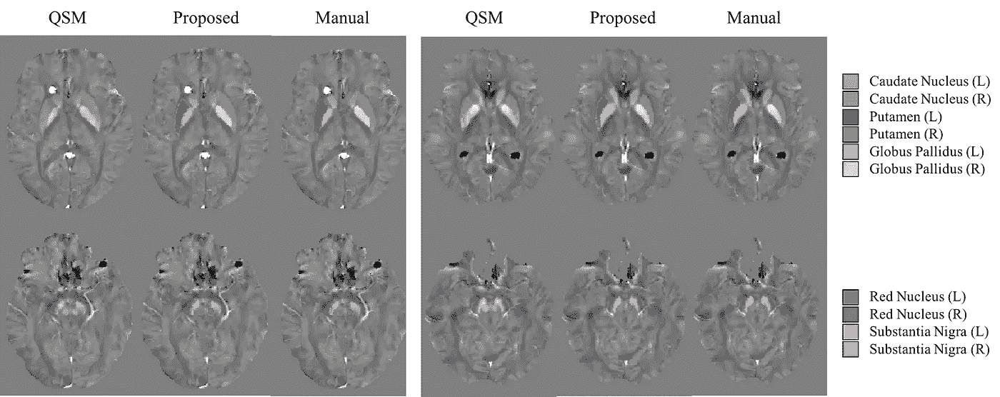
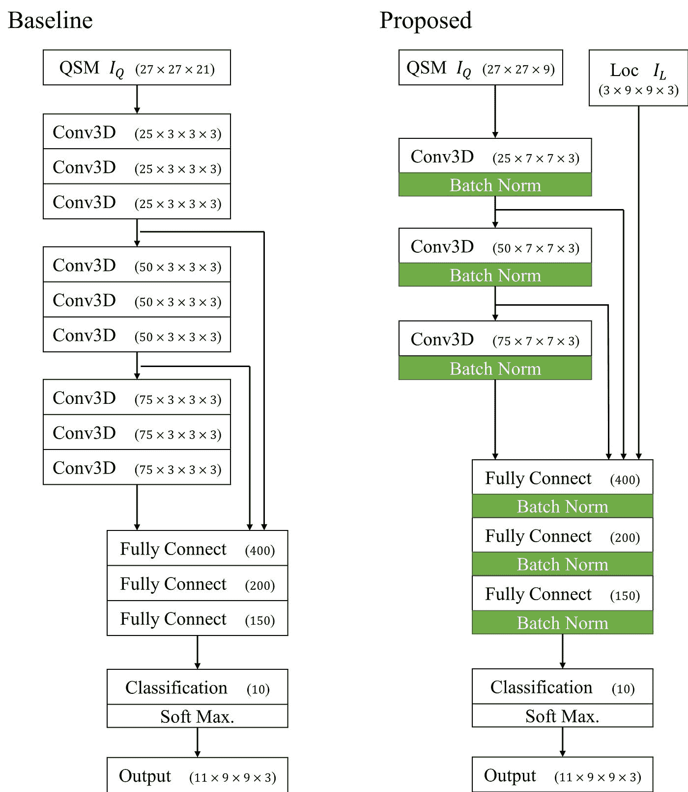
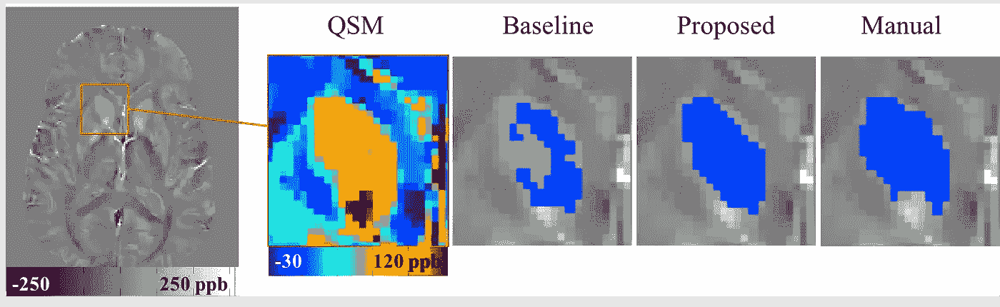
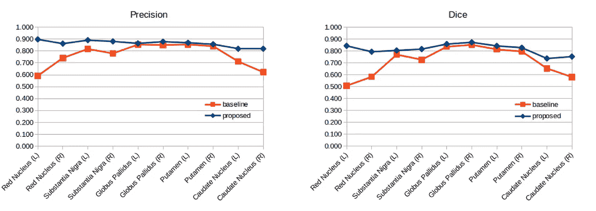

# 使用 3D 卷积神经网络的深部灰质(DGM)分割:在 QSM 的应用(第二部分)

> 原文：<https://towardsdatascience.com/deep-gray-matter-dgm-segmentation-using-3d-convolutional-neural-network-application-to-qsm-part-83c247416389?source=collection_archive---------16----------------------->

背景信息和以前的结果可在[第 1 部分](https://medium.com/@zheliu/deep-gray-matter-dgm-segmentation-using-neural-network-application-to-qsm-a0183cb3e3ae)中找到:

# 代码(更新)

可在 Github 获得:【https://github.com/zl376/segDGM_CNN 

# 描述

该记录包括对先前用于 QSM 图像上的深灰质(DGM)分割的 3D 卷积神经网络模型(基线模型)的以下更新:

Example cases where proposed and manual segmentation are performed

## 网络体系结构

Flowchart for Baseline (left) and Proposed (right) model

*   **内核大小**:从(3，3，3)变为(7，7，3)，以说明各向异性的图像分辨率
*   **每层后批量归一化**以提高收敛性
*   **空间坐标输入**作为辅助特征

## 训练参数

执行 10 重交叉验证，其中 18 个案例用于训练，2 个用于测试。最大纪元是 60 年。学习率最初设置为 0.001，每 20 个时期减少 10 倍。

# 改进的结果

Comparison of Baseline, proposed and manual segmentation for Caudate Nucleus.

较大的卷积核有助于完全捕捉 DGM 结构，如上例所示，其中基线模型中使用的较小核不必要地关注尾状核边界的对比度。

Precision and Dice score for Baseline and proposed model

在精确度和骰子得分度量中也观察到了改进，尤其是对于红核，其横截面形状类似于其他结构，例如静脉或出血。辅助输入中的空间信息有助于区分红核和那些结构。

# 后续步骤

*   **数据扩充**:缩放和旋转训练数据集，以处理临床应用中 DGM 大小和方向的变化。
*   **合并其他模态**如 R2*图像或 T1w 图像。