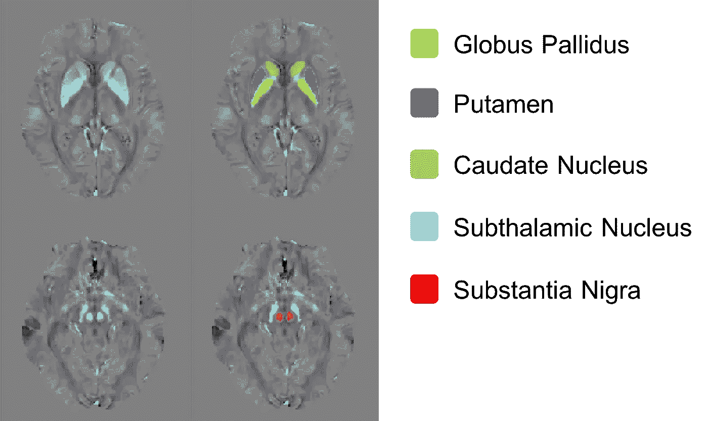
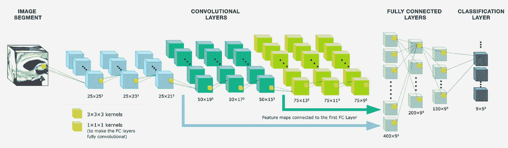
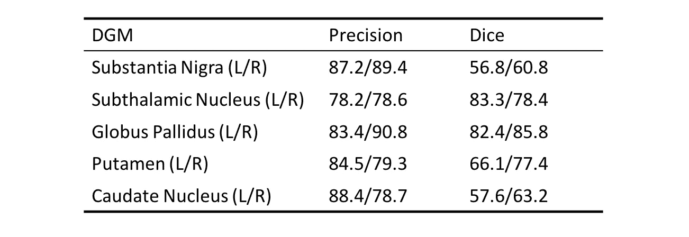
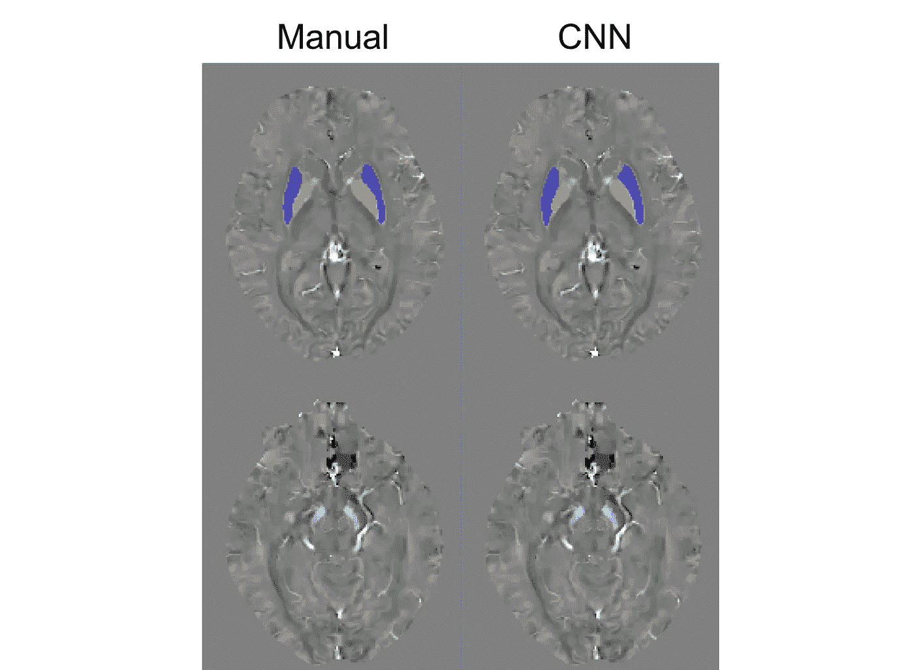

# 使用 3D 卷积神经网络的深部灰质(DGM)分割:在 QSM 的应用(第一部分)

> 原文：<https://towardsdatascience.com/deep-gray-matter-dgm-segmentation-using-neural-network-application-to-qsm-a0183cb3e3ae?source=collection_archive---------4----------------------->

【更新 2018–02–04】:新的结果可以在 [Part 2](https://medium.com/@zheliu/deep-gray-matter-dgm-segmentation-using-3d-convolutional-neural-network-application-to-qsm-part-83c247416389) 找到。

# 密码

可在 Github 获得:【https://github.com/zl376/segDGM_CNN 

# 动机

在 MRI 分析中，计算机化的自动分割是期望的，并且实际上被广泛研究。具体而言，对于 QSM(定量磁化率绘图)，一种量化和描绘受试者中铁/钙分布的 MRI 技术，深灰质(DGM)的感兴趣区域(ROI)测量是不同重建算法之间一致性的公认度量。DGM 铁矿资源丰富，是 QSM 的一个亮点，因此通常选择该地区作为研究目标。

Deep Gray Matter includes: Basal ganglia (Globus pallidus, Putamen and Caudate nucleus), subthalamic nucleus and substantia nigra.

通常，DGM ROI 的绘制是由经验丰富的放射科医生手动完成的，这需要花费大量的时间，并且固有地限制了分析的样本量(<20 subjects). Therefore, I try to train a neural network to segment the DGM based on QSM, for ROI measurement analysis at a potentially large scale (e.g. ~500 subjects).

# Method

Convolutional Neural Network is chosen as the framework for segmentation. The model used in this work is based on:

*   [用于 MRI 皮质下分割的 3D 全卷积网络:一项大规模研究](http://www.sciencedirect.com/science/article/pii/S1053811917303324)
*   [使用三维完全卷积神经网络和伪标记进行六个月婴儿脑组织分割](https://github.com/joseabernal/iSeg2017-nic_vicorob)

当前的 CNN 是通过以下平台/包实现的:

*   张量流
*   Python 3.5
*   Keras 2.0.2

# 数据预处理

这项工作收集并命名了来自 20 个受试者的 QSM。由有经验的专家在每个病例上绘制不同深灰质(DGM)的 ROI，并将其作为参考分割。

Example for QSM (left) and ROI (right) for DGM

QSM 重建的原始结果跨越一系列矩阵大小、分辨率和覆盖范围(视野)，因此数据在输入网络之前需要归一化。

## 数据标准化

所有 20 个三维图像被重新调整到相同的体素尺寸(1 毫米、1 毫米、3 毫米)并被裁剪成矩阵尺寸(160、220、48)。这提供了(16 厘米，22 厘米，14.4 厘米)的体积覆盖，对于普通人的大脑来说足够大。QSM 的磁化率值被裁剪为-0.2ppm 至 0.2ppm，并重新调整为 0~255。从人工分割中提取 11 个类别:1 个类别用于背景，2 个类别(左/右)用于 5 个 DGM 中的每一个。处理后的图像保存为 Nifti 文件，并提供给以下 CNN。

15 个案例表示为训练集，5 个用于测试。

# 训练 CNN

Overview of the 3D CNN, as proposed by [Dolz et al. Neuroimage 2017](http://www.sciencedirect.com/science/article/pii/S1053811917303324).

如在用于 iSeg2017 的[解决方案中所建议的，输入 3D 体积(QSM 和类别标签)被分割成对应于输出片尺寸(9，9，9)的更小的片(27，27，27)，并且仅具有背景标签的那些被从训练中丢弃。这个技巧极大地减少了数据的大小，从而减少了用于训练的内存。对于这项工作，这里的切片厚度(3 毫米)比他们的(1 毫米)大 3 倍，因此输入面片大小选择为 **(27，27，21)** ，对应于输出大小(9，9，3)。](https://github.com/joseabernal/iSeg2017-nic_vicorob)

选择 1/4 的输入数据进行验证。选择交叉熵作为损失函数。

## 针对误报的微调

由于一些补丁在训练前就被丢弃了，这些区域的信息还没有被 CNN 利用。在训练 CNN 之后，如果这些小块通过网络并与参考标签比较(验证)，观察到背景类可能被错误分类为 DGM，这被表征为假阳性。

那些假阳性被 CNN 的第二轮微调处理:那些具有假阳性的小块被包括在输入集合中；然后，基于先前获得的“最优”权重，使用扩充的输入数据来重新训练网络。

## 参数选择

学习率被指定为 0.0001，然后减少到 0.00001。最大历元数为 40，当验证损失停止下降时，触发提前停止。

# 后处理

正如在[大型研究论文](http://www.sciencedirect.com/science/article/pii/S1053811917303324)中注意到的，分割可能由一些孤立的小“岛”组成，而不是目标 DGM 构造。这是为了在每个 DGM ROI 的分割中保持最大的连通分量。

# 结果和评估

计算每个 DGM 的精度(真阳性对所有阳性预测)和[骰子点数](https://en.wikipedia.org/wiki/Sørensen–Dice_coefficient)，如下所示。

一个很好的例子:

一个不太好的例子:

在结果中观察到对特定 DGM(尤其是黑质和尾状核)的低估。对于这两个 DGM，这也在表中表示为低骰子分数。

# 讨论

## 样本量

在这项工作中，样本量有点小(15 个训练+ 5 个测试)，但已经给出了一些有希望的结果，如上所示。保存所有 3D 碎片所需的昂贵的 3D 卷积和存储器是使用大样本量的主要障碍。在目前的训练平台上(酷睿 i3，16GB RAM，11GB 内存的 GTX 1080Ti)，微调阶段占用了大约 50%的 GPU 内存。潜在地，样本大小可以加倍(到~40)并且可以使用交叉验证来进一步评估 CNN 的性能。

## 损失函数

在当前的训练中，分类交叉熵被用作损失函数。虽然 Dice 分数等其他指标被广泛用于量化 ROI 协议，但有趣的是，看看用 Dice 分数代替交叉熵是否会提高 CNN。

## 分割不足

当应用于 5 个测试病例时，CNN 有时不能描绘某些 DGM 区域的整个结构，尤其是尾状核。这可能与卷积层中使用的内核大小有关。

这就引出了另一个有趣的问题:*欠分割真的是 ROI 分析的一个问题吗，尤其是在比较不同的 QSM 重建算法时？*

## 多类 vs .二进制？

考虑到 DGM 在解剖和功能上是相互联系的，至少对于基底神经节而言是如此，在基底神经节中，苍白球、壳核和尾状核之间的界面难以确定，因此多类分割可能不是这一特定任务的最佳框架。同时，整个任务可能被分成更小的子任务，其中我们使用二元分类器来分割每个 ROI:例如，在分割左侧苍白球时，目标结构中的体素被标记为类 1，而其他所有的被表示为类 0。训练速度可以受益于这种任务划分，因为对于每个子任务(ROI ),涉及的补丁数量比原始多类任务中的小得多。当所有子任务同时执行时，训练过程以 ROI 数量的因子加速。

## 多模态输入

在[iseg 2017](https://github.com/joseabernal/iSeg2017-nic_vicorob)的解决方案中，T1 和 T2 加权图像均用作每个受试者的输入。T1 和 T2 加权图像显示的不同对比度可能有助于区分不同的结构。而在 QSM 的研究中，T1/T2 图像通常是稀少的，或者如果有的话，也是未注册的，因为它们是在不同的时段获得的。然而，其他图像模态，如幅度(单回波)或 R2*图(演示信号在多个回波中衰减的速度)很容易与每个 QSM 图一起使用，并可以并入当前的 CNN。它对多通道输入数据的性能将是一个有趣的研究课题。