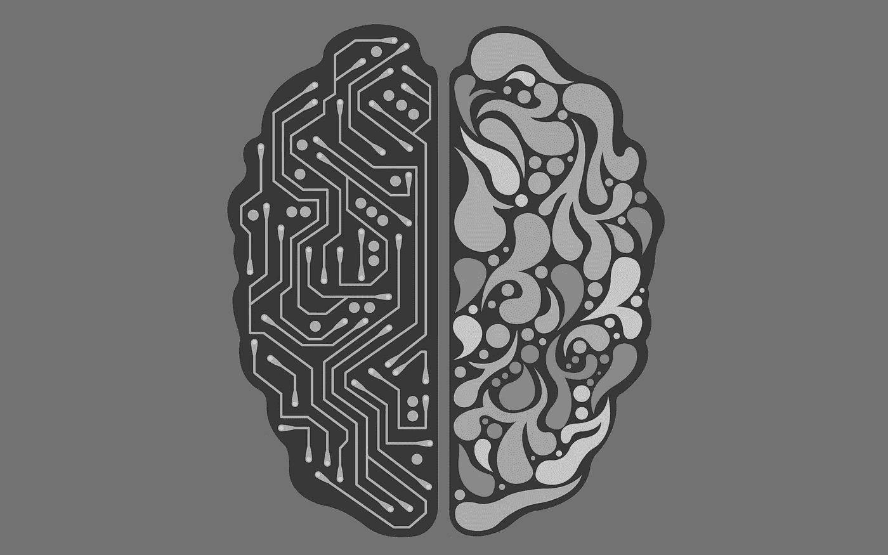

# 内心深处:自动编码器

> 原文：<https://towardsdatascience.com/deep-inside-autoencoders-7e41f319999f?source=collection_archive---------0----------------------->

自动编码器(AE)是神经网络，旨在将它们的输入复制到它们的输出。他们通过将输入压缩到一个**潜在空间** **表示**中，然后从这个表示中重建输出。这种网络由两部分组成:

1.  编码器:这是网络的一部分，它将输入压缩成潜在空间表示。可以用编码函数 *h=f(x)* 来表示。
2.  **解码器:**该部分旨在从潜在空间表示中重建输入。可以用解码函数 *r=g(h)* 来表示。

Architecture of an Autoencoder

因此，自动编码器作为一个整体可以由函数 *g(f(x)) = r* 来描述，其中您希望***【r***与原始输入 ***x*** 一样接近。

> 为什么要将输入复制到输出？

如果自动编码器的唯一目的是将输入复制到输出，那么它们将毫无用处。事实上，我们希望通过训练自动编码器将输入复制到输出，潜在表示*将呈现有用的属性。*

*这可以通过对复制任务创建约束来实现。从自动编码器获得有用特征的一种方式是约束*使其尺寸小于 ***x*** ，在这种情况下，自动编码器被称为**欠完成。**通过训练欠完整表示，我们迫使自动编码器学习训练数据的最显著特征。如果给自动编码器太多的容量，它可以学习执行复制任务，而不提取任何关于数据分布的有用信息。如果潜在表示的尺寸与输入相同，以及在**过完全**的情况下，潜在表示的尺寸大于输入，也会发生这种情况。在这些情况下，即使线性编码器和线性解码器也可以学习将输入复制到输出，而无需学习任何关于数据分布的有用信息。理想情况下，可以成功地训练自动编码器的任何体系结构，根据要建模的分布的复杂性选择编码维数以及编码器和解码器的容量。**

## **自动编码器的用途是什么？**

**今天**数据去噪**和用于数据可视化的**降维**被认为是自动编码器的两个主要有趣的实际应用。通过适当的维度和稀疏性约束，自动编码器可以学习比 PCA 或其他基本技术更有趣的数据投影。**

**自动编码器是从数据示例中自动学习的。这意味着很容易训练将在特定类型的输入上表现良好的算法的专门实例，并且它不需要任何新的工程，只需要适当的训练数据。**

**然而，自动编码器在图像压缩方面表现不佳。当自动编码器在给定的数据集上被训练时，它将在与所使用的训练集相似的数据上实现合理的压缩结果，但是将是较差的通用图像压缩器。像 JPEG 这样的压缩技术会好得多。**

**自动编码器被训练为当输入通过编码器然后通过解码器时尽可能多地保留信息，但是也被训练为使新的表示具有各种良好的属性。不同种类的自动编码器旨在实现不同种类的属性。我们将重点讨论四种类型的自动编码器。**

## **自动编码器的类型:**

**在本文中，将描述以下四种类型的自动编码器:**

1.  **标准自动编码器**
2.  **多层自动编码器**
3.  **卷积自动编码器**
4.  **正则化自动编码器**

**为了说明不同类型的自动编码器，我们使用 Keras 框架和 MNIST 数据集创建了一个示例。每种自动编码器的代码都可以在我的 [GitHub](https://github.com/Yaka12/Autoencoders) 上找到。**

## **标准自动编码器**

**在其最简单的形式中，自动编码器是三层网络，即具有一个隐藏层的神经网络。输入和输出是相同的，我们学习如何重建输入，例如使用 **adam 优化器**和**均方误差损失函数**。**

**这里，我们看到我们有一个**欠完成**自动编码器，因为隐藏层尺寸(64)小于输入(784)。这种约束将迫使我们的神经网络学习数据的压缩表示。**

## **多层自动编码器**

**如果一个隐藏层不够，我们显然可以将自动编码器扩展到更多的隐藏层。**

**现在我们的实现使用 3 个隐藏层，而不是只有一个。可以选择任何隐藏图层作为要素制图表达，但我们将使网络对称，并使用最中间的图层。**

## **卷积自动编码器**

**我们也可以问自己:自动编码器可以用于卷积而不是全连接层吗？**

**答案是肯定的，原理是相同的，但是使用图像(3D 矢量)而不是扁平的 1D 矢量。对输入图像进行下采样，以给出较小尺寸的潜在表示，并迫使自动编码器学习图像的压缩版本。**

## **正则化自动编码器**

**除了施加比输入维度更小的隐藏层之外，还有其他方法可以约束自动编码器的重构。**正则化的**自动编码器不是通过保持编码器和解码器浅和代码大小小来限制模型容量，而是使用损失函数来鼓励模型具有除了将其输入复制到其输出的能力之外的其他属性。在实践中，我们通常会发现两种类型的正则化自动编码器:稀疏的 T2 自动编码器和去噪的 T4 自动编码器。**

****稀疏自动编码器:**稀疏自动编码器通常用于学习另一个任务的特征，例如分类。已经被正则化为稀疏的自动编码器必须响应它已经被训练的数据集的独特统计特征，而不是简单地充当身份函数。通过这种方式，以稀疏性为代价执行复制任务的训练可以产生一个附带学到有用特征的模型。**

**我们可以约束自动编码器的重构的另一种方式是对其损耗施加约束。例如，我们可以在损失函数中加入一个正则项。这样做将使我们的自动编码器学习数据的稀疏表示。**

**请注意，在我们的隐藏层中，我们添加了一个 *l1* 活动正则化器，它将在优化阶段对损失函数应用惩罚。因此，与普通的自动编码器相比，这种表示更加稀疏。**

****去噪自动编码器:**通过改变损失函数的重建误差项，我们可以获得一个自动编码器，它可以学习一些有用的东西，而不是向损失函数添加惩罚。这可以通过在输入图像中添加一些噪声，并让自动编码器学习去除噪声来实现。通过这种方式，编码器将提取最重要的特征，并学习数据的鲁棒表示。**

## **摘要**

**在本文中，我们介绍了自动编码器的基本架构。我们还研究了许多不同类型的自动编码器:普通的、多层的、卷积的和正则化的。每一种都有不同的属性，这取决于所施加的约束:要么是隐藏层的维度减少，要么是另一种惩罚。**

## **我希望这篇文章对新的深度学习实践者来说是清晰和有用的，并且它让你对什么是自动编码器有了很好的了解！如果有不清楚的地方，请随时给我反馈或问我问题。**

** [## nathan hubens/自动编码器

### 在 GitHub 上创建一个帐户，为 Autoencoders 的开发做出贡献。

github.com](https://github.com/nathanhubens/Autoencoders)**