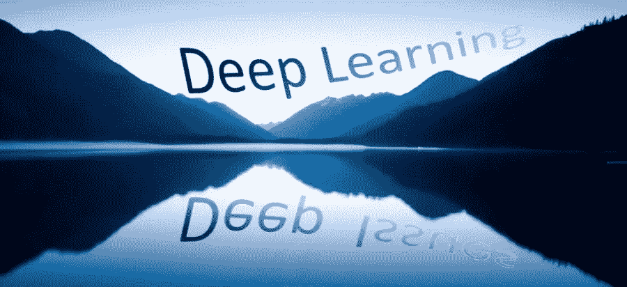
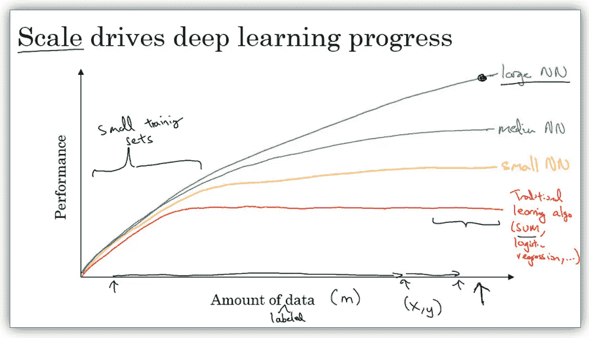
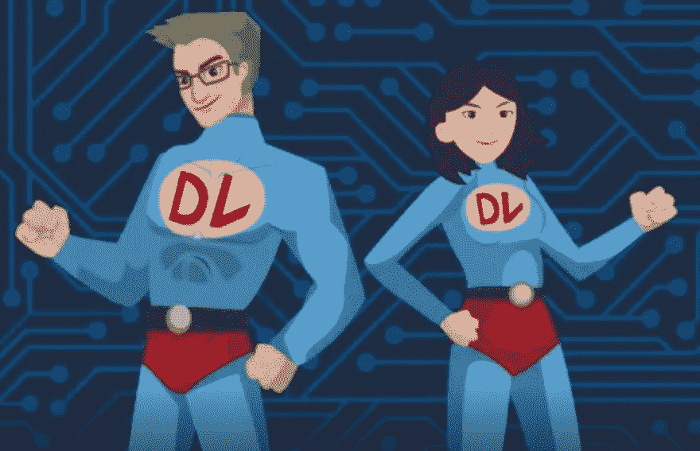

# 隐藏在深度学习下的深层问题:

> 原文：<https://towardsdatascience.com/deep-issues-lurking-within-deep-learning-f923a96564c7?source=collection_archive---------5----------------------->

对吴恩达深度学习 Coursera 专业化的思考

> TL；DR——我强烈推荐这个 MOOC 专业。但是，要注意！这不仅仅是另一张证书。更深层次的问题潜伏在表面之下，促使您更深入地思考使用这项新技术的责任。
> 
> 读者注意(2018–06–07):文章分为两部分。第一部分描述了面向数字图书馆潜在学生的 MOOC 课程。第二部分探讨了“那又怎样？”含义，尤其是 DL 实践者的责任。

我最近完成了 Coursera 深度学习(DL)专业化课程，包括 5 门课程、14 个课程周、180 个视频、29 个实验室和 5 次“英雄”访谈。[01]

我的动机是学习一项新技能，我做到了。然而，我也带走了许多问题和顾虑，以及一系列需要调查的项目。如果你致力于这一专业，你将获得更多的-另一个证书！以下是我对这一经历及其在更大背景下的意义的思考。

# 我的经历

DeepLearning.ai 的吴恩达和斯坦福以一种人性化的风格教授这门课程，在适当的时候逐步揭示细节。他有理解学生在努力学习这门复杂学科时的想法的天赋。他的任务是培训数百万专业人员使用人工智能工具，“这样他们就可以去发明没有大公司能做的事情。”[02]

我在 2013 年上过 Ng 的机器学习课程，用的是 Octave，很兴奋能用 Python 更深入。2017 年 9 月，我开始了五门课程中的第一门。我立刻注意到，Coursera 在这四年里对他们的 MOOC 基础设施进行了许多学习改进。以下是我学习经历中难忘的元素。

## 了解你的数学！

像第一个课程一样，主题流从基础数学开始，并使用逻辑回归的经典例子将其转化为工作代码。然而，我注意到对符号(尤其是奇怪的上标)的更多强调，就像我们在构建更复杂的东西一样。我是正确的！我很快了解到 NumPy 是你的朋友，它支持向量化重构代码。*回见。嗯，不完全是。*我最终了解到，矢量化是为深度神经网络粉碎张量的核心，为实际应用提供了必要的计算能力。

## 复古粉笔对话

视频很短，平均 7 分钟。Ng 以复古的粉笔演讲风格进行了演讲——从一张白纸开始，用几乎无法辨认的脚本详细地写下一切*。*我很快适应了他的风格，在每个片段结束时捕捉最终屏幕，粘贴到 PowerPoint 中，并添加更多评论。还提供了 MP3 视频和粗略的 TXT 翻译。

## 只是-足够的测验

每周，讲座都以一个简短的多项选择题测验结束。起初，这些小测验很烦人，但事实证明它们击中了关键点，足以确保我关注视频。

## 英雄访谈

令人高兴的是“英雄”访谈，Ng 将采访 DL 研究人员关于深度学习的历史和里程碑。后面课程的英雄视频我都错过了！Ng 是不是英雄用完了？

## 填空实验室

最好的部分是实验室，由特定结构内的填空组成。这也是使用 Jupyter 笔记本进行教学的一个很好的例子，清晰详细的说明激励学生进行编码并获得即时反馈。因此，学生被激励去学习良好的实践，小心翼翼地插入调试语句和仔细地关注单元测试。

与实验室的薄弱环节是自动评分程序，这是草率的，有时很奇怪。*DL 的巨大应用前景！*这个小故障迫使学生花费额外的时间来理解算法中的数学到代码的转换和数据流。凭借极大的耐心、论坛评论和 StackOverflow，我能够找到解决方案，通常是预计时间的两倍。

## 软性截止日期

我偶尔会面临提交实验的最后期限，这增加了完成实验的戏剧性和满足感。这些截止日期是“软”的，只是将课程完成时间推迟到下一个月周期(不损失之前的工作)。我发现截止日期对我来说是有益的，就像任何忙碌的专业人士一样。

## 付钱还是不付钱

你可以作为一名审计员免费参加整个专业化认证！我是这样开始的，直到第一次测验。审核员不会对他们的测验或实验评分。你可以做实验，但是你不会收到自动评分系统的反馈。在我的专业阶段，我不需要另一个证书。但是，我需要反馈！而且，这个反馈确实提高了我的学习质量。

## 最佳实践

在第一次基础课程后，我期待着与性感的 CNN 和 RNN 模特一起处理图像和自然语言的令人兴奋的事情。令我失望的是，Ng 将接下来的两门课程重点放在了神经网络调优的实践方面(测试/开发、正则化、偏差/方差、小批量、超参数调优)和结构化开发项目(评估指标、人的水平性能、错误分析)。*真扫兴！*

事后看来，这两门课程是整个专业中更有洞察力的。Ng 在深度学习的艺术方面指导我们，强调不断发展的最佳实践及其实验性质。结合“英雄”访谈，Ng 向我介绍了 DL 专业人士社区。*手感不错！*

## 全栈

最后，这种专业化让我掌握了在 Python、NumPy、TensorFlow 和 Keras 的全套工具上设计和实现深度神经网络的技能，以及熟悉基于云的编程环境，如 Jupyter 笔记本。我经常将实验室笔记本文件(和其他相关文件)复制到我的本地 Anaconda3 环境中，并且不加修改地执行。为了增加计算能力，我安装了一个 GTX1060 卡。令我惊讶的是，无论是本地还是基于云的 DL 技术变得如此方便和平易近人。

# 那又怎样？

完成 DL 专业后，我感到宽慰的是我的时间被释放了，而悲伤的是安德鲁的粉笔演讲结束了。我花了很多时间学习这个复杂的学科。然而，我学到了什么持久的意义？这只是区分狗和猫的可爱方法吗？把梵高的风格应用到朋友的照片上？深度学习有实用价值和社会救赎的潜力吗？

经过这么多努力，那又怎样？

意义的问题一直在我脑海中翻腾。所以，我回到第一堂课，整理了一份完整的专业化大纲(十页纸！).是的，有很多材料。但是，我突然意识到，我的“哦，我的上帝”时刻到了！

DL 的意义在于揭示关于思考和学习的基本原理，而不是通过模仿人脑(它只是肤浅地模仿)。相反，DL 使人类能够在几个具有挑战性的智力任务中创造出超过“人类水平的性能”的算法。换句话说，…

> ***我们人类已经创造了足够聪明的工具来超越我们自己！***

这不是通常的超级智能机器人因为我们的自卑而决定消灭人类的科幻故事。真正的问题是在大型系统中嵌入 DL 应用程序的意想不到的后果，如脸书、亚马逊、谷歌和其他影响许多人生活的公司。此外，这些数字图书馆的应用将在未来几年大幅增加！

# 我的见解

下面是我从上面得出的一些见解？

## 以数据开始和结束

一张简单而深刻的 Ng 幻灯片的标题是“规模推动 DL 进步”，如下图所示。

From Coursera Course “Neural Networks & Deep Learning” by Andrew Ng

对于任何预测算法，预测的性能(或准确性)都受到数据量的严重影响。数据必须是有质量标签的数据，其中观察正确地反映了现实，并标有“良好”指标。蹩脚或贴错标签的数据不算！

这里有几点需要注意…

*   更多的数据总是胜过更少的数据！控制最多数据的公司最终会战胜所有其他公司！
*   在低数据量的情况下，任何预测算法都和其他算法一样好。所以 DL 没有优势；因此，使用传统的机器学习算法(如随机森林)，因为它们更容易，更快，并提供更好的可解释性。
*   在高数据量的情况下，深度神经网络可以显著提高性能。
*   绩效往往是不明确的。测试数据的预测准确性(正确预测/总预测)经常被使用，但是这对于许多用例可能是误导的。在这里深入挖掘！

洞察力是…一切都依赖于数据，这是 DL 的“阿喀琉斯之踵”。将数据视为有价值的资产。

## 数据不仅仅是数字

在实验室中，我对数据的想法发生了微妙的转变。作为商业智能的背景，我一直认为数据是一个大数字表中的行(实例)和列(特征)。处理图像和音乐会动摇这种心态。

我清楚地记得 Ng 的 Octave 实验室处理一位数的图像(来自 MNIST)。每个像素的灰度值被放入一个长的线性阵列(特征)，使像素的 x-y 位置的任何指示无效。我认为这种做法不会产生任何有用的结果。*这怎么可能？*然而这个简单的一层神经网络达到了 82%的准确率。*惊喜！*

在最新的 Ng 的 CNN 课程中，我们学习了如何应用卷积变换，它确实保留了位置信息。预测精度提高到 90%以上，超过了人类的水平。*太神奇了！*

重点是，DL 要求同时从两个角度查看数据:

1.  以矩阵形式构造的数字，可在 GPU 上进行高效计算。在这里，形状(维度大小的向量)对于矩阵计算是至关重要的，更重要的是，保持矩阵的意义。每次我弄乱形状的顺序，都是因为我忘记了矩阵的意义，尤其是它与数学的对应关系。
2.  现实的碎片，每一个都有其独特的品质。自然抗拒被数字化，无论是作为图像、声音、振动等等。对我来说，这在 RNN 的课程中很明显，处理音乐中的序列模式。通常，我不得不提醒自己，这些数字实际上是一个爵士钢琴家打出的旋律，数字化成 MIDI 编码。现在，我可以正确地处理观点 1。

这种观点认为，数据具有数字和现实的双重性格，两者的完全共存对任何人来说都是难以维持的。

## 近乎炼金术

DL 是一门正在努力寻找其理论的原始科学。*想想 17 世纪的化学。*因为 DL 缺乏坚实的理论，研究人员正在尝试模型结构、成本函数、数据转换等疯狂的想法。而且，这些疯狂的想法已经产生了惊人的效果！这太令人兴奋了！

但是，这也让 DL 的新生感到困惑。所以，当一个学生问，“为什么要使用盗梦网络”，答案通常是“因为它能产生更高的测试准确度”。真实的回答应该是“因为我们不确定要做什么，所以我们正在尝试一切可能的方法”。

正如在 Geoffrey Hinton 的“英雄”采访中所讨论的，原始科学的斗争在随机梯度下降(SGD)与反向传播的结合中最为明显。这是可行的，但是如何在一个非平凡的网络中理解和优化它的过程呢？辛顿表示，他对 SGD“深表怀疑”，也许应该“扔掉它，重新开始”。相反，他强调对无监督学习的研究，这可能意味着“摆脱反向传播”。[03]

其观点是，DL 是一门实验性的原始科学，缺乏坚实的理论指导。拥抱它！适当地促进其成熟。同时，认识到一个人有很大的责任去坚定地基于好的数据不断地测试算法性能的准确性。

想象一下出现在法庭上解释为什么你控制自动驾驶汽车的 DL 算法导致了一起死亡事故。因此，要对你的模型的有效性着迷甚至偏执！[04]

## 元学习是新的秘方

在我看来，DL 正在迅速超越 SGD，进入一些人称为“元学习”的模糊领域——意识到并控制学习(模型训练)过程。[05]

作为元学习的一瞥，我特别着迷于 ng 的讲座和实验室:

*   **人脸识别**，重新使用预先训练好的模型将其权重“转移”到新的应用程序中。
*   **神经风格转移**，戏弄成本函数以平衡内容与风格激活。
*   **爵士乐独奏**，欺骗一个预先训练好的模型，生成一个可能的输入数据序列。
*   **去除词向量的偏见**，用类比来检测和纠正性别偏见。
*   **语言翻译**，通过管理注意力放置节点来增强。

我的兴趣促使我学习各种元学习方法，例如:

*   **AlphaGo Zero** 证明了问题域(如围棋)的良好模拟可以替代生成标记数据，使用生成式对抗网络(GAN)。
*   **由 Hinton 引入的胶囊网络** (CapsNet)，用于纠正图像分类器中的缺陷。
*   **通过遗传进化算法优化 DNN 类型、组件和超参数。**

这个观点是，人们应该急切地探索 DL 的新秘方——元学习。

## 智能可扩展学习的潜力

对我来说，从这些 DL 课程中可以明显看出，MOOC 基础设施在最近几年已经成熟。当我观看视频、参加测验和在实验室工作时，我生成了大量的点击数据，这些数据可以用测验分数和实验室完成情况来标记。鉴于论坛上的活动，我是数百名(也许数千名)其他学生中的一员。随着课程设置的持续循环，这种点击数据的积累将对指导学习过程非常有用。[06]

我们能设计和训练一个 DNN 模型来指导为新生定制的有效学习吗？把这个学习过程想象成一个旅行到目的地的冒险游戏。一路上有许多难题有待解决。并且，许多路径都是可能的。到达目的地，你就获得了认证。

不仅仅是深度学习的主题，这种方法也适用于成千上万的其他主题。此外，如果可以为一名学生提供定制学习，那么这种定制学习可以扩展到数千名新学生，最终成熟为全球学习服务。

问题是……我们现在有技术为全世界提供智能的可扩展学习资源吗？*维基百科的‘教学’？涡轮增压的卡恩学院？*

# 我的新超能力

最后，我的思绪回到了 DL 的社会和伦理含义上。在他的最后一个视频中，吴恩达祝贺他的学生完成了这个专业，并敦促他们进一步发展自己的职业生涯，追求自己的梦想。

From Coursera Course “Sequence Models” by Andrew Ng

ng 进一步将深度学习的学习比作一个人获得了使计算机能够看到、合成艺术和音乐、翻译语言和诊断放射图像的超能力。他接着敦促道:

> 做你认为对人类最好的工作。
> 当今世界面临诸多挑战。但是借助深度学习的力量，我认为我们可以把它变成一个更好的地方。
> 现在你有了这种超能力，我希望你能利用它走出去
> ，让自己和他人的生活变得更好。[07]

他的观点是…

> 伟大的能力意味着伟大的责任。

深度学习赋予我们巨大的力量，也赋予我们巨大的责任去明智地使用它，造福人类。

作为促进这种责任的一个积极的实质性例子，Francois Chollet 最近提出，深度学习工具不应该被用来操纵人。相反，深度学习应该让人们能够控制这些工具，以追求自己的目标和激情。[08]

一些专家将深度学习比作人类的其他重大发明，如核能。如果这种比较是正确的，那么它是一个非常发人深省的想法。

# 参考

[01] Coursera，《深度学习专业化》。[链接](https://www.coursera.org/specializations/deep-learning)所有五个球场现在都是每月循环一次。关于其内容的概述，请参见泰丝·费兰德斯 2018 年 3 月 8 日撰写的精彩的 [28 页幻灯片笔记](https://www.slideshare.net/TessFerrandez/notes-from-coursera-deep-learning-courses-by-andrew-ng)。另外，Ryan Shrott 的[关于“11 个经验教训”](/computer-vision-by-andrew-ng-11-lessons-learned-7d05c18a6999)的文章是这些课程中教授的概念的一个很好的例子。

[02] Knight，“吴恩达的下一招:培养一百万人工智能专家”，《麻省理工科技评论》，8 月 8 日。2017.[链接](https://www.technologyreview.com/s/608573/andrew-ngs-next-trick-training-a-million-ai-experts/)采访聚焦 ng 的在线课程和他培养新人工智能专家的目标。《麻省理工科技评论》29:18 吴恩达谈论人工智能状态的精彩视频。[链接](https://www.youtube.com/watch?v=NKpuX_yzdYs)一条评论称“Ng 是煤矿里最完美的金丝雀。只要他不抓狂，我们应该相对安全。”

[03]莱文，《人工智能先驱说我们需要重新开始》，Axios，2017 年 9 月 15 日。[链接](https://www.axios.com/ai-pioneer-advocates-starting-over-2485537027.html)

[04] Moore，“关于深度学习的深层误解”，走向数据科学，2018 年 1 月 26 日。[链接](/deep-misconceptions-about-deep-learning-f26c41faceec)开发 DL 应用的最佳实践。*我是偏执狂！我的模特是故意骗我的！它是来抓我的！*

[05]元学习的定义是从这个[维基百科条目](https://en.wikipedia.org/w/index.php?title=Meta_learning&oldid=825581792)中提炼出来的。
关于 DL 元学习的不太密集的文章正在出现，比如:
* Perez，《深度元学习的方法分类学》，直觉机器，2017 年 3 月 5 日。[链接](https://medium.com/intuitionmachine/machines-that-search-for-deep-learning-architectures-c88ae0afb6c8)
* Rodriguez，《深度学习研究的新进展:理解元学习》，走向数据科学，2018 年 3 月 15 日。[链接](/whats-new-in-deep-learning-research-understanding-meta-learning-91fef1295660)
* Miikkulainen 等，《进化中的深度神经网络》，arXiv，2017 年 3 月 1 日。 [link](https://arxiv.org/abs/1703.00548) CoDeepNEAT 通过遗传进化算法优化 DNN 类型、组件和超参数。

[06]在上面的注释#02 中，吴恩达评论道，Coursera 已经检查了 MOOC 交互数据，以实现“教育本身的自动化”。

[07] Ng，“结论和感谢”视频，Coursera 课程“序列模型”，第 3 周。

[08] Chollet，《AI 让我担心什么》，2018 年 3 月 28 日。[链接](https://medium.com/@francois.chollet/what-worries-me-about-ai-ed9df072b704)

> 如果您从这篇文章中受益，请支持 [my Patreon](https://www.patreon.com/BizSmartAnalytics) 创建并指导小型经理同行小组，以探索由深度学习实现的分析系统的关键管理问题。如果同事对该计划感兴趣，请分享链接或推文。谢谢，理查德