# 深层潜在因素模型与反投影变分推理

> 原文：<https://towardsdatascience.com/deep-latent-factor-models-and-variational-inference-with-backprop-89d4aae0fe34?source=collection_archive---------3----------------------->

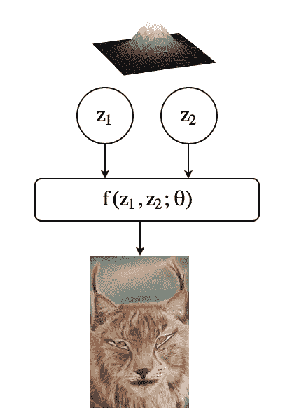

Multivariate normally distributed factors generate the image together with complex f(.) function. (Just an illustration of a process)

我们周围的材料，我们正在目睹的过程和场合，我们拥有的数据集都是我们的观察结果，自然界中有生成模型，我们无法观察但可以生成这些观察结果。潜在因素模型从概率上描述了我们对观察结果生成过程的信念。今天的主题是深度潜在因素模型，这是一种试图用低维(希望是可解释的)因素解释高维复杂数据的统计模型。在深层潜在因素模型中，我们假设有一个复杂的函数，它接受很少的潜在因素作为输入，并生成我们观察到的复杂输出。

人们可能有各种动机去使用潜在因素模型。可解释性显然是其中之一。想象一下，我们找到了产生面部图像的可解释因素。我们有决定头发形状的因素，决定眼睛颜色的因素，以及决定性别的因素。如果我们有这些因素，我们将能够通过指定它们的一些属性来生成全新的面孔。你可能会说 GANs 也会产生新的看不见的面孔。但是记住 GANs 是从估计的概率分布中抽取样本，完全随机，GANs 中没有属性规范(至少据我所知是这样的。有大量的 GAN 模型，很难跟上人工智能的最新发展。打破维度的诅咒是另一个动机。如果数据的维数很大，并且我们想要训练分类模型，则需要学习的参数数量也很高，并且对于一个良好概括的模型来说需要大量数据。通过降低维度，我们还减少了参数的数量，因此学习所需的数据更少。降维对于可视化也很有用，尤其是当维度可以降到 2 或 3 的时候。这些只是使用潜在因素模型的少数动机。

快速提示:了解一些期望值最大化算法的知识是理解本文其余部分的先决条件。在毕晓普的《模式识别与机器学习》一书中可以找到见解清晰、数学优雅的精彩章节。

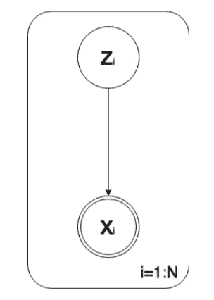

A general graphical representation of latent factor models. z represents latent variable vector. x is observation vector and there are N observations.

开始时，我们假设有模型参数θ，我们希望应用最大似然参数估计，即设置参数以使似然分布达到最大值。如果我们知道每个数据的 z 值，估计参数就相当容易了(更多信息，请看看我在 GLM 的文章)。记住，我们的任务之一是估计将 z 值映射到 x 值的参数。如果我们不知道 z 值，那怎么可能呢？EM 算法为我们提供了一种通过迭代应用期望和最大化步骤来实现它的方法。让我们通过定义目标来钻研数学

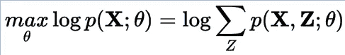

Maximum likelihood objective function where X and Z represent all the observations and latent variables respectively. Theta is model parameter(s).

不幸的是，由于需要求和的元素呈指数增长，上述目标包含难以处理的求和操作。为了克服这个问题，我们引入了一个 q(Z)项，并利用[詹森不等式](https://en.wikipedia.org/wiki/Jensen%27s_inequality)找到对数似然的一个下界。

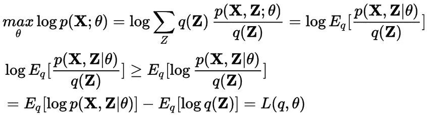

Lower bound to log-likelihood which is a function of q and theta

寻找对数似然性下限背后的动机是，虽然我们不能直接评估对数似然性，但我们可以评估下限，以便我们可以获得关于对数似然性的信息。为此，我们重新排列了下界项，并把它写成对数似然项和一个附加散度项之和。

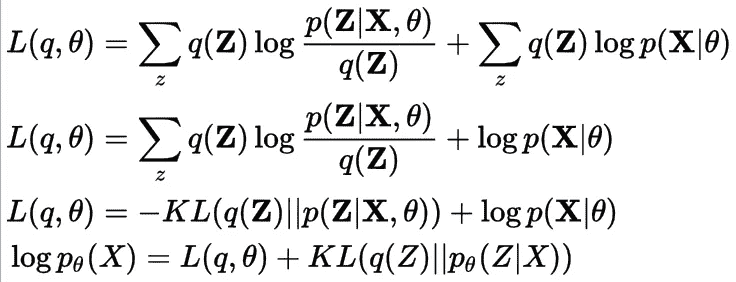

loglikelihood can be written as summation of Lower bound and reverse-KL divergence terms

[KL 散度](https://en.wikipedia.org/wiki/Kullback–Leibler_divergence)是一种非对称度量，度量两个概率分布之间的散度，当两个分布相同时，取 0 的值为最小值。正如你所看到的，当 KL 散度取最小值时，对数似然变得等于下限。因此，我们需要使 q(Z)等于 Z p(Z|X)的后部，以使 KL 散度为 0。让我们用 p(Z|X)代替 q(Z)重写 lower bound。

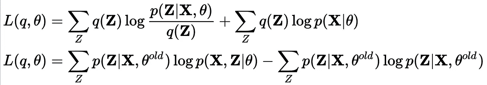

Changing the q(Z) terms with the posterior of Z which is calculated for the old theta parameters

现在，我们可以评估旧θ参数的对数似然值，它基本上等于旧θ的下限值。但是下限值可以通过优化θ值来增加。下限的第二项仅包括旧的θ参数，对于该部分没有任何作用。但是可以进一步优化第一部分，并且可以增加下界的值。这也意味着对数似然性可以通过估计新的θ值来进一步增加。当你仔细观察第一部分时，你会发现它是一个期望项，对这个期望项求值就形成了 EM 算法的 E 部分。E 步包含了 Z 的后验的推断，所以我们可以用推断步来重命名 E 步。通过估计新的模型参数来最大化下界，这叫 M 步，但我觉得叫学习步没有错。考虑到文章接下来的部分，我倾向于重命名 E 和 M 步骤。

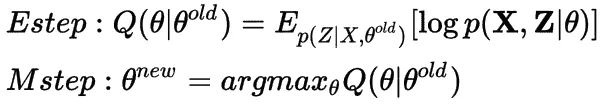

E and M steps

寻找潜在因素的后验并不总是容易的，尤其是当我们处理复杂的模型时。这一次，我们不是精确地计算后验概率，而是用一个具有可变参数φ的建议分布 q(z)来逼近它。在这种情况下，我们假设没有模型参数。

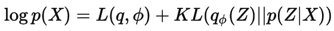

We assume there are no model parameters theta, and we approximate to p(Z|X) by tuning variational parameters phi.

在这种情况下，对数似然是常数，不随 q 和 phi 的选择而变化，但我们不能直接评估它。我们需要做的是巧妙地选择一个变分分布 q(我们试图选择一个与 z 的后验分布尽可能相似的分布族)并优化它的参数φ，以便减小原始后验分布和建议分布之间的 KL 散度。换句话说，我们通过调整输入 q 和 phi 来逼近具有下限的对数似然。寻找函数 q 是变分法的主题，但是对于完全分解的 q(平均场近似)，q 的形式是已知的(更多信息请看 Bishop 的书)。这个过程被称为变分贝叶斯。

在下一部分，我们将深入到深层潜在因素模型的变分推理的细节，我将介绍著名的变分自动编码器。在这之前，我们将重新安排一下下限方程。

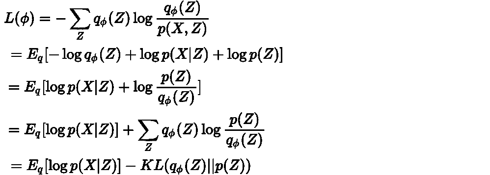

Rearranging lower bound equation

如果模型也有参数呢？然后下界变成 q，theta，和 phi 的函数。

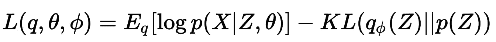

Lower bound is the function of q, theta, phi

为了使问题更简单，我们可以通过考虑共轭性来仔细设计模型，并使用全分解的 q 函数来不优化关于 q 的目标函数。因此，下界需要关于模型参数θ和变分参数φ进行优化。模型参数的估计就是 e M 算法的 M 步。另一方面，变分参数估计与寻找潜在变量的后验有关，因此它是一个推理步骤，构成了 EM 算法的 E 步骤。我们称这个全过程为变分 EM。

现在考虑一个具有高斯似然的复杂模型，其中均值和协方差是接受潜在因子 z 作为输入的神经网络。我们还将潜在因素的先验分布定义如下。

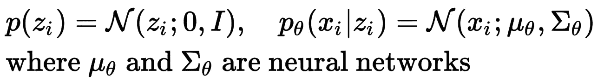

A complex generative model

用经典的变分推理方法很难对如此复杂的模型做出有效的推理。变分推理的最新进展使我们能够在这些复杂的模型中进行推理。在上面的模型中，我们想要估计的模型参数(θ)只不过是神经网络的权重。

对于推理，我们将高斯分布指定为变分分布族，但这次我们定义了神经网络结构，该结构将观察值映射到变分分布的均值和协方差(我们可能不喜欢使用观察和推理网络，但在可能的情况下使用它们是明智的)。所以变分 EM 部分的目标变成了

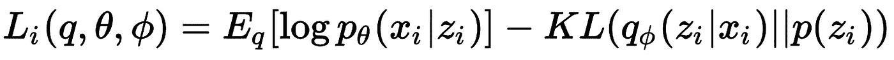

Lower bound for stochastic training

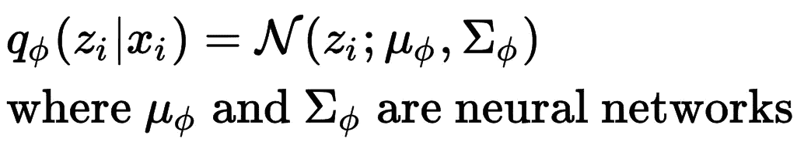

Inference network

有趣的是，观察到每个潜在特征(z_i)都有它自己的变分参数(均值和协方差矩阵),但是这些参数是由作为推理网络权重的观测值(x_i)和全局变分参数(phi)产生的。

深度学习社会更喜欢使用损失函数作为目标，因此我们可以最小化它的负值，而不是最大化下界。

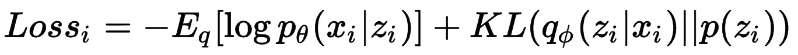

Loss function

损失函数定义了一个自动编码器，因为它的第一项试图重建涉及解码器的观测值，而第二项通过试图使观测值尽可能接近先验值来将观测值编码成潜在表示。

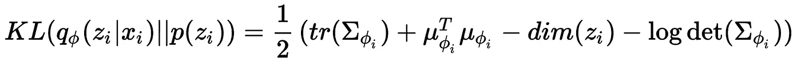

KL divergence between two multivariate Gaussians

损失函数的第二项是两个多元高斯函数之间的 KL 散度，我们知道它的形式。该表达式取决于变分参数φ，并且该项将随着随机梯度下降而相对于φ进行优化。

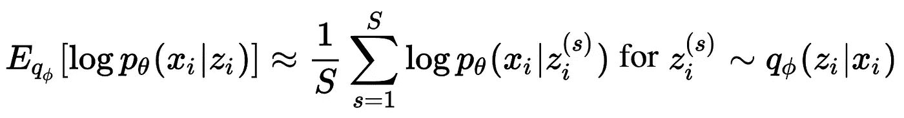

Monte Carlo integration to estimate expectation

第一项是一个期望值，我们可以用蒙特卡罗积分来估计它，而不是用解析方法计算(我们不能)。这里的问题是，在从 q(z|x)采样 z 之后，我们失去了与变分参数的所有联系，并且不能优化 w.r.t .变分参数项，尽管该项依赖于它们。重新参数化技巧是克服这个问题的好方法。

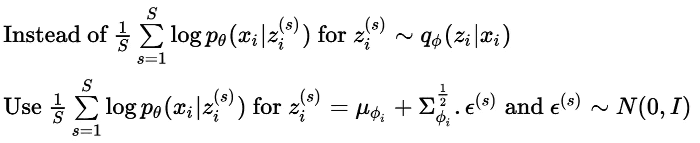

Reparametrization trick

在重新参数化技巧中，我们将样本 z 写成具有参数μ和适马的确定性函数的输出，输入ε是来自零均值单位方差正态分布的样本。现在我们可以用链式法则(dE/dz * dz/dphi)优化 w.r.t .变分参数项。

在这篇文章中，我试图从众所周知的 EM 算法开始解释变分自动编码器的基本思想。有趣的是，通过在目标函数中引入具有小更新的推理网络，我们得到了一种特殊类型的正则化自动编码器，这使得我们能够运行具有反向传播算法的变分 EM 的 E 和 M 步骤。

# 参考

金玛、迪德里克·p 和马克斯·韦林。[“自动编码变分贝叶斯”](https://arxiv.org/abs/1312.6114) *arXiv 预印本 arXiv:1312.6114* (2013)。

毕晓普的模式识别和机器学习书

[EM 和变分推理](https://chrischoy.github.io/research/Expectation-Maximization-and-Variational-Inference/)