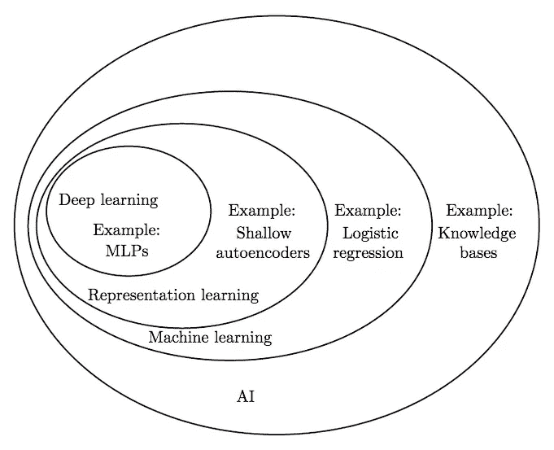
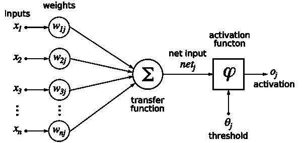
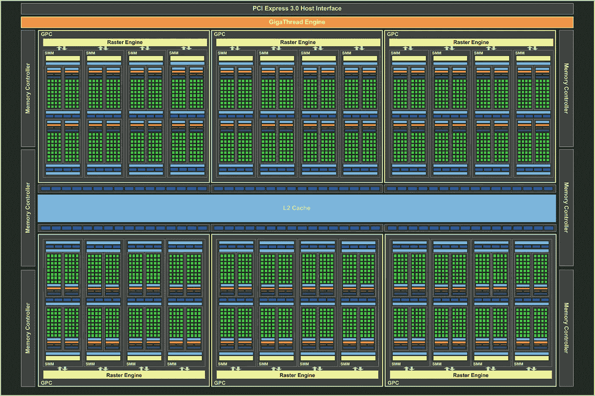

# 深度学习和机器学习

> 原文：<https://towardsdatascience.com/deep-learning-and-machine-learning-c1101debe0c?source=collection_archive---------3----------------------->

2015 年 7 月 14 日

这篇博客文章是关于我目前正在从事的一项正式工作的非正式讨论——我的博士背景文献综述。因此，它的链接非常丰富——我在这里记录的旅程本质上是由其他人的工作组成的。这篇文章也可能被解释为试图说服我的上司 [*奥马尔·拉纳教授*](http://www.cs.cf.ac.uk/contactsandpeople/staffpage.php?emailname=o.f.rana) *和* [*罗南·雷利教授*](https://www.maynoothuniversity.ie/faculty-science-engineering/our-people/ronan-reilly) *我实际上是在做事情，而不是阅读论文和调试*[*torch 7*](https://github.com/torch/torch7/wiki/Cheatsheet)*/*[*Theano*](http://deeplearning.net/software/theano/)*代码。但事实并非如此:)*

# 机器学习-背景

机器学习领域目前非常活跃。一周接一周，一个月接一个月，以前的记录在[翻滚](http://www.technologyreview.com/news/537436/baidus-artificial-intelligence-supercomputer-beats-google-at-image-recognition/)然后又翻滚(尽管[规则在一路上被打破](http://www.nytimes.com/2015/06/04/technology/computer-scientists-are-astir-after-baidu-team-is-barred-from-ai-competition.html?_r=1))。库使用 Nvidia 的 [CUDA](http://www.nvidia.co.uk/object/cuda-parallel-computing-uk.html) 实现针对 GPU 硬件优化的算法，研究人员可以从 Nvidia 购买[硬件，或者在云中租赁机器](http://maxwell.nvidia.com/titan-x)[，每次一小时](https://aws.amazon.com/blogs/aws/new-g2-instance-type-with-4x-more-gpu-power/)。家庭/小公司的程序员现在可以在非常大的数据集上训练非常大的模型，这在 3-4 年前只有大得多的公司才能考虑做。

为什么这很重要？嗯，机器学习最简单的定义是*软件，当针对特定任务*进行测量时，它会随着时间的推移提高自己的性能。这句话描述了一种与我们目前所习惯的软件非常不同的软件——操作系统、浏览器和大多数应用程序不会根据“经验”有意义地修改它们的行为——它们一次又一次地重复做完全相同的事情。拥有可训练的——可以学习的——软件是一种非常有价值的能力，我们将在后面看到。

在我看来，机器学习代表了我们这个时代的重大挑战之一，与理解现实的[结构](http://en.wikipedia.org/wiki/The_Fabric_of_Reality)或什么是[生命本身](http://www.newscientist.com/article/dn25471-spark-of-life-metabolism-appears-in-lab-without-cells.html#.VW9NHlxVhBd)不相上下。

# 机器学习！=深度学习(只不过现在有点)

机器学习不是深度学习(它是深度学习的超集)，但最近(尤其是在主流媒体上)，这两个术语已经成为同义词。深度学习是机器学习的一个*分支*，它源于[人工神经网络](http://en.wikipedia.org/wiki/Artificial_neural_network)——在我看来是所有人工智能分支中最有趣的，因为它具有生物合理性(映射到人类大脑中类似的功能或特征)以及它为研究人员提供的路线图/思想宝库。自 20 世纪 60 年代以来，人工神经网络一直非常受欢迎，也非常不受欢迎，因为第一次炒作超过了现实，然后从业者又赶上了(明斯基和帕普特在 1969 年的书[感知器](http://en.wikipedia.org/wiki/Perceptrons_%28book%29)中对人工神经网络的贬低至今仍在该领域回响，尽管它遭到了反驳)。

在这里引用明斯基是恰当的——直到最近谈论在 [Prolog](http://www.swi-prolog.org/) 和 [Lisp](https://common-lisp.net/) 中实现的符号逻辑和神经网络一样可以接受(甚至更可以接受)。但是像神经网络一样，Prolog 和 LISP 已经过时了。然而，从软件工程的角度来看，它们是诱人的。例如，Prolog 处理如下易于理解的事实和规则:

```
likes(joe, fish).
likes(joe, mary).
likes(mary, book).
likes(john, book).
```

当我们带着问题“咨询”系统时，Prolog 使用归结反驳来回答，于是我们得到:

```
?- likes(mary,fish).
no
*"no" means nothing matches the question, no does not mean false.*
```

但是 Prolog 很慢，规则/事实数据库变得难以管理。Prolog / Lisp 在日本遭遇了自己的人工智能冬天，因为非专业硬件超过了优雅的专用硬件(它们的表现基本上符合摩尔定律)。最近，[谷歌的研究人员建立了](http://arxiv.org/pdf/1502.05698v5.pdf)深度学习系统，专注于相同的领域，显示出有希望的结果，但它们的内部工作方式不像(尽管简单)Prolog 等效程序那样明显/清晰。这既不是一件好事也不是一件坏事——简而言之，这是对古老的[象征主义与联结主义](https://web.media.mit.edu/~minsky/papers/SymbolicVs.Connectionist.html)辩论的重述。在实践中，硬结果很重要，现在神经网络正在赢得这场辩论..

下面的示意图显示了人工智能的同心分组/子集，以提供深度学习和机器学习之间关系的更真实的画面。



图一。描述人工智能中不同子领域之间关系的示意图，来自[本吉奥的书](http://www-labs.iro.umontreal.ca/~bengioy/DLbook/intro.html)。

神经网络有它们的问题——其中之一是不透明的问题。虽然可视化工具存在，但大部分神经网络看起来像，而且确实是，浮点数的大格子。不经意的观察者从它们那里得到的信息不会比通过观察人类大脑更有意义，当试图将神经网络集成到工作软件系统中时，这不是很好。

# 那么什么是神经网络呢？

Haykin 的[规范文本](http://www.amazon.co.uk/Neural-Networks-Learning-Machines-International/dp/0131293761/ref=sr_1_1?ie=UTF8&qid=1433363604&sr=8-1&keywords=simon+haykin)将神经网络定义如下:

“由简单处理单元组成的大规模并行分布式处理器，具有存储经验知识并使其可供使用的自然倾向”。

这些简单的处理单元就是神经元。神经元的标准模型是由麦卡洛克和皮茨在 1943 年提出的，从那以后就没怎么改变过。神经元接受输入 X 的向量，这些输入被加权，并且可选的偏置 b(图中未示出)基于应用于权重的某个函数(根据期望的特性使用许多不同的函数)生成输出或激活。下图描绘了这种风格化的神经元。



图二。单个神经元的标准(麦卡洛克-皮茨)模型。

现实世界的神经网络有成千上万个这样的神经元，它们一起提供了经验知识的存储，最有用的是，在先前已经看到的数据的背景下理解新的、看不见的数据的能力。GPU 非常适合训练神经网络，因为它们也是大规模并行的，如下图所示。



图 3。Nvidia 的 Titan X GPU，拥有 3，072 个 CUDA 内核。

# 神经网络的个人历史

我第一次遇到神经网络是在 1997 年——我最后一年的项目结合了[SNNS](http://www.ra.cs.uni-tuebingen.de/SNNS/)(torch 7/the ano 的祖先)和[西姆德雷拉](http://www.sciencedirect.com/science/article/pii/0925231294900639)创造了一个“通过观察学习”的 6 自由度机械臂。我们教网络嵌套杯子——就像一个孩子会做的那样。事实上，随着网络的训练，它显示了嵌套策略的复杂性进展(线性- >预堆叠),正如[皮亚杰为真实儿童记录的](http://www.ncbi.nlm.nih.gov/pubmed/24777522)。这个项目也旨在成为进一步工作的垫脚石，该工作受到人类大脑中[布罗卡区](http://en.wikipedia.org/wiki/Broca%27s_area)发展的启发，如果我们预先训练或调节简单任务的神经网络，它在学习更复杂的任务时会更成功。预训练/调节是训练深网时要考虑的一个重要启发(见下文)。事后看来，我怀疑我为了我的项目结束演示过度训练了这个网络，以确保在我使用的简单的 20x20 视网膜上找到杯子的准确性！在 1997 年(从主观上来说)，从计算机科学的角度来看，神经网络被认为是优雅的，但可疑地接近心理学和软件工程，可以从诸如基于案例的推理、推理、决策树等技术中获得更好的(和可理解的)结果。

2003 年，我的理学硕士再次关注神经网络，但几乎是作为主要活动(分布式计算)的副业。这项工作的主要目的是展示一个异构计算节点集群如何有效地复制一个非常著名的基准测试[，该基准测试使用钱和 Sejnowski，1998](http://www.ncbi.nlm.nih.gov/pubmed/3172241) 的神经网络模型预测球状蛋白质的二级结构，使用基于的 Linda 和 David Gelernter 的基于元组的架构进行近似线性加速。此外，这项工作只使用了前馈神经网络——递归网络，当然 LSTM 会产生更好的结果，因为它们能够保留氨基酸输入序列的信息。

2003 年，关于投资银行使用神经网络来预测股票市场和监控投资组合风险的流言四起。如果这是真的，那么我向读者提出，2008 年的事件表明，这些神经网络可能已经找到了一系列不幸的局部极小值..

2006 年，世界变了。 [Geoffrey Hinton](http://www.cs.toronto.edu/~hinton/) 、 [Yoshua Bengio](http://www.iro.umontreal.ca/~bengioy/yoshua_en/index.html) 和 [Yann LeCun](http://yann.lecun.com/) 开始将神经网络分层堆叠——每一层都从其输入中提取重要/相关的特征，并将这些特征传递给其上一层。此外，焦点从简单的分类器转移到了生成模型——实际上，网络的主要任务变成了在不断增加的抽象级别(通过堆栈)上生成输入数据，以便提取有用的特征。这些都是重大突破，时机也很偶然——在硬件方面，Nvidia(和 AMD，但 OpenCL 对深度学习来说几乎是死的)正在让 GPU 卡成为通过 [CUDA](http://www.nvidia.co.uk/object/cuda-parallel-computing-uk.html) 访问的计算资源。即使在今天，我们仍然处于一个黄金时代，因为这三位一体的融合:

1.  带有训练算法的核心思想(神经网络)[反向传播:Rumelhart，Hinton，Williams](http://psych.stanford.edu/~jlm/papers/PDP/Volume%201/Chap8_PDP86.pdf) 本质上服从并行化。
2.  内在并行硬件(GPU)来训练这些神经网络。
3.  越来越大的数据集(标记的和未标记的)作为输入提供给神经网络。

2013 年 3 月，[辛顿加入谷歌](http://www.wired.com/2013/03/google_hinton/)，2013 年 12 月，[乐存加入脸书](https://www.facebook.com/yann.lecun/posts/10151728212367143)。这两家公司、百度以及更多公司都在深度学习方面投入巨资，以自动分类、理解和翻译网络上的丰富内容——文本、图像、视频、语音..*你为什么会这么做是显而易见的——社交平台变得更加相关，手机变得更加强大和有用，广告变得更有针对性，电子商务网站提供更好的搜索结果，推荐是真正有用的——可能性是无限的。仅仅是让谷歌和脸书在这一领域开展工作，就要为当前许多(准确和不准确的)主流媒体对人工智能的报道负责。*

这让我们很好地了解了神经网络的典型用途。

# 实际应用

简而言之，神经网络从它们接受训练的数据中提取特征和模式——通常是人类看不到的特征和模式。然后，一个经过训练的神经网络可以得到*新的、看不见的*数据，并做出预测。这个一般化步骤非常有用，特别是对于[递归神经网络](http://en.wikipedia.org/wiki/Recurrent_neural_network)，其可以随时间吸收数据*，即编码时间信息或序列。神经网络变得非常擅长:*

*   图像解析(边缘检测、对象检测和分类)
*   场景理解
*   语音识别
*   自然语言处理
*   语言翻译
*   玩简单的电子游戏
*   多标签系统的分类和聚类
*   时间序列预测。

对于特定的用例，人工神经网络有时能够并且将会表现更好，通常是通过更简单/更老的技术。构建一个允许使用多种 ML 技术的问题总是明智的，这样可以进行对等比较。然而，特别是在计算机视觉和序列翻译领域，深度学习方法主导了各种排行榜。

更一般地，如果神经网络 N 可以在系统 S 和从时间步长 0 到当前时间步长 t 在该系统中发生的事件 E 上被训练，例如 E = {e0，..然后可以对 e(t+1)，e(t+2)等中将要发生的事情提供合理到良好的预测。，那么这就有广泛的适用性——在电子商务、个性化医疗、库存管理中——只要是你能想到的，都需要这种预测。这是神经网络的基本吸引力(与理解图像及其元素相比，这一点经常被忽视/低估)。

# 神经网络的弱点

毫无疑问，神经网络是令人沮丧的工作。神经网络是:

1.  难以培训(时间过长，最终表现平平)。
2.  对输入的呈现方式非常敏感，因此可以提取正确的特征(ICLR 是一个致力于表征学习的会议)——[本吉奥、库维尔和文森特](http://arxiv.org/pdf/1206.5538.pdf)对这些复杂性进行了很好的综述。
3.  权重的初始状态会对最终绩效产生巨大的(正面和负面)影响。
4.  服从“经验法则”，这些法则散布在文献中，被发现/重新发现/重新发明:例如，课程学习，颠倒输入顺序，调整学习速度。无论如何，这不是一个完整的列表..

尽管如此，各种形式的神经网络已经在许多不同的领域展示了一流的成果。这就是它们有趣的原因，也是我认为研究人员和公司坚持使用它们的原因。它们复杂、深奥的本质远远超过了它们产生的结果。

# 深度学习的“国家状况”——2015 年 ICLR

看看某个研究领域最近的会议上提出的主题，了解该领域当前的“国家状况”是有益的。机器学习也不例外，我参加的最后一次会议是几周前在加州圣地亚哥举行的 [ICLR 2015](http://www.iclr.cc/doku.php?id=iclr2015:main) 。正如在[对 ICLR 的其他评论](http://www.machinedlearnings.com/2015/05/iclr-2015-review.html?utm_source=twitterfeed&utm_medium=twitter)中已经提到的，所有提交的论文都可以在 [Arxiv](http://arxiv.org/) 上获得，这太棒了。很高兴看到这些论文的作者展示他们的作品，或者在海报会议上直接谈论他们。还有很多其他优秀的会议——[NIPS](https://nips.cc/Conferences/current)、 [KDD](http://www.kdd.org/kdd2015/) 、[IJCAI](http://ijcai-15.org/)——我选择 ICLR，因为它在我心目中是最新鲜的！

首先，至今使用的[数据集](http://deeplearning.net/datasets/)开始[挣扎](http://culurciello.github.io/tech/2015/05/17/image-rec.html)。

第二，研究人员正在寻找共同的参考点，以此来对正在开发的最新系统进行评级。玩具任务是一个很好的例子，它与[课程学习](http://ronan.collobert.com/pub/matos/2009_curriculum_icml.pdf)有着清晰的渊源。ICLR 2015 的一篇论文正在接受审查，但我猜没有被接受的是[递归神经网络正则化](http://arxiv.org/pdf/1409.2329v4.pdf)。关于这篇论文，我最喜欢的是 Github 上的[代码——一种将论文中的数据与可再现的输出相匹配的好方法。](https://github.com/wojzaremba/lstm)

[带 fbfft 的快速卷积网络:一个 GPU 性能评估](http://arxiv.org/abs/1412.7580)演示了在训练深度网络时如何更努力地驱动 GPU，并且已经有了该库的另一个版本(提示:使用 16 位浮点而不是 32 位！)不难想象，如果确定了进一步的不同优化，Nvidia 将在未来为深度学习社区生产专用硬件..

最后，从直觉的角度来看，我个人最喜欢的是记忆网络。它具有较低的生物学似然性(或者当然该论文中没有探讨这方面),但是具有较高的实际应用性。我们可以很容易地想象出这种架构的变体，例如，它学会了访问 SQL / NoSQL 数据库中保存的业务事实，或者访问类似 Prolog 的事实和规则。

# 机器学习的商品化

机器学习已经渡过了某种难关，现在被视为商业应用的必备工具。语音和计算机视觉的传统应用将继续，但 ML 也将在 POBAs(普通的旧商业应用)中变得无处不在。ML 的商品化已经开始了:

1.  [微软(今年)](http://azure.microsoft.com/en-gb/services/machine-learning/)
2.  [谷歌(2011 年，很少被采用)](https://cloud.google.com/prediction/docs)
3.  [亚马逊(今年)](https://aws.amazon.com/blogs/aws/amazon-machine-learning-make-data-driven-decisions-at-scale/)

还存在许多较小的服务，随着时间的推移，随着赢家的出现，我们可以期待看到整合。对于那些希望在本地使用 ML 的工程师，我们提供以下服务:

ML 从业者的祸根是超参数选择(也称为上帝参数——使你美丽的神经网络出色工作或比随机猜测好不了多少的配置标志)。事实上， [Bergstra 和 Bengio 证明了](http://www.jmlr.org/papers/volume13/bergstra12a/bergstra12a.pdf)随机猜测超参数通常是一种“足够好”的策略，因为算法通常只对一两个超参数敏感。最近，Snoek 等人[应用贝叶斯先验](http://papers.nips.cc/paper/4522-practical-bayesian-optimization-of-machine-learning-algorithms.pdf)和高斯过程来进一步完善这种方法(我猜我会称之为智能随机性加学习)。[Spearmint](https://github.com/HIPS/Spearmint)——构建的实现已经被剥离成一个具有漂亮的 [API](https://www.whetlab.com/docs/getting-started) 的[启动](https://www.whetlab.com/)。考虑到一些深度网络需要大约两周的时间来训练，*任何更快的到达最优超参数的路径都是有利的。*

# 该领域的未来方向

很明显，与理论相比，围绕机器学习的软件工具相当不成熟。研究人员撰写并发表论文，而不是生产强度代码。因此，将机器学习与计算机科学的其他分支(操作系统、网络、数据存储、搜索)进行比较表明，在这一领域需要做很多工作。

冒着过度对冲的风险，下一个突破要么来自现有的方法(见 2014 / 2015 年，施密德胡伯和霍克雷特的《长短期记忆》又名 [LSTM](http://deeplearning.cs.cmu.edu/pdfs/Hochreiter97_lstm.pdf) 变得多么受欢迎),经过 15 年的探索之后),要么来自新的思维，可能是受生物构造的启发。Geoffrey Hinton 目前关于胶囊/流形学习的工作就是一个很好的例子。对于研究人员来说，看到文献中存在哪些由于计算困难而被放弃的想法/技术，现在可能更容易处理，这肯定是有希望的！

有可能我们所要做的就是将网络堆叠得更高(900+层深？)根据 Srivastava、Greff 和 Schmidhuber 的[高速公路网论文继续前进，但我的感觉是“深度”方法只剩下这么多距离了。无论如何，有趣的是，目前六层似乎是最佳的(但是](http://arxiv.org/pdf/1505.00387.pdf)[谷歌网](http://arxiv.org/abs/1409.4842)使用 22 或 27 层，这取决于你如何计算它们)。

有点奇怪的是，反向传播结合随机梯度下降(SGD)仍然是使用的最好/规范的学习算法。自 1986 年以来，它确实经受住了时间的考验，并且非常适合 GPU。目前的研究似乎集中在网络*架构*上，但学习算法的复兴似乎也将不可避免。

大多数神经网络都是由老师训练的——对于好的输出，我们奖励网络低误差，对于差的输出，我们惩罚它。这种方法工作得很好，但是需要很好标记的数据，这通常是一种奢侈或者根本不可能实现的。谷歌 Deepmind 正在倡导强化学习，将其作为开发能够很好地跨问题转移的系统的一种方式(在他们迄今为止的[开创性论文](https://www.cs.toronto.edu/~vmnih/docs/dqn.pdf)中，一个单一的神经网络已经学习/泛化到足以玩*所有的*雅达利游戏)。

最后，有理由期待神经网络复杂性的降低，如果不是理论上的，那么肯定是实践和使用上的。使用[最小描述长度](http://www.cs.toronto.edu/~fritz/absps/cvq.pdf)或[VAP Nik–Chervonenkis 维度](http://en.wikipedia.org/wiki/VC_dimension)作为度量，我们感兴趣的是构建最简单、最紧凑的神经网络(具体来说，使用最少的参数)来解决给定的问题或任务。更简单的网络也会训练得更快——这在实践中是一个非常好的好处。

# 回顾/总结

这篇博文比我预想的要长！一部分是历史之旅，一部分是对机器学习的概述，带有明显的深度学习倾向，这是一篇比我目前正在为我的博士论文撰写的文章更非正式的文献综述。

这一领域的创新步伐很快——每年有四五个大型会议，每个会议都会带来新的公告和突破。目前，软件工程、快速、可扩展的硬件和良好的理论真正融合在一起。

深度学习/神经网络可能不是将所有人工智能结合在一起的单一统一理论(有太多的未知和以前的失败)，但我怀疑它将对人工智能的发展产生深远的影响，至少在未来十年内。

# 进一步阅读

如果你仍然对机器学习感兴趣(你为什么会不感兴趣？！)我认为公平地说，在这个领域，你只是不能做足够的阅读——基础已经建立，但前沿每天都在被推进和挑战。这篇博文包含了许多有趣的链接，除此之外，如果你想了解更多，我强烈推荐这个领域的主要思想领袖/实践者的 Reddit ML AMAs。它们是(没有优先顺序——它们都有助于优秀的、有洞察力的阅读):

1.  [吴恩达和亚当·科茨(2015 年 4 月 15 日)](http://www.reddit.com/r/MachineLearning/comments/32ihpe/ama_andrew_ng_and_adam_coates/)
2.  [于尔根·施密德于贝尔(2015 年 3 月 4 日)](http://www.reddit.com/r/MachineLearning/comments/2xcyrl/i_am_j%C3%BCrgen_schmidhuber_ama/)
3.  [杰弗里·辛顿(2014 年 11 月 10 日)](http://www.reddit.com/r/MachineLearning/comments/2lmo0l/ama_geoffrey_hinton/)
4.  [迈克尔·乔丹(2014 年 9 月 10 日)](http://www.reddit.com/r/MachineLearning/comments/2fxi6v/ama_michael_i_jordan/)
5.  [扬·勒村(2014 年 5 月 15 日)](http://www.reddit.com/r/MachineLearning/comments/25lnbt/ama_yann_lecun/)
6.  [约舒阿·本吉奥(2014 年 2 月 27 日)](http://www.reddit.com/r/MachineLearning/comments/1ysry1/ama_yoshua_bengio/)