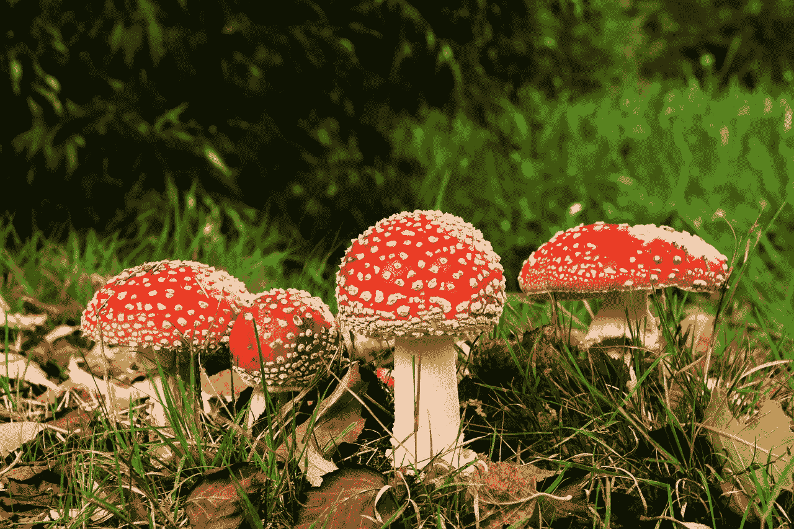
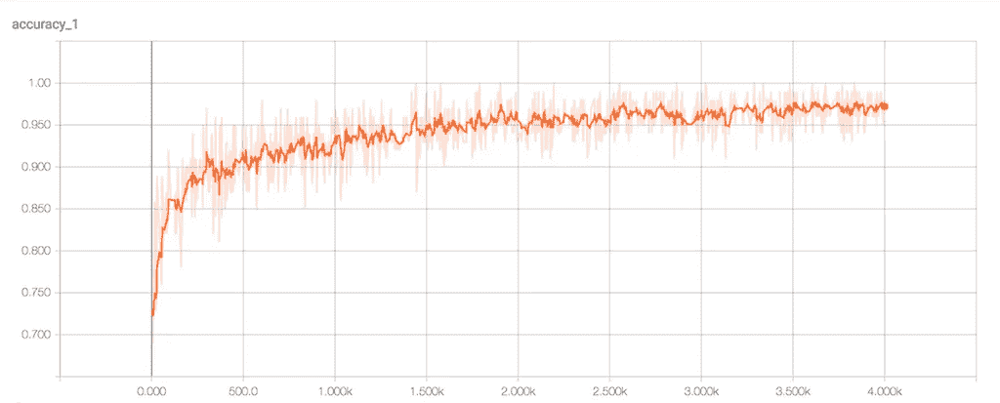
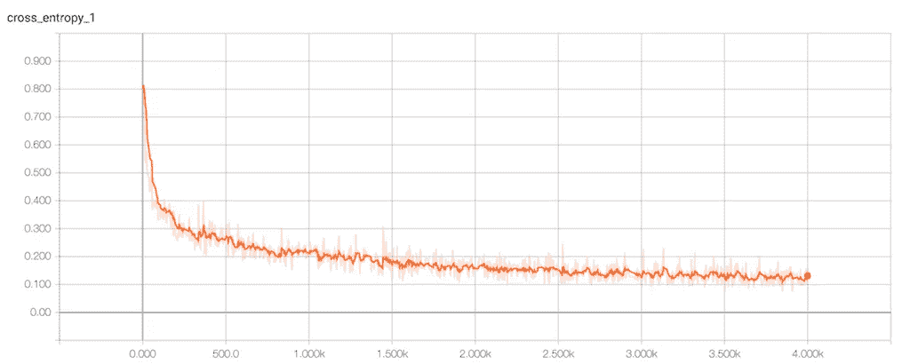
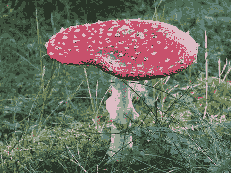
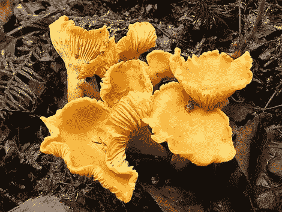

# 深度学习和毒蘑菇

> 原文：<https://towardsdatascience.com/deep-learning-and-poisonous-mushrooms-4377ea4c9b80?source=collection_archive---------2----------------------->

在对蘑菇或机器学习知之甚少的情况下，使用深度学习网络解决一个常见问题。

**简介**

机器学习是一个如此迷人的话题，它允许机器学习如何完成历史上需要人类完成的任务。虽然几年前机器学习还需要最强大的超级计算机，但云计算、更便宜的 CPU 和更好的算法的出现让机器学习变得更广泛。今天，高中生可以在普通家用计算机上使用机器学习，其能力可以提供比人类更好的图像分类结果。但首先，这就是为什么我对机器学习，特别是深度学习感到兴奋。

鉴于最近媒体报道了人工智能的进步，特别是深度学习网络的进步，我决定了解一些核心概念，这些概念允许机器在危险中击败人类，围棋，扑克或自动驾驶汽车以及其他许多通常需要人脑的应用。我认为深度学习网络是极其庞大和复杂的分层试错系统，当给定大型数据集和大量计算资源时，它们可以自我学习。

**研究深度学习网络**

我转向谷歌搜索，以确定 AlphaGo 的技术，这是一种击败世界上最好的围棋选手的人工智能。谷歌使用了一个名为 DeepMind 的深度学习网络系统。在战胜最优秀的人类选手后不久，DeepMind 转而使用开源的深度学习库 TensorFlow。由于对 TensorFlow 了解不多，我继续寻找一个易于管理的切入点，不需要博士学位，以了解 TensorFlow 的基础知识和一些我可以在家里的笔记本电脑上复制的示例。我发现了一个包含 YouTube 视频、GitHub 项目、博客帖子和类似内容的大型资料库。

我发现这两个资源对了解 TensorFlow 最有帮助:

Siraj Raval 的 YouTube 视频，他希望在人工智能方面启发和教育开发人员，这样他们就可以使用 Youtube 视频和 Udacity 开发游戏、音乐、聊天机器人、创造艺术和许多其他很酷的东西。我在 YouTube 上看过他的视频，据说是教你*“在 5 分钟内建立一个 TensorFlow 图像分类器”*。[https://youtu.be/QfNvhPx5Px8](https://youtu.be/QfNvhPx5Px8)。

该视频是实践性的，节奏很快，很难跟上，但在看了几遍后，我确信我可以效仿这个例子，并受到启发，创建了我自己的图像分类器，它不是基于达斯·维德和熊猫。

谷歌开发者 Codelabs 正在提供一个名为*“诗人的 tensor flow”*的图像分类示例，它允许你识别给定花的属。这个例子使用了几种，像雏菊、向日葵、蒲公英、郁金香和玫瑰。它提供了一个详细的步骤列表，只要一切按计划进行，就很容易遵循。[https://code labs . developers . Google . com/code labs/tensor flow-for-poets/# 0](https://codelabs.developers.google.com/codelabs/tensorflow-for-poets/#0)

您可以查看完整说明的链接。

**蘑菇是如何发挥作用的**

对于图像分类器来说，有什么比将图像与达斯·维德进行匹配更好的用例，可以基于可用的图像库来实现？我转向蘑菇。每当我们在森林里徒步旅行时看到蘑菇，我通常不知道斑点蘑菇是否可以食用。几年前，我和我的合作伙伴认为开发一个可以判断主题是否适合消费的移动应用程序会很棒。只要把你的相机对准蘑菇，应用程序就会告诉你它是否可以食用。需要说明的是，我没有计划构建这样一个应用程序所需的 web 服务，但基于 TensorFlow 的图像分类能够提供当今解决方案中最复杂的部分，人们可以相对容易地构建由深度学习网络支持的蘑菇标识符应用程序。

**项目及成果**

我是这样做的:

我用谷歌图片搜索下载了 600 张食用蘑菇和同样数量的有毒蘑菇的图片，并将其输入到我基于 TensorFlow 的深度学习网络中。经过大约 30 分钟的训练，精确度和损失函数值都指向正确的方向，所以我知道这个网络能够提供结果。

准确度和损耗的张量图

这个图表显示了深度学习网络的准确性水平。x 轴上的训练步数和 y 轴上的精确度。达到~97%是相当可观的。

在这种情况下，y 轴上的交叉熵用作损失函数。它基本上显示了网络学习的效率。数字越小越好。x 轴上的训练步数。

例:*飞木耳*

不可食用！毒药(得分= 0.99746)可食用(得分= 0.00230)

例子:*鸡油菌*

我会吃这些。可食用(得分= 0.96285)毒药(得分= 0.03706)

这是两个最令人印象深刻的结果。还有其他不太确定的结果，我相信这些结果是基于有点不科学的研究图像库，因为网络的准确性相当高。清理图像数据库并使用更大的食用和有毒蘑菇数据集将是一个有趣的项目。

**结论**

让我惊讶的是，建立并运行一个有效的深度学习网络所需的简单性和低技术知识门槛。这项突破性的技术现在对全世界的开发者和爱好者开放，使用它不需要计算机科学学位。我们正在见证一个重要的转变，强大的机器学习技术正在从少数科学家的实验室转移到成千上万的开发人员手中，他们将提供成千上万的人工智能应用，对我们的生活产生难以想象的影响。TensorFlow 等工具包将使这一切成为可能。