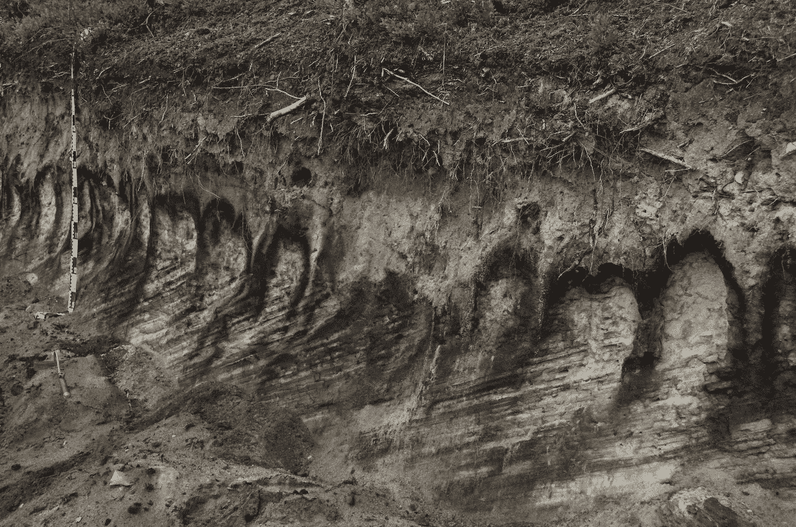
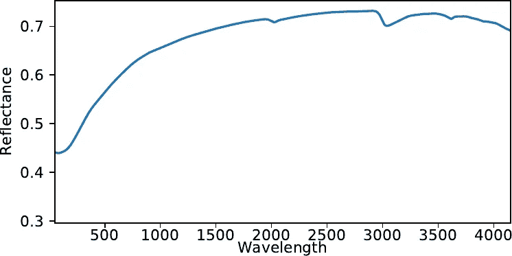
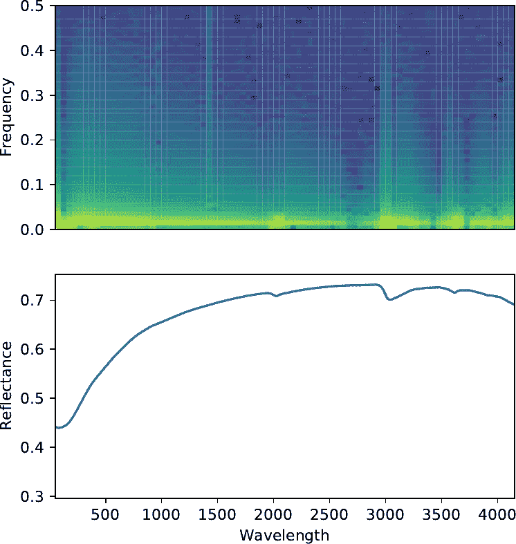
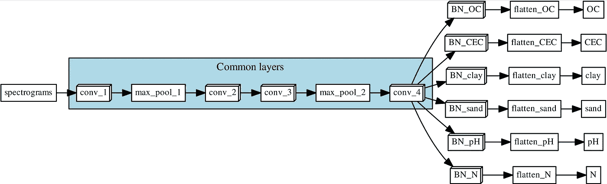
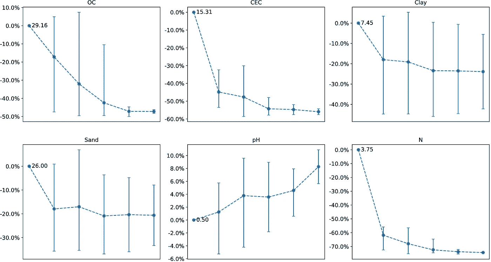

# 深度学习和土壤科学—第 1 部分

> 原文：<https://towardsdatascience.com/deep-learning-and-soil-science-part-1-8c0669b18097?source=collection_archive---------3----------------------->

## 预测土壤性质的土壤光谱学

这是我致力于深度学习在土壤科学中的应用的系列文章的第一篇。我的动机是为了表明深度学习对其他事情有用，而不是对猫和狗的照片或情感进行分类。并不是说猫和狗有什么不好，但是已经有数百万个这样的例子了…

这是一个正在进行的系列，到目前为止还包括:

 [## 深度学习和土壤科学—第二部分

### 使用上下文空间信息的数字土壤制图。从点信息生成土壤图的多任务 CNN。

towardsdatascience.com](/deep-learning-and-soil-science-part-2-129e0cb4be94)  [## 深度学习和土壤科学—第 3 部分

### 土壤光谱学与迁移学习。将大陆土壤光谱模式“本地化”到国家范围。

towardsdatascience.com](/deep-learning-and-soil-science-part-3-c793407e4997) 

其他与地球科学相关的文章:

 [## 用 SHAP 解释 CNN 生成的土壤地图

### 使用 SHAP 来证实数字土壤制图 CNN 捕捉到了合理的关系。

towardsdatascience.com](/explaining-a-cnn-generated-soil-map-with-shap-f1ec08a041eb)  [## GeoVec:用于地球科学的单词嵌入

### 词语嵌入的类比、分类、关联和空间插值。

towardsdatascience.com](/geovec-word-embeddings-for-geosciences-ac1e1e854e19) 

# 一点背景知识

土壤科学是一个相对广泛的学科，所以我将尝试给出一些关于我们所做的事情和我们通常处理的数据类型的背景。

**现场和实验室的土壤**

土壤是一个复合体，可以用多种方式描述，这取决于你是否对它的物理、化学和/或生物特性感兴趣，它在景观中的位置，它与生物圈其他部分的相互作用，等等。

通常，描述从土壤剖面开始。我们挖了一个坑，我们能够看到类似下图的东西。

Soil profile (Spodosol) in Denmark.

图片中你首先注意到的是不同的颜色和不同层次的垂直结构。每一层都有不同的特征，作为土壤科学家，我们有兴趣尽可能全面地描述它们。

典型的描述通常包括现场可观察到的属性(坐标、层厚、颜色等。)和我们在实验室处理样品后获得的信息(pH 值、颗粒大小、营养成分等。).

可以想象，数据采集的现场和实验室部分非常昂贵，因此我们花费大量时间来优化采样设计，预测我们在某个位置会发现什么，并根据更容易、更快或更便宜的测量方法来预测土壤属性。

**土壤光谱学**

土壤光谱学是一种允许在野外或实验室快速获取土壤信息的技术。简单地说，我们用一束光照射土壤样本，然后测量反射回来的东西。根据样品的成分，反射回仪器(光谱仪)的能量因样品而异，从而获得样品的光谱特征。

Spectral signature of a soil sample.

表示该数据的另一种方式是通过生成频谱图。你可能见过它们被用于音频分析。你可以在这里找到更多关于他们的信息。频谱图的 2D 结构使其成为被**卷积神经网络**摄取的完美候选。

Spectrum (bottom) and its corresponding spectrogram (top).

# 卷积神经网络模型

设计卷积神经网络(CNN)是一个高度迭代的过程。有时候感觉更像一门艺术，而不是一门精确的科学。然而，阅读别人的作品并从中获得灵感总是好的。我不会解释它们是如何工作的，但[在这里](/convolutional-neural-networks-from-the-ground-up-c67bb41454e1)你可以找到一个很好的描述 MNIST 数据集的图像分类的例子。

在设计本研究中使用的 CNN 时，一系列因素引导或限制了这一过程:

*   **输入数据的 2D 结构:**声谱图是一个矩阵(1 波段图像)，使用 [**2D-CNN**](/convolutional-neural-networks-from-the-ground-up-c67bb41454e1) 处理可能更好。
*   **数据集规模相对较小:**切记数据是从现场样本中获取的，这一点很重要。这意味着去实地，挖一个洞，在实地或在将样本送到实验室后扫描样本。这个过程既费时又费钱。我们在本例中使用的数据集包含来自全欧洲的大约 [20，000 个样本](https://esdac.jrc.ec.europa.eu/projects/lucas)。这不是你能找到的最小的数据集，但与用于训练 AlexNet 的数据集(超过 1500 万张图像)相比，还是很小的。很容易过度适应一个小数据集，所以我用了一个**小网络**。
*   **多种输出:**我们可以使用光谱预测许多土壤特性。在这项具体研究中，我们有兴趣预测:a)有机碳含量(OC)，b)阳离子交换容量(CEC)，c)粘土颗粒尺寸部分，d)砂颗粒尺寸部分，e)水中测得的 pH 值，以及 f)总氮含量(N)。我们可以为他们每个人训练不同的模型，但我对 [**多任务学习**](http://ruder.io/multi-task/) 产生某种协同效应的潜力感兴趣。

最终的网络结构如下所示:

Multi-task network architecture

网络的头部(“公共层”)是图像分类中常见的一系列卷积层和最大池层。网络的这一部分由所有目标土壤属性共享，并且应该能够了解谱图是如何构造的。在“公共层”提取由谱图表示的数据的**一般表示之后，信息被导向 6 个不同的分支，每个分支对应一个目标土壤特性。每个分支由一个卷积层(BN)组成，在产生输出之前，卷积层被展平(到 1D)。这些分支应该能够学习光谱图中的信号，这些信号是针对每种土壤特性的**。****

# 结果

**与其他传统方法的比较**

使用光谱数据预测土壤特性的两种常用模型是立体回归树模型(Quinlan *等人*，1992 年)和偏最小二乘回归(PLSMartens 和 Naes，1989 年)。我们使用这些模型作为基线来评估 CNN 的性能。使用光谱(不是光谱图)训练模型，这些光谱是使用文献中常用的一系列方法预处理的:

1.  将反射率转换为表观吸光度(a = log10(r))。
2.  Savitzky-Golay 平滑(Savitzky 和 Golay，1964)，使用 11 的窗口大小和二阶多项式。
3.  边缘修整(< 500 nm and > 2450 纳米)以去除伪影。
4.  每十次测量取样一次。
5.  应用标准正态变量变换(Barnes 等人，1989)。

下图比较了所有模型(PLS，Cubist，CNN)的预测误差。我们还包括了 CNN 预测单个属性的误差作为参考。

Comparison between PLS, Cubist and CNN for each target property.

CNN 的表现优于 PLS 和 Cubist 模型，多任务 CNN 的表现通常优于单预测 CNN。

**多任务学习的协同效应**

我认为最有趣的结果是通过使用多任务网络观察到的协同效应。在下图中，您可以看到随着我们增加同时预测的属性数量(我们修改了每种情况下的网络架构，获得了范围[1，6]内的分支数量)，预测误差如何减少(pH 除外)。与单独预测 OC 相比，同时预测我们的 6 个属性将 OC 的预测误差降低了近 50%。

Percentage change in error when more properties are predicted simultaneously. X-axes correspond to number of extra variables used, starting from zero. Value next to first point corresponds to the RMSE when only the target property is used. Error bars correspond to the 90% confidence interval.

当网络预测一个属性时，它使用其余的预测属性作为约束预测的“提示”。一个简单的例子是粘土和砂含量的情况。在最普遍的情况下，土壤矿物颗粒被分成 3 组逐渐增大的颗粒:粘土、淤泥和沙子。这三组的比例相加应为 1 (100%)。如果模型预测粘土含量非常高，这是一个暗示，表明砂含量应该很低。显然，6 个属性之间的相互作用更加复杂，但是网络正在捕捉这种效应。因此，我们观察到预测误差的减少。

# 最后的话

在我的研究小组中，我们通常使用机器学习技术，如随机森林、回归树等。这是我第一次尝试使用卷积神经网络来做一些不同于分类图像的事情。

我特别喜欢这项工作的是多任务学习的协同效应。在我们的头脑中，我们产生了指导我们做决定的规则，CNN 能做类似的事情真是太棒了。

结果很有希望，自从我开始研究这个，我一直在尝试用 CNN 做任何事情！

在接下来的文章中，我将探索一点迁移学习，以及在土壤制图中的一些应用，敬请关注！

# 引用

关于这项工作的更多细节可以在相应的论文中找到。

Padarian，j .，Minasny，b .和 McBratney，A.B .，2018。使用深度学习从区域光谱数据预测土壤特性。地域晶洞。[https://doi.org/10.1016/j.geodrs.2018.e00198](https://doi.org/10.1016/j.geodrs.2018.e00198)

# 参考

*   巴恩斯，r .，达诺亚，硕士和李斯特，S. J. (1989)。近红外漫反射光谱的标准正态变量变换和去趋势。应用光谱学 43 (5)，772–777。
*   马滕斯，h .和奈斯，T. (1989 年)。多元校准。约翰·威利父子公司。
*   昆兰，J. R. *等* (1992)。连续上课学习。第五届澳大利亚人工智能联合会议。第 92 卷。新加坡，第 343-348 页。
*   萨维茨基和戈雷(1964 年)。用简化的最小二乘法对数据进行平滑和微分。分析化学 36 (8)，1627–1639。