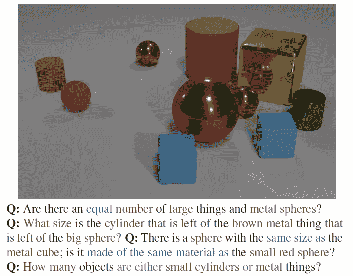
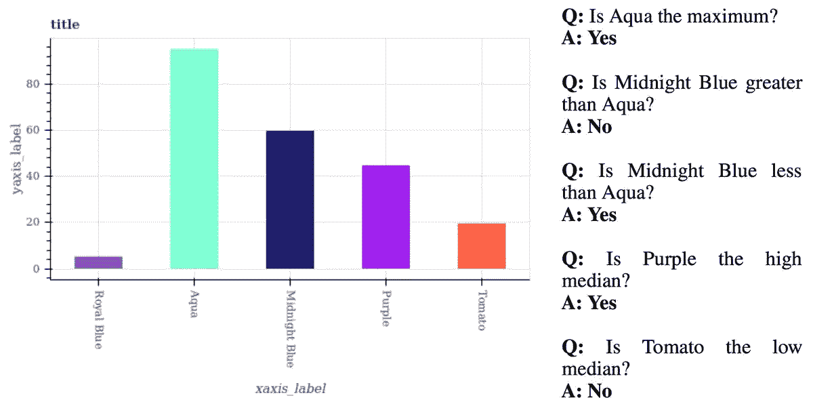
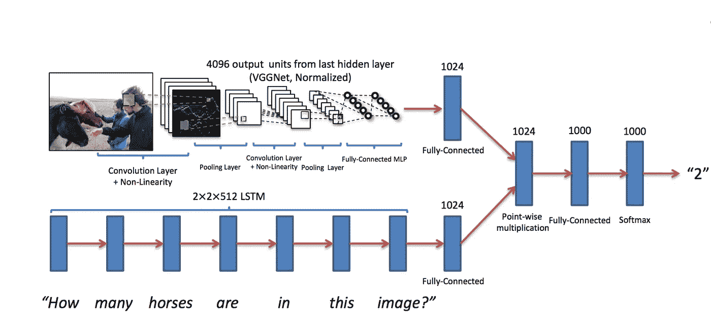
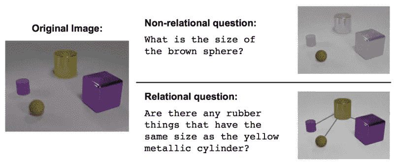
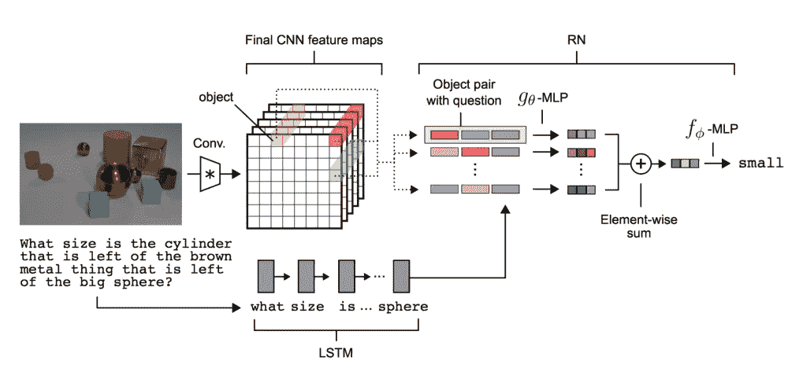

# 深度学习和视觉问答

> 原文：<https://towardsdatascience.com/deep-learning-and-visual-question-answering-c8c8093941bc?source=collection_archive---------1----------------------->

**视觉问答**是关于建立一个计算机系统来回答用图像和自然语言表达的问题的研究领域。首先，我们来考察一下**视觉问答**中的三个数据集。

# [VQA 数据集](http://www.visualqa.org)

**Figure 1\. VQA Dataset from www.visualqa.org**

在来自 www.visualqa.org 的[**VQA 数据集中，计算机系统需要解决问题，例如，二进制分类问题(伞是不是颠倒的？)，一个计数问题(床上有几个孩子？)，或者一个开放式的问题(谁戴着眼镜？孩子设定在哪里？)**](http://www.visualqa.org/)

# [CLEVR 数据集](https://cs.stanford.edu/people/jcjohns/clevr/)

**Figure 2\. CLEVR Dataset from Stanford**

在斯坦福 的 [**CLEVR 数据集里，计算机系统需要回答关于物体的形状/颜色/大小/材料，以及其空间/逻辑关系的问题。**](https://cs.stanford.edu/people/jcjohns/clevr/)

# [图 QA 数据集](https://datasets.maluuba.com/FigureQA)

**Figure 3\. FigureQA from Maluuba**

在来自 Maluuba 的 [**图 QA 数据集中，计算机系统需要回答以条形图、饼状图或线图呈现的问题。**](https://datasets.maluuba.com/FigureQA)

# 视觉问答和深度学习

因为**视觉问答**需要涉及图像识别和自然语言处理的技术，所以研究的一个主要方向是在**深度学习**上:使用**卷积神经网络(CNN)** 进行图像识别，使用**递归神经网络(RNN)** 进行自然语言处理，然后将结果组合起来给出最终答案，如图**图 4** 所示。

[**Figure 4\. Combining CNN/RNN for VQA**](https://github.com/anantzoid/VQA-Keras-Visual-Question-Answering)

[**Keras**](https://keras.io/getting-started/functional-api-guide/)**给出了**视觉问答**的通用模型，如图**图 5** 所示。**

**[**Figure 5\. VQA/CNN/RNN Model from keras.io**](https://keras.io/getting-started/functional-api-guide/)**

*   ****第 1–4 行**:导入 Keras**
*   ****第 6–21 行**:实现 CNN 进行图像识别**
*   ****第 23–26 行**:实现自然语言处理的 RNN**
*   **综合 CNN 和 RNN 的结果，给出最终答案**

# **视觉问答与关系网络**

**在**视觉问答**领域，一个有趣且重要的想法是由**deep mind[**[**1**](https://arxiv.org/abs/1706.01427)**，**[**2**](https://hackernoon.com/deepmind-relational-networks-demystified-b593e408b643)**]**提出的**关系网络**。**关系网**的主要目的是探索图像和问题中呈现的对象之间的空间关系或逻辑关系，如***“…与**图 6** 问题中的*** 大小相同，以及***“…在**图 7 问题中的***** 的左侧。**

****

****Figure 6\. non-relational questions and relational questions in CLEVR Dataset****

****

****Figure 7\. the model of relation network****

****图 7** 示出了视觉问答系统内部的关系网络的架构。注意，关系网络可能在基于**对象到对象的**或基于**特征到特征的**中探索关系。**图 8** 显示了 Keras/Theano 中**特征提取**和**关系提取**的简单实现。**

****Figure 8\. a simple implementaion of feature extraction and relation extraction in Keras/Theano****

# **结论**

****视觉问答**是一项有趣的挑战，结合了不同的学科，包括计算机视觉、自然语言理解和深度学习。希望我们能在 Medium 下看到更多这方面的文章。**

# **参考**

**[1] [VQA 数据集](http://www.visualqa.org)**

**[2] [CLEVR 数据集](https://cs.stanford.edu/people/jcjohns/clevr/)**

**[3] [图 QA 数据集](https://datasets.maluuba.com/FigureQA)**

**[4] [科拉斯 VQA 模型](https://keras.io/getting-started/functional-api-guide/)**

**[5] [来自 DeepMind 的关系网](https://deepmind.com/blog/neural-approach-relational-reasoning/)**

**[6] [视觉问答的人工智能进度测量](https://www.eff.org/ai/metrics#Visual-Question-Answering)**