# 深度学习笔记，第三章(第一部分):概率导论

> 原文：<https://towardsdatascience.com/deep-learning-book-notes-chapter-3-part-1-introduction-to-probability-49d13c997f2a?source=collection_archive---------8----------------------->

这些是我对深度学习这本书第三章的笔记的第一部分。它们也可以作为概率的快速入门。这些笔记涵盖了这一章的大约一半(介绍性概率的部分)，后续的文章将涵盖其余部分(一些更高级的概率和信息理论)。

我在第二章的笔记可以在这里找到:

 [## 深度学习笔记，第 2 章:用于深度学习的线性代数

### 这些是我对深度学习书第二章的笔记。它们也可以作为线性代数的快速介绍…

becominghuman.ai](https://becominghuman.ai/deep-learning-book-notes-chapter-2-linear-algebra-for-deep-learning-af776cf52506) 

像往常一样，这篇文章基于一个 Jupyter 笔记本，可以在这里找到。

# 书籍推荐

## 可能性

***出自本书:***

*   [*概率论:科学的逻辑*](https://www.amazon.com/Probability-Theory-Science-T-Jaynes/dp/0521592712) 杰恩斯著。
    ***我的评论:*** (还)没看。然而，如果你是概率新手，我不建议你这么做。引用这本书的序言: *“下面的材料是写给已经熟悉应用数学的读者的，在大学本科或更高的水平。”你可能不知道高等本科或更高层次的应用数学，如果你知道，你可能已经知道足够的概率，这可能不是你目前的主要优先事项。也就是说，这绝对是一本关于概率的经典研究生教材，值得放在你的数学书籍清单上阅读。请注意，它没有太多的练习，而且它所做的练习更多的是关于完成书中的证明，而不是练习(我猜这与它是一本研究生书是一致的)。*

***本人推荐:***

*   *概率导论布利茨坦和黄。
    ***我的评论:*** 不错，引人入胜的书，很好地覆盖了概率最重要的方面。使用故事、代码和许多练习，其中一些有在线解决方案。 **100%推荐**，如果你已经不太懂概率的话肯定适合。请注意，你需要了解一些微积分来阅读它，因为概率经常涉及积分和导数。
    我唯一的批评:有解决方案的练习太少，练习的交错应该更精细(即应该在每一节的结尾有练习，而不是在每一章的结尾)，如果代码是 Python 而不是 R 就好了；).
    这本书也是基于哈佛大学的统计数据 110，你可以在这里观看:*

*   *[*贝特塞卡斯和齐茨克里斯的概率*](https://www.amazon.com/Introduction-Probability-2nd-Dimitri-Bertsekas/dp/188652923X/ref=dp_ob_title_bk) 导论。
    ***我的评论:*** 没看过，但显然挺有说服力的。应该与上面的另一本《概率导论》相当相似，事实上，几乎可以说这本书是“麻省理工版本”，而前一本是“哈佛版本”。这个还附带了开放式课程视频:*

*   *[*海明的概率艺术*](https://www.amazon.com/Art-Probability-Richard-W-Hamming/dp/0201406861/ref=mt_paperback?_encoding=UTF8&me=) 。我的评论:我没有读过这本书，但我确实买了它，因为我在研究为这篇文章推荐的书籍，因为它看起来很有竞争力。引用其中一篇评论:
    *“海明对概率的贡献就像费曼在他的讲座中对物理学的贡献一样。”* 这本书似乎也呈现了一些信息论，这是我们目前深度学习书章节的另一个话题！*
*   *数学和尚 [*概率初级读本*](https://www.youtube.com/playlist?list=PL17567A1A3F5DB5E4) 。
    **我的评论:**这是一个 Khanacademy 风格的 youtube 播放列表。我把它包括在内，因为这可能是学习一些应用于概率的测度理论的最简单的方法，因为我相信除了杰恩斯以外，上面没有任何一本书提到测度理论。深度学习需要了解什么测度理论吗？几乎肯定不会，但人们可能会参考它(例如，深度学习的书会参考)，对它有一些模糊的概念会很有用。*

# *信息论*

****出自本书:****

*   *[*信息论的要素*](https://www.amazon.com/Elements-Information-Theory-Telecommunications-Processing/dp/0471241954) 由盖和托马斯。
    ***我的评论:*** 没看过。坦白地说，我从来没有读过任何一本专门关于信息论的书。然而，这基本上被认为是**信息论上的**经典。坦白地说，对于深度学习，你可能不需要非常深入地了解信息论，但如果你确实想学习它，阅读这本书似乎是一个不错的方法。*
*   *[*信息理论、推理和学习算法*](http://www.inference.org.uk/itprnn/book.html) 麦凯著。
    ***我的评论:*** 我也没看过。然而，我推荐它**多于**，原因如下:
    -它在亚马逊上的评论比封面&托马斯好。
    -它明确涵盖了机器学习背景下的信息论。
    -是**免费的！！！！！！！！！***

****我的推荐:****

*(目前)没有。*

# *可能性*

## *什么？*

*也许描述概率的一种方式类似于逻辑，但是当不确定性出现时。*

*例如，逻辑可以接受“如果某物会飞，那么它是一只鸟”和“如果某物是一只鸟，那么它是美味的”这样的陈述，并允许我们推断出“如果某物会飞，那么它是美味的”，但是在并非所有会飞的都是鸟或者并非所有是鸟的都是美味的情况下，它对我们没有帮助。概率可以:有了概率，我们就可以知道“如果一个东西会飞，那么有 90%的可能是一只鸟”和“如果是一只鸟，有 80%的可能是美味的，否则肯定不好吃”。由此我们可以推断，有 72%的可能性会飞的东西是美味的，这是我们用逻辑无法做到的。*

*“频繁主义者”和“贝叶斯”对概率的解释是有区别的……我不会对此做过多解释。坦率地说，大多数人通常在不同的情况下使用这两种方法，这本质上可以归结为，他们接受我们在日常生活中用概率语言谈论的几乎所有事情确实是概率。*

*这里有一个关于这个话题的有趣视频:*

## *为什么？*

*那么深度学习为什么需要概率呢？根据这本书，有两个原因:*

*   *概率推理在这个世界上是必要的，因为很少有事情是确定的，所以我们的人工智能系统应该使用概率规则进行推理。
    举一个具体的深度学习例子，就拿下面的 MNIST 形象来说。是奇怪的 4 还是奇怪的 9？结果是 4，你可能会认为这是最合理的答案，但我相信你不会肯定地说，这就是为什么你的深度学习算法似乎也不必肯定地给出答案。*

*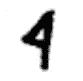*

*   **我们经常需要对深度学习算法进行概率分析。*
    举个简单的例子，当我们评估一个分类模型时，我们经常使用它的*准确度*，这毕竟是模型在给定一个例子的情况下输出正确答案的概率。更复杂的是，我们可以问这样的问题，比如“如果我给它 N 个例子来训练，我的算法将具有精度 X 的概率是多少”，就像在 [PAC learning](https://en.wikipedia.org/wiki/Probably_approximately_correct_learning) 中一样，等等。*

*在我看来，有一个关键的原因被忽略了，那就是逻辑是*离散的*而概率是*连续的*。就拿这张图来说吧，是狗还是猫？*

**

*我想我们都同意这里不涉及概率。这绝对是一只 100%的猫，所以上面的“很少事情是确定的”论点不应该适用。*

*事实上，我认为它没有，但对我们的模型来说，返回某样东西是猫而不是确定性的*概率*仍然很重要，因为概率是**连续的**而确定性不是:如果我们的算法输出确定性，并认为上面的图片是一只狗，那就真的很难知道如何改变它的参数，以便它输出正确的答案，而不会破坏它在例子上的表现。相比之下，对于概率，有一个简单的方法来增加图片是一只猫的概率，我们在第四章会看到。*

****不确定性来源****

*这本书给出了 3 个(或者可以说是 4 个)不确定性的来源。我认为有可能将它们合二为一:*

*   ***“真正的”随机性**(“随机性”只是“随机性”的一个花哨说法):有时候这个世界真的在抛硬币，你必须处理好这个问题。一个深度学习的例子是语言建模，其中深度学习模型需要在给定一系列先前单词的情况下预测下一个单词。如果我给你一个句子“法国是一个……”，你能预测下一个单词是什么吗？不，因为它实际上可以是任何数量的东西:就在法国的维基百科页面上，这些词后面是“国家”、“统一”、“发达”、“创始”、“成员”和“永久”。这本书区分了“固有的随机性”和“不完全的可观察性”。在我看来，这通常不是一个有用的区别:如果有人抛硬币，答案是随机的，因为有实际的量子过程决定它最终在哪一边，还是看起来是随机的，因为我们没有硬币旋转速度、空气分子密度等信息。？答案几乎总是:没关系。*
*   ***建模不完整**:有时候你就是不能对所有事情建模，或者不想建模。
    再次以语言建模为例，事实是尽管最近取得了真正的进步，但计算机仍然无法像人类一样理解语言，这有时意味着人类可以 100%的概率预测句子中的下一个单词，而机器还不能。这意味着我们的算法需要依赖输出概率，因为它们还不够好。类似地，你可能会认为，对确定某件事所涉及的所有复杂性进行建模太高了，你有时犯错误也没关系。书中的例子很好地说明了这一点:记住“大多数鸟都会飞”比记住“除了生病、受伤或非常年幼的鸟，以及几维鸟、鸵鸟、鸸鹋等，所有的鸟都会飞”要便宜得多。*

# *随机变量*

*随机变量是其值随机变化的“变量”。*

*从代码的角度来看，这没有任何意义，所以你可以把随机变量想象成一个不带参数的函数，返回一个随机值。这是一个随机变量 X 的例子，它是随机的 1 或 2。*

*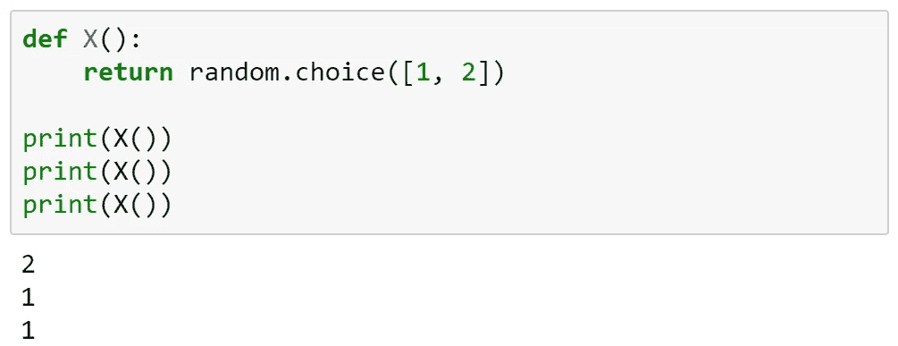*

*所以当我谈论随机变量 X 时，你可能会问，我是在谈论用`def X(): ...`定义的函数，还是在谈论通过调用`X()`得到的返回值？*

*答案是:看情况。事实是，数学符号是如此草率，但在实践中，它通常会直截了当地指出人们是在谈论`def X(): ...`还是`X()`。*

*最后要注意的是，如果随机变量在数学表达式中作为一个数字使用，它通常不会每次都重新计算，所以例如:X < 1.5 and X > 0.5 意味着:*

*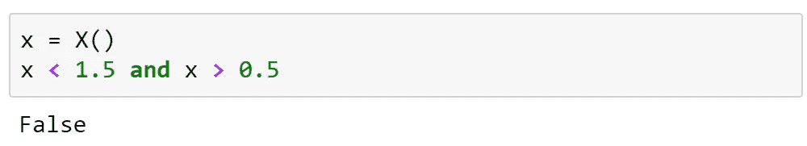*

***不是***

*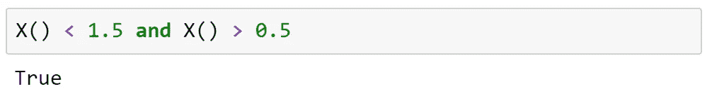*

*随机变量可以是*连续*或*离散*。难道**而不是**读连续和离散随机变量的定义，是因为它是错误的，而且我不是指“有点简化”中的“错误”，而是更多的“错误”是指“如此简化，以至于人们会错误地认为某些 r.v.s 实际上是连续的却是离散的，这完全错过了为什么一开始就有区别的要点”。*

*以下是我认为保持准确性的两者的简化定义:*

*   *离散随机变量是一种随机变量，它只能返回(也称为“接受”)“断开的”值。换句话说，在它能返回的任意两个数之间，还有其他数(实际上是无穷多个)是它不能返回的。
    例如，我们上面的变量 X 是离散的，因为它只能返回 1 或 2，而不能返回 1.5、1.25、1.58928921 或 1 和 2 之间的任何其他数字。同样，即使一个变量可以取下列任何一个数字:0.5，1，1.5，2，2.5…等等，它也是离散的，尽管它有无限的可能性。*
*   *一个连续的随机变量可以取一个(或几个)区间上的任何值。
    例如，下面的变量 Y 可以取 0 到 1 之间的任何数字。它能达到 0.03920 吗？是的。0.23?是的。等等。*

*这种区别很重要，原因有二:*

*   *离散的随机变量可以用正规的算术来处理。连续随机变量需要微积分。*
*   *一个离散随机变量可以取的所有值都有大于 0 的概率。一个连续的随机变量可以取的所有值有一个概率…等于 0！
    想想下面的变量 Y:0 到 1 之间的每一个数被 Y 返回的概率都是一样的……但是 0 到 1 之间有多少个数呢？无限！所以不可能每个数字的概率都大于 0，因为否则总的概率将等于无穷大。*

**

# *分发、PMF 和 pdf*

*分布是描述随机变量不同可能输出的概率的一种方式。分布可以告诉我们一个随机变量输出一个给定值或一个给定区间值的概率是多少。*

*在 Python 中，`scipy.stats`模块支持许多发行版。我们将在这里解释一下如何探索这个模块。*

*离散分布有一个概率**质量**函数(PMF)。它接受一个值并输出一个概率，例如，如果 P 是上面变量 X 的 PMF，则 P(1) = 0.5。有时我们写 P(X = 1)，这样我们就确定它是 X 的 PMF*

*如果你画出这个函数，x 轴将显示它可以取的不同值，而 y 轴将显示该值的概率。当然，所有 y 值之和必须等于 1，因为随机变量的概率之和必须为 1。*

*scipy 支持的离散分布可以在[这里](https://docs.scipy.org/doc/scipy/reference/tutorial/stats/discrete.html)找到。这允许我们使用已知的分布创建随机变量，这比编写自己的函数更方便。需要注意的一点是，为了从一个 r.v .中采样，我们现在需要调用 distribution 对象上的`rvs()`函数。例如，让我们从“二项式”分布中取样:*

*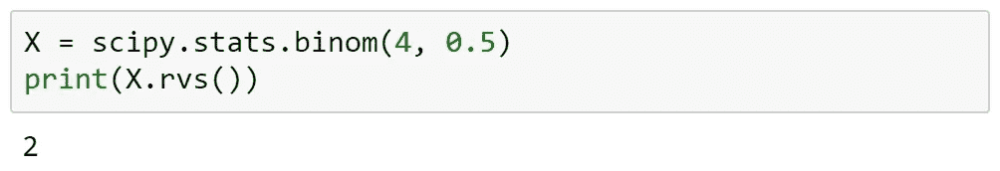*

*因为离散 r.v .的值是不连续的，所以 PMF 看起来像这样“尖尖的”:*

*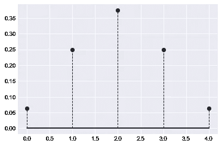*

*对于多个变量可以有一个 PMF，在这种情况下我们称之为“联合 PMF”。所以 PMF P(X = x，Y = y)给出了 X 等于 X，Y 等于 Y 的概率，通常这与 X 等于 x **乘以** Y 等于 Y 的概率相同，但并不总是如此(见下文)。*

*这是一个联合 PMF 的样子:*

*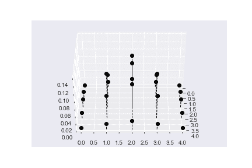*

*另一方面，连续随机变量具有概率**密度**函数。它也是 r.v .可以取的值的函数，但是它不**而不是**返回给定值的概率:正如我们已经说过的，对于每个可能的值，概率都是 0。*

*然而，我们可能想要表达这样的概念，例如，接近 0 的值*应该比接近* 2 的值*更有可能，即使 0 和 2 的概率都是 0。这就是概率**密度**函数的用武之地:在 *x* ( *p(x)* )的 PDF *p* 的值与得到一个在*区间*内非常接近 *x* 的数的概率成比例。**

*具体来说，它是这样定义的，即值落在一个区间内的概率是该区间内 PDF 曲线下的面积。换句话说，要获得某个区间内的值的概率，你需要**对该区间内的 PDF 进行积分**，就像如果你想对一个离散的 r.v .做同样的事情，你需要对该区间内的 PMF 值求和:积分基本上是求和的连续等价物。*

*遗憾的是，与求和不同，手工积分相当困难。幸运的是，借助现代软件，有两种方法可以轻松获得积分:*

*   *使用 [Wolfram Alpha](https://www.wolframalpha.com/) ，你通常可以获得积分的精确解析解:例如，只需写下“[integrate 2x+1 from 0.1 to 0.8](https://www.wolframalpha.com/input/?i=integrate+2x%2B1+from+0.1+to+0.8)”，Wolfram Alpha 就会告诉你确切的答案，即 1.33。*
*   *在 python 中使用 scipy:可以使用`scipy.integrate.quad`。它返回的第一个值是积分，第二个值可以忽略(这是对答案中可能存在的误差的估计，因为数值积分是一个近似过程)。*

*scipy 中的连续分布可以在[这里](https://docs.scipy.org/doc/scipy/reference/tutorial/stats/continuous.html)找到。让我们重新定义上面的 r.v. Y，你会记得它是从 0 到 1 均匀分布的:*

*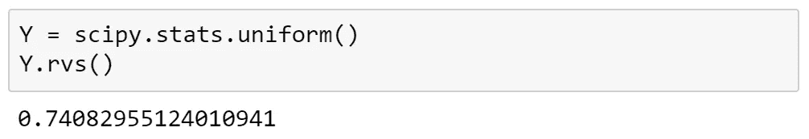*

*正如我们所记得的，Y 是一个连续的随机变量，从 0 到 1 的所有值被选中的概率相等，而 0 以外的所有值被选中的概率为 0。让我们展示一下它的 PDF 格式:*

*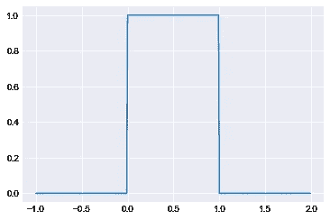*

*我们预计 Y 返回一个介于 0.3 和 0.4 之间的数字的概率是 0.1，因为该区间覆盖了允许范围的 10%。同样，很明显，值落在 0 和 1 之间的概率一定是 1，并且它落在-1 和 2 之间的概率也一定是 1。*

*让我们通过整合来检查:*

*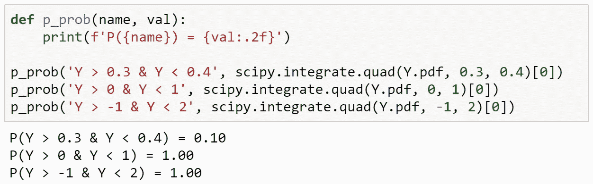*

*就像 PMF 一样，一个 PDF 可以关联到两个不同的随机变量。我们称之为“联合 PDF”。下面是一个例子:*

*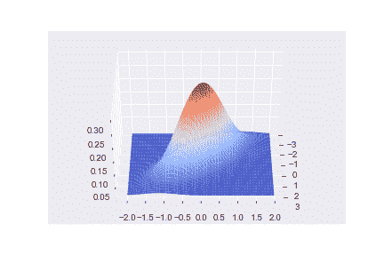*

# *排斥*

*如果给你一个联合 PMF，想知道单个变量对应的 PMF 或者 PDF 怎么办？换句话说，你知道 P(X=x，Y=y)，想知道的只是 P(X=x)。*

*从逻辑上看，X = x 忽略 Y 的概率应该是 X=x *和* Y=0(或者 Y 的第一个可能值)的概率加上 X=x *和* Y=1 的概率，等等。换句话说，我们对所有可能的 Y 取 P(X=x，Y=y)的**和**。在数学上:*

*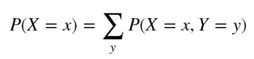*

*这个过程确实是正确的，叫做**边缘化**。X 的最终分布称为**边际分布**。让我们看看 PMF 是什么样子，提醒一下，我们在`join_probabilities`变量中有一组联合概率:*

*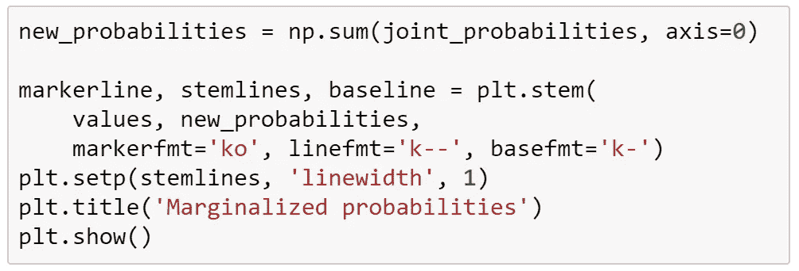**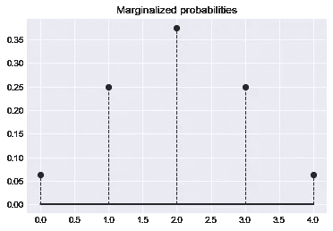*

*在这种情况下，我们恢复了 X 的原始 PMF，因为`joint_probabilities`包含了独立变量的概率。情况不一定总是如此。*

*边缘化也适用于 pdf，同样，唯一的区别是我们需要在所有可能的 y 上使用积分，而不是 sum，即:*

*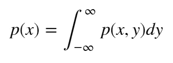*

*让我们看看当我们在之前的连续连接 PDF 中边缘化 X 时会是什么样子:*

*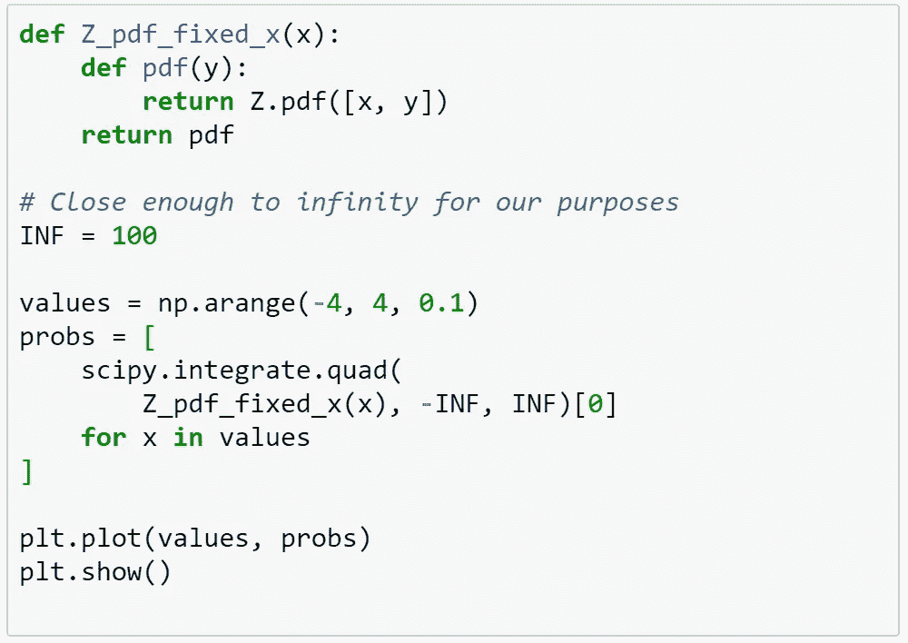**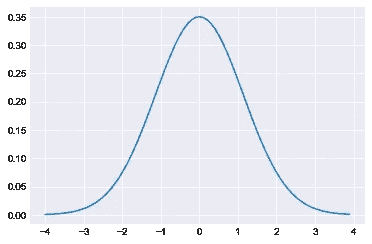*

*也许一种看待边缘化的方式是一种“挤压”的形式:想象沿着 y 轴压缩你在上面看到的 3D 图片，将概率质量推到它自己的顶部，直到 3D 图形完全变平，只留下原始的 x 轴。*

*当然，因为你可以有两个以上变量的联合分布，这个可视化只能到此为止，但是记住我们上次的引用:*

> *要处理一个 14 维的空间，想象一个 3 维的空间，大声对自己说“14”。每个人都这样做。*
> 
> *杰弗里·辛顿*

# *条件概率*

*边缘化可以让我们从 X 和 Y 的联合分布中得到忽略变量 Y 的变量 X 的分布，但是如果给定 Y 的一个*特定*值，我们想知道 X 的分布呢？*

*给定 Y，这个概率称为 X 的*条件*概率，表示如下:*

*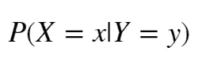*

*在这种情况下，竖线通常读作“given”。*

*举个具体的例子，假设你想知道某人是否来自德国，你知道他说一口流利的德语。以下是显示世界上说德语且居住在德国的人口比例的联合 PMF:*

*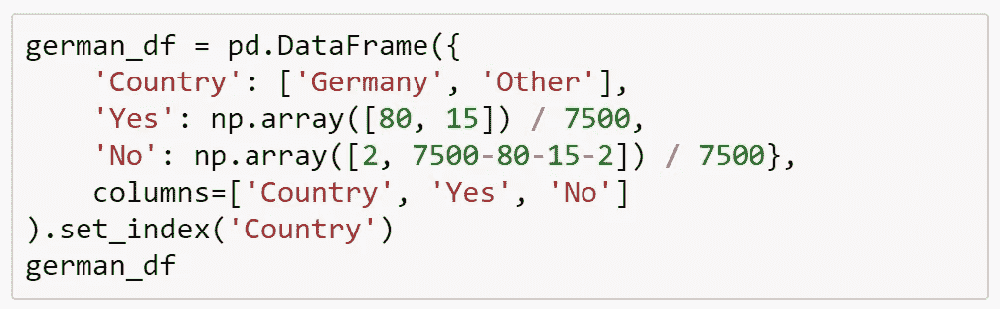**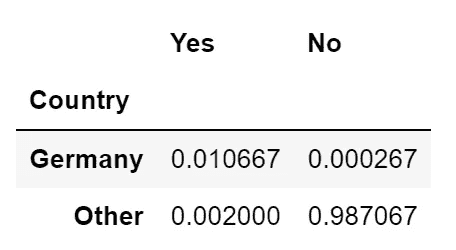*

*怎么知道说德语的人是德国人的概率？看起来你需要知道世界上有多少人说德语，以及德国总共有多少人。事实上，在这两种情况下，你都不需要实际的人口数量，世界人口的比例就足够了。换句话说:*

*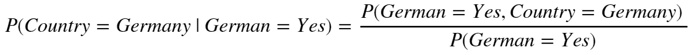*

*我们得到分母的方法当然是使用如上所述的*边缘化*，即把生活在德国的每个人的语言相加。*

*我们得到:*

*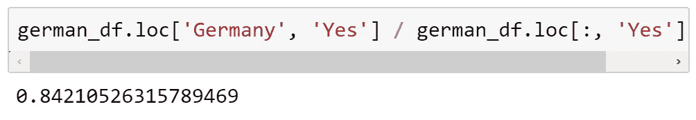*

*84.2%的几率，这当然不足为奇，因为德国是一个讲德语的大国。*

*正如您可能猜到的，一般规则如下:*

*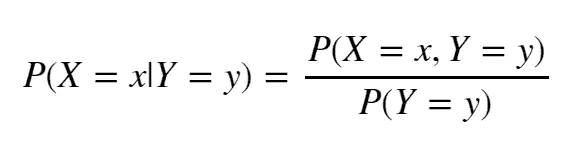*

*将这个规则应用于 X 的所有可能值，我们得到一个新的分布，称为给定 y 的 X 的条件分布。*

*类似于我们所说的边缘化可以被认为是“挤压”联合分布的图形，采用条件分布类似于**切割**图形，然后*重整*图形，使得最终分布仍然总计为 1。让我们沿着 Y = 1.0 对之前的 3D 关节 PDF 进行“切片”:*

*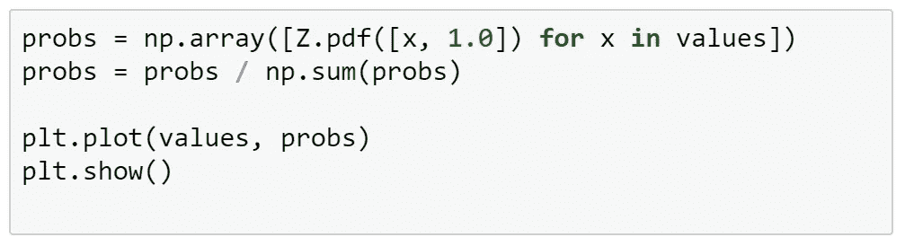***

*重要的是不要将条件概率与实际可行的东西混淆。在我们德国的例子中，很明显，教某人德语并不会使他们更有可能来自德国，但是这个陷阱通常并不那么明显。*

**

# *条件概率链规则*

*我们现在知道如何从联合分布到边际分布，从联合边际分布到条件分布。现在，让我们完成从边际和条件分布到联合分布的循环。*

*这个过程非常简单。假设你知道一个人说德语是德国人的概率，也知道世界上任何地方的人说德语的概率，你想知道一个人既是德国人又会说德语的概率。看起来你需要简单地将条件概率和边际概率相乘:*

*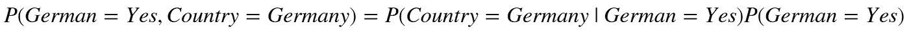*

*事实上，这直接来自上面条件概率的定义。*

*总的来说:*

*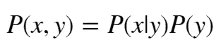*

# *贝叶斯法则*

*最后假设你不想知道你的朋友是德国人的概率，而不是他会说德语，而是想知道某人会说德语的概率，因为他们来自德国。*

*当然，我们可以使用以前的完整联合 PMF 表来完成，但不幸的是，我们并不总是能够访问这些表。假设我们从上面知道了概率(说德语的人来自德国)，以及世界上任何地方的人是德国人的概率和世界上有人说德语的概率。我们能搞清楚吗？*

*当然，我们只需要恢复联合概率，我们在上面做过，然后除以德国人的比例。*

*一般来说，我们有:*

*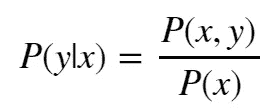*

*(来自条件概率的定义)*

*所以:*

*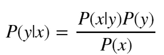*

*(来自条件概率的链式法则)。*

*这最后一个等式以**贝叶斯法则**而闻名。它在许多情况下都非常有用，尽管你可以看到，尽管它的名字很花哨，但它只是我们定义的一个简单应用。*

# *最后的话*

*以上仅涵盖了第三章的大约一半。这比我预期的要花更长的时间来写，我认为我们已经在材料中取得了很好的自然突破(剩下的更多的是各种有趣的技术的大杂烩)，所以我将在随后的帖子中完成第三章的笔记。回头见！*