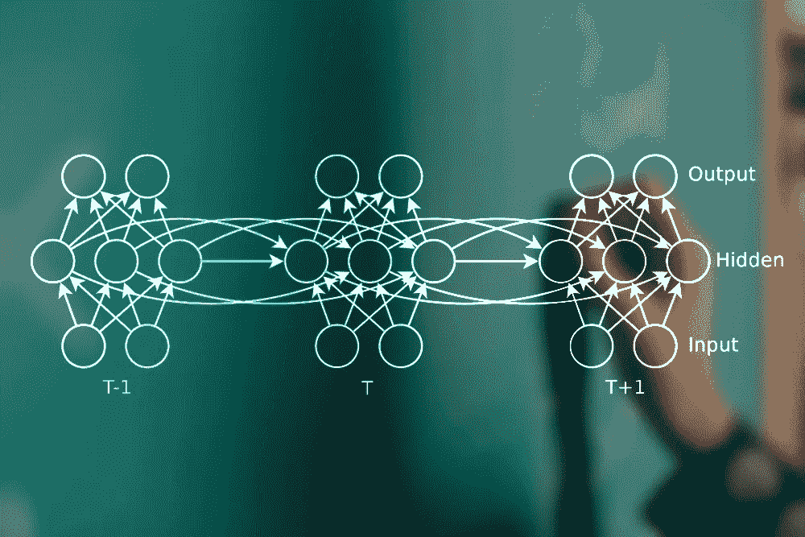
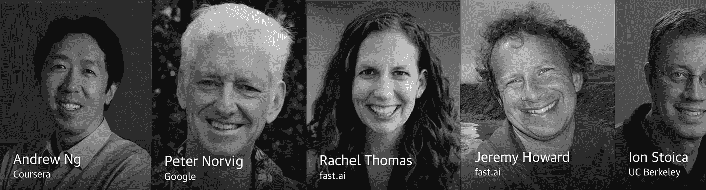

# 深度学习第十章:序列建模:递归和递归网络

> 原文：<https://towardsdatascience.com/deep-learning-chapter-10-sequence-modeling-recurrent-and-recursive-nets-68aee18c5eae?source=collection_archive---------5----------------------->

我们有幸请到了作者 Ian Goodfellow 介绍《第 10 章序列建模:深度学习的递归和递归网络》一书。

以下是他在演讲中提到的论文列表:

> [用于递归神经网络序列预测的预定采样](https://arxiv.org/abs/1506.03099)
> [教授强制:用于训练递归网络的新算法](https://arxiv.org/abs/1610.09038)
> [用于训练非常深的前馈网络的随机行走初始化](https://arxiv.org/abs/1412.6558)
> [层归一化](https://arxiv.org/abs/1607.06450)
> [多预测深度玻尔兹曼机器](https://papers.nips.cc/paper/5024-multi-prediction-deep-boltzmann-machines)

我希望你喜欢伊恩的演讲！

我们刚刚完成了该书的第二部分，并将从 8 月 28 日开始复习**第三部分:深度学习研究**。即将举行的活动时间表:

> **08/28** 13 线性因子模型
> **09/05** 14 自动编码器
> **09/11** 15 表征学习
> **09/18** 16 用于深度学习的结构化概率模型
> **09/25** 17 蒙特卡罗方法
> **10/02** 18 面对配分函数【T33

我希望你能加入我们！

***书:***

*深度学习书籍是唯一一个教授深度学习核心原则的有组织的出版物。这本书可以在网上免费获得:*[*http://www.deeplearningbook.org/*](http://www.deeplearningbook.org/)

***俱乐部:***

[*深度学习读书会*](https://www.meetup.com/Deep-Learning-Book-Club/about/comments/?op=all) *是留出一段时间来复习书中的资料，一起解决问题。每周，我们行业专家都会介绍一个章节。我们每周一下午 6:30-8:30 在旧金山霍华德街 101 号的 USF 数据研究所会面。*

*对未来事件的 RSVP:*

**过往事件录音在此有:*[*https://www.youtube.com/c/AlenaKruchkova*](https://www.youtube.com/c/AlenaKruchkova)*

****我现在挖的东西:****

1.  *fast.ai 的雷切尔·托马斯(Rachel Thomas)开设了令人惊叹的计算线性代数课程**。这是一门“完全以实际应用为中心”的课程，使用了“前沿算法和工具”。
    [https://github . com/fastai/numerical-linear-algebra/blob/master/readme . MD](https://github.com/fastai/numerical-linear-algebra/blob/master/README.md)***
2.  ***奥莱利人工智能大会**在旧金山举行，拥有一个令人印象深刻的发言人名单:
    [https://conferences . oreilly . com/artificial-intelligence/AI-ca](https://conferences.oreilly.com/artificial-intelligence/ai-ca)
    如果你在那里见到我，打个招呼！*

**