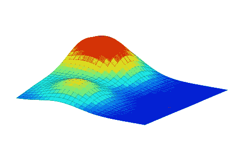

# 深度学习第四章:数值计算

> 原文：<https://towardsdatascience.com/deep-learning-chapter-4-numerical-computation-14de09526931?source=collection_archive---------4----------------------->

第四章:数值计算由雅罗斯拉夫·布拉托夫提出。

在我们讨论第 3 章的时候，我们没有机会复习这一章的信息论部分，所以在我们进入第 4 章之前，我们请雅罗斯拉夫给我们一个快速的概述。

然后我们继续讨论*数值计算*。雅罗斯拉夫用他自己的幻灯片(请见下面附的幻灯片)向我们概述了这一章，然后在演示结束时浏览了 Ian Goodfellow 的幻灯片。

 [## presentation.pdf

### 雅罗斯拉夫·布拉托夫的数字计算幻灯片

drive.google.com](https://drive.google.com/open?id=0B653sCwrWAVNclZZRU5fdkRkakU) 

这是我们深入 ML 和 DL(也称为有趣的东西)之前的最后一章:)，所以请继续关注不久的将来的更多帖子。

我们每周一都会在 USF 数据研究所见面。对于未来的活动，请查看我们的 [meetup 页面](https://www.meetup.com/Deep-Learning-Book-Club/)。下一次会议在 2017 年 6 月 12 日星期一下午 6:30-8:30 我们将讨论*第 5 章:机器学习基础*。我们将有一个现场直播的链接:[https://youtu.be/-l1JGI-cCvY](https://youtu.be/-l1JGI-cCvY)