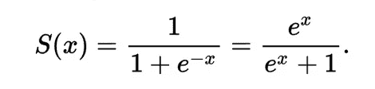
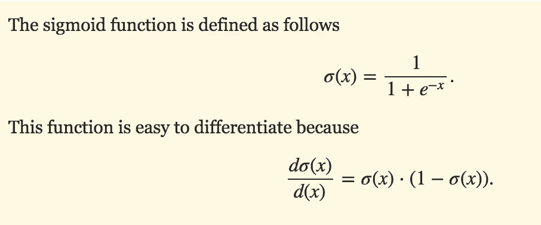
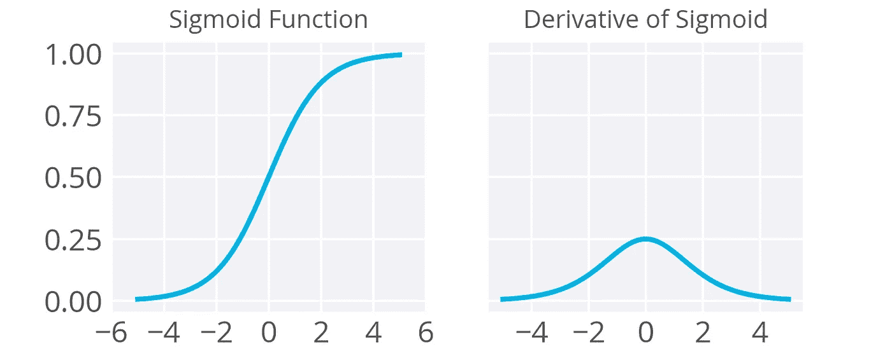
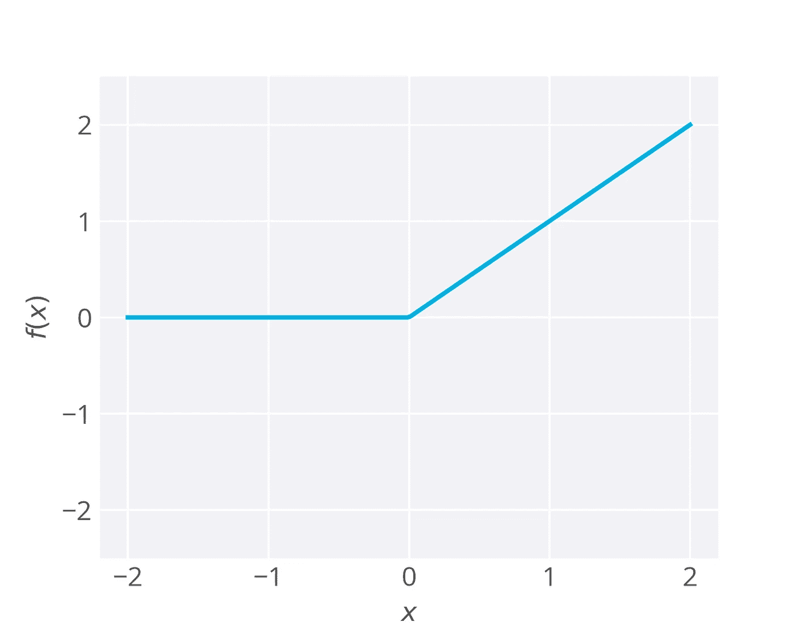
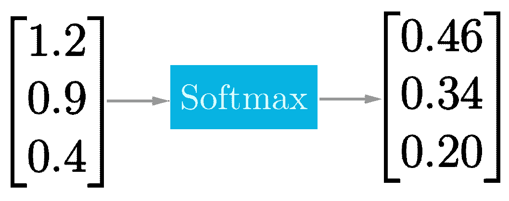
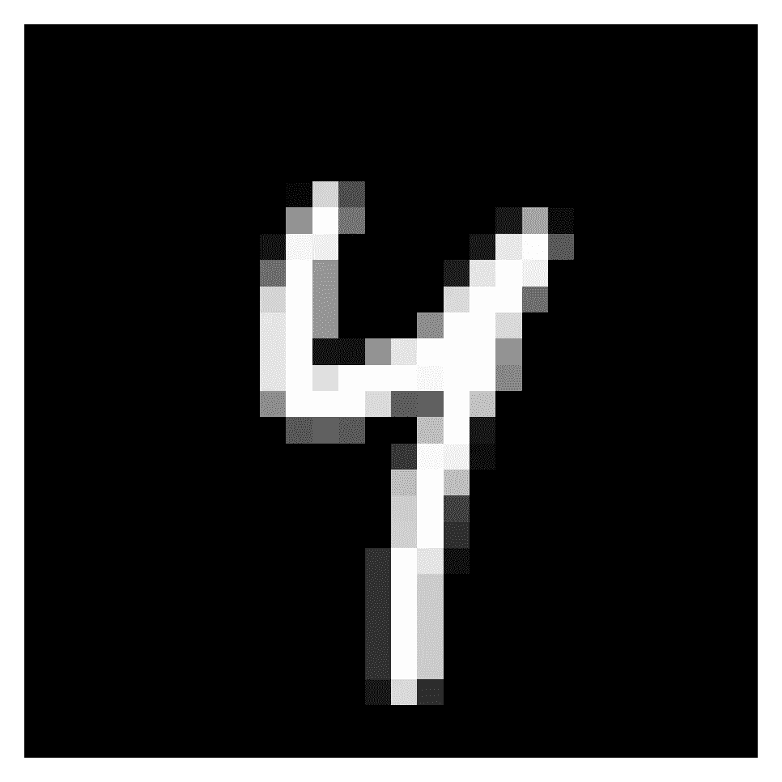
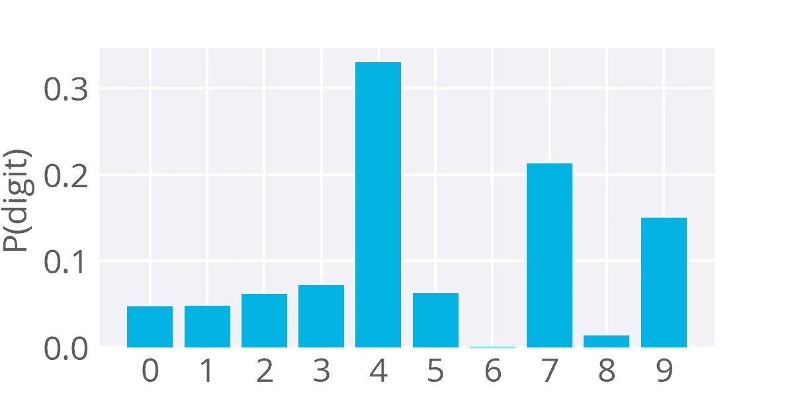
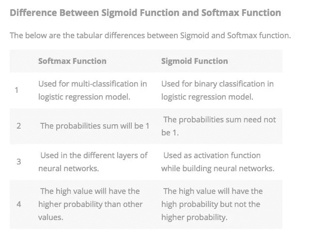
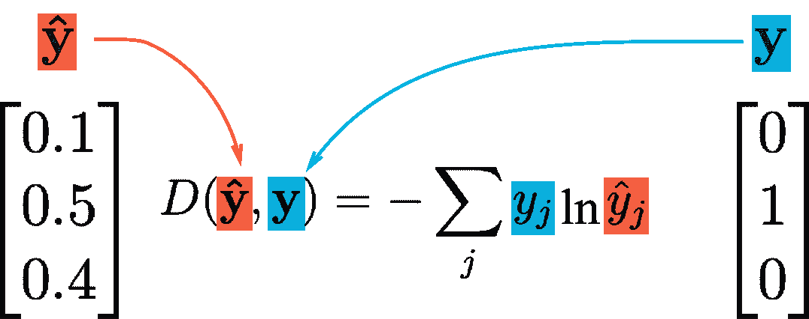

# 深度学习概念—第 1 部分

> 原文：<https://towardsdatascience.com/deep-learning-concepts-part-1-ea0b14b234c8?source=collection_archive---------4----------------------->

# 激活功能

Sigmoid 函数:

乙状结肠的导数:

之前，我们一直使用 sigmoid 函数作为隐藏单元的激活函数，在分类的情况下，作为输出单元的激活函数。然而，这不是你能使用的唯一的激活功能，实际上有一些缺点。

如反向传播材料中所述，s 形的导数在 0.25 处达到最大值(见上文)。这意味着，当您使用 sigmoid 单元执行反向传播时，返回网络的误差将在每一层至少缩小 75%。对于接近输入图层的图层，如果您有很多图层，权重更新将会很小，并且这些权重将需要很长时间来训练。由于这个原因，sigmoids 已经不再受欢迎的激活隐藏单位。

## 输入校正的线性单位

最近的深度学习网络使用**整流线性单元** (ReLUs)代替 sigmoids 用于隐藏层。如果输入小于 0，整流线性单元具有输出 0，否则具有原始输出。也就是说，如果输入大于 0，则输出等于输入。数学上，这看起来像

*f*(*x*)= max(*x*，0)。

函数的输出或者是输入， *x* ，或者是 0，以较大者为准。所以如果*x*= 1，那么 *f* ( *x* )=0，如果 *x* =0.5，那么 *f* ( *x* )=0.5。从图形上看，它看起来像:

ReLU 激活是您可以使用的最简单的非线性激活功能。当输入为正时，导数为 1，因此不会出现 sigmoids 反向传播误差的消失效应。研究表明，ReLUs 可以大大加快大型网络的训练速度。像 TensorFlow 和 TFLearn 这样的大多数框架使得在隐藏层上使用 ReLUs 变得很简单，所以你不需要自己实现它们。

## 缺点

有可能一个大的梯度可以设置权重使得一个 ReLU 单位总是 0。这些“死的”单元将总是 0，并且大量的计算将被浪费在训练中。

摘自安德烈·卡帕西的 CS231n 课程:

> *不幸的是，ReLU 部队在训练中很脆弱，可能会“死亡”。例如，流过 ReLU 神经元的大梯度可能导致权重更新，使得神经元再也不会在任何数据点上激活。如果发生这种情况，那么从该点开始，流经该单元的梯度将永远为零。也就是说，ReLU 单元在训练期间可能会不可逆地死亡，因为它们可能会从数据流形上脱落。例如，如果学习率设置得太高，您可能会发现多达 40%的网络可能是“死的”(即，在整个训练数据集内从未激活的神经元)。有了正确的学习率设置，这个问题就不那么常见了。*

## Softmax

之前我们已经看到神经网络用于回归(自行车骑手)和二元分类(研究生入学)。通常，您会发现想要预测某个输入是否属于多个类中的一个。这是一个分类问题，但乙状结肠不再是最佳选择。相反，我们使用 [**softmax**](https://en.wikipedia.org/wiki/Softmax_function) 功能。softmax 函数将每个单元的输出压缩到 0 和 1 之间，就像一个 sigmoid。它还对每个输出进行分频，使输出的总和等于 1。softmax 函数的输出相当于分类概率分布，它告诉您任何类为真的概率。

这与正常的 sigmoid 之间唯一的真正区别是 softmax 将输出归一化，使它们的总和为 1。在这两种情况下，您都可以放入一个向量，并得到一个向量，其中输出是一个大小相同的向量，但所有值都压缩在 0 和 1 之间。对于二进制分类，您可以使用带有一个输出单元的 sigmoid。但是，如果您正在进行多项式分类，您可能希望使用多个输出单元(每个类一个)并在输出上激活 softmax。

例如，如果一个 softmax 函数有三个输入，比如一个网络有三个输出单元，它看起来像:

数学上，softmax 函数如下所示，其中 **z** 是输出层的输入向量(如果有 10 个输出单元，则 **z** 中有 10 个元素)。再次， *j* 索引输出单元。

不可否认，这看起来很难理解，但实际上很简单，如果你不懂数学也没关系。请记住，输出被压缩，它们的总和为 1。

为了更好地理解这一点，考虑训练一个网络来从图像中识别和分类手写数字。该网络有十个输出单元，每个单元对应一个数字 0 到 9。然后，如果你给它输入一个数字 4 的图像(见下文)，对应于数字 4 的输出单元就会被激活。

图片来自 [MNIST 数据集](http://yann.lecun.com/exdb/mnist/)

建立这样的网络需要 10 个输出单元，每个单元对应一个数字。每个训练图像都标有真实数字，网络的目标是预测正确的标签。因此，如果输入是数字 4 的图像，则对应于 4 的输出单元将被激活，并且对于其余单元以此类推。

对于上面的示例图像，softmax 函数的输出可能如下所示:

预测上述数字的网络的 softmax 输出示例

这个图像看起来最像数字 4，所以你有很大的可能性。然而，这个数字在没有完成循环的情况下看起来有点像 7，又有点像 9。所以，你最有可能得到 4，但也有可能得到 7 或 9。

softmax 可用于任意数量的课程。接下来你会看到，它将被用来预测两类情绪，积极的或消极的。它也用于成百上千的类，例如在对象识别问题中，有成百上千个不同的可能对象。

# Softmax 函数与 Sigmoid 函数:

## Sigmoid 函数的性质

*   sigmoid 函数返回实值输出。
*   sigmoid 函数的一阶导数将是非负或非正的。
*   **非负:**如果一个数大于等于零。
*   **非正数:**如果一个数小于或等于零。

## Sigmoid 函数用法

*   逻辑回归模型中用于**二元分类**的 Sigmoid 函数。
*   在创建人工神经元时，sigmoid 函数用作**激活函数**。
*   在统计学中， **sigmoid 函数图**通常作为累积分布函数。

## Softmax 函数的性质

下面是 softmax 函数的几个属性。

*   计算出的概率将在 0 到 1 的范围内。
*   所有概率之和等于 1。

## Softmax 函数用法

*   用于多分类逻辑回归模型。
*   在构建神经网络时，softmax 函数用于不同的层级别。

## Sigmoid 函数和 Softmax 函数的区别

# 范畴交叉熵

之前，我们一直使用误差平方和作为网络的成本函数，但在这些情况下，我们只有单一(标量)输出值。

然而，当你使用 softmax 时，你的输出是一个*向量*。一个向量是来自输出单元的概率值。你也可以使用所谓的**一键编码**将你的数据标签表示为一个向量。

这仅仅意味着您有一个长度为类的数量的向量，并且 label 元素被标记为 1，而其他标签被设置为 0。在对之前的数字进行分类的情况下，数字 4 的图像的标签向量将是:

**y** =[0，0，0，0，1，0，0，0，0，0]

我们的输出预测向量可以是这样的

^ =[0.047，0.048，0.061，0.07，0.330，0.062，0.001，0.213，0.013，0.150]。

我们希望误差与这些向量的距离成正比。为了计算这个距离，我们将使用[交叉熵](https://en.wikipedia.org/wiki/Cross_entropy)。然后，我们在训练网络时的目标是通过最小化交叉熵来使我们的预测向量尽可能接近标签向量。交叉熵计算如下所示:

交叉熵计算

如上所述，交叉熵是标签元素的总和乘以预测概率的自然对数。注意，这个公式是不对称的！翻转向量是个坏主意，因为标签向量有很多零，取零的对数会导致错误。

对标签向量使用独热编码的酷之处在于除了一个 true 类之外，*y*j*都是 0。然后，除了其中 *y* *j* =1 之外，该和中的所有项都是零，并且对于真实标签，交叉熵简单地是*d*= ln*y*^。例如，如果您的输入图像是数字 4，并且它被标记为 4，那么只有对应于 4 的单元的输出在交叉熵成本中起作用。*

关于这个的好博客:[https://ljvmiranda 921 . github . io/notebook/2017/08/13/soft max-and-the-negative-log-likelihood/](https://ljvmiranda921.github.io/notebook/2017/08/13/softmax-and-the-negative-log-likelihood/)

## KL 散度:

[https://www . countbayesie . com/blog/2017/5/9/kull back-lei bler-divergence-explained](https://www.countbayesie.com/blog/2017/5/9/kullback-leibler-divergence-explained)

学分:来自课堂讲稿:[https://classroom.udacity.com/nanodegrees/nd101/syllabus](https://classroom.udacity.com/nanodegrees/nd101/syllabus)