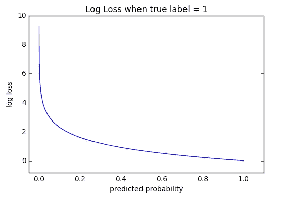
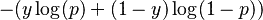
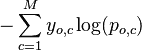
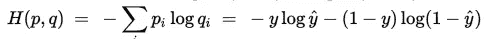

# 深度学习概念—第 2 部分

> 原文：<https://towardsdatascience.com/deep-learning-concepts-part-2-9aed45e5e7ed?source=collection_archive---------4----------------------->

**part 1**:[https://medium . com/forward-data-science/deep-learning-concepts-part-1-ea 0 b 14b 234 c 8](https://medium.com/towards-data-science/deep-learning-concepts-part-1-ea0b14b234c8)

# 损失函数选择:MSE 与交叉熵；

交叉熵是各种模型(如分类、分割、生成模型等)的首选损失函数。这里我们解释行为的差异:

假设您只有三个训练数据项。您的神经网络对输出神经元使用 softmax 激活，因此有三个可以解释为概率的输出值。例如，假设神经网络的计算输出和目标值(也称为期望值)如下:

```
computed       | targets              | correct?
-----------------------------------------------
0.3  0.3  0.4  | 0  0  1 (democrat)   | yes
0.3  0.4  0.3  | 0  1  0 (republican) | yes
0.1  0.2  0.7  | 1  0  0 (other)      | no
```

该神经网络具有 1/3 = 0.33 的分类误差，或者等效地，2/3 = 0.67 的分类精度。请注意，神经网络只是勉强得到前两个正确的训练项目，在第三个训练项目上差得很远。但是现在考虑下面的神经网络:

```
computed       | targets              | correct?
-----------------------------------------------
0.1  0.2  0.7  | 0  0  1 (democrat)   | yes
0.1  0.7  0.2  | 0  1  0 (republican) | yes
0.3  0.4  0.3  | 1  0  0 (other)      | no
```

这个 NN 也有 1/3 = 0.33 的分类误差。但是第二个神经网络比第一个好，因为它固定了前两个训练项目，并且几乎没有错过第三个训练项目。总而言之，分类误差是一种非常粗略的误差度量。

现在考虑交叉熵误差。上述第一个神经网络中第一个训练项目的交叉熵误差为:

```
-( (ln(0.3)*0) + (ln(0.3)*0) + (ln(0.4)*1) ) = -ln(0.4)
```

请注意，在神经网络分类的情况下，计算有点奇怪，因为除了一项之外，所有项都将消失。(关于如何计算交叉熵，网上有几个很好的解释。)因此，第一个神经网络的平均交叉熵误差(ACE)计算如下:

```
-(ln(0.4) + ln(0.4) + ln(0.1)) / 3 = 1.38
```

第二个神经网络的平均交叉熵误差为:

```
-(ln(0.7) + ln(0.7) + ln(0.3)) / 3 = 0.64
```

请注意，第二个高级神经网络的平均交叉熵误差小于第一个神经网络的 ACE 误差。交叉熵中的 ln()函数考虑了预测的接近程度，是一种更细粒度的计算误差的方法。

> 交叉熵误差优于均方误差。简而言之，在反向传播训练期间，您希望根据目标值将输出节点值驱动到 1.0 或 0.0。如果使用 MSE，权重调整因子(渐变)包含(输出)*(1-输出)项。随着计算的输出越来越接近 0.0 或 1.0，(输出)* (1 —输出)的值变得越来越小。例如，如果输出= 0.6，则(输出)* (1 —输出)= 0.24，但如果输出为 0.95，则(输出)* (1 —输出)= 0.0475。随着调整因子变得越来越小，权重的变化也变得越来越小，可以说训练会停止。
> 
> 但是如果你使用交叉熵误差，那么(输出)* (1 —输出)项就消失了(数学很酷)。所以，体重的变化不会越来越小，所以训练不太可能停止。请注意，此参数假设您正在使用 softmax 输出节点激活进行神经网络分类。

# 调试深度学习模型:

查看验证集中每类标签的前几个错误预测(损失最大的预测)总是一个好主意。它通常能让你对你的模型的行为以及你的标签数据有多好或多干净有很好的了解。

# 伪标签:

[http://deep learning . net/WP-content/uploads/2013/03/pseudo _ label _ final . pdf](http://deeplearning.net/wp-content/uploads/2013/03/pseudo_label_final.pdf)

 [## keras 中一个简单的伪标签实现

### (此贴与 fast.ai 第七课 jupyter 笔记本高度相关在此)我目前正在参加…

shaoanlu.wordpress.com](https://shaoanlu.wordpress.com/2017/04/10/a-simple-pseudo-labeling-function-implementation-in-keras/) 

**基本思路:**思路是用标注数据训练一个模型。使用该模型来预测未标记数据的标签，然后包括伪标记数据作为数据的一部分，以在假设伪标签是真实标签的情况下与标记数据一起训练该模型。

**来自上面的博客:**一种有效的伪标记方法是，如 2015 年全国数据科学碗获奖者在这里[提到的](http://benanne.github.io/2015/03/17/plankton.html)，以 67:33 的比例混合原始数据和伪标记数据。fast.ai 的课视频里也提到了这一点。

fast.ai 一课伪标注的另一个实现可以在第七课笔记本[这里](https://github.com/fastai/courses/blob/master/deeplearning1/nbs/lesson7.ipynb)找到。

```
preds = model.predict([conv_test_feat, test_sizes], 
                      batch_size=batch_size*2)
gen = image.ImageDataGenerator()
test_batches = gen.flow(conv_test_feat, preds, batch_size=16)
val_batches = gen.flow(conv_val_feat, val_labels, batch_size=4)
batches = gen.flow(conv_feat, trn_labels, batch_size=44)
mi = MixIterator([batches, test_batches, val_batches)bn_model.fit_generator(mi, mi.N, nb_epoch=8, 
                       validation_data=(conv_val_feat, val_labels))
```

在上面的代码中，fast.ai 课程的讲师杰瑞米·霍华德写了一个[自定义迭代器](https://github.com/fastai/courses/blob/master/deeplearning1/nbs/utils.py#L237)，用于混合训练数据和伪标签数据。

# 原木损失

衡量分类模型的性能，其中预测输入是介于 0 和 1 之间的概率值。机器学习模型的目标是最小化这个值。完美的模型的对数损失为 0。随着预测概率偏离实际标签，测井曲线损失增加。

## 测井损失与准确性

*   **准确性**是预测值等于实际值的预测数。准确性并不总是一个好的指标，因为它具有是或否的性质。
*   **测井损失**根据实际标签的变化程度，考虑您预测的不确定性。这让我们对模型的性能有了更细致的了解。

下图显示了给定真实观测值(isDog = 1)的可能测井损失值的范围。随着预测概率接近 1，测井曲线损失缓慢下降。然而，随着预测概率的降低，测井曲线损失迅速增加。日志丢失惩罚了这两种类型的错误，尤其是那些有把握的和错误的预测！



```
**def** logloss(true_label, predicted, eps=1e-15):
  p = np.clip(predicted, eps, 1 - eps)
  **if** true_label == 1:
    **return** -log(p)
  **else**:
    **return** -log(1 - p)
```

在二进制分类中(M=2)，公式等于:



## 多类分类

在多类分类(M>2)中，我们取观测值中每个类预测的测井损失值的总和。



跨类的所有日志损失值的总和

## 为什么是负号？

Log Loss 使用负 Log 来提供一个简单的比较指标。之所以采取这种方法，是因为数字的正对数< 1 returns negative values, which is confusing to work with when comparing the performance of two models.

## Log Loss vs Cross-Entropy

Log loss and cross-entropy are slightly different depending on the context, but in machine learning when calculating error rates between 0 and 1 they resolve to the same thing. As a demonstration, where p and q are the sets p∈{y, 1−y} and q∈{ŷ, 1−ŷ} we can rewrite cross-entropy as:



*   p = set of true labels
*   q = set of prediction
*   y = true label
*   ŷ = predicted prob

Which is exactly the same as log loss!

# Data leakage:

Here are good blog posts explaining this and apply to general machine learning/data mining:

[https://medium . com/machine-intelligence-report/new-to-machine-learning-avoid-this-three-errors-73258 b 3848 a 4](https://medium.com/machine-intelligence-report/new-to-machine-learning-avoid-these-three-mistakes-73258b3848a4)