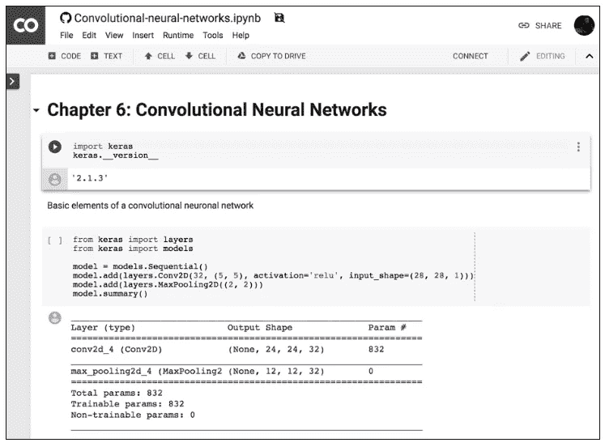
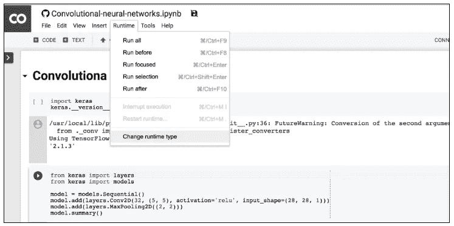
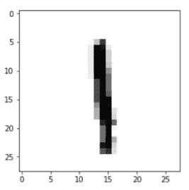
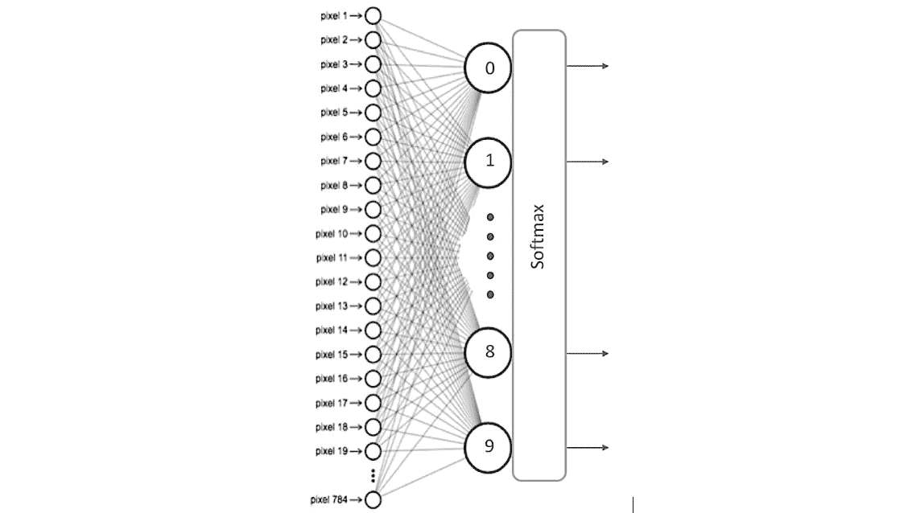
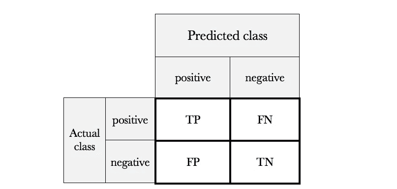
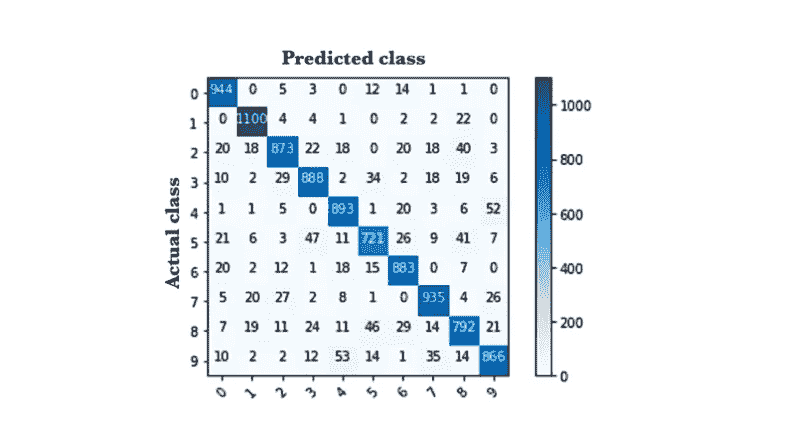
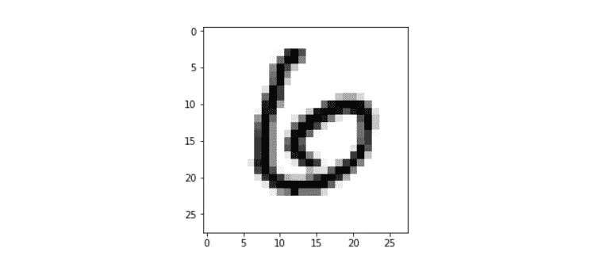

# 初学者的深度学习

> 原文：<https://towardsdatascience.com/deep-learning-for-beginners-practical-guide-with-python-and-keras-d295bfca4487?source=collection_archive---------2----------------------->

## Python 和 Keras 实用指南


这篇文章将展示如何使用 Keras 对数字识别的示例进行编码，以向读者提供使用这个 Python 库进行深度学习的第一次实际接触，该示例在[之前的文章](/basic-concepts-of-neural-networks-1a18a7aa2bd2)(我强烈建议之前阅读它)中给出。

# 环境设置

## 为什么是 Keras？

[Keras](https://keras.io) 是推荐给初学者的库，因为与其他库相比，它的学习曲线非常平滑，目前它是实现神经网络的流行中间件之一。Keras 是一个 Python 库，它以一种简单的方式，使用 TensorFlow、Theano 或 CNTK 等其他库作为后端，提供了广泛的深度学习模型的创建。它由来自谷歌的工程师[弗朗索瓦·乔莱](https://twitter.com/fchollet)开发和维护，他的代码已经在麻省理工学院的许可下发布。还有一点很重要，Keras 作为 API 包含在 [TensorFlow 中。虽然 Keras 目前包含在 Tensorflow 包中，但是也可以作为 Python 库使用。首先，我认为第二个选择是最合适的。](https://www.tensorflow.org/guide/keras)

这篇文章中的代码可以在 GitHub 中以 Jupyter 笔记本的形式获得([https://GitHub . com/JordiTorresBCN/DEEP-LEARNING-practical-introduction-with-Keras](https://github.com/JordiTorresBCN/DEEP-LEARNING-practical-introduction-with-Keras))，尽管如果读者愿意，这可以作为 Python 中的正常程序运行。

## 合作环境

在本帖中，我们将使用 Google *提供的 [*合作实验室*](https://colab.research.google.com) 。*


这是谷歌的一个研究项目，旨在帮助传播机器学习教育和研究。这是一个 Jupyter 笔记本环境，不需要任何配置，完全在云中运行，允许使用 Keras、TensorFlow 和 PyTorch。Colab 区别于其他免费云服务的最重要的特点是；Colab 提供 GPU，完全免费。关于该服务的详细信息可以在[常见问题页面](https://research.google.com/colaboratory/faq.html)上找到。

笔记本存储在 Google Drive 中，可以像使用 Google Docs 一样共享。这个环境是免费使用的，只需要一个谷歌账户。此外，该环境允许免费使用 NVIDIA K80 GPU。

第一次进入时，您会看到如下所示的窗口。在此窗口中，您应该选择 GITHUB 选项卡，并在 URL 字段中填写“JordiTorresBCN”，在存储库字段中填写“JordiTorresBCN/DEEP-LEARNING-practical-introduction-with-Keras”。


要加载笔记本，请单击出现在他们右侧的按钮(在新选项卡中打开笔记本):



默认情况下，Colab 笔记本运行在 CPU 上。你可以切换你的笔记本运行 GPU。为了访问一个 GPU，我们需要选择选项卡 Runtime ，然后选择“Change runtime type ”,如下图所示:



当弹出窗口出现时，选择 GPU。确保“硬件加速器”设置为 GPU(默认为 CPU)。

> 可能会出现一条警告，指出该代码不是由 Google 创建的。我希望您相信我的代码，并运行它！；-)

然后，确保您已连接到运行时(在菜单功能区中“已连接”旁边有一个绿色复选标记):


现在你可以在 Google Colab 中运行 GitHub repo 了。尽情享受吧！

# 输入神经网络的数据

## 用于培训、验证和测试的数据集

在展示前一个例子的 Keras 实现之前，让我们回顾一下我们应该如何分配可用的数据，以便正确地配置和评估模型。

对于机器学习中模型的配置和评估，因此深度学习，可用数据通常分为三组:训练数据、验证数据和测试数据。训练数据是那些用于学习算法的数据，以通过我们已经提到的迭代方法获得模型的参数。

如果模型不完全适应输入数据(例如，如果它出现过度拟合)，在这种情况下，我们将修改某些超参数的值，并在使用训练数据再次训练它之后，我们将使用验证数据再次评估它。我们可以在验证数据的指导下对超参数进行这些调整，直到获得我们认为正确的验证结果。如果我们遵循了这个过程，我们必须意识到，事实上，验证数据已经影响了模型，所以它也符合验证数据。由于这个原因，我们总是保留一组测试数据用于模型的最终评估，这些数据只会在整个过程结束时使用，此时我们认为模型已经过微调，我们将不再修改它的任何超参数。

考虑到这篇文章的介绍性质，我们不会深入到超参数调优的细节，在示例中，我们将忽略验证数据，只使用训练和测试数据。

## Keras 中预加载的数据

在 Keras 中，MNIST 数据集以四个 Numpy 数组的形式预加载，可通过以下代码获得:

```
import kerasfrom keras.datasets import mnist
(x_train, y_train), (x_test, y_test) = mnist.load_data()
```

*x_train* 和 *y_train* 包含训练集，而 *x_test* 和 *y_test* 包含测试数据。图像被编码为 Numpy 数组，它们对应的标签从 0 到 9。按照 post 的策略，逐步引入主题的概念，正如我们已经指出的，我们还不会看到如何分离一部分训练数据来使用它们作为验证数据。我们将只考虑训练和测试数据。

如果我们想检查我们加载了哪些值，我们可以选择 MNIST 集的任何图像，例如图像 8，并使用以下 Python 代码:

```
import matplotlib.pyplot as plt
plt.imshow(x_train[8], cmap=plt.cm.binary)
```

我们得到了下面的图像:



如果我们想看到它对应的标签，我们可以通过:

```
print(y_train[8])1
```

正如我们所看到的，它返回的值为“1 ”,这是意料之中的。

## Keras 中的数据表示

正如我们所见，Keras 使用 Numpy 的多维数组作为基本数据结构，称这种数据结构为张量。简而言之，我们可以说张量有三个主要属性:

*   *轴数* ( *秩*):一个包含单个数的张量将被称为标量(或 0 维张量，或张量 0D)。我们称之为矢量或张量 1D 的一组数字。一组向量将是一个矩阵，或 2D 张量。如果我们把这个矩阵打包成一个新的数组，我们就得到一个 3D 张量，我们可以形象地把它解释为一个数字的立方体。通过将 3D 张力器打包成阵列，我们可以创建 4D 张力器，等等。在 Python Numpy 库中，这被称为*张量的 ndim* 。
*   *形状*:它是一个整数元组，描述张量沿每个轴有多少维。在 Numpy 库中，这个属性被称为*形状*。
*   D *数据类型* : 该属性表示包含张量的数据类型，例如可以是 *uint8* 、 *float32* 、 *float64* 等。在 Numpy 库中，这个属性被称为 *dtype* 。

我建议我们从前面的例子中获得张量 *train_images* 的轴数和维数:

```
print(x_train.ndim)3print(x_train.shape)(60000, 28, 28)
```

如果我们想知道它包含什么类型的数据:

```
print(x_train.dtype)uint8
```

## Keras 中的数据规范化

这些 28×28 像素的 MNIST 图像表示为一个数值数组，其值的范围为 uint8 类型的[0，255]。但是通常将神经网络的输入值调整到一定的范围。在这篇文章的例子中，输入值应该在区间[0，1]内换算成 float32 类型的值。我们可以通过下面几行代码实现这种转换:

```
x_train = x_train.astype(‘float32’)
x_test = x_test.astype(‘float32’)x_train /= 255
x_test /= 255
```

另一方面，为了便于将数据输入到我们的神经网络中(我们将看到在卷积中这是不必要的)，我们必须将张量(图像)从二维(2D)转换为一维(1D)的向量。也就是说，28×28 个数字的矩阵可以由 784 个数字(逐行连接)的向量(数组)表示，这种格式接受密集连接的神经网络作为输入，就像我们将在本文中看到的那样。在 Python 中，将 MNIST 数据集的每幅影像转换为包含 784 个分量的矢量可通过以下方式完成:

```
x_train = x_train.reshape(60000, 784)
x_test = x_test.reshape(10000, 784)
```

在执行这些 Python 指令后，我们可以验证 *x_train.shape* 采用(60000，784)的形式，而 *x_test.shape* 采用(10000，784)的形式，其中第一维索引图像，第二维索引每个图像中的像素(现在像素的亮度是 0 到 1 之间的值):

```
print(x_train.shape)(60000, 784)print(x_test.shape)(10000, 784)
```

除此之外，我们还有每个输入数据的标签(记住，在我们的例子中，它们是 0 到 9 之间的数字，表示哪个数字代表图像，也就是与哪个类相关联)。在这个例子中，正如我们已经提到的，我们将用 10 个位置的向量来表示这个标签，其中对应于表示图像的数字的位置包含 1，向量的剩余位置包含值 0。

在这个例子中，我们将使用所谓的*一键编码*，我们已经提到过，它包括将标签转换成与不同标签的数量一样多的零向量，并在对应于标签值的索引中包含值 1。Keras 提供了许多支持函数，包括*to _ categorial*来精确地执行这种转换，我们可以从 *keras.utils* 导入这些函数:

```
from keras.utils import to_categorical
```

为了查看转换的效果，我们可以看到将*应用到 _ categorial*之前和之后的值:

```
print(y_test[0])7print(y_train[0])5print(y_train.shape)(60000,)print(x_test.shape)(10000, 784)y_train = to_categorical(y_train, num_classes=10)
y_test = to_categorical(y_test, num_classes=10)print(y_test[0])[0\. 0\. 0\. 0\. 0\. 0\. 0\. 1\. 0\. 0.]print(y_train[0])[0\. 0\. 0\. 0\. 0\. 1\. 0\. 0\. 0\. 0.]print(y_train.shape)(60000, 10)print(y_test.shape)(10000, 10)
```

现在，我们已经准备好了用于简单模型示例的数据，我们将在下一节中用 Keras 对其进行编程。

# 喀拉斯的密集连接网络

在本节中，我们将介绍如何在 Keras 中指定我们在前面几节中定义的模型。

## Keras 中的顺序类

Keras 中的主要数据结构是*顺序*类，它允许创建一个基本的神经网络。Keras [还提供了一个 API](https://keras.io/getting-started/functional-api-guide/) ,允许以图形的形式实现更复杂的模型，可以有多个输入、多个输出，以及它们之间的任意连接，但这超出了本文的范围。

Keras 库的 [*序列*类](https://keras.io/models/sequential/)是 Keras 提供的序列神经网络模型的包装器，可以通过以下方式创建:

```
from keras.models import Sequential
model = Sequential()
```

在这种情况下，Keras 中的模型被视为一系列层，每一层都逐渐“提取”输入数据以获得所需的输出。在 Keras 中，我们可以找到所有需要的层类型，通过 *add()* 方法可以很容易地添加到模型中。

## 定义模型

我们识别数字图像的模型在 Keras 中的结构如下:

```
from keras.models import Sequential
from keras.layers.core import Dense, Activationmodel = Sequential()
model.add(Dense(10, activation=’sigmoid’, input_shape=(784,)))
model.add(Dense(10, activation=’softmax’))
```

在这里，神经网络已经被定义为密集连接(或完全连接)的两层序列，意味着每层中的所有神经元都连接到下一层中的所有神经元。视觉上，我们可以用以下方式表示它:



在前面的代码中，我们在第一层的 *input_shape* 参数中明确表达了输入数据是什么样的:一个张量，表明我们有模型的 784 个特征(事实上，被定义的张量是 *(None，784，)*，我们将在前面看到更多)。

Keras 库的一个非常有趣的特点是，它会在第一个张量之后自动推导出层间张量的形状。这意味着程序员只需要为其中的第一个建立这些信息。此外，对于每一层，我们指出它所具有的节点数量以及我们将在其中应用的激活函数(在本例中， *sigmoid* )。

本例中的第二层是由 10 个神经元组成的 *softmax* 层，这意味着它将返回代表 10 个可能数字的 10 个概率值的矩阵(通常，分类网络的输出层将具有与类一样多的神经元，除了在二元分类中，只需要一个神经元)。每个值将是当前数字的图像属于它们中的每一个的概率。

Keras 提供的一个非常有用的检查模型架构的方法是 *summary()* :

```
model.summary()_________________________________________________________________
Layer (type) Output Shape Param #
=================================================================
dense_1 (Dense) (None, 10) 7850
_________________________________________________________________
dense_2 (Dense) (None, 10) 110
=================================================================
Total params: 7,960
Trainable params: 7,960
Non-trainable params: 0
```

稍后，我们将更详细地介绍返回 *summary()* 方法的信息，因为当我们开始构建非常大的网络模型时，神经网络所拥有的参数和数据大小的计算是非常有价值的。对于我们的简单示例，我们看到它指示需要 7960 个参数(列 *Param #* )，这对应于第一层的 7850 个参数和第二层的 110 个参数。

在第一层中，对于每个神经元 *i* (在 0 和 9 之间)，我们需要 784 个参数用于权重 *wij* ，因此需要 10×784 个参数来存储 10 个神经元的权重。此外还有 10 个附加参数，用于 10 个 *bj* 偏置，与它们中的每一个相对应。在第二层中，作为 softmax 函数，需要将所有 10 个神经元与前一层的 10 个神经元连接。因此，需要 10 个 x10 *wi* 参数，另外还需要 10 个 *bj* 偏置，对应于每个节点。

我们可以为 [*密集*层](https://keras.io/layers/core/#dense)指出的参数细节可以在 Keras 手册中找到。在我们的例子中，最相关的出现了。第一个参数表示层中神经元的数量；下面是我们将在其中使用的激活函数。在下一篇文章中(很快:-)，我们将更详细地讨论除了这里介绍的两个激活函数之外的其他可能的激活函数:sigmoid 和 softmax。

权重的初始化也经常被表示为*密集*层的自变量。初始值必须足以使优化问题尽可能快地收敛。各种[初始化选项](https://keras.io/initializers/#usage-of-initializers)也可以在 Keras 手册中找到。

# 在 Keras 中实现神经网络的基本步骤

接下来，我们将简要描述实现一个基本神经网络所必须执行的步骤，在接下来的文章中(很快)，我们将逐步介绍每个步骤的更多细节。

## 学习过程的配置

从*顺序*模型中，我们可以用 *add()* 方法以一种简单的方式定义这些层，正如我们在上一节中提到的。一旦我们定义了我们的模型，我们就可以用 *compile()* 方法配置它的学习过程，用它我们可以通过方法参数指定一些属性。

第一个参数是*损失函数*，我们将使用它来评估训练数据的计算输出和期望输出之间的误差程度。另一方面，我们指定了一个*优化器*，正如我们将看到的，这是我们指定优化算法的方式，允许神经网络根据输入数据和定义的损失函数计算参数的权重。损失函数和优化器的确切目的的更多细节将在下一篇文章(不久)中呈现。

最后，我们必须指出我们将用来监控我们的神经网络的学习过程(和测试)的度量。在第一个例子中，我们将只考虑*准确度*(被正确分类的图像的比例)。例如，在我们的例子中我们可以在 *compile()* 方法中指定以下参数来在我们的计算机上测试它:

```
model.compile(loss=”categorical_crossentropy”,
              optimizer=”sgd”,
              metrics = [‘accuracy’])
```

在这个例子中，我们指定损失函数是*分类 _ 交叉熵*，使用的优化器是*随机梯度下降(sgd)* ，度量是*准确度*，我们将使用它来评估正确猜测的百分比。

## 模特培训

一旦我们的模型被定义，学习方法被配置，它就可以被训练了。为此，我们可以通过调用模型的 *fit()* 方法，将模型训练或“调整”为可用的训练数据:

```
model.fit(x_train, y_train, batch_size=100, epochs=5)
```

在前两个参数中，我们已经以 Numpy 数组的形式指出了用于训练模型的数据。 *batch_size* 参数表示我们将在每次更新模型参数时使用的数据数量，而*时期*则表示我们将在学习过程中使用所有数据的次数。这最后两个论点将会在下一篇文章中详细解释。

这种方法通过我们提到的迭代训练算法找到网络参数的值，我们将在下一篇文章(很快)中更详细地介绍。大致来说，在该算法的每次迭代中，该算法从 *x_train* 中获取训练数据，将它们通过神经网络(带有它们的参数在该时刻的值)，将获得的结果与期望的结果(在 *y_train* 中表示)进行比较，并计算*损失*来指导模型参数的调整过程。 其直观地包括应用上面在 *compile()* 方法中指定的优化器来计算每次迭代中每个模型参数(权重和偏差)的新值，从而减少损失。

正如我们将看到的，这种方法可能需要更长的时间，Keras 允许我们使用*冗长的*参数(默认情况下等于 1)来查看其进度，此外还指示每个*时期*花费的估计时间:

```
Epoch 1/5
60000/60000 [========] — 1s 15us/step — loss: 2.1822 — acc: 0.2916
Epoch 2/5
60000/60000 [========] — 1s 12us/step — loss: 1.9180 — acc: 0.5283
Epoch 3/5
60000/60000 [========] — 1s 13us/step — loss: 1.6978 — acc: 0.5937
Epoch 4/5
60000/60000 [========] — 1s 14us/step — loss: 1.5102 — acc: 0.6537
Epoch 5/5
60000/60000 [========] — 1s 13us/step — loss: 1.3526 — acc: 0.7034
10000/10000 [========] — 0s 22us/step
```

这是一个简单的例子，因此读者在文章结束时已经能够编写他们的第一个神经网络，但是，正如我们将看到的， *fit()* 方法允许更多的参数，这些参数对学习结果有非常重要的影响。此外，这个方法返回一个*历史*对象，我们在这个例子中忽略了它。其 *History.history* 属性是连续*时期*中训练数据和其他度量的*损失*值的记录，以及验证数据的其他度量(如果它们已经被指定的话)。

## 模型评估

此时，神经网络已经训练完毕，现在可以使用 *evaluation()* 方法评估其在新测试数据下的行为。此方法返回两个值:

```
test_loss, test_acc = model.evaluate(x_test, y_test)
```

这些值表明我们的模型在处理从未见过的新数据时表现得如何。当我们执行 *mnist.load_data()* 时，这些数据已经存储在 *x_test* 和 *y_test* 中，并将它们作为参数传递给方法。在本帖的范围内，我们将只关注其中之一，准确性:

```
print(‘Test accuracy:’, test_acc)Test accuracy: 0.9018
```

准确性告诉我们，我们在这篇文章中创建的模型，应用于该模型从未见过的数据，正确分类了 90%。

读者应该注意到，在本例中，为了评估模型，我们只关注其准确性，即模型做出的正确预测与总预测之间的比率，而不管它是什么类别。然而，虽然在这种情况下这就足够了，但有时有必要再深入一点，并考虑模型在其每个类别中做出的正确和不正确预测的类型。

在机器学习中，评估模型的一个非常有用的工具是混淆矩阵，这是一个包含行和列的表格，用于将预测值与实际值进行比较。我们使用这个表来更好地理解模型的行为，当一个类与另一个类混淆时，明确地显示出来是非常有用的。类似于[上一篇文章](/basic-concepts-of-neural-networks-1a18a7aa2bd2)中解释的二元分类器的混淆矩阵具有这样的结构:



真阳性(TP)、真阴性(TN)、假阳性(FP)和假阴性(FN)，是对具有类“1”(“正”)和“0”(“负”)的两类情况的单个预测的四种不同的可能结果。

假阳性是指结果被错误地归类为阳性，而实际上却是阴性。假阴性是指当结果实际上是阳性时却被错误地归类为阴性。真阳性和真阴性显然是正确的分类。

利用这个混淆矩阵，可以通过将对角线的值相加并除以总和来计算精度:

*精度* = (TP + TN) / (TP + FP + FN + TN)

尽管如此，就模型的质量而言，准确性可能是误导性的，因为当对具体模型进行测量时，我们不区分假阳性和假阴性类型的错误，好像两者具有相同的重要性。例如，想象一个预测蘑菇是否有毒的模型。在这种情况下，假阴性(即食用毒蘑菇)的代价可能是巨大的。相反，假阳性的代价非常不同。

出于这个原因，我们有另一个称为*敏感度*(或*回忆*)的指标，它告诉我们该模型如何避免假阴性:

*灵敏度* = TP / (TP + FN)

换句话说，从正面观察(毒蘑菇)的总数中，模型检测到多少。

从混淆矩阵中，可以获得几个指标来关注其他案例，如[此链接](https://en.wikipedia.org/wiki/Confusion_matrix)所示，但更详细地讨论这个主题超出了本文的范围。使用一种度量或另一种度量的便利性将取决于每个特定情况，特别是与模型的每个分类错误相关的“成本”。

但是读者会想知道这个混淆矩阵在我们的分类器中是怎么回事，这里有 10 个类而不是 2 个。在这种情况下，我建议使用 [*Scikit-learn* 包](http://scikit-learn.org/stable/)通过[计算混淆矩阵](http://scikit-learn.org/stable/modules/generated/sklearn.metrics.confusion_matrix.html)来评估模型的质量，如下图所示:



在这种情况下，对角线的元素表示模型预测的标签与标签的实际值相符的点数，而其他值则表示模型分类不正确的情况。因此，对角线的值越高，预测就越好。在本例中，如果读者计算对角线值除以矩阵总值的和，他或她将看到它与 *evaluate()* 方法返回的精度相匹配。

在帖子的 [GitHub 中，读者可以找到](https://github.com/JordiTorresBCN/DEEP-LEARNING-practical-introduction-with-Keras)用来计算这个混淆矩阵的代码。

## 生成预测

最后，读者需要知道我们如何使用上一节中训练的模型进行预测。在我们的例子中，它包括预测哪个数字代表一幅图像。为了做到这一点，Keras 提供了 *predict()* 方法。

为了测试这种方法，我们可以选择任何元素。为了方便起见，让我们从测试数据集 *x_test* 中选取一个。例如，让我们选择这个数据集的元素 11*x _ test*。

在看到预测之前，让我们看看图像，以便能够检查我们自己模型是否做出了正确的预测(在进行之前的整形之前):

```
plt.imshow(x_test[11], cmap=plt.cm.binary)
```



我想读者会同意，在这种情况下，它对应于数字 6。

现在让我们看看模型的 *predict()* 方法，执行下面的代码，正确地预测了我们刚刚估计它应该预测的值。

```
predictions = model.predict(x_test)
```

predict()方法返回一个向量，其中包含对整个数据集元素的预测。通过 Numpy 的 argmax 函数，我们可以知道哪个类给出的归属概率最大，该函数返回包含向量最高值的位置的索引。具体而言，对于项目 11:

```
np.argmax(predictions[11])6
```

我们可以通过打印方法返回的向量来检查它:

```
print(predictions[11])[0.06 0.01 0.17 0.01 0.05 0.04 0.54 0\. 0.11 0.02]
```

我们看到向量中的最高值在位置 6。我们还可以验证预测的结果是一个向量，它的所有分量之和等于 1，正如所预期的那样。为此，我们可以使用:

```
np.sum(predictions[11])1.0
```

到目前为止，读者已经能够在 Keras 中创建他们的第一个模型，该模型在 90%的情况下正确地对 MNIST 数字进行分类。在下一篇文章中(很快)，我们将介绍学习过程是如何工作的，以及我们可以在神经网络中使用的几个超参数来改善这些结果。

在以后的文章中，我们将会看到如何使用卷积神经网络来改进这些分类结果。

[下期贴子见(更新)](/learning-process-of-a-deep-neural-network-5a9768d7a651):

[](/learning-process-of-a-deep-neural-network-5a9768d7a651) [## 深度神经网络的学习过程

### 人工神经网络是如何学习的？[更新版本]

towardsdatascience.com](/learning-process-of-a-deep-neural-network-5a9768d7a651)