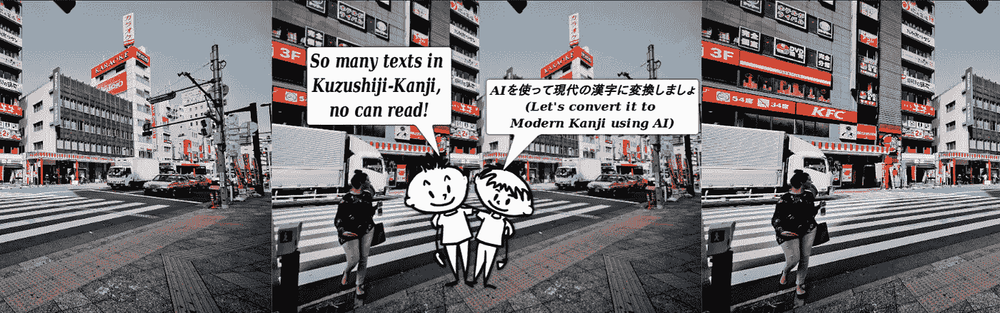
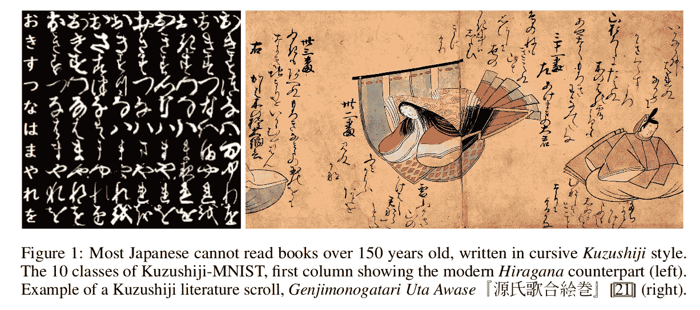
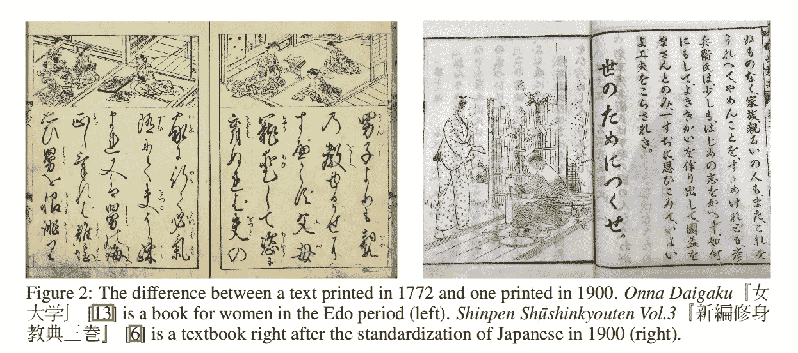
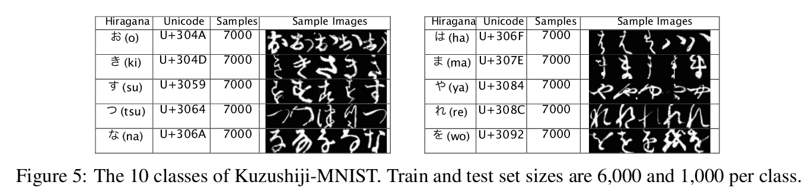
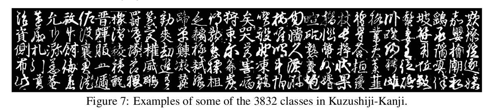
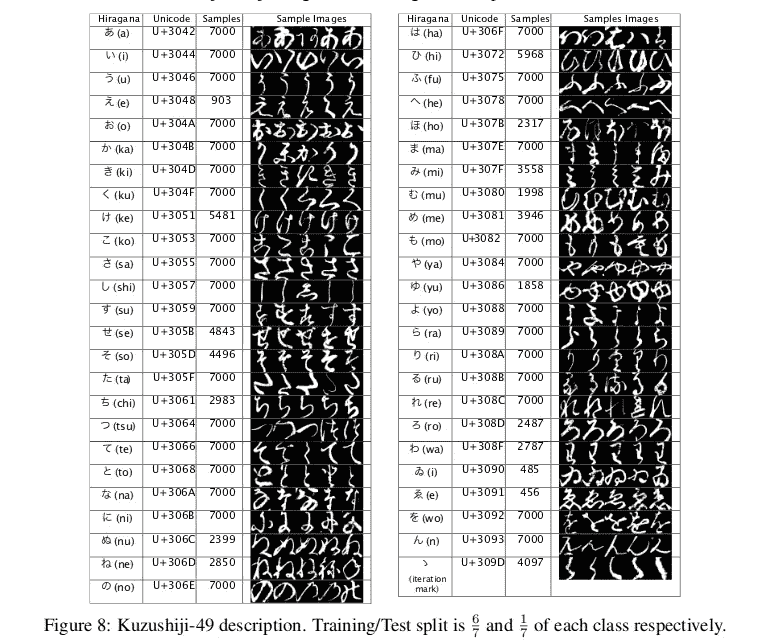
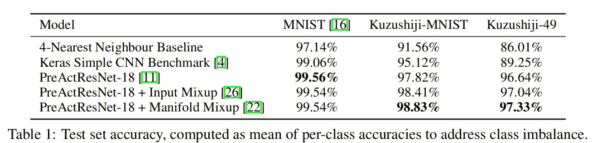
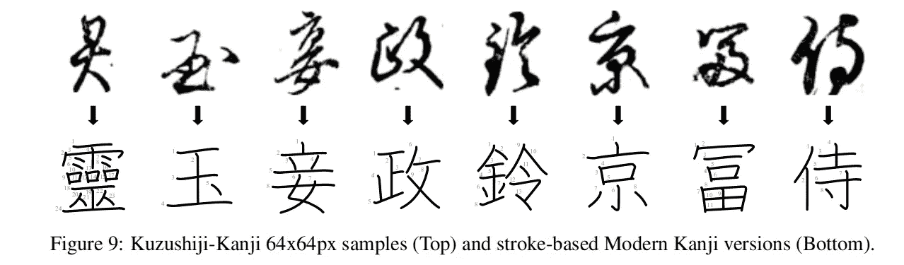
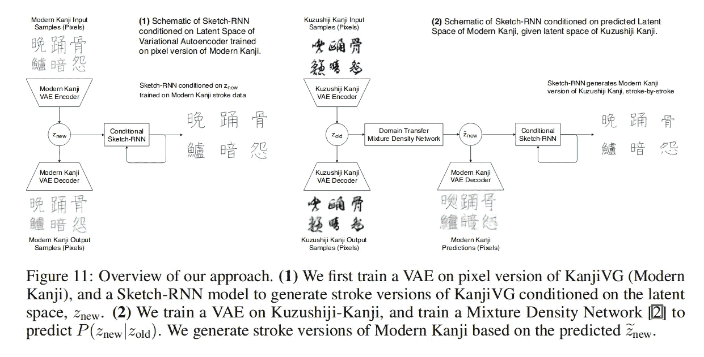
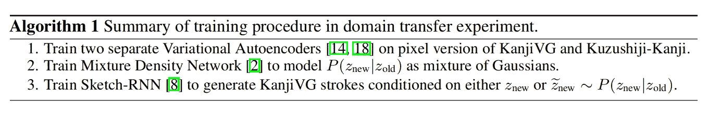

# 日本古典文学的深度学习

> 原文：<https://towardsdatascience.com/deep-learning-for-classical-japanese-literature-48ae04c17dfd?source=collection_archive---------11----------------------->

## 论文摘要

[**Fig 1\. Toons Discussing about converting Kuzushiji-Kanji to Modern Kanji**](https://unsplash.com/photos/cbKnjTX8-fc)

*这是一篇论文的论文摘要:* ***对日本古典文学的深度学习*** *由* [*塔林·克兰瓦特、*](mailto:tarin@nii.ac.jp) *米克尔·波贝尔-伊里扎尔、浅野武·北本、亚历克斯·兰姆、山本和树、大卫·哈。
论文:*

# *概观*

*本文介绍了 3 个新的机器学习基准数据集，即:
-**Kuzushiji-MNIST**-*替代 MNIST 数据集(28x 28)*-
-**Kuzushiji-49**-*一个更大但不平衡的数据集，包含 48 个平假名字符和 1 个平假名迭代标记(28x 28)*-
-**Kuzushiji-Kanji**-(64x64)*

**

***Fig 2\. An example of a Kuzushiji script***

*由于在这个时代日本语言的现代化，Kuzushiji 文字不再在正常的学校课程中教授。尽管日本人已经使用了 1000 多年，但今天大多数日本人都不会读或写 150 多年前写的书！*

**

***Fig 3\. Difference between text printed in 1772 and 1900***

*在国家图书总目录中有超过 170 万册注册图书，超过 300 万册未注册图书和超过 100 万份 1B 历史文献，除了其中一些被数字化外，只有了解《藏书世纪》的人才能阅读这些文献。*

*本文介绍了一个专门为 ML 研究建立的数据集，并向日本文学界介绍了 ML 社区。*

*该论文使用最近的模型发布了 Kuzushiji-MNIST 和 Kuzushiji-日本汉字数据集的基准。库祖什基-MNIST 可用作正常 MNIST 数据集的替代品。*

*本文还将生成模型应用于未知汉字到现代汉字的领域转换任务。*

**

***Fig 4\. Domain Transfer Experiment between Kuzushiji Kanji and Modern Kanji***

# *数据集*

*Kuzushiji 数据集由*NIJL 国立日本文学研究所*创建，由*人文科学开放数据中心(CODH)* 管理。
Kuzushiji 全数据集于 2016 年 11 月发布，现在数据集包含 3999 个字符类型，403242 个字符。*

*本文作者对从 18 世纪印刷的 35 本古典书籍中扫描的字符进行预处理，并将它们分成 3 个数据集:
-**Kuzushiji-MNIST**-*MNIST 数据集(28x 28)*
-**Kuzushiji-49**-*一个更大但不平衡的数据集，包含 48 个平假名字符和 1 个平假名迭代标记(28x 28)*
-**Kuzushiji-Kanji(64x64)***

**

***Fig 5\. 10 Classes of Kuzushiji-MNIST***

*One characteristic of Classical Japanese which is very different from Modern Japanese is *Hentaigana(*変体仮名*).**

> *汉字是一种平假名字符，它有一种以上的书写形式，因为它们来自不同的汉字。*

*因此，Kuzushiji-MNIST 和 Kuzushiji-49 的一个平假名类可能映射了许多字符(如上图所示)。这使得 Kuzushiji 数据集比 MNIST 数据集更具挑战性。*

**

***Fig 6\. Few examples from Kuzushiji-Kanji***

*Kuzushiji-49 和 Kuzushiji-Kanji 中的高类别不平衡是由于真实教科书中的出现频率，并且保持这种方式以表示真实的数据分布。*

*   *Kuzushiji-49 —有 49 个类别，共有 266，407 张图像 *(28x28)**
*   *kuzushiji-Kanji-有 3832 个类，总共有 140，426 个图像，从 1，766 个示例到每个类只有一个示例。 *(64x64)**

*Kuzushiji-MNIST 是平衡的。Kuzushiji-Kanji 是为更多的实验任务而创建的，而不仅仅是分类和识别基准。*

**

***Fig 7\. Kuzushiji-49 Classes***

# *实验*

## *库祖什基-MNIST 和库祖什基-49 的分类基线*

**

***Fig 8\. Classification baselines for Kuzushiji-MNIST and Kuzushiji-49***

## *从日本汉字到现代汉字的域名转移*

*Kuzushiji-Kanji 数据集用于从像素图像到矢量图像的域转移(与以前的此类方法相反，以前的方法侧重于从像素图像到像素图像的域转移)*

*所提出的模型旨在以基于像素和笔画的格式生成给定汉字输入的现代汉字版本。*

**

***Fig 9\. Kuzushiji Kanji to Modern Kanji***

*下图展示了整体方法。*

**

***Fig 10\. Kuzushiji-Kanji to Modern Kanji Approach***

*他们训练两个独立的卷积变分自动编码器，一个在 Kuzushiji-Kanji 数据集上，另一个在 KanjiVG 数据集的像素版本上，渲染为 64x64 像素以保持一致性。VAE 的建筑与*【3】相同。* 并且两个数据集都被压缩到各自的 64 维潜空间中， *z_old* 和 *z_new* 。KL 损失项在低于某个阈值时没有被优化。*

*然后，训练具有 2 个隐藏层的混合密度网络(MDN)来模拟近似为混合高斯分布的密度函数 *P(z_new | z_old)* 。*

*然后，给定从 Kuzushiji-Kanji 编码的潜在向量 z_old，我们可以采样潜在向量 *z_new* 。*

> *该论文称，与端到端地训练单个模型相比，在每个数据集上训练两个独立的 VAE 模型要高效得多，并且取得了更好的结果。*

*在最后一步中，草图-RNN 解码器模型被训练以基于 *z_new* 生成现代汉字。*

**

***Fig 11\. The algorithm for domain transfer from Kuzushiji-Kanji to KanjiVG***

*两个数据集之间有 3600 个重叠字符。
-对于不在重叠空间中的那些，我们从编码在 KanjiVG 数据上的 z_new 调节 sktech-RNN 模型，以同样从 KanjiVG 生成笔画数据[ *参见图 10*
中的(1).-对于存在于重叠数据集中的那些，我们使用从以 z_old 为条件的 MDN 采样的 z_new，以同样从 KanjiVG 生成笔画数据[ *参见图 10* 中的(2)*

> *这有助于 sketch-RNN 微调 VAE 潜在空间的各个方面，当只在像素上训练时，这些方面可能无法很好地捕捉现代汉字的数据分布。*

# *参考*

****【1】****y . le Cun。MNIST 手写数字数据库，1998 年。*[*http://yann.lecun.com/*](http://yann.lecun.com/)*exdb/mnist/*
**c .对于人文学科的开放数据。Kuzushiji 数据集，2016。*[*http://codh.rois.ac.jp/*](http://codh.rois.ac.jp/)*char-shape/*
***【3】****d .哈和 j .施密德胡伯。循环世界模型促进政策演变. arXiv 预印本 arXiv:1809.01999，2018。*[*https://worldmodels.github.io/*](https://worldmodels.github.io/)**

***所以，简而言之，这就是论文的全部内容！* ***如果我发现一些有趣的见解需要补充，会更新这个故事！*** *一定要走纸！***

***感谢阅读！***