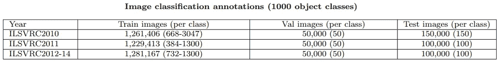
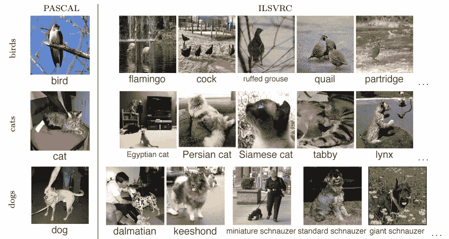
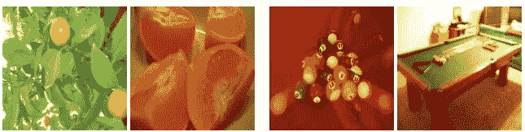
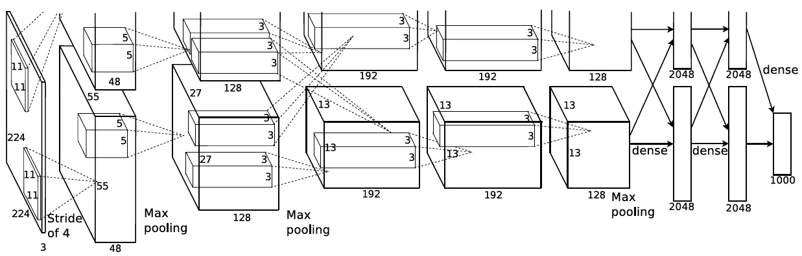
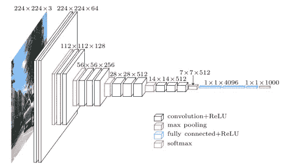
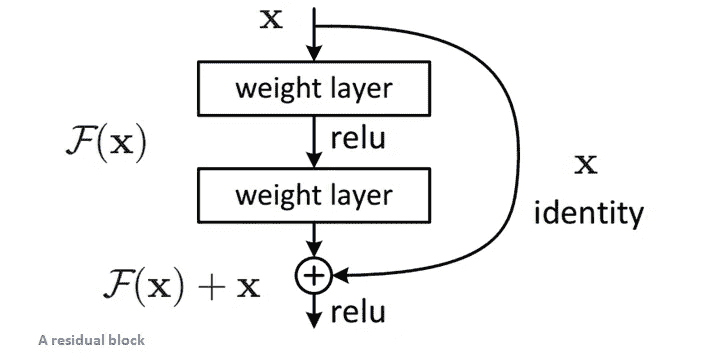
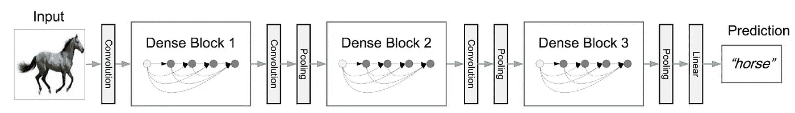
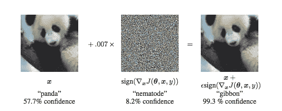

# 图像识别的深度学习:为什么它具有挑战性，我们已经走过的路，以及下一步

> 原文：<https://towardsdatascience.com/deep-learning-for-image-classification-why-its-challenging-where-we-ve-been-and-what-s-next-93b56948fcef?source=collection_archive---------1----------------------->

> 想获得灵感？快来加入我的 [**超级行情快讯**](https://www.superquotes.co/?utm_source=mediumtech&utm_medium=web&utm_campaign=sharing) 。😎

在过去几年里，深度学习绝对**统治了**计算机视觉，在许多任务及其相关竞赛中取得了最高分。这些计算机视觉竞赛中最受欢迎和最知名的是 [ImageNet](https://en.wikipedia.org/wiki/ImageNet) 。ImageNet 竞赛要求研究人员创建一个模型，最准确地对数据集中的给定图像进行分类。

在过去的几年里，深度学习技术使这项比赛取得了快速进展，甚至超过了人类的表现。今天，我们将回顾这一进展，以深入了解这些进步是如何伴随深度学习而来的，我们可以从中学习到什么，以及我们可以从这里走向何方。

# ImageNet 的挑战

那么 ImageNet 挑战赛有什么难的呢？让我们先看一下数据。ImageNet 分类任务的数据是从 Flickr 和其他搜索引擎收集的，由人工标记，每张图像属于 1000 个对象类别中的一个。下表显示了数据集的分布情况。

ImageNet Dataset

到 2012 年，ImageNet 拥有近*130 万*张训练图片。如此大规模的图像分类任务的主要挑战是图像的**多样性**。这里我们可以看几个例子。

看看下面的图片。在左边，我们看到一些来自另一个图像分类挑战的示例图像: **PASCAL** 。在帕斯卡挑战中，只有大约 20，000 幅训练图像和 20 个对象类别。这个挑战有非常通用的类别，如“鸟”、“狗”和“猫”，如下所示。转移到 ImageNet 挑战，这是一个全新的游戏。ImageNet 没有一个包含所有种类狗的名为“dog”的通用类，而是为每种狗都提供了类。事实上，不同于帕斯卡的“狗”类别，ImageNet 有 120 个不同品种的狗的类别！因此，我们用于这项任务的任何模型/算法必须能够处理这些非常**细粒度的**和**特定的** **类**，即使它们看起来非常相似并且难以区分。

用更专业的术语来说，我们希望最大化**类间可变性。**这意味着我们希望两张包含不同种类鸟类的图像在我们的模型中看起来非常不同，因为尽管它们都是鸟类，但在我们的数据集中它们属于不同的类别。看看下面的插图。

Inter-class Variability

ImageNet 的另一个具有挑战性的特性是:同一类****的对象看起来会有很大的不同。让我们看看下面的图片。左边的两个都来自“橘子”班，右边的两个都来自“台球桌”班。然而，每一对图像看起来非常不同！作为人类，我们可以看到一个橙子被切开，而另一个没有；我们还可以看到，台球桌的一张照片被放大了，另一张没有。这叫做**类内变异性**。我们希望**最小化**这种可变性，因为我们希望同一类的两幅图像看起来非常类似于我们的深度学习模型，也就是说，在数量上。****

********

****Intra-class Variability****

****知道了这些图像分类挑战，让我们回顾一下深度学习是如何在这项任务上取得巨大进展的。****

# ****图像分类深度学习的快速进展****

****自 2012 年以来，几乎每年都让我们在为图像分类任务开发深度学习模型方面取得重大突破。由于其大规模和具有挑战性的数据，ImageNet 挑战已成为衡量进展的主要基准。在这里，我们将看看深度学习在这项任务上的进展，以及使这一进展成为可能的一些主要架构。****

## ****开始这一切的人:AlexNet****

********

****AlexNet Architecture****

****早在 2012 年，多伦多大学的一篇论文发表在 NIPS 上，这真是令人震惊。那篇论文是 [ImageNet 用深度卷积网络分类](https://papers.nips.cc/paper/4824-imagenet-classification-with-deep-convolutional-neural-networks.pdf) *。*它在 ImageNet 挑战赛中实现了近 50%的错误率降低，这在当时是前所未有的进步，随后成为该领域最具**影响力的** **论文之一。论文中 AlexNet 的神经网络架构如上所示。******

****本文提出使用深度卷积神经网络(CNN)来完成图像分类的任务。与现在使用的相比，它相对简单。这篇论文的主要贡献是:****

*   ****第一个成功地使用 deep 进行大规模图像分类。这之所以成为可能，是因为来自 ImageNet 的标记为 **的**的**大量** **数据**，以及使用两个 GPU 上的并行计算来训练模型。********
*   他们将 **ReLU** 用于**非** - **线性** **激活** **功能**，发现它们相对于 tanh 功能表现更好，并减少了训练时间。ReLU 非线性现在倾向于成为深度网络的默认激活功能。
*   他们使用**数据** **增强**技术，包括图像平移、水平反射和均值减法。如今，这些技术被广泛用于许多计算机视觉任务。
*   为了解决**超过** - **拟合**训练数据的问题，他们使用了**剔除**层。
*   他们提出的风格是让**连续** **卷积**和**汇集** **层**，然后是**完全** - **连接最后的**层，这仍然是今天许多先进网络的基础。

基本上，AlexNet 设置了标杆，提供了使用 CNN 完成计算机视觉任务的基线和默认技术！

## 让我们更深入:VGGNet

VGGNet Architecture

VGGNet 论文“[用于大规模图像识别的极深度卷积神经网络](https://arxiv.org/pdf/1409.1556.pdf)”于 2014 年问世，进一步扩展了使用具有许多卷积和 ReLUs 的深度网络的思想。论文中 VGGNet 的神经网络架构如上所示。他们的主要想法是，你真的不需要任何花哨的技巧来获得高精度。只要一个有很多 3×3 小卷积和非线性的深度网络就可以了！上图中相同大小的重复块的堆叠是使用 3x3s 堆叠的直接结果！VGGNets 的主要贡献是:

*   仅使用**3x 3 大小的过滤器，而不是 AlextNet 中使用的 11x11。他们表明，两个连续的 3×3 卷积具有等同于单个 5×5 卷积的**接收** **场**或“视野”(即它看到的像素)；同样，三个连续的 3×3 卷积相当于一个 7×7 卷积。这样做的好处是，它模拟了一个更大的滤波器，同时保留了较小滤波器的优点。较小滤波器的第一个好处是减少了参数数量。第二个是能够在每个卷积之间使用 ReLU 函数，这将更多的**非** - **线性**引入网络，这使得**决策** **函数**更具**辨别能力**。**
*   随着每一层的输入体积的空间大小减小(作为汇集层的结果)，体积的深度增加。这背后的想法是，随着空间信息的减少(从通过最大池的向下采样)，它应该被编码为更具**区分度的** **特征**，以用于精确和高区分度的分类。因此，特征图的数量随着深度而增加，以便能够捕捉这些特征用于分类。
*   它引入了一种新的数据扩充方式:标度抖动。
*   用 Caffe 工具箱建立模型。在这一点上，深度学习库变得越来越受欢迎。

## 更深入:GoogLeNet 和 Inception 模块

Inception Module from GoogLeNet

GoogLeNet 架构是第一个真正解决**计算** **资源**以及**多** - **规模** **处理**的问题的，在论文“[用卷积](https://www.cv-foundation.org/openaccess/content_cvpr_2015/papers/Szegedy_Going_Deeper_With_2015_CVPR_paper.pdf)走得更深”。随着我们不断地让我们的分类网络越来越深，我们到达了一个耗尽大量内存的点。此外，过去已经提出了不同的计算滤波器大小:从 1x1 到 11x11 你如何决定哪一个？inception 模块和 GoogLeNet 通过以下贡献解决了所有这些问题:

*   通过在每个 3x3 和 5x5 之前使用 1x1 卷积，初始模块减少了通过每层的**特征** **映射**的数量，从而减少了计算和内存消耗！
*   初始模块有 1x1、3x3 和 5x5 个卷积，都在**并行**中。这背后的想法是让网络通过训练来决定学习和使用什么信息。它还允许**多** - **尺度** **处理**:该模型既可以通过较小的卷积恢复**局部** **特征**，也可以通过较大的卷积恢复**高** **抽象** **特征**。厉害！
*   GoogLeNet 是第一个引入 CNN 层不必总是按顺序堆叠的想法的模型之一。这篇论文的作者表明，你还可以增加网络宽度以获得更好的性能，而不仅仅是深度。

## 使用快捷方式跳过:ResNet

Residual block from ResNet

自从 2015 年首次发表论文“[图像识别的深度剩余学习](https://arxiv.org/pdf/1512.03385.pdf)”以来，ResNets 已经在许多计算机视觉任务的准确性方面取得了重大进步。ResNet 架构是第一个在 ImageNet 上通过人类水平性能的架构，他们对**残差** **学习**的主要贡献通常默认用于当今许多最先进的网络:

*   显示出一个**幼稚的** **层层叠加**让网络变得很深并不总是有帮助，实际上还会让事情变得更糟。
*   为了解决上述问题，他们引入了跳过连接的剩余学习。其思想是通过使用附加的**跳过** **连接作为快捷方式**，深层具有从先前层直接**访问** **到** **特征**。允许功能信息更容易地通过网络传播。这也有助于训练，因为梯度也可以更有效地反向传播。
*   第一个“**超** **深**”网络，通常使用超过 100-200 层。

## 走极端的捷径:DenseNet

DenseNet visualization

随着论文“[密集连接的卷积网络](https://arxiv.org/pdf/1608.06993.pdf)”中 DenseNets 的引入，快捷连接被发挥到了极致。DenseNets 扩展了快捷连接的概念，但具有比 ResNet 更密集的连接:

*   DenseNets 以前馈方式将每一层与每一层连接起来。这允许每个层使用在 **层**之前的**所有** **的所有特征图作为输入，并且它自己的特征图被用作所有后续层的输入。**
*   这是通过**连接**完成的，而不是在 ResNets 中使用的加法，这样原始特征直接通过层。
*   显示出**执行** **比 ResNets**更好。DenseNets 有助于缓解消失梯度问题，加强特征传播，鼓励特征重用，并大大减少参数的数量。

这些是在过去几年中形成图像分类进展的主干的主要体系结构。已经取得了很大的进展，这是令人兴奋的，因为它允许使用这种新技术来解决许多现实世界的问题。只剩下一个问题…..

# 我们将何去何从

正如我们刚刚回顾的，针对图像分类的深度学习研究一直在蓬勃发展！我们已经在改进这项任务的方法上迈出了巨大的步伐，甚至超越了人类水平的表现。深度神经网络现在广泛用于许多企业对图像进行分类，甚至是许多新启动技术的基础。

很高兴看到所有这些进步，但我们必须一直努力改进。深度学习模型在图像分类方面仍然存在许多挑战。如果我们想要前进，这些挑战是必须解决的。在这里，我将回顾其中一些我认为重要的、研究人员正在积极尝试解决的问题:

## 从监督学习到非监督学习

An example of Supervised vs Unsupervised learning

目前，大多数应用于计算机视觉任务的深度学习方法都是由**监督的**。这意味着我们需要大量的**标记的**训练数据。获取这些数据既繁琐又昂贵。想想看:ImageNet 挑战赛有*130 万*个训练样本，而这仅仅是针对 1000 个不同的类别！一个人需要得到所有的数据，浏览每一幅图像，并给它贴上标签；好多**手动**工作！

大多数情况下，当企业想要为自己的特定应用应用图像分类网络时，他们必须使用**迁移学习**来微调预先训练的 ImageNet 网络。为了进行这种微调，他们仍然需要收集大量自己的数据并对其进行标记；**繁琐**和**昂贵**退一步说。

研究人员正在积极努力解决这个问题并取得进展。像**快速**和**有效** **转移** **学习****半** - **监督** **学习**和**一次** - **射击** **学习**这样的事情越来越多。我们可能不会直接跳到无监督学习，但这些方法的研究是朝着正确方向迈出的有力一步

## 抵御我们的敌人

Adversarial images can cause major problems

使用**生成** **对抗** **网络** (GANs)的日益流行，揭示了图像分类的新挑战:**对抗** **图像**。简而言之，敌对图像的类别对人类来说显而易见，但在深层网络中会导致**大量** **故障**。看看上面的图片。仅仅有一点点扭曲(看起来)，一个深层网络的图像分类就从熊猫变成了长臂猿！

对我们人类来说，很明显这个图像仍然是一只熊猫，但出于某种原因，它导致深层网络无法完成任务。这在**真实** - **世界** **应用**中可能是非常危险的:如果你的自动驾驶汽车没有认出一个行人，而是从他们身上碾过去怎么办？部分问题可能源于这样一种想法，即我们并不完全了解我们的网络内部发生了什么。无论如何，研究人员正在积极研究这个具有挑战性的问题。

## **加快进程**

MobileNets benchmarking

深度学习的许多进展都是由硬件的改进推动的，特别是 GPU。GPU 允许高速处理可以并行完成的计算。由于**矩阵**运算**运算**，深度网络需要大量的乘加运算；GPU 擅长执行这些操作。这是一个了不起的进步，但是我们并不是到处都有 GPU！

许多最先进的网络，包括上面讨论过的网络，只能在高端 GPU 上以合理的速度运行。**移动** **设备**是一个巨大的市场，采取措施为该市场服务非常重要。此外，随着网络越来越深，它们往往需要更多的内存，从而限制更多的设备运行网络！

这一领域的研究最近实际上有了很大进展。 [**MobileNets**](https://arxiv.org/pdf/1704.04861.pdf) 是一个体系结构家族，已经流行于直接在移动设备上运行深度网络。他们使用不同风格的卷积来减少内存消耗和推理时间。

# 把一切都包起来

这是一个总结！我们看到了对图像进行分类有多么困难，并回顾了使用深度学习在该领域取得的惊人进展。我们也看到了未来的一些挑战。但是用新的科学和工程来应对这些挑战是技术令人兴奋的地方。

# 喜欢学习？

在[推特](https://twitter.com/GeorgeSeif94)上关注我，我会在那里发布所有最新最棒的人工智能、技术和科学！也在 LinkedIn 上与我联系！