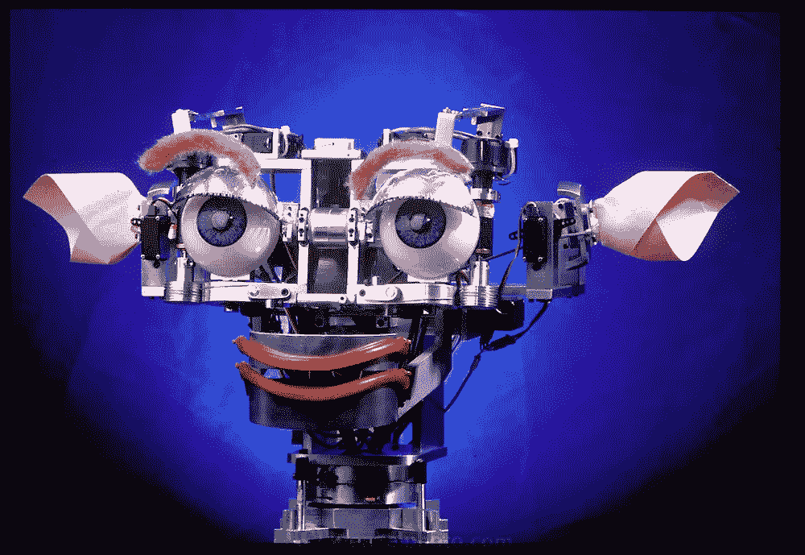
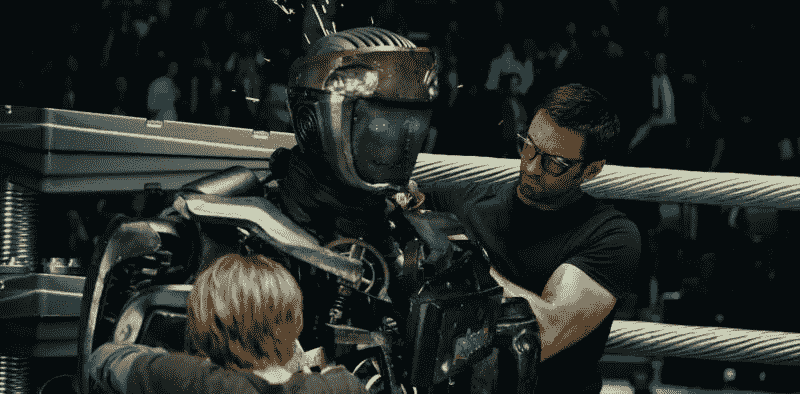

# 机器共情的深度学习:机器人和人类的互动——第一部分

> 原文：<https://towardsdatascience.com/deep-learning-for-machine-empathy-robots-and-humans-interaction-part-i-8142fccd6050?source=collection_archive---------10----------------------->

当我们思考下一次数字革命迫在眉睫的发展时，人类将面临前所未有的自动化浪潮。越来越多的智能和互联设备将与我们共存。这场革命已经在发生，从手机到自动驾驶汽车，甚至我们的冰箱。有一点是肯定的，机器人已经出现了，而且会一直存在下去。

问题不是我们是否同意，而是我们将如何与这些新租户互动。除了传统的设计原则，如实用性和风格，一个新的标准将获得相关性:机器同理心。随着越来越多的公司认识到人机交互(HMI)是安全技术采用的关键，这种趋势将变得更加强烈。

但是，我们能做些什么来改善人机交互呢？我们能至少*软化*我们的共存吗？

融入社会的关键是掌握理解他人感受和想法的能力，并做出相应的反应。直到现在，这种能力只保留给(一些)人类。这种被称为同理心的美德促进了社会化，而人类天生善于交际。

因此，答案可能是让机器有能力理解我们的感受、我们的需求和我们的目标。这样他们就能做出相应的反应，最大限度地提高我们的舒适度。这也包括给他们正确的形式。这种新一代机器人会是类人机器人吗？温和的自动机像无害的 [Roomba](https://www.youtube.com/watch?v=rRsstfoKQeo) ？或者可能是可怕的黑镜的金属头机器人“狗”和他们现实生活中来自波士顿动力[的远亲](https://www.youtube.com/watch?v=wXxrmussq4E)。这是讨论 HMI 时整体的一部分。

许多研究人员已经在这个领域开展工作，特别是麻省理工学院的人形机器人小组。他们开发了社交机器人 Kismet。Kismet 对观众表现出的情绪做出友好的反应，让人们参与自然而富有表现力的面对面互动。初步结果显示，人类与这些机器之间的互动有了很大的改善。

Kismet, MIT’s social robot.

很明显，这一新的自动化浪潮的成功将在很大程度上取决于机器人的同情心和个性。想象一下，一辆汽车检测到你感到悲伤，并自动播放你喜欢的歌曲让你感觉更好，或者一个机器人医疗助理识别你的需求并做出反应，给你最大限度的关注和安慰。通过添加强大的自动语音识别和自然语言处理(由亚马逊 Alexa 和其他公司广泛开发),可能性是无限的。

这样一个系统可以从外部信息源获取信息，并根据经验不断发展。您的设备将不断向您学习。这种*超个性化*将产生一个直接的结果:*独特性。*独特性是*依恋、*的燃料，而依恋在本质上是*人类的。*

Real Steel robot Atom (2011)

在科幻电影《铁钢》(2011)中，拳击手机器人 Atom 在战斗中多次遭受严重损伤。突然，情绪开始出现，作为一个明显的标志，我们不想失去原子；它是独一无二的。我们知道是什么让 Atom 与其他机器人相比如此特别，它表现出感情；很有同情心。

不过不用担心，那时候云存储和电信技术会那么发达，你的机器人失去个性的可能性很小。

尚不清楚这将如何改变科技行业并影响消费者习惯。你会像以前一样频繁地换车吗？您会觉得您的设备*独一无二*吗？你能和它建立联系吗？

现实是，我们仍然没有这些问题的答案。这场革命正在开始，其潜在后果尚未被完全理解。那么这个话题将成为未来几年公开讨论的一部分。

## 深度学习和情感识别

情感识别是拥有真正的“移情”机器之旅的第一步。这种系统已经使用深度学习架构，特别是卷积神经网络(CNN)成功构建。

这一成功背后的秘密是 CNN 能够自动学习识别输入图像的相关低级和高级特征。该网络生成越来越明确的图像表示，学习将低级和高级特征结合起来，最终关心实际内容，而不是单个像素信息。这个最终的表示用于将情绪分类成几个类别，例如，悲伤、快乐、愤怒、恐惧、惊讶和中立。关于这一点的非常详细的解释可以在臭名昭著的论文'[A Neural Algorithm to Transfer Style](https://arxiv.org/pdf/1508.06576.pdf)'中找到。

以下视频是一周沉浸在使用深度卷积神经网络的实时情感识别中的结果。为了测试这个解决方案，我们选择了著名的《悲伤的本·阿弗莱克》采访。初步结果如下所示(更多改进即将推出):

Sad Affleck inteview meets AI

在下一篇文章中，我们将直接讨论基于深度学习的机器人基本(和功能)移情模块的实现。我们将深入研究计算机视觉技术，从经典的快速人脸检测算法到用于情感识别和迁移学习的深度神经网络。

# 问题

我希望你和我一样喜欢这篇文章。我很乐意阅读你对这个话题的看法。不要犹豫留下你的评论，*掌声*也欢迎。请关注我，让您了解本文的下一部分。如果你想了解更多关于 Axionable、项目和职业的信息，请访问我们的[网站](http://www.axionable.com)并在 [Twitter](https://twitter.com/axionabledata) 上关注我们。

**参考书目**

> Breazeal，C. (2000)，“社交机器:人类和机器人之间的表达性社会交换”。麻省理工学院电子工程和计算机科学系博士论文。
> 
> 洛杉矶 Gatys 公司、埃克公司和 m . Beth ge 公司(2015 年)。艺术风格的神经算法。 *CoRR，abs/1508.06576* 。