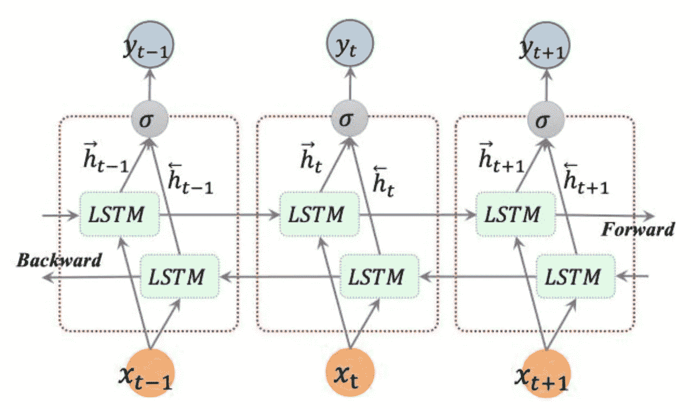
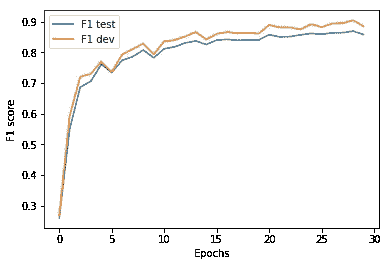

# 命名实体识别的深度学习#2:为 CoNLL 2003 实现最先进的双向 LSTM + CNN 模型

> 原文：<https://towardsdatascience.com/deep-learning-for-named-entity-recognition-2-implementing-the-state-of-the-art-bidirectional-lstm-4603491087f1?source=collection_archive---------6----------------------->

## 基于 Chiu 和 Nichols (2016)，该实现在 2003 年 CoNLL 新闻数据上取得了 90%以上的 F1 分数。

CoNLL 2003 是对 NER 有用的许多公开可用的数据集之一。在这篇文章中，我们将使用 Keras 和 Tensorflow 在 Python 中实现 Chiu 和 Nichols (2016) ( [此处](https://arxiv.org/abs/1511.08308))的当前 SOTA 算法。该实现的核心是双向 LSTM (BLSTM ),同时还使用卷积神经网络(CNN)来识别字符级模式。

假设读者熟悉 CNN(如果不熟悉，请阅读 Denny Britz 的摘要[这里](http://www.wildml.com/2015/11/understanding-convolutional-neural-networks-for-nlp/)，但不太熟悉 BLSTMs，让我们快速描述一下为什么 BLSTMs 特别适合 NER。

# 双向 LSTMs

长短期记忆(LSTM)细胞是递归神经网络(RNNs)的构建模块。虽然前馈神经网络中的普通 LSTM 细胞像人类一样处理文本(从左到右)，但 BLSTMs 也考虑相反的方向。随着输入信息量的增加，这使得模型能够发现更多的模式。换句话说，该模型不仅考虑感兴趣的记号之后的记号序列，还考虑感兴趣的记号之前的*。*

下图更正式地表达了这一观点。请注意， ***x*** 代表输入序列， ***h*** 代表向前或向后运行的输出序列(分别由指向右边或左边的箭头定义)， ***y*** 代表串接的输出序列，其中*∑*串接向前和向后输出元素。

Unfolded BLSTM architecture with 3 consecutive steps. From Cui et al. (2017) ([here](https://arxiv.org/pdf/1801.02143.pdf)).

维基百科的文章([此处](https://en.wikipedia.org/wiki/Bidirectional_recurrent_neural_networks))包含了更多的细节，包括到舒斯特和帕利瓦尔(1997)的原始论文的链接([此处](https://pdfs.semanticscholar.org/4b80/89bc9b49f84de43acc2eb8900035f7d492b2.pdf))。

# Keras 实施

我使用 Keras 和 Tensorflow 后端。这通常是最有效的设置，尤其是在 GPU 上运行时。

 [## MX hofer/命名实体识别双向 TM-CNN-CoNLL

### 命名实体识别双向 TM-CNN-CoNLL - Keras 实现 Chiu 和 Nichols (2016)

github.com](https://github.com/mxhofer/Named-Entity-Recognition-BidirectionalLSTM-CNN-CoNLL) 

以下是主要步骤。

## 嵌入

加载训练、开发和测试数据文件后， *embed* 函数创建单词和字符级嵌入。这意味着单词和字符被映射到神经网络可以处理的实数。更具体地说，标签(例如 B-ORG、I-ORG、B-LOC 等。)、记号大小写(例如，小写、大写或数字记号)和字符使用字典数据结构被映射到实数。此外，所有唯一的单词被映射到手套嵌入向量。

## 模型架构

BLSTM 层构成网络的核心，具有以下三个输入:

1.  字符级模式由卷积神经网络识别
2.  来自手套嵌入的单词级输入
3.  大小写输入(无论单词是小写、大写等。)

下图显示了所有层的模型架构。一个 *softmax* 激活层生成最终输出。

Model architecture, Chiu and Nichols (2016).

## 因素

推荐参数与论文略有不同。这可能是因为我们不知道 Chiu 和 Nichols (2016)在不使用额外的基于规则的方法的情况下会取得什么样的 F1 分数。仅考虑他们的机器学习模型组件，这些参数达到 90%+的 F1 分数:

*   80 个时代
*   0.68 辍学
*   200 个 LSTM 州大小
*   3 卷积宽度
*   那达慕乐观主义者

在您的本地机器上运行代码时，您只需 30 个历元和大约 1 个小时的训练，就可以获得大约 86%的 F1 分数，其中包括上述的下降、LSTM 状态大小、卷积宽度和优化器参数(见下图)。

Learning curve with 30 epochs.

总之，双向 LSTMs 是用于命名实体识别的非常强大和灵活的神经网络类型。提示:尝试在 CoNLL 格式的不同数据上重用模型。表现如何？

我希望这为 CoNLL 2003 数据的当前 SOTA 模型提供了一个有用的概述和实现。让我知道你用不同的参数和其他调整得到的结果！👋