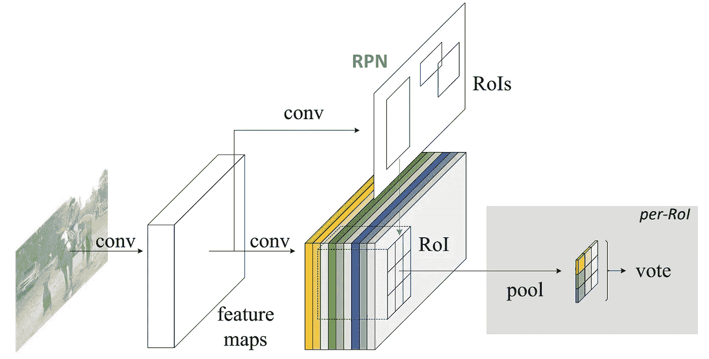
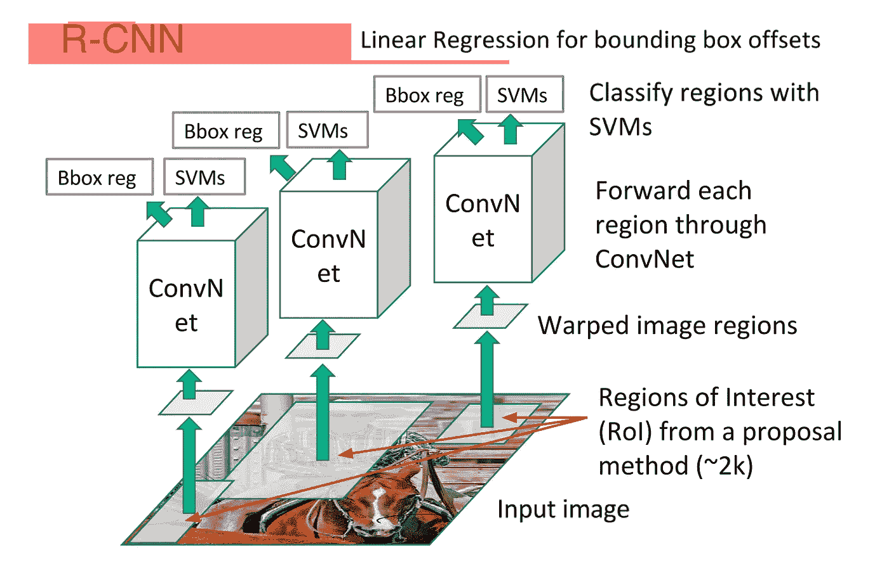
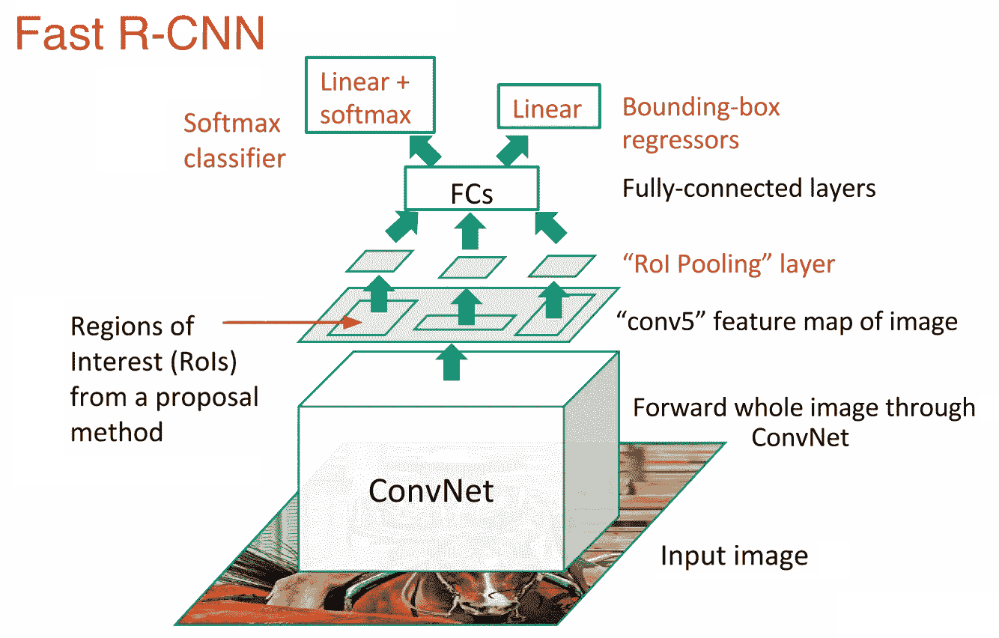
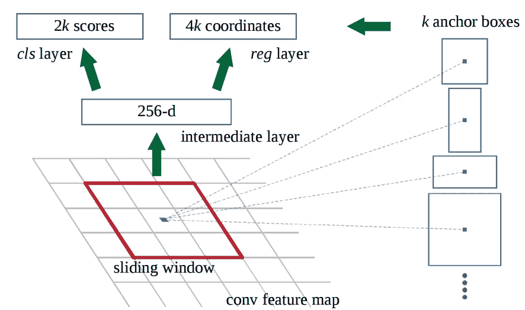
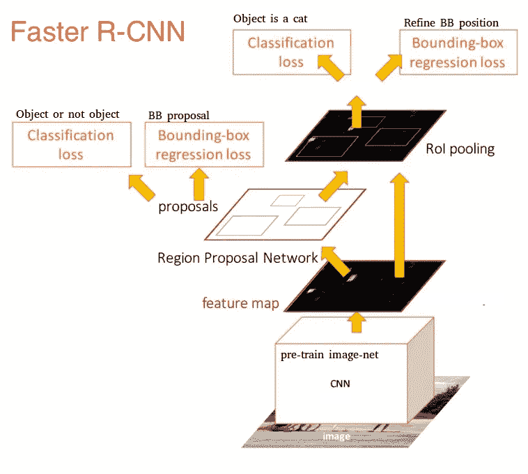
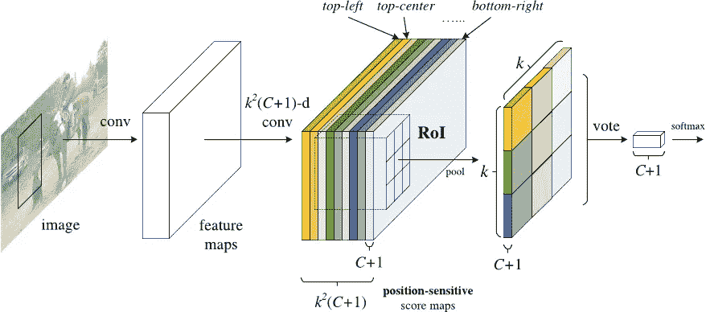
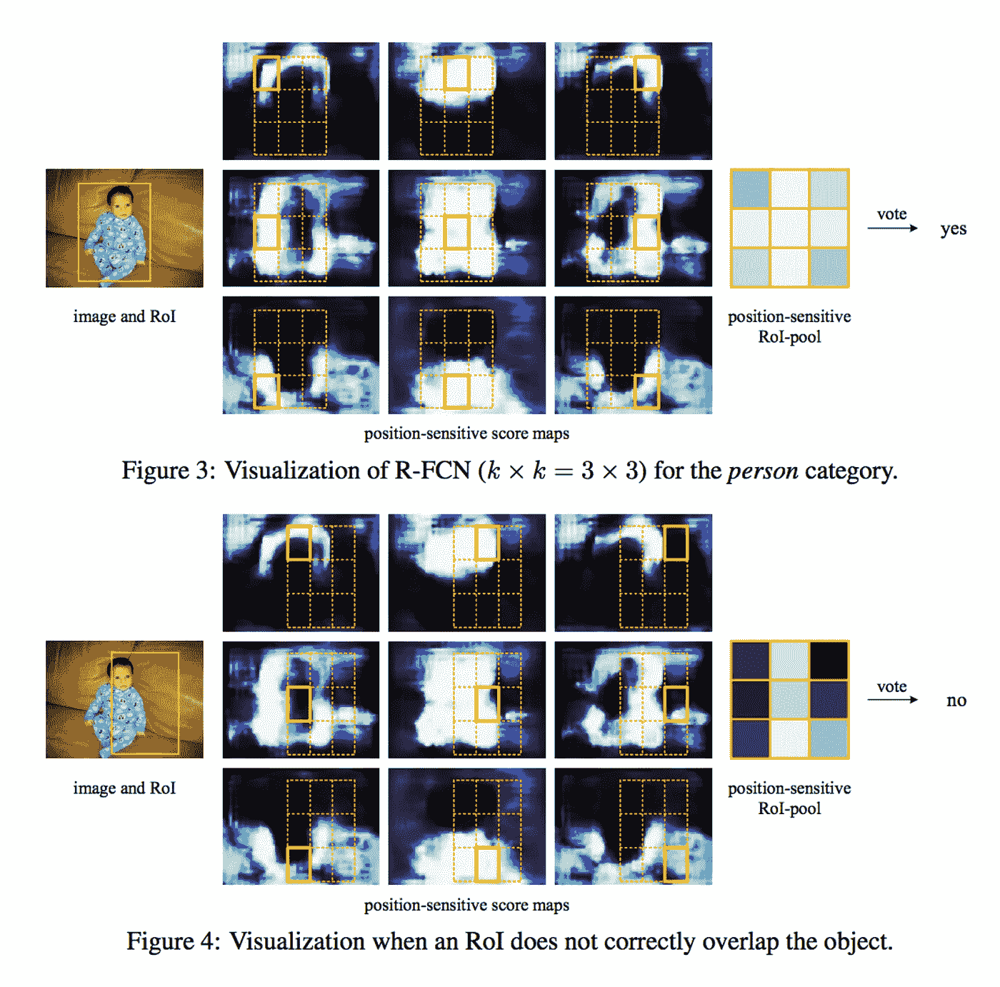
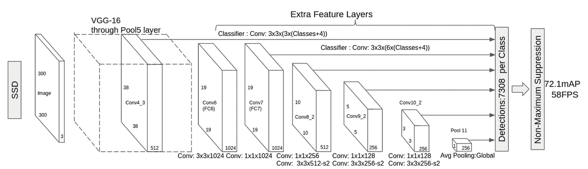
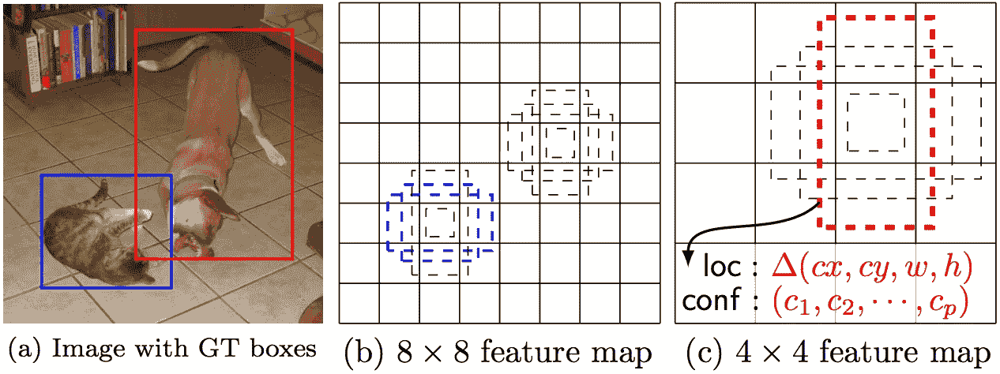

# 用于物体检测的深度学习:综述

> 原文：<https://towardsdatascience.com/deep-learning-for-object-detection-a-comprehensive-review-73930816d8d9?source=collection_archive---------0----------------------->

随着自动驾驶汽车、智能视频监控、面部检测和各种人数统计应用的兴起，对快速准确的物体检测系统的需求不断增加。这些系统不仅包括识别和分类图像中的每个对象，还包括通过在每个对象周围绘制适当的边界框来定位每个对象。这使得物体检测比其传统的计算机视觉前身图像分类困难得多。

然而，幸运的是，目前最成功的对象检测方法是图像分类模型的扩展。几个月前，谷歌为 Tensorflow 发布了一个新的[对象检测 API](https://research.googleblog.com/2017/06/supercharge-your-computer-vision-models.html) 。随着这一版本的发布，为[少数特定型号](https://github.com/tensorflow/models/blob/master/object_detection/g3doc/detection_model_zoo.md)提供了预构建的架构和重量:

*   [带](https://arxiv.org/abs/1512.02325) [MobileNets](http://research.googleblog.com/2017/06/mobilenets-open-source-models-for.html) 的单次多箱探测器 (SSD)
*   带[盗梦空间 V2](https://arxiv.org/abs/1512.00567) 的固态硬盘
*   [基于区域的全卷积网络](https://arxiv.org/abs/1605.06409) (R-FCN)带 [Resnet 101](https://arxiv.org/abs/1512.03385)
*   使用 Resnet 101 实现更快的 RCNN
*   [更快的 RCNN](https://arxiv.org/abs/1506.01497) 与 [Inception Resnet v2](https://arxiv.org/abs/1602.07261)

在我的上一篇博文中，我介绍了上面列出的三种基础网络架构背后的直觉:MobileNets、Inception 和 ResNet。这一次，我想对 Tensorflow 的对象检测模型做同样的事情:更快的 R-CNN、R-FCN 和 SSD。到这篇文章结束时，我们将有望了解深度学习如何应用于对象检测，以及这些对象检测模型如何相互启发和分歧。

# 更快的 R-CNN

更快的 R-CNN 现在是基于深度学习的对象检测的规范模型。它帮助启发了许多后来的检测和分割模型，包括我们今天要研究的另外两个模型。不幸的是，如果不了解它的前身 R-CNN 和 Fast R-CNN，我们就无法真正开始了解更快的 R-CNN，所以让我们快速了解一下它的祖先。

## R-CNN

有线电视新闻网是更快的有线电视新闻网的始祖。换句话说，R-CNN *真的*开球了。

R-CNN，或称 **R** 基于地区的**C**on 可选 **N** eural **N** 网络，由 3 个简单的步骤组成:

1.  使用一种称为选择性搜索的算法扫描输入图像中的可能对象，生成大约 2000 个**区域提议**
2.  在这些区域建议的基础上运行卷积神经网络( **CNN** )
3.  获取每个 **CNN** 的输出，并将其输入 a)SVM 以对区域进行分类，以及 b)线性回归以收紧对象的边界框，如果这样的对象存在的话。

这三个步骤如下图所示:

换句话说，我们首先提出区域，然后提取特征，然后根据特征对这些区域进行分类。本质上，我们已经将目标检测转化为图像分类问题。R-CNN 非常直观，但是非常慢。

## 快速 R-CNN

R-CNN 的直系后裔是 Fast-R-CNN。快速 R-CNN 在许多方面与原来的相似，但通过两个主要增强功能提高了检测速度:

1.  在提出区域之前，对图像**执行特征提取，从而在整个图像上仅运行一个 CNN，而不是 2000 个 CNN 的 2000 多个重叠区域**
2.  用 softmax 图层替换 SVM，从而扩展用于预测的神经网络，而不是创建新模型

新模型看起来像这样:

正如我们从图像中看到的，我们现在基于网络的最后一个特征图而不是原始图像本身来生成区域建议。因此，我们可以为整个图像只训练一个 CNN。

此外，有一个 softmax 图层直接输出分类概率，而不是训练许多不同的 SVM 来对每个对象类进行分类。现在，我们只有一个神经网络来训练，而不是一个神经网络和许多 SVM 氏症。

快速 R-CNN 在速度方面表现得好得多。只剩下一个大瓶颈:生成区域提议的选择性搜索算法。

## 更快的 R-CNN

在这一点上，我们回到了我们最初的目标:更快的 R-CNN。快速 R-CNN 的主要观点是用快速神经网络取代缓慢的选择性搜索算法。具体来说，它介绍了**区域提案网络** (RPN)。

RPN 是这样工作的:

*   在初始 CNN 的最后一层，3×3 的滑动窗口在特征图上移动，并将其映射到更低的维度(例如 256-d)
*   对于每个滑动窗口位置，它基于 *k* 固定比率**锚框**(默认边界框)生成*多个*可能区域
*   每个区域提议包括 a)该区域的“客观性”分数，以及 b)表示该区域的边界框的 4 个坐标

换句话说，我们查看上一个特征地图中的每个位置，并考虑以它为中心的不同盒子:高盒子、宽盒子、大盒子等等。对于这些盒子中的每一个，我们输出我们是否认为它包含一个对象，以及这个盒子的坐标是什么。这是在一个滑动窗口位置的外观:

2 个 *k 个*分数表示每个 *k 个*边界框位于“对象”上的最大软概率请注意，尽管 RPN 输出边界框坐标，但它并不试图对任何潜在的对象进行分类:它唯一的工作仍然是提出对象区域。如果锚定框的“客观性”分数高于某个阈值，则该框的坐标将作为区域建议向前传递。

一旦我们有了地区提案，我们就把它们直接输入到一个快速的 R-CNN 中。我们添加一个池层，一些完全连接的层，最后是一个 softmax 分类层和边界框回归。从某种意义上来说，**快 R-CNN = RPN +快 R-CNN。**

总之，更快的 R-CNN 实现了更好的速度和最先进的准确性。值得注意的是，虽然未来的模型做了很多工作来提高检测速度，但很少有模型能够远远超过更快的 R-CNN。换句话说，更快的 R-CNN 可能不是最简单或最快的对象检测方法，但它仍然是性能最好的方法之一。举个例子，Tensorflow 更快的 R-CNN 和 Inception ResNet 是他们[最慢但最精确的模型](https://github.com/tensorflow/models/blob/master/object_detection/g3doc/detection_model_zoo.md)。

说到底，更快的 R-CNN 可能看起来很复杂，但它的核心设计与最初的 R-CNN 是一样的:**假设对象区域，然后对它们进行分类**。这是现在许多物体检测模型的主要管道，包括我们的下一个。

# R-FCN

还记得 R-CNN 通过在所有区域提案中共享一个 CNN 计算来提高原始的检测速度有多快吗？这种想法也是 R-FCN 背后的动机:*通过最大化共享计算来提高速度。*

R-FCN，或者说基于区域的 RFfully**C**on 可选的 **N** et，在每一个输出上共享 100%的计算。由于是完全卷积的，它在模型设计中遇到了一个独特的问题。

一方面，在对一个物体进行分类时，我们要学习一个模型中的*位置不变性*:不管猫出现在图像的什么地方，我们都要把它归类为猫。另一方面，当执行对象的检测时，我们想要学习*位置方差*:如果猫在左上角，我们想要在左上角画一个方框。因此，如果我们试图在 100%的网络上共享卷积计算，我们如何在位置不变性和位置方差之间折衷？

R-FCN 的解决方案:**位置敏感得分图**。

每个位置敏感得分图代表*一个对象类*的一个相对位置。例如，一个分数图可能会在检测到*猫*的*右上角*时激活。当看到*汽车*左下方的*时，另一个得分图可能会激活。你明白了。本质上，这些分数图是**卷积特征图，已经被训练来识别每个对象的某些部分**。*

现在，R-FCN 的工作方式如下:

1.  对输入图像运行 CNN(在本例中是 ResNet)
2.  添加一个完全卷积层，以生成前述“位置敏感得分图”的**得分库**应该有 k (C+1)个分数图，其中 k 表示划分对象的相对位置的数量(例如，3×3 网格为 3)，C+1 表示类别加上背景的数量。
3.  运行完全卷积区域建议网络(RPN)以生成感兴趣区域(RoI)
4.  对于每个 RoI，将其划分为与分数图相同的 k 个“箱”或子区域
5.  对于每个媒体夹，检查乐谱库以查看该媒体夹是否与某个对象的相应位置相匹配。例如，如果我在“左上角”框上，我将抓取对应于对象“左上角”的得分图，并对 RoI 区域中的这些值进行平均。这一过程对每个班级都重复进行。
6.  一旦 k 个箱中的每一个都具有每个类的“对象匹配”值，则对箱进行平均以获得每个类的单个分数。
7.  在剩余的 C+1 维向量上用 softmax 对 RoI 进行分类

总的来说，R-FCN 看起来像这样，一个 RPN 生成 RoI:

即使有了解释和图像，您可能仍然会对这个模型的工作原理感到有点困惑。老实说，当你能想象它在做什么时，R-FCN 就更容易理解了。这是一个 R-FCN 在实践中检测婴儿的例子:

简单地说，R-FCN 考虑每个区域提议，将其划分为子区域，并在子区域上迭代，询问:“这看起来像婴儿的左上方吗？”，“这看起来像婴儿的顶部中心吗？”“这看起来像婴儿的右上方吗？”等。它对所有可能的类重复这一过程。如果足够多的子区域说“是的，我与婴儿的那部分匹配！”，RoI 在所有类的 softmax 之后被分类为婴儿。

通过这种设置，R-FCN 能够通过建议不同的对象区域来同时解决*位置变化*，并且通过使每个区域建议引用回相同的分数地图库来解决*位置不变性*。这些评分图要学会把一只猫归为一只猫，不管这只猫出现在哪里。最重要的是，它是完全卷积的，这意味着所有的计算在整个网络中共享。

因此，R-FCN 比更快的 R-CNN 快几倍，并达到相当的准确性。

# （同 solid-statedisk）固态（磁）盘

我们最后的型号是 SSD，代表**S**single-**S**hot**D**etector。像 R-FCN 一样，它提供了比更快的 R-CNN 更大的速度增益，但是以一种明显不同的方式。

我们的前两个模型在两个独立的步骤中执行区域提议和区域分类。首先，他们使用区域提议网络来生成感兴趣的区域；接下来，他们使用全连接层或位置敏感卷积层对这些区域进行分类。SSD 在“单次拍摄”中完成这两项工作，在处理图像时同时预测边界框和类。

具体来说，给定一个输入图像和一组基本事实标签，SSD 执行以下操作:

1.  将图像通过一系列卷积层，产生几组不同比例的特征图(例如 10x10、6x6、3x3 等。)
2.  对于这些特征图的每个*中的每个位置，使用 3×3 卷积过滤器来评估一小组默认边界框。这些默认的边界框本质上相当于更快的 R-CNN 的锚框。*
3.  对于每个框，同时预测 a)边界框偏移和 b)类别概率
4.  在训练期间，根据 [IoU](https://en.wikipedia.org/wiki/Jaccard_index) 将地面实况框与这些预测框匹配。最佳预测框将被标记为“正”，以及所有其他具有真值为 0.5 的 IoU 的框。

SSD 听起来很简单，但是培训它有一个独特的挑战。使用前面的两个模型，区域建议网络确保我们试图分类的所有东西都有成为“对象”的最小概率。然而，对于 SSD，我们跳过了过滤步骤。我们从图像的每一个位置*开始分类并绘制边界框，使用*多个不同的形状*，在*几个不同的比例*。结果，我们生成了比其他模型多得多的包围盒，而且几乎所有的包围盒都是反例。*

为了修复这种不平衡，SSD 做了两件事。首先，它使用[非最大抑制](https://docs.microsoft.com/en-us/cognitive-toolkit/Object-Detection-using-Fast-R-CNN#algorithm-details)将高度重叠的框组合成一个框。换句话说，如果四个形状、大小等相似的盒子。包含同一只狗，NMS 会保留最有信心的一只，丢弃其余的。其次，该模型使用了一种叫做[硬负挖掘](https://arxiv.org/pdf/1608.02236.pdf)的技术来平衡训练期间的类。在硬负挖掘中，在每次迭代训练时，仅使用具有最高训练损失(即，假阳性)的负样本的子集。固态硬盘保持 3:1 的正负比例。

它的架构是这样的:

正如我上面提到的，在最后有“额外的特征层”,尺寸缩小。这些不同尺寸的特征地图有助于捕捉不同尺寸的物体。例如，下面是固态硬盘的应用:

在较小的特征地图(例如 4x4)中，每个单元覆盖图像的较大区域，使它们能够检测较大的对象。区域提议和分类是同时执行的:给定 *p* 个对象类别，每个边界框与一个(4+ *p* )维向量相关联，该向量输出 4 个框偏移坐标和 *p* 个类别概率。在最后一步中，再次使用 softmax 对对象进行分类。

最终，SSD 与前两种型号没有太大区别。它简单地跳过了“区域提议”步骤，而是在分类的同时考虑图像的每个位置中的每个单个边界框。因为 SSD 一次搞定一切，所以是三款中[最快的，表现还是相当不俗的。](https://github.com/tensorflow/models/blob/master/object_detection/g3doc/detection_model_zoo.md)

# 结论

更快的 R-CNN、R-FCN 和 SSD 是目前最好和最广泛使用的三种对象检测模型。其他流行的模式往往与这三个相当相似，都依赖于深度 CNN 的(阅读:ResNet，Inception 等。)来完成最初的繁重工作，并在很大程度上遵循相同的提议/分类流程。

此时，将这些模型投入使用只需要了解 Tensorflow 的 API。Tensorflow 有一个使用这些模型的入门教程[在这里](https://github.com/tensorflow/models/blob/master/research/object_detection/object_detection_tutorial.ipynb)。试试吧，祝你黑客生涯愉快！