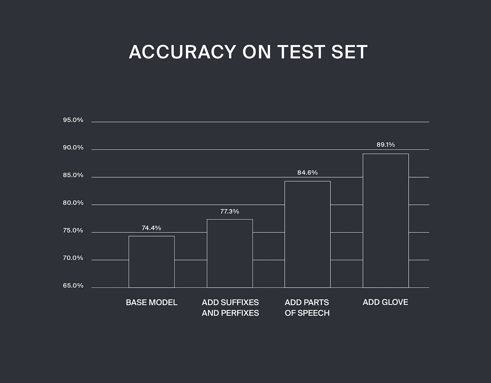
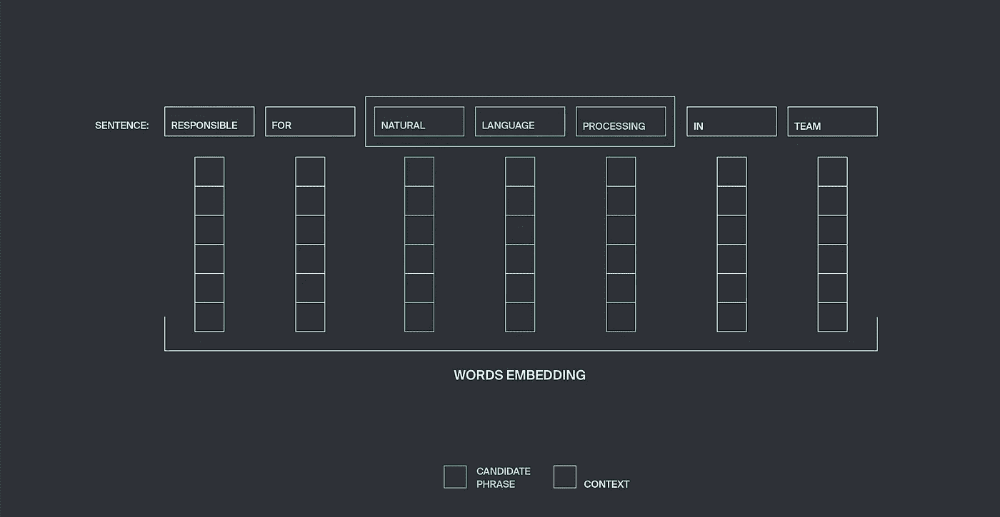
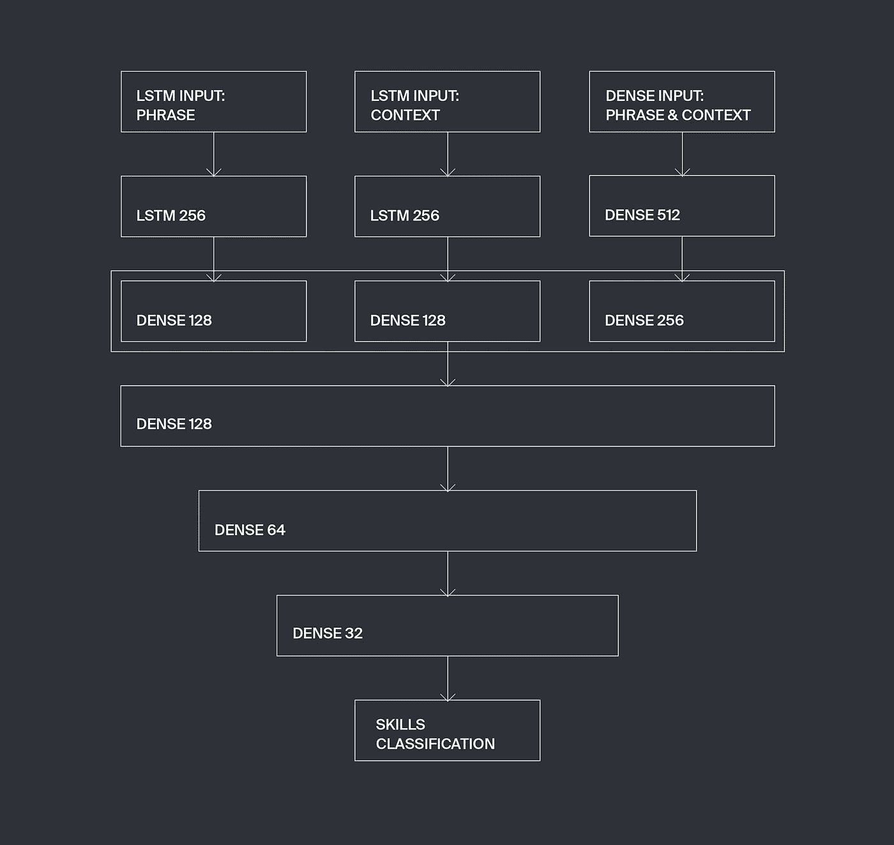

# 用于从非结构化文本中抽取特定信息的深度学习

> 原文：<https://towardsdatascience.com/deep-learning-for-specific-information-extraction-from-unstructured-texts-12c5b9dceada?source=collection_archive---------1----------------------->

这是与我们的 [iki](https://iki.ai/) 项目工作相关的系列技术帖子的第一篇，涵盖了机器学习和深度学习技术用于解决各种自然语言处理和理解问题的一些应用案例。

**在这篇文章中，我们将解决从非结构化文本中提取某些特定信息的问题**。我们需要从用户的简历中提取他们的技能，即使他们是以任意的方式写的，比如“在生产服务器上部署量化交易算法”。

**本帖有一个** [**演示页面**](http://intuition.engineering/skills) ，在你的简历上查看我们模特的表现。

## 语言模型

现代语言模型( [ULMfit](https://arxiv.org/abs/1801.06146) ， [ELMo](https://allennlp.org/elmo) )使用无监督学习技术，例如在大型文本语料库上创建 RNNs 嵌入，以在更具体的监督训练步骤之前获得语言结构的一些原始“知识”。相反，在某些情况下，你需要一个在非常具体的小数据集上训练的模型。这些模型对一般的语言结构几乎一无所知，并且只能处理特殊的文本特征。一个经典的例子是用于电影评论或新闻数据集的幼稚情感分析工具——最简单的工作模型只能在“好”或“坏”形容词同义词和一些强调词存在的情况下运行。在我们的研究中，我们利用了两种方法的优点。

一般来说，当分析某个文本语料库时，我们会查看每个文本的全部词汇。文本矢量化的流行方法，例如 *tfidf、* [*word2vec*](https://www.tensorflow.org/tutorials/word2vec) *或*[*GloVe*](https://nlp.stanford.edu/projects/glove/)*模型使用整个文档的词汇来创建其向量，除了停用词(例如冠词、代词和在这种统计平均过程中带来很少语义意义的其他相当通用的语言元素)。如果有一个更具体的任务，你有一些关于文本语料库的额外信息，你可能会说一些信息比另一些更有价值。例如，要对烹饪食谱语料库进行分析，从文本中提取配料或菜名类别是很重要的。另一个例子是从简历的语料库中提取专业技能。例如，如果我们可以通过将简历与提取的技能向量相关联来对每份简历进行矢量化，这将让我们更成功地进行行业职位聚类。*

*示例:*

****简历:*** *数据科学家，在机器学习、大数据、开发、统计和分析方面有动手能力。我的数据科学家团队实施了 Python 机器学习模型集成、堆叠和特征工程，展示了预测分析的高准确率。使用 Doc2Vec 单词嵌入和神经网络创建了一个推荐系统。**

****提取专业技能:*** *机器学习、大数据、开发、统计、分析、Python 机器学习模型集成、堆栈、特征工程、预测分析、Doc2Vec、单词嵌入、神经网络。**

## *步骤 1:词性标注*

*实体抽取的任务是文本挖掘类问题的一部分——从非结构化的文本中抽取一些结构化的信息。让我们仔细看看建议的实体提取方法。至于主要存在于所谓的名词短语中的技能，我们提取过程的第一步将是由 [NLTK 库](https://www.nltk.org/)内置方法执行的实体识别(从文本中提取信息的检验， [NLTK book，part 7](https://www.nltk.org/book/ch07.html) )。词性标注方法提取名词短语，并建立代表名词短语和句子其他部分之间关系的树。NLTK 库有许多工具可以执行这样的短语分解。*

**

**NLTK book, chapter 7, pic 2.2: An example of a simple regular expression based NP Chunker.**

*我们可以将模型定义为给出句子分解的正则表达式(例如，我们可以将一个短语定义为多个形容词加一个名词),或者我们可以在 NLTK 中带有提取的名词短语示例的标记数量的文本上教授模型。这一步导致接收许多实体，其中一些是目标技能，一些不是——除了技能 CV 可以包含一些其他实体，如地点、人员、对象、组织等等。*

## *步骤 2:用于候选分类的深度学习架构*

*下一步是实体分类。这里的目标很简单——区分技能和“非技能”。用于训练的特征集是根据候选短语的结构和上下文构成的。显然，为了训练一个模型，我们必须创建一个带标签的训练集，我们手动为 1500 个提取的实体做了这件事，这些实体中有技能和“非技能”。*

> *我们从来没有试图让我们的模型适合一些有限的硬编码技能，该模型背后的核心思想是学习英语简历中技能的语义，并使用该模型提取看不见的技能。*

*每个单词的向量由二进制特征组成，如数字或其他特殊字符的出现(技能通常包含数字和符号:C#、Python3)、首字母大写或整个单词大写(SQL)。我们还检查一个单词是否出现在英语词汇和一些主题列表中，如名称、地名等。使用所列特征的最终模型在实体测试集上显示了 74.4%的正确结果。使用另一个二元特征来描述候选中流行的英语前缀和后缀的存在，将模型的性能提高到测试集上 77.3%的正确结果。在模型的特征集中加入编码词性的独热向量后，我们的结果提高到了 84.6%。*

*可靠的语义单词嵌入模型不能在 CV 数据集上训练，它太小并且太窄，为了减轻这个问题，你应该使用在其他一些非常大的数据集上训练的单词嵌入。我们使用 50 维的手套模型向量，在测试集上将我们的模型性能提高到 89.1%的正确结果。**您可以通过上传您简历中的文本，在我们的** [**演示**](https://intuition.engineering/skills) **中玩最终模型。***

**

*流行的词性标注者( [NLTK POS tagger](https://www.nltk.org/book/ch05.html) ， [Stanford POS tagger](https://nlp.stanford.edu/software/tagger.html) )经常在简历的短语标注任务中出错。原因是，为了突出经验并赋予其一定的结构(人们以谓语而不是主语开始句子，有时短语缺少适当的语法结构)，简历文本经常忽略语法，许多单词是特定的术语或名称。我们必须编写自己的 postager 来解决上述问题。*

*分类是用 Keras 神经网络执行的，该网络具有三个输入层，每个输入层被设计成接受特殊类别的数据。第一输入层采用由候选短语的上述特征组成的可变长度向量，该候选短语可以具有任意数量的单词。这个特征向量用 LSTM 层处理。*

**

*第二个可变长度向量带来上下文结构信息。对于给定的窗口大小 n，我们取候选短语右侧的 n 个相邻单词和左侧的 n 个单词，这些单词的矢量表示被连接成可变长度矢量并被传递到 LSTM 层。我们发现最优的 n=3。*

*第三输入层具有固定的长度，并利用关于候选短语及其上下文的一般信息来处理向量——短语及其上下文中的单词向量的坐标最大值和最小值，这些信息以及其他信息表示整个短语中许多二元特征的存在或不存在。*

*我们称这个建筑技能为“拖拉机”,这就是。*

**

*Skills Extractor network architecture*

*它的 Keras 实现如下所示:*

*在学习率降低到 0.0001 的情况下，用 Adam 优化器实现了模型训练的最佳结果。我们选择 binary_crossentropy 作为损失函数，因为该模型被设计成分类成两类。*

*为了方便使用，我们加入拟合方法，利用交叉验证和预测函数进行神经网络的训练和自动停止，形成候选短语特征向量的预测。*

*pad_sequences 函数将特征序列列表转换为一个 2d 数组，其宽度等于列表中最长的序列。这是为了将进入 LSTM 层的可变长度数据转换成模型训练所需的格式。*

*onehot_transformfunction 将目标值 0 和 1 转换为 one-hot 向量[1，0]和[0，1]*

*只要实体及其上下文中的字数是任意的，使用稀疏固定长度向量看起来就不合理。因此，处理任意长度向量的递归神经网络在这里成为一种方便且非常自然的解决方案。我们的测试证明，使用密集层来处理固定长度向量，使用 LSTM 层来处理可变长度向量的架构是最佳的。*

*已经用密集层与 LSTM 层的不同组合测试了几种架构。最终的架构配置(层的大小和数量)显示了交叉验证测试的最佳结果，这对应于训练数据的最佳使用。可以通过增加训练数据集的大小以及适当地缩放层的大小和数量来执行进一步的模型调整，使用相同的数据集进行后期调整会导致模型过度拟合。*

## *结果*

*Examples of extracted skills*

*所有用于模型训练的简历都来自 IT 行业。我们很高兴地看到，我们的模型在属于其他行业(如设计和金融)的简历数据集上也显示出相当合理的性能。显然，处理结构和风格完全不同的 cv 会导致模型性能降低。我们还想提一下，我们对“技能”概念的理解可能与其他人不同。对于我们的模型来说，一个困难的情况是分辨新公司名称中的技能，因为技能通常等同于软件框架，有时你无法分辨这是提到的初创公司名称，还是新的 JS 框架或 Python 库。然而，在大多数情况下，我们的模型可以成为自动 CV 分析的有用工具，并且与一些统计方法一起可以解决任意 CV 语料库上的广泛的数据科学任务。*