# 深度学习框架 Power Scores 2018

> 原文：<https://towardsdatascience.com/deep-learning-framework-power-scores-2018-23607ddf297a?source=collection_archive---------2----------------------->

## 谁在使用、兴趣和受欢迎程度上领先？

深度学习仍然是数据科学中最热门的事情。深度学习框架正在快速变化。就在五年前，除了首席执行官之外，其他领导人都不在。

我想找到哪些框架值得关注的证据，所以我开发了这个权力排名。我使用了 7 个不同类别的 11 个数据源来衡量框架的使用、兴趣和受欢迎程度。然后我对[这个 Kaggle 内核](https://www.kaggle.com/discdiver/deep-learning-framework-power-scores-2018)中的数据进行加权合并。

2018 年 9 月 20 日更新:由于普遍的需求，我扩展了评估的框架，包括 Caffe，Deeplearning4J，Caffe2 和 Chainer。现在所有在 KDNuggets 使用调查中报告使用率超过 1%的深度学习框架都包括在内。

2018 年 9 月 21 日更新:我在几个指标上做了一些方法上的改进。

事不宜迟，下面是深度学习框架的能力得分:

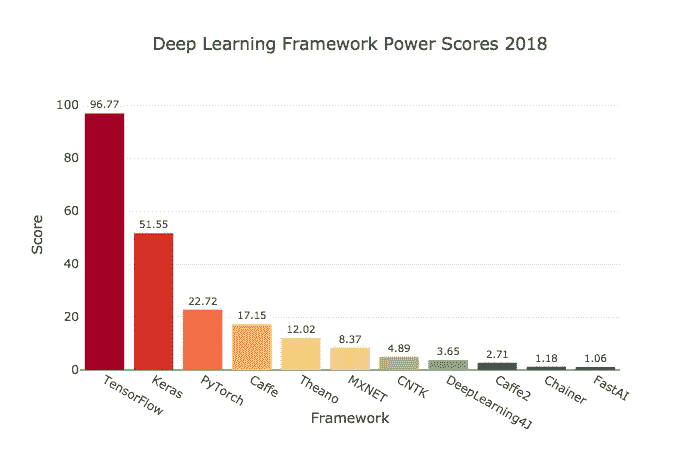

虽然 TensorFlow 是明显的赢家，但也有一些令人惊讶的发现。让我们开始吧！

# 竞争者

所有这些框架都是开源的。除了一个人之外，其他人都可以使用 Python，还有一些[可以使用 R](https://tensorflow.rstudio.com/) 或其他语言。

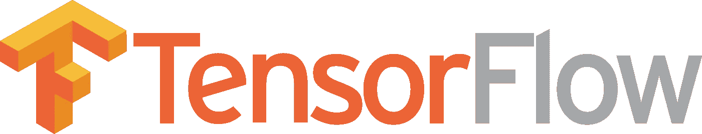

[TensorFlow](https://www.tensorflow.org/) 是无可争议的重量级冠军。它拥有最多的 GitHub 活动，谷歌搜索，中型文章，亚马逊上的书籍和 ArXiv 文章。它还拥有大多数开发人员使用它，并被列在大多数在线职位描述中。TensorFlow 由谷歌提供支持。

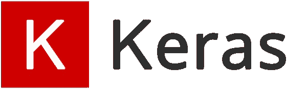

Keras 有一个“为人类设计的 API，而不是为机器设计的”这是几乎所有评估领域中第二受欢迎的框架。 [Keras](https://keras.io) 位于 TensorFlow、Theano 或 CNTK 之上。如果你是深度学习的新手，可以从 Keras 开始。

PyTorch 是第三大流行的整体框架，也是第二大流行的独立框架。它比 TensorFlow 年轻，受欢迎程度增长迅速。它允许 TensorFlow 不允许的定制。它得到了脸书的支持。

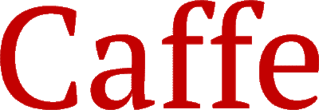

Caffe 是第四大流行的框架。已经有将近五年了。雇主对它的需求相对较大，学术文章中也经常提到，但最近很少报道它的使用。

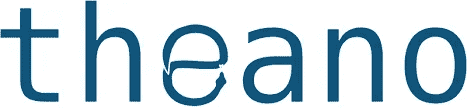

[Theano](http://www.deeplearning.net/software/theano/) 于 2007 年在蒙特利尔大学开发，是最古老的重要 Python 深度学习框架。它已经失去了很多人气，它的领导者[声明](https://en.wikipedia.org/wiki/Theano_(software))主要版本已经不在路线图上了。但是，更新仍在继续。Theano 仍然是得分第五高的框架。

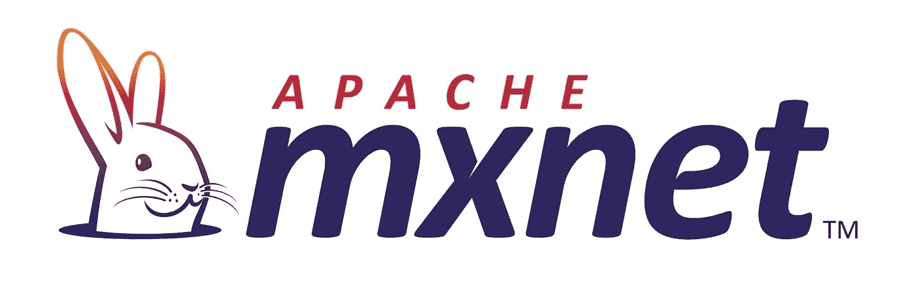

[MXNET](https://mxnet.apache.org/) 由 Apache 孵化，亚马逊使用。它是第六大最受欢迎的深度学习库。

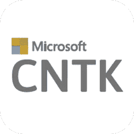

CNTK 是微软的认知工具包。它让我想起了微软的许多其他产品，因为它试图与谷歌和脸书的产品竞争，但并没有赢得广泛的采用。

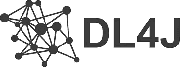

[Deeplearning4J](https://deeplearning4j.org/) ，也叫 DL4J，配合 Java 语言使用。这是 Python 中唯一不可用的半流行框架。但是，您可以将使用 Keras 编写的模型导入 DL4J。这是唯一一个两个不同的搜索词偶尔会有不同结果的框架。我对每个指标都使用了较高的数字。由于该框架得分很低，这并没有造成实质性的差异。

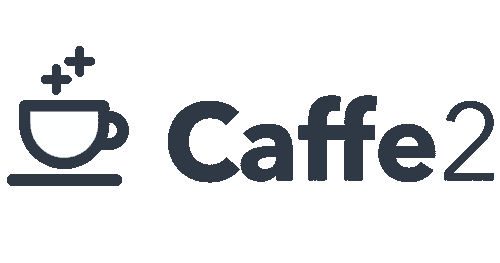

Caffe2 是另一个脸书开源产品。它构建于 Caffe 之上，现在存放在 PyTorch GitHub 库中。因为它不再有自己的存储库，所以我使用了旧存储库中的 GitHub 数据。

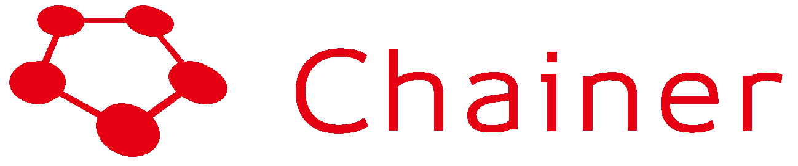

[Chainer](https://chainer.org/) 是由日本公司 Preferred Networks 开发的一个框架。它有一小群追随者。

FastAI 建立在 PyTorch 上。它的 API 受 Keras 的启发，只需要更少的代码就能得到很好的结果。截至 2018 年 9 月中旬，FastAI 处于领先地位。它正在为定于 2018 年 10 月发布的 1.0 版本进行重写。杰瑞米·霍华德，FastAI 背后的力量一直是一个顶级卡格勒和[卡格勒](https://www.kaggle.com/)的总裁。他在这里讨论了为什么 FastAI 从 Keras 转到制作他们自己的框架。

FastAI 还没有被职业需求，也没有被广泛使用。然而，它通过广受欢迎的免费在线课程拥有庞大的用户渠道。它功能强大且易于使用。它的采用可能会显著增加。

# 标准

我选择了以下类别，以提供对深度学习框架的流行度和兴趣的全面看法。

评估类别包括:

*   在线工作列表
*   KDnuggets 使用调查
*   谷歌搜索量
*   中等物品
*   亚马逊图书
*   ArXiv 文章
*   GitHub 活动

搜索于 2018 年 9 月 16 日至 9 月 21 日进行。源数据在[这张谷歌表](https://docs.google.com/spreadsheets/d/1mYfHMZfuXGpZ0ggBVDot3SJMU-VsCsEGceEL8xd1QBo/edit?usp=sharing)中。

我使用了 plotly 数据可视化库和 Python 的 pandas 库来探索流行性。对于交互式 plotly 图表，请参见我的 Kaggle 内核[这里](https://www.kaggle.com/discdiver/deep-learning-framework-power-scores-2018)。

# 在线工作列表

如今的就业市场需要哪些深度学习库？我在 LinkedIn 上搜索了工作列表，事实上，简单雇佣，怪物和天使列表。

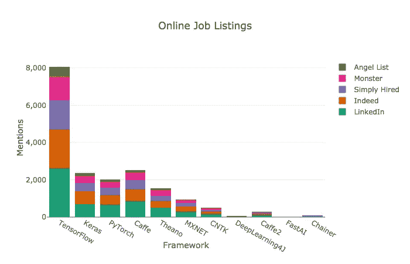

当谈到工作列表中提到的框架时，TensorFlow 显然是赢家。如果你想找一份做深度学习的工作，就去学吧。

我使用术语*机器学习*后跟库名进行搜索。于是用*机器学习 TensorFlow 对 TensorFlow 进行了评测。我测试了几种搜索方法，这一种给出了最相关的结果。*

需要一个额外的关键字来区分框架和不相关的术语，因为 Caffe 可能有多种含义。

# 使用

流行的数据科学网站 KDnuggets 对世界各地的数据科学家进行了调查，询问他们使用的软件。他们问:

> 在过去 12 个月中，您在实际项目中使用了哪些分析、大数据、数据科学、机器学习软件？

以下是这一类别框架的结果。

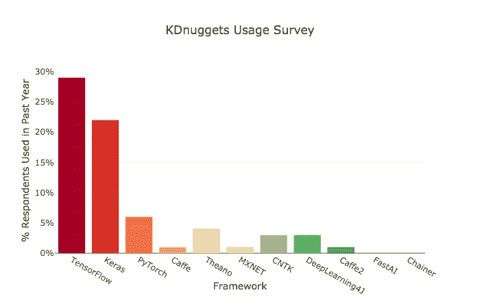

Keras 显示了惊人的使用量——几乎与 TensorFlow 一样多。有趣的是，美国雇主压倒性地寻求张量流技能，而 Keras 至少在国际上几乎同样频繁地被使用。

这一类别是唯一包含国际数据的类别，因为包含其他类别的国际数据会很麻烦。

KDnuggets 报告了几年的数据。虽然我在这次分析中只使用了 2018 年的数据，但我应该注意到，Caffe，Theano，MXNET 和 CNTK 的使用量自 2017 年以来有所下降。

# 谷歌搜索活动

在最大的搜索引擎上进行网络搜索是衡量受欢迎程度的一个很好的标准。我查看了过去一年谷歌趋势的搜索历史。谷歌不提供绝对搜索数字，但提供相对数字。

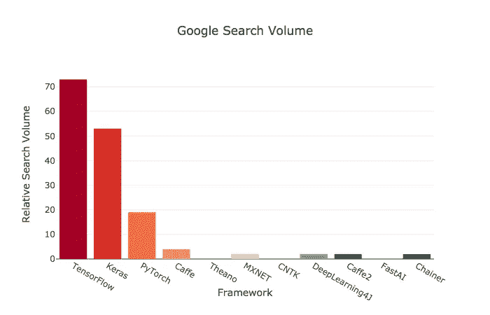

我在 2018 年 9 月 21 日更新了这篇文章，因此这些分数将包括截至 2018 年 9 月 15 日的一周内在*机器学习和人工智能*类别中的全球搜索。感谢 Franç ois Chollet 提出改进这一搜索指标的建议。

Keras 离 TensorFlow 不远。PyTorch 排名第三，其他框架的相对搜索量得分在 4 分或以下。这些分数用于功效分数计算。

让我们简单看看搜索量是如何随着时间的推移而变化的，以提供更多的历史背景。谷歌下面的图表显示了过去两年的搜索量。

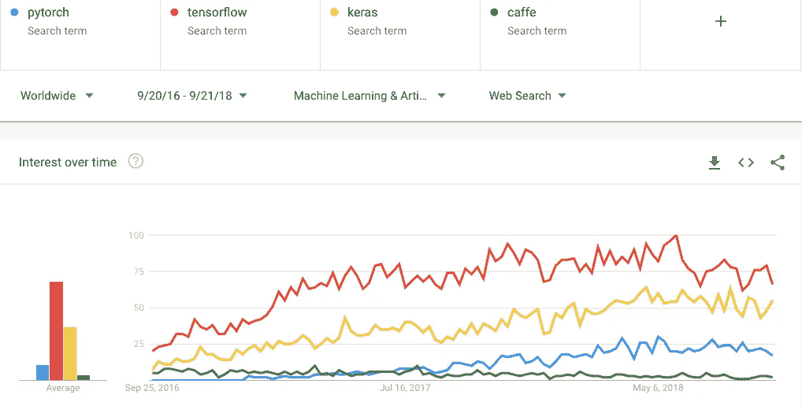

TensorFlow = red, Keras = yellow, PyTorch = blue, Caffe = green

对张量流的搜索在过去的一年里并没有增长，但是 Keras 和 PyTorch 看到了增长。Google Trends 只允许同时比较五个术语，所以其他图书馆是在单独的图表上进行比较的。除了对 TensorFlow 的搜索兴趣很小之外，其他任何库都没有显示任何其他内容。

# 出版物

我在 power score 中包括了几种出版物类型。先看中等文章。

# 中等物品

Medium 是流行数据科学文章和指南的地方。而你现在在这里**——**太棒了！

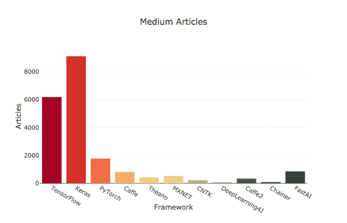

终于有了新的赢家。在媒体文章提及方面，Keras 在 TensorFlow 之前破了带子。FastAI 的表现优于其通常的表现。

我假设这些结果可能已经发生，因为 Keras 和 FastAI 是初学者友好的。他们对新的深度学习从业者有相当多的兴趣，Medium 通常是教程的论坛。

在过去的 12 个月里，我用谷歌网站搜索了 Medium.com，搜索的关键词是框架名和“学习”。这种方法对于防止“咖啡”一词的错误结果是必要的。在几个搜索选项中，它的文章减少幅度最小。

现在让我们看看哪些框架在亚马逊上有关于它们的书籍。

# 亚马逊图书

我在*书籍* - > *计算机&技术*下搜索了 Amazon.com 上的各个深度学习框架。

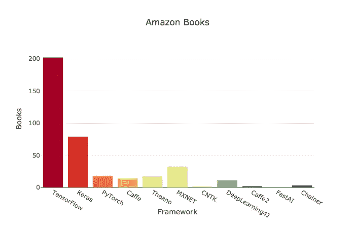

张量流再次获胜。MXNET 的书比预期的多，而 Theano 的书比预期的少。PyTorch 的书相对较少，但这可能是因为这个框架还很年轻。由于出版一本书需要时间，这种方法偏向于老图书馆。

# ArXiv 文章

ArXiv 是大多数学术机器学习文章发表的在线仓库。在过去的 12 个月里，我使用 Google 站点搜索结果在 arXiv 上搜索了每个框架。

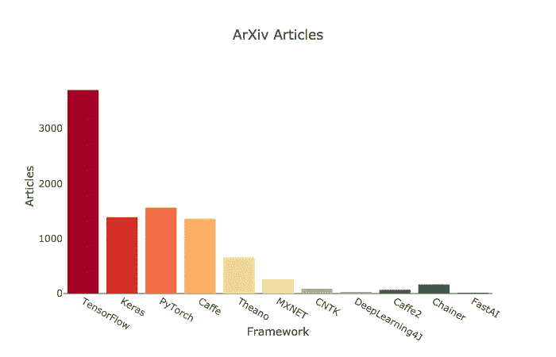

更多相同的学术文章来自 TensorFlow。注意 Keras 在 Medium 和 Amazon 上比在学术文章上更受欢迎。Pytorch 在这一类别中排名第二，显示了它在实现新想法方面的灵活性。Caffe 的表现也相对不错。

# GitHub 活动

GitHub 上的活动是框架受欢迎程度的另一个指标。我在下面的图表中列出了星星、叉子、观察者和贡献者，因为它们分开比组合起来更有意义。

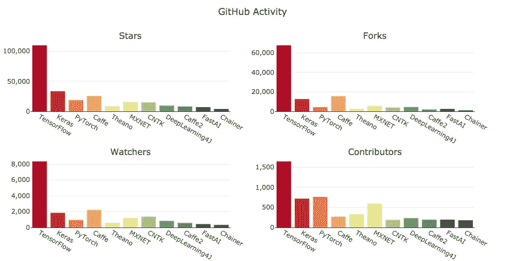

TensorFlow 显然是 GitHub 上最受欢迎的框架，拥有大量的用户。考虑到 FastAI 还不到一岁，它已经有了相当多的追随者。有趣的是，所有框架的贡献者级别都比其他三个指标更接近。

收集和分析数据后，是时候将其整合到一个指标中了。

# 动力评分程序

以下是我如何创建能力分数的:

1.  在 0 和 1 之间缩放所有特征。
2.  聚合的工作搜索列表和 GitHub 活动子类别。
3.  根据下面的权重对类别进行加权。

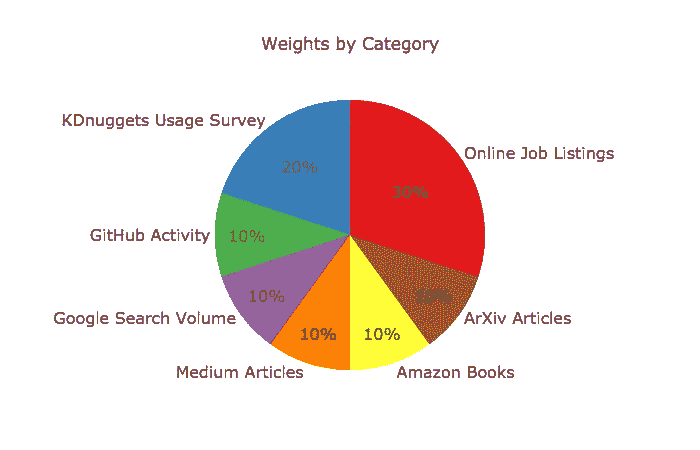

如上图所示，在线工作列表和 KDnuggets 使用情况调查占总得分的一半，而网络搜索、出版物和 GitHub 关注占另一半。这种划分似乎是各种类别之间最恰当的平衡。

4.可理解性的加权分数乘以 100。

5.将每个框架的类别得分相加，得到一个单项得分。

数据如下:

这是加权和汇总子类别后的分数。

这张漂亮的图表再次显示了最终的能力得分。

100 分是可能的最高分，表示每个类别的第一名。TensorFlow 几乎获得了 100 分，这并不奇怪，因为它在每个类别中都名列前茅。Keras 显然是第二名。

要互动地玩图表或分叉 Jupyter 笔记本，请前往[这个 Kaggle 内核](https://www.kaggle.com/discdiver/deep-learning-framework-power-scores-2018)。

# 将来的

目前，TensorFlow 稳稳占据榜首。在短期内，它似乎有可能继续占据主导地位。然而，鉴于深度学习世界的发展速度，这种情况可能会改变。

时间会证明 PyTorch 是否超过 TensorFlow，因为 React 超过 Angular。这些框架可能是类似的。PyTorch 和 React 都是脸书支持的灵活框架，通常被认为比谷歌支持的竞争对手更容易使用。

FastAI 会在课程之外获得用户吗？它有大量的学生，是一个比 Keras 更容易上手的 API。

你认为未来会怎样？

2019 年 4 月 1 日更新:未来在这里！至少有一部分。😄我用这篇文章发表后的六个月的增长分数评估了领先的框架。点击此处查看新文章:

 [## 哪个深度学习框架发展最快？

### TensorFlow 与 PyTorch

towardsdatascience.com](/which-deep-learning-framework-is-growing-fastest-3f77f14aa318) 

# 给学习者的建议

如果你正在考虑学习这些框架中的一个，并且拥有 Python、numpy、pandas、sklearn 和 matplotlib 技能，我建议你从 Keras 开始。它拥有庞大的用户群，雇主对它有需求，在媒体上有很多文章，并且有一个易于使用的 API。

如果你已经知道了 Keras **，**，决定下一个要学习的框架可能会很棘手。我建议你选 TensorFlow 或者 PyTorch，好好学学，这样就能做出很棒的深度学习模型。

如果你想掌握什么是需求，TensorFlow 显然是学习的框架。但是 PyTorch 的易用性和灵活性使其受到研究人员的欢迎。下面是 Quora 对这两个框架的讨论。

一旦你掌握了这些框架，我建议你继续关注 FastAI。如果你想学习基础和高级深度学习技能，请查看其免费在线课程。FastAI 1.0 承诺让你轻松实现最新的深度学习策略，快速迭代。

无论你选择哪种框架，我希望你现在对哪种深度学习框架需求最大、使用最多、写得最多有了更好的了解。

# 如果你觉得这很有趣或有帮助，请通过分享和鼓掌来帮助其他人找到它。

# 快乐深度学习！