# 深度学习 II L9:生成模型

> 原文：<https://towardsdatascience.com/deep-learning-ii-l9-generative-models-dcd599ad6e0b?source=collection_archive---------4----------------------->

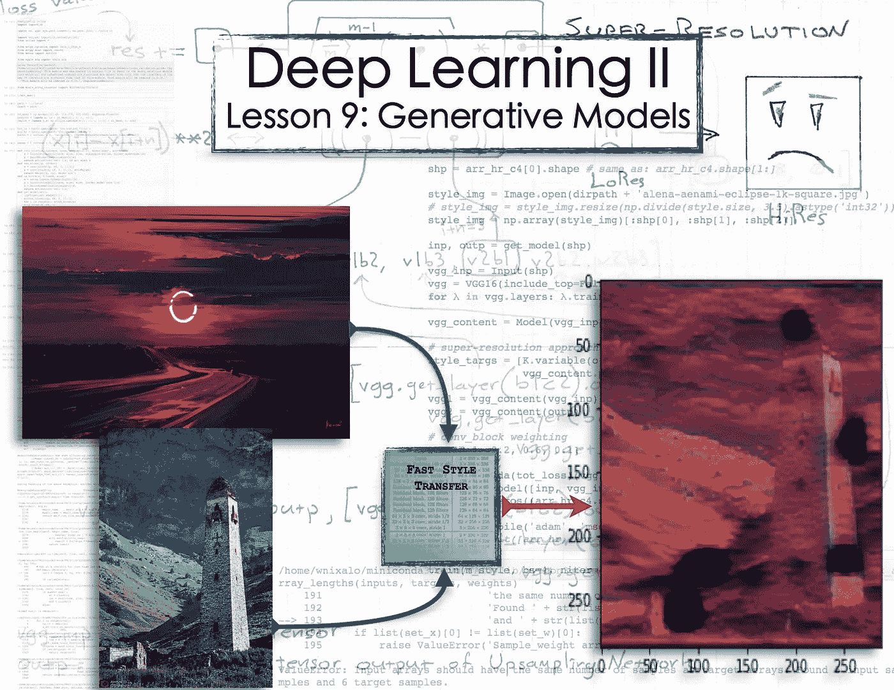

[fast.ai](http://www.fast.ai/) 的深度学习课程中的[第九课](http://course.fast.ai/lessons/lesson9.html)继续从制作艺术的角度深入到生成对抗网络(GANs)中。这主要涉及(截至编写时)课程库中的[神经风格](https://github.com/fastai/courses/blob/master/deeplearning2/neural-style.ipynb)和[神经-sr](https://github.com/fastai/courses/blob/master/deeplearning2/neural-sr.ipynb) Jupyter 笔记本。*注*:这篇帖子比较长。从简单开始，不断深入。

在[第 8 课](http://course.fast.ai/lessons/lesson8.html)中，我们学习了获取一幅图像，将它放入由风格损失和内容损失组成的损失函数中，输出损失和梯度，并使用这些梯度来更新图像并在下一次迭代中减少损失——冲洗并重复。像这样:

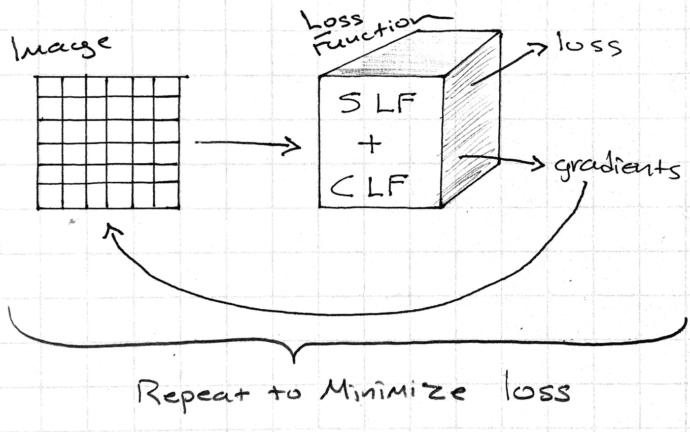

copyright: my notebook …

根据杰瑞米·霍华德在讲座中的说法，这是对许多不同的风格和图像进行风格转换的最好方法，比如在 web 应用程序中。然而，如果你想应用一个单一的风格到任何图像:这是我们可以改变事情做得更好的地方。原因是你不需要做上面的优化循环来产生一些东西。相反，你可以只训练 CNN 来学习如何以特定的风格输出图像(并且通过 CNN 向前传递是非常快的——权衡是 CNN 被训练成特定的风格)。

这一次我们开始像以前一样将多个图像输入到同一个损失函数中(样式+内容)。在这个例子中，对于风格损失，我们使用梵高的虹膜，对于内容损失，我们使用当前输入到函数中的图像。这里最大的不同是，我们将在输入图像和损失函数之间放置一个 CNN。CNN 将学习输出一个图像，这样当它进入损失函数时，它将输出一个小的损失值。在英语中，这意味着 CNN 已经学会制作内容与原始输入图像相似、风格与所选风格相似的图像。

这里有一些注释。有了 CNN，你可以选择任何你喜欢的损失函数(你的里程可能会有所不同)。[深度学习 I](http://course.fast.ai/) & [II](http://course.fast.ai/part2.html) 到目前为止已经使用了相当简单的，比如 [MSE](https://en.wikipedia.org/wiki/Mean_squared_error#Loss_function) 和[交叉熵](http://neuralnetworksanddeeplearning.com/chap3.html#the_cross-entropy_cost_function)。不过，这里我们将使用样式+内容损失，就像上面的第一个例子一样。*注意*:因为样式+内容损失函数是由神经网络生成的:它是可微的；并且可以优化任何可微的损失函数。

现在，如果我们采用相对于 CNN 权重的输出梯度，我们可以使用它们来更新这些权重，这样 CNN 就可以更好地将图像转变为与风格相匹配的图像。

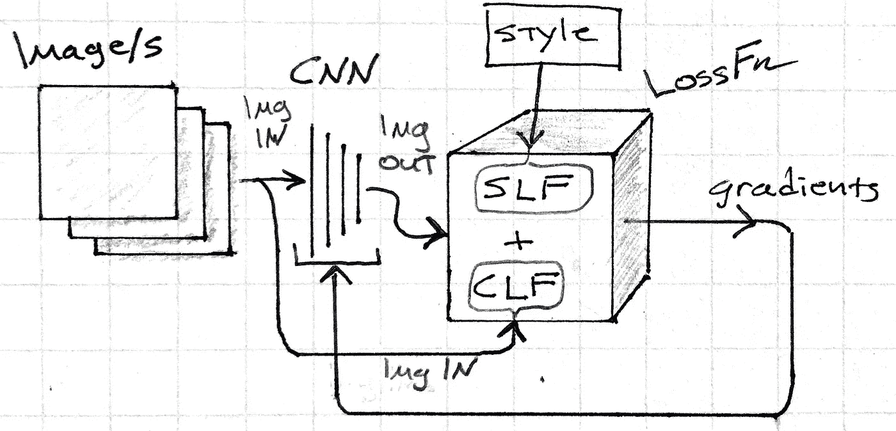

something like this

这一点的强大之处在于，没有优化步骤来减缓推理——或者模型的“预测”操作。通过 CNN 的单次向前传递几乎是瞬时的。

你还能做更多。

the future is here. ENHANCE.

事实证明，深度学习神经网络可以用来放大图像和推断细节。

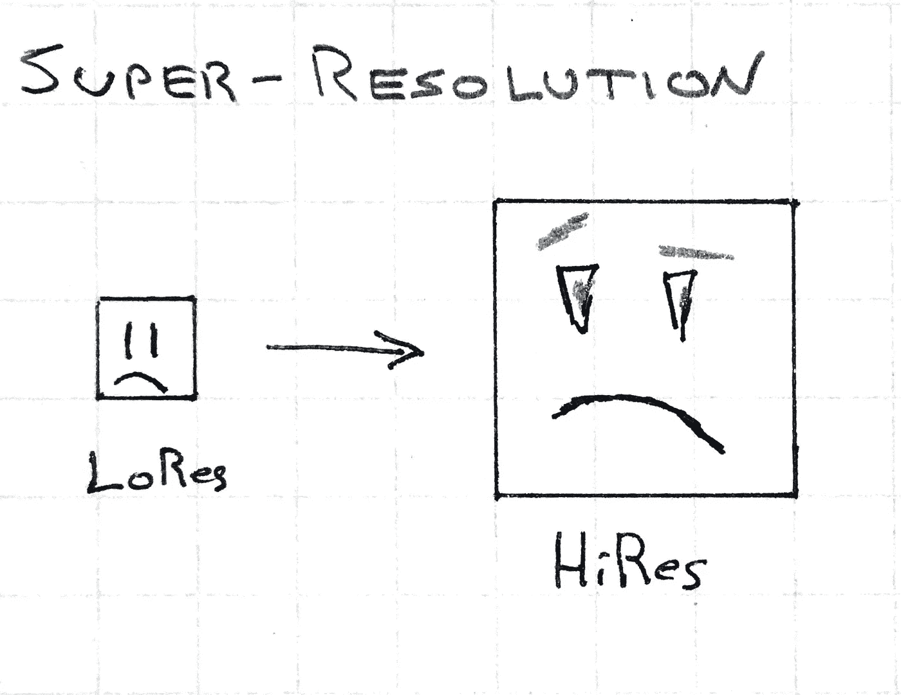

we have the technology

我们从在传说和雇佣图像之间放一个 CNN 开始。CNN 将 LoRes 图像作为输入，并将其输出发送到仅计算内容损失的损失函数中。内容损失是通过将其从 CNN 的输入与从 HiRes 图像的激活进行比较来计算的。换句话说，损失函数是检查 CNN 是否从原始知识中创建了一个更大的图像，该图像与雇佣图像具有相同的激活。

这场讨论引发了我在课堂上听到的最好的问题之一:

> 我们能不能在任何两个事物之间放一个 CNN，它就能知道它们之间的关系？

[杰瑞米·霍华德](https://medium.com/u/34ab754f8c5e?source=post_page-----dcd599ad6e0b--------------------------------):

> 是的，绝对的。

这就涉及到了我们与 CNN 之前不同的做法。一篇 [2016 论文](https://arxiv.org/abs/1603.08155)详细介绍了 CNN 使用不同的损失函数来做超分辨率。在此之前， [MSE](https://en.wikipedia.org/wiki/Mean_squared_error#Loss_function) 通常用于升级网络像素输出和 HiRes 图像之间。问题是:模糊图像在 [MSE](https://en.wikipedia.org/wiki/Mean_squared_error#Loss_function) 下仍然表现良好，但这对于图像任务来说有点不可接受。另一方面:

> …如果你拿下 VGG 的第二或第三个 conv 街区，那么它需要知道*这是一个眼球*，否则它不会好看。

教训:使用内容损失而不是像素损失。*(题外话:从在像素上使用*[*MSE*](https://en.wikipedia.org/wiki/Mean_squared_error#Loss_function)*到内容丢失，显然花了 1 年时间。回顾过去，发现直观事物所花费的时间是很有趣的。)*

[论文](https://arxiv.org/abs/1603.08155)列出了这种方法的一些有用应用——将它们框定为*图像变换*任务:

*   图像处理:去噪、超分辨率、彩色化
*   计算机视觉:语义分割，深度估计

(*这里的另一个题外话是，使用生成模型，你可以通过添加噪声或使彩色图像灰度化等方式产生尽可能多的标签数据。)*

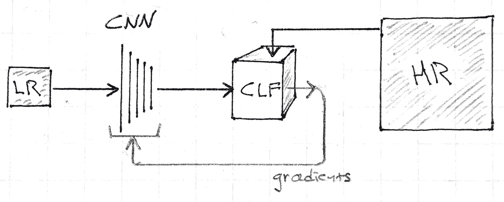

high-level view of Content (Perceptual) Loss for Super Resolution or Style Transfer

2。现在进入代码。如果您想继续学习，请参见 [neural-style.ipynb](https://github.com/fastai/courses/blob/master/deeplearning2/neural-style.ipynb) (注意:课程的未来更新可能会完全更改代码或笔记本)。

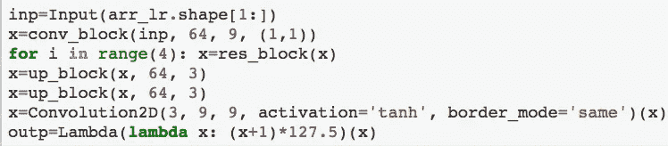

the final network — “The Upsampling Network”

上面的代码首先接收一批低分辨率图像，作为一个维度为`arr_lr.shape[1:]`(这里是:`(72, 72, 3)`)的张量。在笔记本中，`arr_lr`和`arr_hr`是 NumPy 数组。

`inp = Input(arr_lr.shape[1:])`

该输入然后被放入具有 64 个大小为 9 的滤波器和单位步幅(即输入大小没有变化)。

`x = conv_block(inp, 64, 9, (1,1))`

这是一个大的过滤器尺寸，因为我们想要一个大的初始感受野。显然，拥有 64 个滤波器可以确保没有信息丢失(来自 3 个颜色通道)，但我不知道输入滤波器与滤波器的信息丢失曲线是什么样的。但显然这也变得越来越普遍。

接下来是大部分计算将要完成的地方。这是 GAN 必须弄清楚的部分，例如，*那个黑点是眼球*，然后*一个更高分辨率的眼球看起来会是什么样子*。

`for i in range(4): x = res_block(x)` # `res_block()`是在别处定义的 [ResNet](https://arxiv.org/abs/1512.03385) 块。

在创成式模型中，我们希望以低分辨率完成这个主要的计算步骤。低分辨率意味着工作量更少，因此计算速度更快，但最重要的是:我们将有一个更大的感受域。为什么这很重要？你可以很容易地想象出一张放大版的某人脸部照片是什么样子，因为你知道脸是什么样子的。你知道那个黑色的东西是一只眼睛，而那个黑色的区域是它们下颚投下的阴影。你一开始就知道这些，因为你能一眼看到整张照片，并认出它是一张脸，而不是餐盘或抽象艺术作品。GAN 必须做同样的事情。

决定感受域的有几个因素:卷积层深度、滤波器大小和下采样(非单位步长、最大池等)。

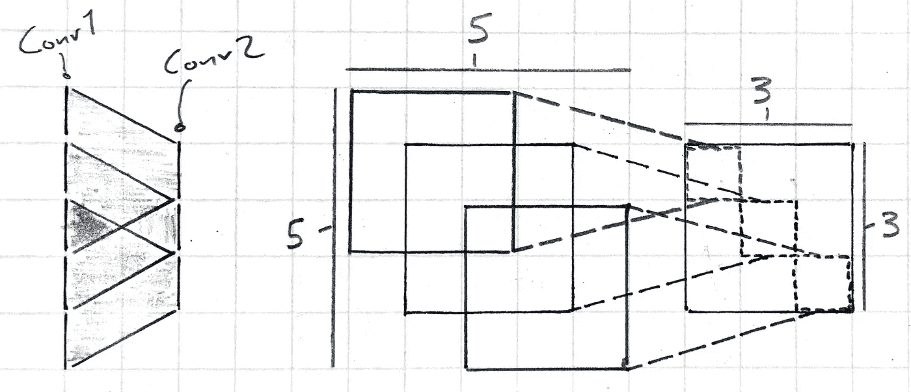

hopefully this makes some amount of sense

回到代码。ResNet 块是这样定义的:

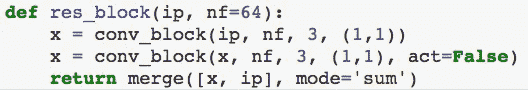

ip: input; nf: num. filters

这个块接受一个输入，用它来构建两个卷积块(通过 [Keras 的函数式 API](https://keras.io/getting-started/functional-api-guide/) )，然后将这些 Conv 块的结果添加回原始输入:`return merge([x, ip], mode='sum')`最后的 Conv 块没有激活(`act=False`)，因为最近的一篇论文(不确定是哪一篇)发现没有 ResNet 块通常会执行得更好。

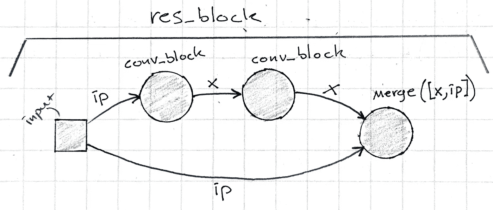

1st conv_block has ReLU activation; 2nd block no activ. ip is input. merge using sum operation.

从我目前对[深度残差网络](https://youtu.be/UlnYEWXoxOY?t=600)的理解来看，ResNet 的优势在于它给了网络的每一层一些关于原始输入的上下文。在讲座中，[杰瑞米·霍华德](https://medium.com/u/34ab754f8c5e?source=post_page-----dcd599ad6e0b--------------------------------)说，一堆 ResNet 块可以磨练他们需要做什么来完成一项任务(这里:放大图像)。

`y = f(x) + x;` → `f(x) = y — x;`其中`y — x = the residual`

那么，如果函数是输出 y 和输入 x 之差，即残差，这就给出了一些关于如何最小化损失函数的上下文信息？我将不得不及时了解更多关于那件事。

`conv_block`相当标准:

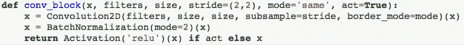

a convolution, then batch-normalization, and optionally an activation

在这一点上，我们实际上需要改变图像的尺寸。最初的讲座使用了反卷积模块，执行[反卷积/转置/分数阶卷积](https://youtu.be/I-P363wSv0Q?t=3154)来重建图像的外观，如果它的当前版本(输入)是卷积的结果。简而言之:它是对(零)填充输入的卷积。如果你想深入了解，这是讲座中提到的链接。在课程的 github 存储库中，课程笔记本的当前版本、 [neural-style.ipynb](https://github.com/fastai/courses/blob/master/deeplearning2/neural-style.ipynb) 以及 [neural-sr.ipynb](https://github.com/fastai/courses/blob/master/deeplearning2/neural-sr.ipynb) 都使用一个定义为:

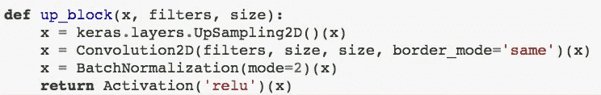

如果我理解正确的话，这是课程代码的一点逻辑发展。转置/分形步长/去卷积的一个问题是棋盘:根据步长，卷积滤波器重叠的地方会出现棋盘图案的假象。谷歌大脑和蒙特利尔大学的一些研究人员写了一篇关于这个问题的很棒的论文。

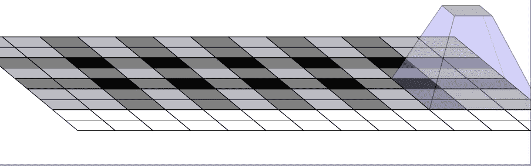

Figure from Odena, et al., “Deconvolution and Checkerboard Artifacts”, Distill, 2016\. [http://doi.org/10.23915/distill.00003](http://doi.org/10.23915/distill.00003)

简而言之:步长为 2 — `stride=(2,2)` —意味着过滤器在扫描输入时以 2 个像素或单元为步长移动，`size=3`意味着过滤器是一个`3x3`正方形。看一下上图，问题就很明显了。纠正这个问题的一个方法是确保你的过滤器大小是你步幅的倍数。另一种方法是*根本不*使用去卷积。

相反，该论文建议首先进行上采样，这本质上与最大池操作相反:例如，每个像素都成为同一像素的`2x2`网格。在常规卷积之后进行上采样不会产生棋盘效应。这看起来就像杰瑞米·霍华德在新版代码中所做的一样。酷毙了。

让我们再深入一点:原始代码使用了两个去卷积模块来放大低分辨率图像，从`72x72` → `144x144` → `288x288`。较新的代码通过两个上采样模块来实现这一点，每个模块执行一个`Upsampling2D()`操作，然后进行卷积和批量归一化。`UpSampling2D()`的 [Keras 文档](https://keras.io/layers/convolutional/#upsampling2d)显示:

`keras.layers.convolutional.UpSampling2D(size=(2,2), data_format=None)`

对我们来说重要的是`size`参数:

> **size** : int，或者 2 个整数的元组。行和列的上采样因子。

所以默认的行为是将图像的大小增加一倍，这就是为什么对`UpSampling2D()`的两次空调用实现了预期的效果。

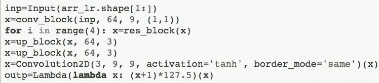

Just a reminder for what’s going on: the super-resolution network we’re building. inp is the original LoRes input tensor. outp is the HiRes output tensor. The Upsampling Network.

在放大之后，我们有一个最终的`9x9`卷积层，以便回到 3 个颜色通道。讲座中的解释是，在图像输出从 64 个过滤器或通道减少到 3 个时，我们希望大量的上下文(因此是`9x9`)能够做到这一点。因此，将前面的`(288, 288, 64)`张量通过最后的卷积层输出一个`(288, 288, 3)`张量:一个图像。最后一条`outp = Lambda(lambda x: (x+1) * 127.5)(x)`线需要将每个像素从之前的 tanh 激活中恢复到正确的`0,255`颜色强度等级。Tanh 在范围`0±1`我觉得，所以→ `([-1:+1] + 1) * 127.5 = [0:255]`。`Lambda(..)`是一个 Keras 包装器，它将内部的所有东西都视为自定义层。*注意*:[感知损失论文的](https://arxiv.org/abs/1603.08155)作者之一在 reddit 上提到，他们在没有 tanh 激活和没有最终 Lambda 处理层的情况下运行网络，并获得了同样好或更好的结果(无链接)。

现在可以训练网络，但是我们仍然需要定义我们的损失函数。Ie:网络自我评估的标准是什么？我们首先将我们的上采样网络连接到 VGG。VGG 将仅被用作内容损失的损失函数。在将上采样网络的输出张量输入 VGG 之前，需要对其进行预处理(VGG 模型中使用的归一化)。我们通过定义一个定制的 Keras 预处理层，并定义一个新的输出张量`outp_λ`作为预处理层运行`outp`的结果，来实现这一点:

```
vgg_λ = Lambda(preproc)
outp_λ = vgg_λ(outp)
# I just discovered code blocks in Medium :D (```)
```

接下来，我们创建一个 VGG16 网络，并将其所有层设置为不可训练。这…有点重要。因为这个网络*是*我们的损失函数——我们的测量棒——它必须是静态的。想象一下如果千克或米改变了。如果你想看现场混乱，只要看看外汇市场。

```
shp = arr_hr.shape[1:]vgg_inp = Input(shp)
vgg     = VGG16(include_top=False, input_tensor=vgg_λ(vgg_inp))
for λ in vgg.layers: λ.trainable=False
```

VGG 网络的输入张量形状`shp`是 HiRes 图像维度。于是:`shp = arr_hr.shape[1:]`和`vgg_inp = Input(shp)`。`arr_hr`是从磁盘上的 bcolz 压缩数组创建的 NumPy 数组，其维数(形状)为:(num-elements，dim1，dim2，dim3，…)。在我们的例子中是:(图像数量，高度，宽度，颜色通道)。所以取`arr_hr.shape[1:]`会返回一个形状张量:`(288, 288 , 3)`。`VGG16(..)`的`include_top=False`将省略网络末端的全连接分类块。这是 VGG16 w/ Average-Pooling &批处理规范化的 fast.ai 实现，位于: [vgg16_avg.py](https://github.com/fastai/courses/blob/master/deeplearning2/vgg16_avg.py) (如果课程目录结构发生变化，链接可能会断开)。

为了获得我们想要的 VGG 网络的部分内容损失，有几个实现。最初的课堂讲授通过选择提取特征的单个块(特别是块 2 中的 conv 第 2 层)来创建单个模型。在课程存储库中，这已经发展成为从多个块中检索特征的功能。

讲座的实施:

```
vgg_content = Model(vgg_inp, vgg.get_layer('block2_conv2').output)
vgg1 = vgg_content(vgg_inp)
vgg2 = vgg_content(outp_λ)
```

更新的课程 repo 在 [neural-sr.ipynb](https://github.com/fastai/courses/blob/master/deeplearning2/neural-sr.ipynb) 中的实现:

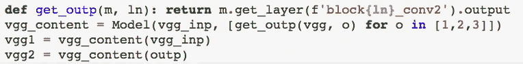

note how similar the 1 & l look. Wait, in this font which is an I and which is an l? → Making my case for the λ. =) vgg_content here is a [Multi-Output model](https://keras.io/getting-started/functional-api-guide/#multi-input-and-multi-output-models) (covered in Deep Learning I)

在这两种情况下，我们都使用模型中相对较早的激活。在 L8 中，我们发现我们完全可以使用早期层激活来重建图像。然后我们使用 Keras 的功能 API 创建 VGG 输出的两个版本。这个 Keras API 的一个伟大之处在于，任何层(模型被视为层)都可以被视为一个函数。然后，我们可以将任何我们喜欢的张量传递到这个“函数”中，Keras 将创建一个新的模型，将这两个部分连接在一起。因此`vgg2`是`outp`，底部是上采样网络，顶部是`vgg_content`，VGG16 中我们希望用作损失函数的部分。

旁白:你可能会有点困惑。我不应该说`outp_λ`而不是`outp`吗？在讲座的代码中，它是`outp_λ`:这是经过预处理λ层后的输出张量。然而，在更新的课程代码中，该步骤包含在 VGG16 模型的初始化调用中。新的号召是:

```
vgg = VGG16(include_top=False, input_tensor=Lambda(preproc)(vgg_inp))
```

因此，现在我们有两个版本的 VGG 图层输出。`vgg1`基于雇佣输入，而`vgg2`基于升级网络的输出(接受了知识输入)。我们将比较招聘目标图像和招聘汇总结果，因此两个张量都具有高分辨率形状(288，288，3)。需要明确的是:`vgg1`是雇佣内容/感知激活，`vgg2`是知识增采样内容/感知激活。

*注意:对于损失函数和最终模型的定义，原始讲座和更新的存储库代码之间存在显著差异。我将先浏览一下讲座版本，然后浏览一下新内容。*

接下来我们计算它们之间的均方误差。在 Keras 中，任何时候你想把某个东西放到一个网络中，你都需要把它变成一个层，而这是通过把它扔进一个`Lambda(..)`来完成的:

```
loss = Lambda(lambda x: K.sqrt(K.mean((x[0]-x[1])**2, (1,2))))([vgg1, vgg2])
```

最终模型将采用 LoRes 输入和 HiRes 输入作为其两个输入，并返回刚刚定义为其输出的损失函数:

```
m_final = Model([inp, vgg_inp], loss)
```

此外，当您试图在 Keras 中适应事物时，它会假设您试图获取一些输出并使其接近目标。这里的损失是我们想要的实际损失函数；没有目标，我们只是希望它越小越好。由于我们的损失函数使用的是 [MSE](https://en.wikipedia.org/wiki/Mean_squared_error) ，我们可以说我们的目标是零。然而，Keras 中的目标是标签，所以每行(每个输入)都必须有一个标签，所以我们需要一个零数组:

```
targ = np.zeros((arr_hr.shape[0], 128))
```

为什么每个图像有 128 个零？[讲座](https://youtu.be/I-P363wSv0Q?t=4298)回答:Lambda 层，`loss`，对应目标数组有 128 个滤镜。128，因为该层包含了`vgg1`和`vgg2`，两者都有 64 个过滤器。

接下来，我们使用 Adam 优化器和 MSE 损失编译模型，并对其进行拟合:

```
m_final.compile('adam', 'mse')
m_final.fit([arr_lr, arr_hr], targ, 8, 2, **pars)
```

*注意:* `pars`包含一对这样定义的参数变量:`pars = {'verbose': 0, 'callbacks': [TQDMNotebookCallback(leave_inner=True)]}` —这关闭了冗长性，并使用 [TQDM](https://pypi.python.org/pypi/tqdm) 进行状态报告。

在第一轮训练后，学习率有所降低(称为“学习率退火”):

```
K.set_value(m_final.optimizer.lr, 1e-4)
m_final.fit([arr_lr, arr_hr], targ, 16, 2, **pars)
```

训练之后，我们对模型中的上行采样网络感兴趣。一旦我们完成训练&试图最小化损失函数，我们不再关心损失:我们关心的是来自上采样网络的输出图像。所以现在我们定义了一个模型，它接受知识输入`inp`并返回雇佣输出`outp`:

```
top_model = Model(inp, outp)
```

当我第一次为它做任务时，这让我有点困惑:`outp`在我们上面的训练步骤中已经被训练过了。事实上，如果你记得:`inp`和`outp`只是我们的上采样网络的输入层和输出激活。我们基本上建立了一台机器来对图像进行上采样，使用现有的模块(VGG16)来训练这台机器，方法是将它放在上面，然后在完成后断开该模块，现在我们有了一台经过训练的机器来对图像进行上采样。

*现在*，我做这件事的方式与课程库中的方式有些不同。定义`vgg1`和`vgg2`后，训练前的部分如下:

```
def mean_sqr_b(diff):
    dims = list(range(1, K.ndim(diff)))
    return K.expand_dims(K.sqrt(K.mean(diff**2, dims)), 0)w = [0.1, 0.8, 0.1]def content_fn(x):
    res = 0; n=len(w)
    for i in range(n): res += mean_sqr_b(x[i]-x[i+n]) * w[i]
    return resm_sr = Model([inp, vgg_inp], Lambda(content_fn)(vgg1+vgg2)
m_sr.compile('adam', 'mae')
```

还记得在 VGG16 中，新代码是如何使用多输出模型在不同的块上进行激活的吗？我们将对每个块对损失函数的相对影响进行加权:`w = [0.1, 0.8, 0.1]`表示`block1_conv2`的权重为 10%，`block_2_conv2`的权重为 80%，&等等。

我们的损失函数本身就是函数中的函数。`content_fn(x)`取张量`x`，输出标量损失值`res`。对于`w`中的每个权重，`content_fn(.)`根据`x`的第 I 个元素和`x`的第 I+n 个元素之差调用`mean_sqr_b(.)`(其中 n =在`w`中权重的数量)，将结果乘以`w`中的第 I 个权重，并将该值加到`res`。

如果你认为进入`content_fn(.)`的`x`是我们的雇佣张量和我们的 LoRes 上采样张量的连接，如果这两个张量都是多输出模型(3 个不同的 conv 块激活)的结果，那么`content_fn(.)`所做的只是两个张量的相应加权块激活的 [MSE](https://en.wikipedia.org/wiki/Mean_squared_error) 。

如果这仍然有点难以理解，试试这个:

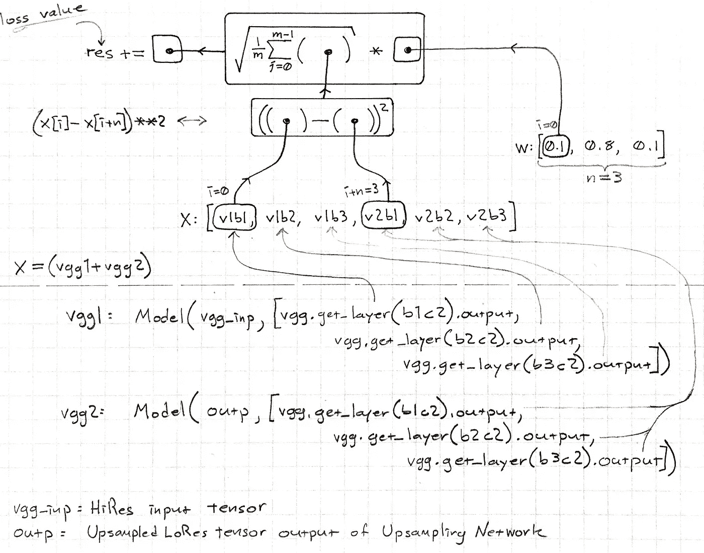

yes I see it too.

我要在这里暂停一会儿，希望我没有让它变得更糟。

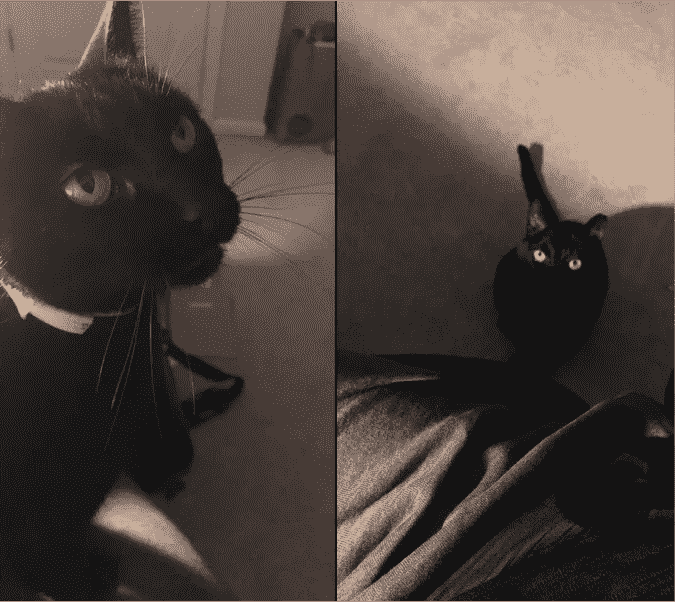

Terek

没错。这就是损失函数。

最终的模型，这次称为`m_sr`的超分辨率模型，将一组张量作为输入:LoRes 和 HiRes originals，并输出应用于`vgg1` + `vgg2`的损失函数`content_fn`的结果。

```
m_sr = Model([inp, vgg_inp], Lambda(content_fn)(vgg1+vgg2)
```

想象这是一个温和的噩梦:想象多重计算图形的不同之处仅在于它们将 VGG 的哪个块作为输出，它们的输出是如何被编织到损失函数中的；这还没有考虑每个上采样网络内部发生了什么，或者反向传播实际上是如何更新网络的。这可以被抽象成几行代码，这很酷。我想过画一个巨大的图表…过了某个点，它是光明会遇到矩阵，你在比赛找出情节。

尽管使用了[平均绝对误差](https://www.kaggle.com/wiki/MeanAbsoluteError)而不是 [MSE](https://en.wikipedia.org/wiki/Mean_squared_error) : `m_sr.compile('adam', 'mae')`，但编译还是很简单的。另一个区别是训练。加载大约 40k 的图像*刚好*刚好适合我工作站的内存，*有时*。如果你想要更多呢？这就是 bcolz 库的用武之地。你把数据保存在磁盘上，然后分批加载。代码是这样的:

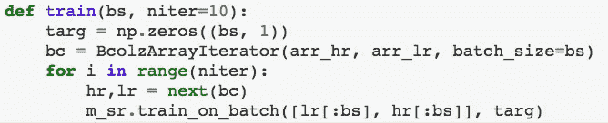

see: [bcolz_array_iterator.py](https://github.com/fastai/courses/blob/master/deeplearning2/bcolz_array_iterator.py)

`bs`是批量大小。它必须是压缩时定义的 bcolz carray 的块长度的倍数。bcolz 数组有一个问题，它的块长度是 64，而我的工作站只能处理 6 的批量大小；8 如果行星排成一行。我通过创建新数组并显式设置参数`chunklen`解决了这个问题。这可能是或可能不是犹太人。

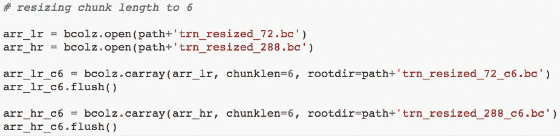

[neural_sr_attempt3.ipynb](https://github.com/WNoxchi/Kaukasos/blob/master/FAI02/Lesson9/neural_sr_attempt3.ipynb)

`niter`是迭代次数。`targ`和之前一样是目标向量，但是这次是一个 0 的数组，一个 0 代表批处理中的一个元素。`bc`是一个迭代器，它在每次调用`next(bc)`时返回下一批`arr_hr`和`arr_lr`。我真的很喜欢这个，因为我在一个深度学习任务中遇到了系统内存限制的问题，我拼凑了一堆类似的函数来批量从磁盘中提取数据，并正确处理最后的剩余部分。[代码](https://github.com/fastai/courses/blob/master/deeplearning2/bcolz_array_iterator.py)更先进一些，把它拆开看看它是如何工作的会很有趣。它使用了线程和`with`语句，这些我还没有用过。

对于`niter`迭代，`train(..)`加载下一批雇佣和知识图像，然后调用`m_sr.train_on_batch([lr[:bs], hr[:bs]], targ)`。为什么当`lr`是长度`bs`时，确切地说是`lr[:bs]`而不仅仅是`lr`呢，反正我不确定——也许不是？在最后一批中，我遇到了输入和目标数组长度不匹配的问题。如果您有 16，007 个图像，批处理大小为 8，那么您的目标数组大小被设置为批处理大小→您会得到一个减一的错误。我通过将目标指定为`targ[:len(hr)]`来解决这个问题，这样最终的输入和目标数组长度相同。至于`niter`，我将其设置为:`niter = len(arr_hr)//6 + 1`以说明余数，尽管回想起来，只有在余数存在时才添加`1`会更好。

毕竟，结束是容易的。训练几个纪元，降低学习速度，然后再训练几个纪元。然后获得您训练有素的工作模型:

```
top_model = Model(inp, outp)
```

并开始向上采样。我得到了这个(*注*:这里的数据一次全部加载到内存中，模型通过`model.fit(..)`进行训练):

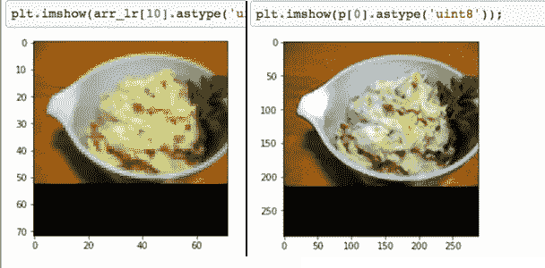

it enhanced the mashed potatoes

虽然正如课程笔记本暗示的那样，这种良好的表现可能部分是由于过度拟合。以下是木星照片的结果:


LoRes — SuperRes — HiRes

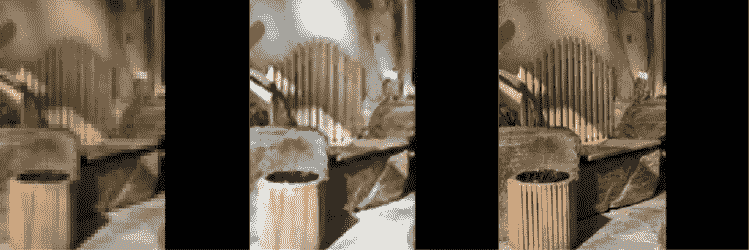

LoRes — SuperRes — HiRes (used batch-loading method)

这并不奇怪。首先，我肯定忘记了至少一个实现中的学习率退火部分——我更感兴趣的是让它工作起来:大量的资源耗尽错误和 bcolz 迭代器的故障排除——而我正在处理的数据集只有 19，439 幅图像。也许这已经足够了，但是如果`In: len(arr_hr)//16; Out: 62277`有任何线索的话，课程中的模型至少训练了 996，432 张图像，尽管那可能是在讲座被录制之后。不管是哪种情况，你都应该在 ImageNet 上进行训练，而不是一个小的子集，如果你有发言权的话。理想情况下，你也应该正确地进行训练。顺便说一下，我的两次成功尝试总共花费了大约 12 个小时的计算时间。所以 20k 就可以了。

关于木星和过度拟合的一个注意事项:在所有图片中，似乎确实存在对比度增加和褪色的问题，但据我所知，ImageNet 中也没有行星类别。所以那里可能发生了什么。

3。快速风格转移。我们可以使用来自超分辨率的相同基本思想，利用感知(内容)损失进行快速风格转换。这次我们拍摄一张照片，通过 CNN，然后通过一个损失函数对一张固定风格的图片进行风格和内容损失。关于这个话题有一篇[论文](https://arxiv.org/abs/1603.08155)和[补充材料](http://cs.stanford.edu/people/jcjohns/papers/eccv16/JohnsonECCV16Supplementary.pdf)。

[论文](https://arxiv.org/abs/1603.08155)在输入上使用反射填充而不是零填充——也就是说:反射边界周围的图像而不是只有黑色像素。杰瑞米·霍华德用一个定制层实现了这个，在 Keras 中这个定制层是作为一个 Python 类来实现的。

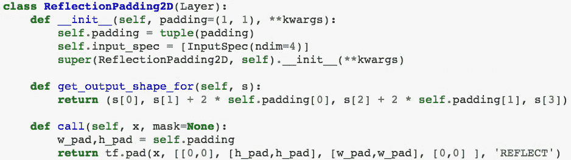

[neural-style.ipnb](https://github.com/fastai/courses/blob/master/deeplearning2/neural-style.ipynb)

第一部分是构造函数。此后，在定义自定义 Keras 层时需要做两件事:您需要定义`get_output_shape_for(self, input)`，它接受输入张量的形状，并返回输出张量的形状——在这种情况下，它与`s` ( `s[0]`)具有相同的批处理大小，相同的通道数(`s[3]`)，以及两倍的行和列填充量(`s[1] + 2 * self.padding[0], s[2] + 2 * self.padding[1],`)。当你把东西放在一起时，Keras“神奇地”知道中间层的输入/输出有多大，因为每一层都包含这种信息。第二个要定义的是`call(self, x, mask=None)`。`call(..)`获取你的层数据`x`，并返回你的层所做的一切。 [Keras 的文件规定](https://keras.io/layers/writing-your-own-keras-layers/):

> 这是层的逻辑所在。

我们希望这一层添加反射填充。TensorFlow 有一个名为`tf.pad(..)`的内置函数。

该图层现在可用于网络定义:

```
inp = Input((288, 288, 3))
ref_model = Model(inp, ReflectionPadding2D((40, 2))(inp)
ref_model.compile('adam', 'mse')p = ref_model.predict(arr_hr[10:11]) # run model on 10th img
```

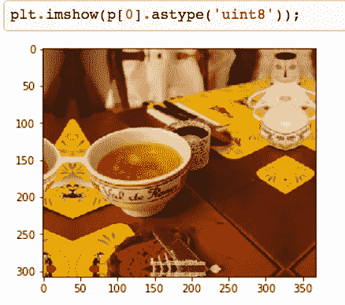

[neural-style.ipynb](https://github.com/fastai/courses/blob/master/deeplearning2/neural-style.ipynb)

论文作者使用`40x40`像素对图像进行反射填充。因为它们在它们的 ResNet 块中使用“有效”卷积，所以图像通过层被逐渐裁剪，所以反射填充的存在是为了保留图像。

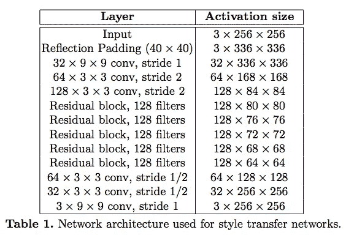

From: [Perceptual Loss Supplementary Material](http://cs.stanford.edu/people/jcjohns/papers/eccv16/JohnsonECCV16Supplementary.pdf)

其实作者的架构和我们的很像。一般模式是:通过卷积对输入进行下采样，并增加通道和感受野的数量，从而创建更复杂的数据表示(第 3-5 行)，对这些表示进行计算(剩余层)，然后对其进行上采样(最后 3 行)。1/2 步是去卷积:它与分数步卷积相同。

没有进入太多的细节，实现这一点(主要遵循更新的课程笔记本)我采取了这种风格的形象:


artist: [Alena Aenami](https://www.artstation.com/aenamiart)

并把它应用到这幅 Waynakh 中世纪塔的图片上:


image: Ahmed Osmiev

两幅图像都被调整到`500x500`。回头看看代码，我看到了一些愚蠢的错误:样式图像被裁剪为`288x288`以适应样式张量…因此丢弃了 33%的样式图像。在将塔的内容图片调整到`333x333` …那不适合，所以我只是裁剪它以适合输入张量。尽管如此，在用学习速率退火(2p @ default→2p @ 0.0001)在 4 个时期中训练快速风格转移模型大约 6 小时之后，该模型在大约 1 秒或更短时间内完成了其风格转移，并产生了以下结果:

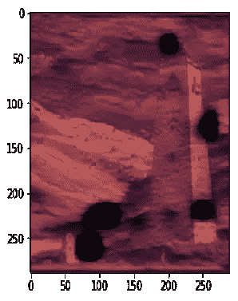

resized in Apple Pages to (kind of) match original proportions

有点像角色扮演游戏的卡片。闹鬼的城堡什么的。显然，如果我使用原始内容和风格图像的全分辨率会好得多，但我还没有研究它。由于这种模型首先进行训练，而不是像以前的风格转移模型那样在运行时进行训练……感觉要让它在计算资源有限的情况下处理大型图像会很困难。你可以尝试简单的极端情况，重新压缩 bcolz 数组，使其块长度为 1，这样你就可以使用批量大小为 1 的数组，以低得多的学习速率开始，只需接受更长的训练时间，然后就可以了……但是这种解决方案感觉*太*简单了。在给定固定资源的情况下，应该有一种方法可以缩放到任何图像大小，并且只在计算时间上付出代价。嗯..

你可以试着把图像分成一个网格马赛克，在每一块上运行，然后把它们拼接起来。但现在你要付出一个定性的代价:如果这是一张雇佣照片，那么有一些重要信息你的社交网络不会知道，因为它实际上会被放大到只见树木不见森林。

等等，有没有一种方法可以使用`288x288x3`张量作为视野，并扫描更大的图像，将视野中的内容加载到内存中，并将其余内容保存在磁盘上，也许可以使用 bcolz？*嗯..*

4。 [设计](https://research.google.com/pubs/pub41869.html):深度视觉语义嵌入模型。第九课的最后一部分，也是这篇博文的开始。Andrea Frome 在一篇论文中描述了这一点。)，DeVISE 试图通过用单词嵌入取代一键编码来更接近我们在图像识别方面所做的事情。

作为一个(非常)粗略的概述:在你传统的一键编码模型中，鲨鱼和鱼之间几乎没有相似之处，或者“鲨鱼”的概念是所有类型鲨鱼的超集。当然，这不是我们在现实生活中感知事物的方式。在一个不同的领域，自然语言处理，有一种方法可以捕捉到类别之间的相互关系，叫做单词嵌入。它基本上是一个矩阵，每行(每列？？)由映射一个单词与所有其他单词的相关性的向量组成。我们在[深度学习 I](http://course.fast.ai/lessons/lesson4.html) 中使用它来创建一种类似尼采的机器人，也用于电影推荐(嵌入可以将电影映射到类别，而不仅仅是单词到单词)。

因此，对于图像，pug 的向量不是 1000 个元素，pug 类别的索引是 1，其他地方都是 0，而是用 pug 的密集单词向量来替换它(向量长度取决于我们使用的嵌入)。我们将使用一个 Softmax 层来进行一键编码(答案是`1`其他都是`0`)，但是现在我们将使用线性层。

棘手的是要通过 ImageNet。150 万张左右的图片已经很多了。这就是 bcolz 和数组迭代器(在前面使用过)的用武之地。

这里有一个来自[杰瑞米·霍华德](https://medium.com/u/34ab754f8c5e?source=post_page-----dcd599ad6e0b--------------------------------)的提示:他定义了两条数据路径——一条用于高速固态硬盘/非易失性存储器上的数据，另一条用于大型硬盘。他使用 RAID 1 SSD 来快速访问调整大小的图像和功能阵列，以及用于批量数据的 HDD 路径。好主意。

使用的单词嵌入是 word2vec。

讲座中提到的[另一个有趣的事情是 Python 的 single-star (zip-star？)语法。如果您有一个将单词映射到向量的数据结构，并且想要获得单词列表和向量列表，如果您能够以迭代器的形式获得该数据结构，那么:](https://youtu.be/I-P363wSv0Q?t=6172)

```
words, vectors = zip(*wordvec_iterator)
```

将所有的单词放入`words`，所有对应的向量放入`vectors`。

所以在这个讲座的例子中，如果`wordvec_iterator`包含`"fox:", array01, "wolf", array02, ...`，那么当你压缩`wordvec_iterator`时，这与把这些内容放入`zip(.)`是一样的，就像这样:

```
zip("fox", array01, "wolf", array02)
```

那么测试一下这个:

```
>>> words = ["fox:","wolf:"]; vecs = [[1,2,3],[4,5,6]]; 
>>> zipped = zip(words, vecs)
>>> list(zipped)Out: [('fox:', [1,2,3]), ('wolf', [4,5,6])]>>> w, v = zip(*zip(words, vecs)) # or: zip(*zipped) ## for fresh `zipped`
>>> words == list(w) and vecs == list(v)Out: True>>> w, vOut: (('fox:', 'wolf:'), ([1,2,3], [4,5,6]))
```

或者说得迂腐一点:

```
>>> word, vecsOut: (['fox:', 'wolf:'], [[1, 2, 3], [4, 5, 6]])>>> list(w), list(v)Out: (['fox:', 'wolf:'], [[1, 2, 3], [4, 5, 6]])
```

所以我今天学到了一些新东西。基本经验:如果你想把一个元组列表转换成一个列表元组，使用 zip-star (Python)。

[杰瑞米·霍华德](https://medium.com/u/34ab754f8c5e?source=post_page-----dcd599ad6e0b--------------------------------)做了更多设置笔记本的工作，将文字嵌入应用到 ImageNet 图片。我不会在这里详述，因为这篇文章遭受了它自己的任务爬行形式——而且我还没有为一个完全解压缩的 ImageNet 腾出 TB 左右的自由空间。Howard 对单词列表做了一些处理，对它们进行了重新排序，这样更常见的单词就会排在前面——并且还将所有单词都变成了小写，因为大写在这里并不重要。他通过使用`np.corrcoef(..)`来查看他的名字的大写和小写版本与他的名字和不相关的对象之间的相关系数，从而进行了几次健全性检查。

然后，他创建了两个单词向量映射(Python 字典),分别映射到 1，000 个 Imagenet 类别和 WordNet 中的 82，000 个名词——目标是创建一个可以超越 ImageNet 的 1，000 个类别的系统。

最后，他创建了一个在 WordNet 中找不到的 ImageNet 类别列表，并将这些图像文件夹移出目录。

另一个有用的提示:Howard 保存所有花费大量时间的输出。获取一百万张图像的文件名需要一段时间，尤其是当它们在旋转的磁盘上时。

他还利用了我在[计算/数值线性代数](https://github.com/fastai/numerical-linear-algebra/blob/master/README.md)课上看到的三种技术:内存局部性、SIMD/向量化和并行处理。【[讲座环节](https://youtu.be/I-P363wSv0Q?t=6729)】。我觉得关于 SIMD 的那段很有趣。

到目前为止，对我来说，这是这门课最长的一课。有很多事情要做，但我喜欢从大规模架构的角度来看代码的想法。在黑暗的森林中很容易迷路，并且忘记你的模型的一部分来自哪里。人们也很容易害怕做出任何改变，因为害怕再也无法完全理解。但是如果你有一个连续的主题“我通过 CNN 输入图像，CNN 的输出通过一个损失函数与我想要它产生的相比较”，记住你实际上在做什么就变得容易多了。这就差不多结束了！

关于符号的几个注意事项:我将经常大写某些术语，如卷积或生成等。我发现，在阅读新的技术主题时，将一些关键术语强调得恰到好处，就像路径标记一样，会有所帮助，可以避免只是通读像散文这样的文本墙而迷失方向。

此外，每当代码中有一个单独的`l`时，我会用`λ`替换它。除了`λ`漂亮之外，在许多字体中`1 I l`看起来完全相同或者非常接近，足以让人迷惑；所以它有一个额外的用途——保持理智。