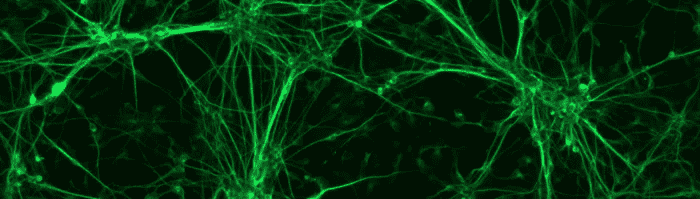
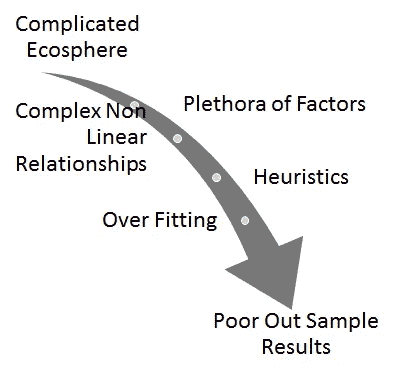
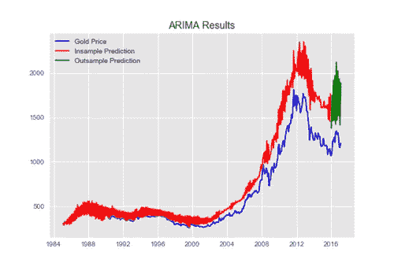
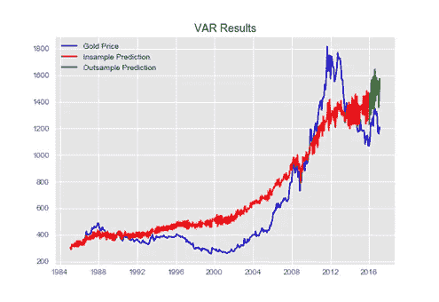
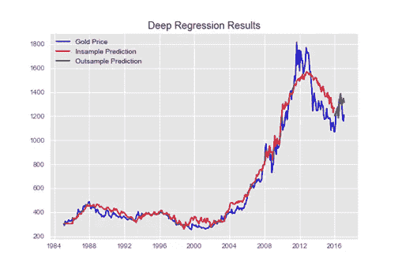
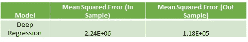
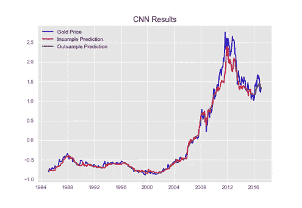
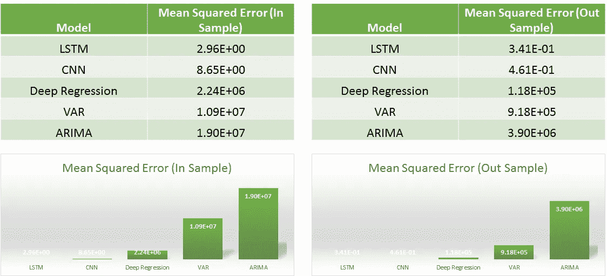
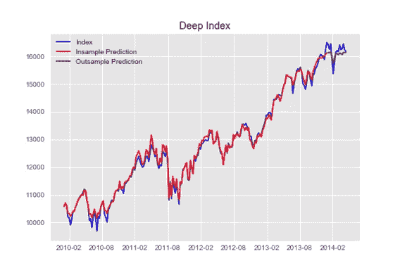
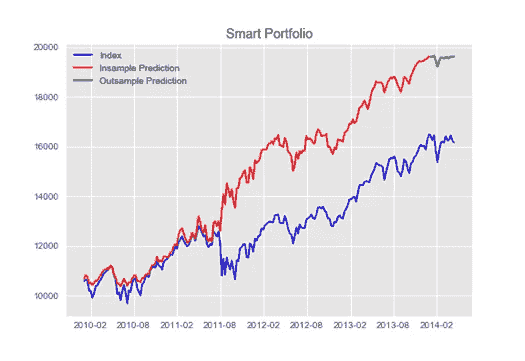

# 金融领域的深度学习

> 原文：<https://towardsdatascience.com/deep-learning-in-finance-9e088cb17c03?source=collection_archive---------0----------------------->

我写这篇文章是为了跟进新加坡再工作深度学习峰会上的同名讲座。在演讲中，我试图详细说明金融模型失败的原因，以及深度学习如何弥合这一差距。接下来，我继续介绍了金融领域深度学习的三个用例，以及这些模型优越性的证据。

虽然金融是计算最密集的领域，但金融中广泛使用的模型——监督和非监督模型、基于状态的模型、计量经济学模型甚至随机模型——都存在过度拟合、启发式和样本外结果差的问题。这是因为，金融领域非常复杂，并且是非线性的，有太多的因素相互影响。

为了解决这个问题，如果我们看看在图像识别、语音识别或情感分析等成熟领域的深度学习中所做的研究，我们会发现这些模型能够从大规模未标记数据中学习，形成非线性关系，形成递归结构，并且可以轻松调整以避免过度拟合。

如果这些模型能在金融领域得到应用，那么它们的应用将会非常广泛。这些模型可用于定价、投资组合构建、风险管理甚至高频交易等领域。因此，让我们来解决其中的一些问题。

# 回报预测

以预测每日黄金价格的样本问题为例，我们首先来看看传统的方法。

[ARIMA](https://en.wikipedia.org/wiki/Autoregressive_integrated_moving_average)

使用自回归综合移动平均模型，试图预测一个平稳的时间序列，保持季节性因素不变，我们得到一个结果

[**VAR**](https://en.wikipedia.org/wiki/Vector_autoregression)

如果我们将相关的预测变量添加到我们的自回归模型，并转移到向量自回归模型，我们会得到以下结果—

**深度回归**

使用相同的输入，如果我对数据拟合一个简单的深度回归模型，我会得到好得多的结果，

[**卷积神经网络**](https://en.wikipedia.org/wiki/Convolutional_neural_network)

修改我的架构以使用卷积神经网络来解决相同的问题，我的结果是

这些结果要好得多。但是接下来是最好的结果。

[**【长短期记忆(LSTM)**](https://en.wikipedia.org/wiki/Long_short-term_memory)

这就对了。使用这些变化的递归神经网络，我的结果是:

所以总的来说，均方差的趋势是一个启示！

# 投资组合构建

我们将尝试使用深度学习解决的第二个金融问题是投资组合的构建。深度学习在这个问题上的应用有一个漂亮的结构。我的研究受到了 T4 一篇名为《深度投资组合》的论文的启发。

这篇论文的作者试图做的是构建自动编码器[来将一个时间序列映射到它自身。使用这些自动编码器的预测误差成为股票 beta(与市场的相关性)的代理，自动编码器是市场的模型！](https://en.wikipedia.org/wiki/Autoencoder)

基于上述自动编码器误差选择不同的股票集合，我们可以使用另一个深度神经网络来构建深度指数，并且结果相当好。

这里的深度神经网络已经成为一种使用股票复制指数的指数构建方法。

但这只是开始！如果我们应用智能指数，我从指数中删除极端下降的时期，并在智能指数上训练我的指数映射深度神经网络，我就能够以激烈的方式超越指数！

这项技术在投资组合构建领域有着巨大的潜力！

# 结论

金融行业的当前趋势正在引领更复杂、更合理的模型进入市场。对于所有银行来说，技术是一个巨大的压力领域，有大量数据科学家进入该领域。像 RelTec 和 Worldquant 这样的对冲基金已经在交易中使用这种技术。这些复杂的模型在其他领域表现出了卓越的结果，而金融建模领域存在巨大的差距，这就产生了一系列引人注目的创新！

更好地解决我们在金融和贸易领域的关键问题将提高效率，增加透明度，加强风险管理和创新。

PS:以上所有分析使用的代码可以在我的 [github repo](https://github.com/sonaam1234/DeepLearningInFinance) 上找到

我正在计划我的下一篇关于投资组合管理的文章，请继续关注！

欢迎任何好的建议。

*请访问我的网站*[***http://www . Wright research . in/***](http://www.wrightresearch.in/)*了解更多我管理的投资策略！*

 [## 返工

### RE*WORK 活动将企业家精神、技术和科学结合起来，利用……

videos.re-work.co](http://videos.re-work.co/videos/410-how-machine-learning-is-transforming-finance) 