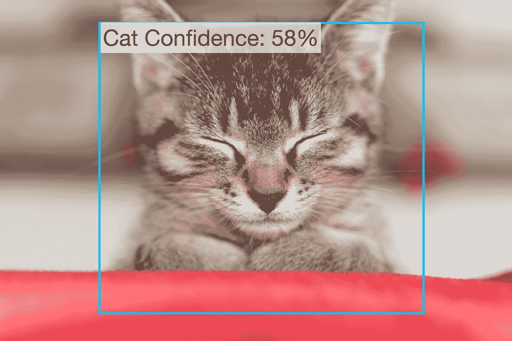
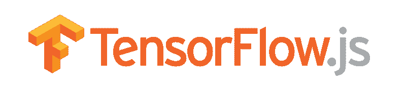
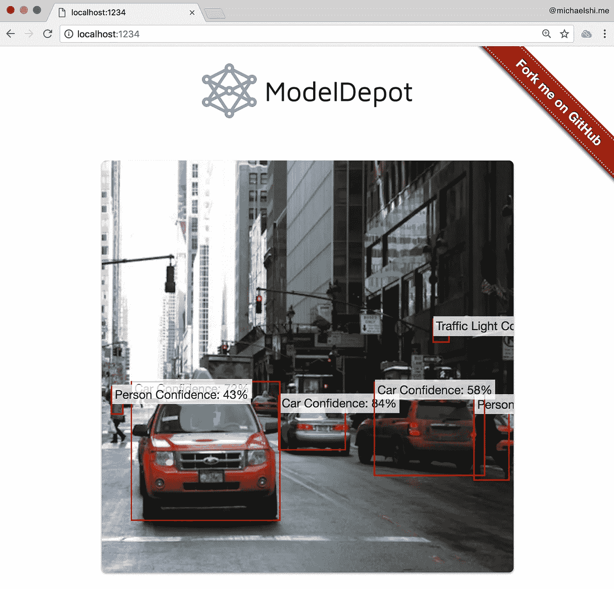
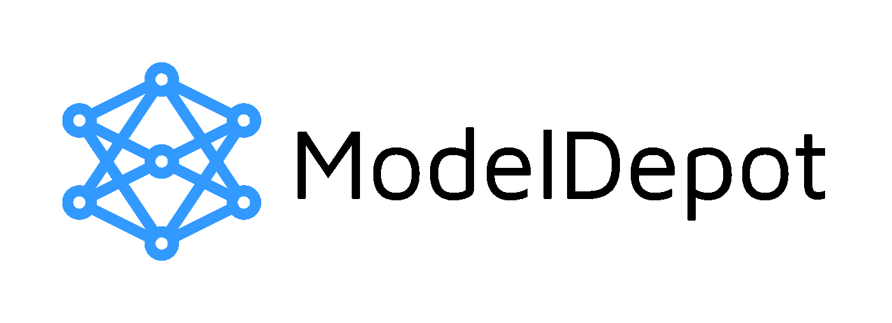

# 浏览器中的深度学习:简明指南

> 原文：<https://towardsdatascience.com/deep-learning-in-your-browser-a-brisk-guide-ca06c2198846?source=collection_archive---------3----------------------->

## 使用网络摄像头和 Tensorflow.js 实时检测物体。



[Original Image](https://pixabay.com/en/cat-animal-kitten-domestic-cat-2720778/)

[Tensorflow.js](https://js.tensorflow.org/) 是一个新的深度学习库，可以在你的浏览器中运行。作为一名机器学习和 Javascript 爱好者，我在 Tensorflow.js 发布后立即开始使用它进行对象检测库的工作。

在这里，我将走过我是如何开始的，并分解 [tfjs-yolo-tiny](https://github.com/ModelDepot/tfjs-yolo-tiny) 的不同点。你可以[点击这里](https://modeldepot.github.io/tfjs-yolo-tiny-demo/)查看现场演示。

我们将涉及提取原始的微型 YOLO 暗网模型，将其转换为 Keras，将其转换为 Tensorflow.js，进行一些预测，在 Tensorflow.js 中编写时捕获数据，以及轻松使用网络摄像头/图像进行预测。


# 更好、更快、更强

是的那是认真的[原论文题目](https://arxiv.org/abs/1612.08242)。我们将使用[微型 YOLO](https://pjreddie.com/darknet/yolo/) ，一种可以以 200 FPS 运行的快速对象检测模型。我们将使用小 YOLO 而不是完整的 YOLOv2。为什么？首先，YOLOv2 在一个强大的桌面上“只能”以 40 fps 的速度运行，大多数用户都无法访问。该模型文件也比微型 YOLO 大 5 倍左右，从网上下载要花很长时间。最后，YOLOv2 有一个 [reorg 层](https://github.com/pjreddie/darknet/blob/master/cfg/yolov2.cfg#L219)，它还不支持作为原生 Tensorflow.js 层。我们将在下一步中获取微小 YOLO 的网络配置(神经网络结构)和权重(幻数)。

# YAD2K:又一个 Darknet 2 Keras(转换器)

你可能已经注意到 YOLO 是用暗网写的，暗网听起来不像张量流。所以我们的第一站是将我们的 YOLO 模型转换成更张量流的东西，在我们的例子中，就是 [Keras](https://keras.io) ！Keras 是一个更高级的深度学习框架。这是将您的权重转换为 Tensorflow.js 格式的[推荐格式](https://js.tensorflow.org/tutorials/import-keras.html)。

我们将使用 [YAD2K](https://github.com/allanzelener/YAD2K) 将暗网模型转换为 Keras。继续按照这里的[说明](https://github.com/allanzelener/YAD2K#installation)安装 YAD2K，我等着。

好吧，你也可以假装是你做的，并使用我已经发布的[最终重量文件](https://modeldepot.io/mikeshi/tiny-yolo-in-javascript)，但这不会那么有趣！

现在，我们必须修复 YAD2K 中的一个错误，以正确加载微小的 YOLO。

在您最喜欢的文本编辑器中打开 [yad2k.py](https://github.com/allanzelener/YAD2K/blob/master/yad2k.py#L83) ，在第 83 行，将`buffer=weights_file.read(16)`改为`buffer=weights_file.read(20)`。为什么？不知道。

现在在您的终端中运行以下命令。它将下载微小的 YOLO 重量和配置，以及输出转换后的模型文件到`model_data/yolov2-tiny.h5`

```
wget [https://pjreddie.com/media/files/yolov2-tiny.weights](https://pjreddie.com/media/files/yolov2-tiny.weights)
wget [https://raw.githubusercontent.com/pjreddie/darknet/master/cfg/yolov2-tiny.cfg](https://raw.githubusercontent.com/pjreddie/darknet/master/cfg/yolov2-tiny.cfg)./yad2k.py yolov2-tiny.cfg yolov2-tiny.weights model_data/yolov2-tiny.h5
```

接下来，我们要确保我们的新模型实际可行！有趣的事实:我忘记这样做了，我花了一整天的时间想知道 Tensorflow.js 为什么是 b0rk。

```
./test_yolo.py model_data/yolov2-tiny.h5
```

该模型应该输出一些预测。如果没有，欢迎在下面评论我！



# Tensorflow.js 转换器:我们最后的重量转换

这一步更简单，我保证！看官方指南[这里](https://js.tensorflow.org/tutorials/import-keras.html)。同样，如果这看起来太多了，我已经完成了所有困难的工作，所以你可以直接跳过:)

我们需要安装官方的转换工具。在你的终端中运行`pip install tensorflowjs`来安装转换器。

现在再次使用终端来转换我们的模型！

```
tensorflowjs_converter --input_format keras \
    model_data/yolov2-tiny.h5 \
    tfjs_model_data
```

现在我们终于在`tfjs_model_data`有了我们所有的模型文件！注意，该文件夹包含一个`model.json`以及一堆其他碎片文件。`model.json`告诉 Tensorflow.js 神经网络的结构是什么，哪些碎片文件对应什么权重。碎片文件包含模型的权重。确保碎片文件位于`model.json`的同一个目录中，否则您的模型将无法正确加载。

# Tensorflow.js 时间

现在，有趣的部分。(每一部分都是好玩的部分。)ML 和 JS 代码同时！

我们将从导入一些 Tensorflow 并加载模型开始。

```
import * as tf from ‘@tensorflow/tfjs’;const model = await tf.loadModel(url);
```

等等，什么是“网址”?您可以在这里使用托管模型文件[或者提供您转换的文件的路径。在这里了解更多](https://raw.githubusercontent.com/MikeShi42/yolo-tiny-tfjs/master/model2.json)！

太棒了，现在我们可以做一些真正的**深度学习**:

```
function yolo (input) {
   return model.predict(input);
}
```

哼。这似乎很平常。哦等等。我们忘记了将输出转换成边界框、类标签和概率！


The numbers Mason, what do they mean?? [Original Image](https://pixabay.com/en/matrix-technology-tech-data-3109378/)

# 把数字变成盒子和数字

我不打算深入探讨这个问题，因为 YOLO 的后期处理可以是他们自己的几篇博文。相反，我将强调我在将 [Python](https://github.com/allanzelener/YAD2K/blob/master/yad2k/models/keras_yolo.py) 版本转换为 [Javascript](https://github.com/ModelDepot/tfjs-yolo-tiny/blob/master/src/postprocess.js) 时所面临的挑战。

**某些张量运算不可用**

Tensorflow.js 还很年轻，因此有些东西还不可用，如[布尔遮罩](https://www.tensorflow.org/api_docs/python/tf/boolean_mask)或 [NMS](https://www.tensorflow.org/api_docs/python/tf/image/non_max_suppression) 。您也可能遇到这个问题，但幸运的是，您可以通过使用

```
const expected_shape = tensor.shape;
const data = await tensor.data(); // Async transfer from GPU to CPU
// Note: data is a flattened TypedArray of the original tensor
//... data manipulation in JS on CPU
tf.tensor1d(data).reshape(expected_shape); // Shape it back into where we were before
```

注意:这样做可能会成为应用程序的瓶颈，但是[有时候](https://github.com/ModelDepot/tfjs-yolo-tiny/blob/master/src/postprocess.js#L24)这是[不可避免的](https://github.com/ModelDepot/tfjs-yolo-tiny/blob/master/src/index.js#L57-L59)。

**不能像 Python 一样使用-1 索引**

在 python 中，你可以使用-1 作为“最后一个元素”。不幸的是，在 Tensorflow.js 中，如果你在`tf.slice`上尝试这样做，它会无声地失败。相反，你必须明确地指定尺寸。

**不能用 5d 张量**

当心 Tensorflow.js 的 WebGL 后端不支持 5d 张量。如果我连 5 维都想象不出来，为什么还要用它们？在 YOLO，我们将产出重塑为`[batch_size, xy, wh, box_confidence, box_class_pred]`。这明明是 5d。幸运的是，为了避免这样的痛苦和折磨，我简单地删除了 batch_size 维度。一种替代方法是不整形为 5d 张量。需要警惕的事情。

除此之外，我的经历是流动的。我只需要在 CPU(传统 JS)中重新实现 Tensorflow 通常开箱即用的[两个](https://github.com/ModelDepot/tfjs-yolo-tiny/blob/master/src/postprocess.js#L12) [算法](https://github.com/ModelDepot/tfjs-yolo-tiny/blob/master/src/postprocess.js#L79)。

# NPM 装置

让我们把我们的**深度学习**放到一个应用程序中吧！

幸运的是，一个可怜的家伙已经写好了代码，所以只需在你的终端上运行一个 NPM 安装程序:

```
npm i tfjs-yolo-tiny
```

现在我们将挥舞一下我们的 Javascript 魔杖

```
import yolo, { downloadModel } from ‘tfjs-yolo-tiny’;const model = await downloadModel();
const inputImage = webcam.capture();const boxes = await yolo(inputImage, model);
```

哇哇，你说的这个`webcam.capture()`是什么？



Original Traffic Image: [https://pxhere.com/en/photo/423261](https://pxhere.com/en/photo/423261)

# 也许比 NPM 装置多一点…

你可能已经注意到，我们还没有触及我们的 YOLO 到底在喂什么。而这是 Tensorflow.js 最酷的*部分之一。*

我们可以从文档(DOM)中取出一个视频或图像，并将其转换为张量！

我们可以用 JavaScript 写这样的东西:

```
/* Pretend we had the following element in index.html. Always use alt tags for accessibility!

*/const image = document.getElementById(‘image’);
const input = tf.fromPixels(image);
```

嘭！输入现在有图像作为张量！要从图像切换到网络摄像头，你只需将它指向正确的元素。这对我来说是相当✨的魔法。

在这之后，我们必须做一些预处理。在这种情况下，将其裁剪为正方形，大小调整为 416x416，然后除以 255 以获得范围从 0 到 1 的像素值。为什么？因为老板是这么说的(我们就是这样训练 YOLO 的)。

# 最后的想法

我们已经演练了如何将模型转换为 Tensorflow.js 格式。我们可以加载一个模型并用它来预测。然后我们探索了在 Tensorflow.js 中编写后处理代码的一些痛点，但是我们占了上风。我们现在还知道如何通过静态图像或网络摄像头获取数据。现在我们可以将大多数 ML 模型从 Python 转换为 Tensorflow.js，并在您的浏览器中运行它们。

想看看所有的行动吗？查看现场演示。想在您的应用程序中轻松使用它吗？检查一下 [NPM 包](https://github.com/ModelDepot/tfjs-yolo-tiny)。查看 Github repo 的演示[来看看所有这些代码的运行以及如何使用 NPM 包。](https://github.com/ModelDepot/tfjs-yolo-tiny-demo)

[](https://modeldepot.io)

欢迎加入 [ModelDepot](https://modeldepot.io/mikeshi/tiny-yolo-in-javascript) 的讨论，或者在 [Gitter Chat](https://gitter.im/ModelDepot/Lobby) 上找到我们！或者甚至为您的项目浏览下一个机器学习模型！

*特别感谢 HS、KZ、VP 和 JS 润色我的字母汤*