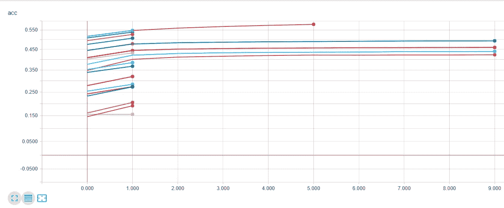
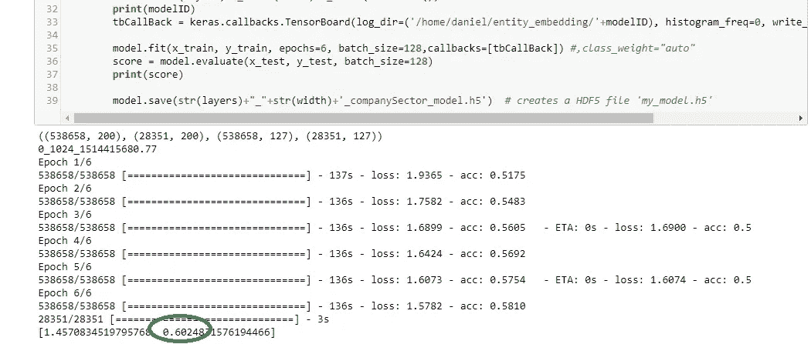
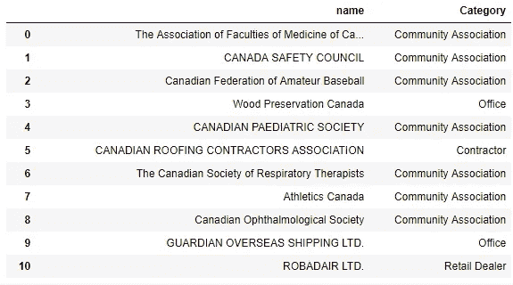

# 深度学习魔法:小企业类型

> 原文：<https://towardsdatascience.com/deep-learning-magic-small-business-type-8ac484d8c3bf?source=collection_archive---------4----------------------->


企业情报很难，NAICS 代码很糟糕。一些公司按行业购买公司列表，以保持他们的潜在客户数据库最新(例如 [D+B](http://www.dnb.com/ca-en/solutions/master-data/deepen-your-knowledge-of-business-entities.html) )。购买清单的主要问题是它们马上就过时了，而且它们不能很好地捕捉小公司的数据。我们如何使用机器学习来猜测一个小企业仅根据他们的企业名称做什么？

大企业通常在公司简介上标注得很好。我们可以从免费来源或商业级 API 获得这些，如彭博和路透社。甚至[的小型公司](https://www.moneyworks4me.com/best-index/top-stocks/top-small-cap-companies-list#)也有现成的数据。但是小企业没有被很好的记录。更糟糕的是，大多数企业都是小企业。让我们把注意力集中在小企业上，看看我们如何从它们的名字中猜出它们是做什么的。

作为一个人，你自动完成这项任务。你看到一家企业的名称“渥太华街角超市”，并根据你的经验得出结论，这是一家便利店。如何从公司名称转换成公司标签？我们认为一个很好的方法是在 Google Places API 中读取 [**类型**。事实证明，这是一个很好的数据源，但还不够好。对于谷歌没有标签的 80%+的小企业，我们能做什么？](https://developers.google.com/places/supported_types)

我们决定发布一个深度学习的 keras 模型来解决这个问题。DNN 模型在超过 500，000 个公司名称及其相关类别上进行了训练。您想要分类的公司名称被编码到一个 word2vec (gensim)单词嵌入模型中，该模型对大约 250 万个公司名称进行了训练。以下是我们训练模型识别的所有 127 个类别的列表:

我们做了大量的设计空间探索研究，以找出在我们的神经网络模型中使用的正确的层数和每层神经元数。



Trying various model hyperparameters in a shallow search yielded a 1024-neuron wide, 3-layer deep (input, hidden, output) DNN. The model we picked corresponds to the top pink line.



The model scored 60% on test data it never saw before. That’s pretty good for a 127 class classification problem.

原来宽浅才是这个模式要走的路。以下是一个示例数据集的结果:



以下是你如何得到这款机型的方法( [GitHub link](https://github.com/dcshapiro/smallCompanyType/) ):

```
git clone [https://github.com/dcshapiro/smallCompanyType.git](https://github.com/dcshapiro/smallCompanyType.git)
cd smallCompanyType/
pip3 install h5py
pip3 install keras --upgrade
pip3 install tensorflow --upgrade
python3 setup.py install
```

以下是您使用它的方法:

```
cd test
python3 test_text.py
python3 test_pandas.py
```

有趣的是，这里有一个视频展示了在 DigitalOcean 机器学习 droplet 上的成功安装。就是我之前贴的几篇文章里提到的一键安装镜像。

The [smallCompanyType](https://github.com/dcshapiro/smallCompanyType.git) package installs cleanly in a new VM. It depends on the latest sklearn, h5py, keras, numpy, and tensorflow. The tests use glob, pandas, and some more fun stuff.

你能把这个模型用于商业目的吗？是的。没有性能保证，但请继续。尝试一下，让我知道你的想法。

试用**拍手工具**。轻点那个。关注我们的[媒体](https://medium.com/@lemaysolutions)。分享这篇文章的链接，或者 GitHub repo 的链接。去吧。

编码快乐！

-丹尼尔
[丹尼尔@lemay.ai](mailto:daniel@lemay.ai) ←打个招呼。
[LEMAY . AI](https://lemay.ai)
1(855)LEMAY-AI

您可能喜欢的其他文章:

*   [人工智能和不良数据](/artificial-intelligence-and-bad-data-fbf2564c541a)
*   [人工智能:超参数](/artificial-intelligence-hyperparameters-48fa29daa516)
*   [人工智能:让你的用户给你的数据贴上标签](https://medium.com/towards-data-science/artificial-intelligence-get-your-users-to-label-your-data-b5fa7c0c9e00)