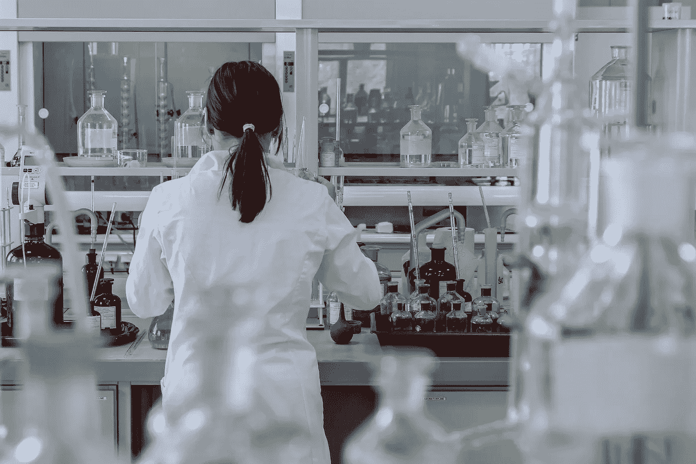

# 深度学习和医疗诊断

> 原文：<https://towardsdatascience.com/deep-learning-medical-diagnosis-c04d35fc2830?source=collection_archive---------5----------------------->

## 越来越多的领域正在将机器学习应用于基于医学成像的诊断。

在过去的几个月里，已经有许多研究发现宣布，声称深度学习已经被应用于某个特定的诊断领域，并且经常是*立即*胜过医生。

我最初开始写这篇博文是为了跟踪他们——我打算以草稿的形式发表这篇博文，并希望定期更新。

## 医学影像诊断中的深度学习试图做什么？

在深入研究具体结果之前，我想强调一下，下面的方法(到目前为止)具有相同的共同模式。我试着用下面一句话来概括:

> 通过机器学习的诊断*在病症可以被简化为对***生理数据的* ***分类任务*** *时起作用，在这些领域中，我们当前依赖于临床医生能够视觉上* ***识别指示病症的存在或类型的模式****

**把它分解成细节:**

*   ****分类**。结果是医学诊断的领域，可以简化为一个[分类问题](https://en.wikipedia.org/wiki/Statistical_classification):给定一些数据，诊断可以简化为将该数据映射到 N 个不同结果之一的问题。在某些情况下，N = 2:任务仅仅是识别数据(例如，x 射线)是否显示条件。请注意，还有其他问题(如图像分割)可以用深度学习来解决，但我还没有看到它们被单独使用*用于*诊断*(而不是，比如说，仅用于分析)。***
*   ****生理数据**。下面的结果倾向于使用医学成像数据或来自其他类型传感器的数据。这些领域结果的激增在很大程度上归因于数据集的创建(例如[这些数据集](http://www.radrounds.com/profiles/blogs/list-of-open-access-medical-imaging-datasets)),这些数据集远远大于以前可用的数据集。注释数据集(例如，标记 x 射线是否包含肿瘤)的一种常见方法是让一组临床医生给出他们的意见并核对响应。**
*   **我们依靠视觉识别模式。自动诊断系统的替代方案是让专业临床医生查看您的数据(也许与一些同行专家讨论一下)来确定结果。这一点抓住了为什么深度学习*应该在这一领域取得成功*:深度学习自动化了在这种“非结构化”数据中提取模式和学习关系的整个过程。还有很多深度学习的非医疗应用(如[人脸识别](https://en.wikipedia.org/wiki/DeepFace))也有类似的需求；正因为如此，技术已经相当成熟。事实上，甚至训练有素的医学图像模型现在也被开源。**

**对于该领域的优秀评论，请查看我在本文底部的参考资料部分添加的评论论文和博客文章。**

## **这种方法*而不是*应该在哪里起作用？**

**上面的模式让我们对这种方法*目前不适用的领域有了一些了解。*就像[这篇文章提到的](https://lukeoakdenrayner.wordpress.com/2016/11/27/do-computers-already-outperform-doctors/)一样，深度学习并没有告诉我们应该如何治疗患者，或者在治疗时他们会有多好。然而，与上述各点特别相关的是，有些领域:**

*   ****不是分类问题。**如果我们对疾病不够了解，我们就无法创建数据来训练任何算法。例如，有些情况没有很好理解的进展，可以列举成一组阶段。在这些情况下，建立一个可靠的模型来告诉我们患者处于哪个进展阶段将是非常具有挑战性的——因为我们不知道应该是哪个阶段。**
*   ****缺乏(或有主观)数据。**如果很少或没有数据，我们就无法训练模型。诚然，这种情况正在开始改变——有深度学习实验证明[从极小的数据集](https://medium.com/@radekosmulski/can-we-beat-the-state-of-the-art-from-2013-with-only-0-046-of-training-examples-yes-we-can-18be24b8615f)中学习。如果有数据，但其中的数据和/或模式是主观的(例如，痛苦或压力的瞬间体验)，那么我认为下面的方法需要重新设想。**
*   ****不依赖医疗器械**。类似地，无法通过将患者连接到某种机器并收集单个数据“样本”来得出诊断的领域(例如，需要长期跟踪或通过排除进行[诊断)。这可能是因为(a)我们还没有开发出一种检测疾病的方法——因此，如上所述，需要更多的基础研究，或者(b)我们还没有开发出可行的产品来进行长期、非侵入性的监测，以收集支持机器学习的数据。](https://en.wikipedia.org/wiki/Diagnosis_of_exclusion)**

# **医疗条件列表**

**我添加到这个列表的标准是:(a)一个数据集已经发布，(b)研究已经发表，(c)一个公司或研究小组已经写了关于进展中的工作，或者(d)有描述解决问题的博客文章。我已经按字母顺序把条件分类了。**

**我错过了什么吗？你可以在推特上 [@我，我来加。](https://twitter.com/neal_lathia)**

## **痴呆症**

**…”是一种慢性神经退行性疾病，通常开始缓慢，并随着时间的推移而恶化伦敦的研究人员[发表了一篇论文](https://arxiv.org/abs/1502.02506)，报告使用来自[ADNI](http://www.adni-info.org/Scientists/ADNIData.html)的数据来训练一个具有单一卷积层的三层神经网络，该网络可以预测[核磁共振扫描](https://en.wikipedia.org/wiki/Magnetic_resonance_imaging)是否是一个*健康的大脑*，一个有*轻度认知障碍的大脑*和一个有*老年痴呆症*的大脑。**

## **心律不齐**

**…”是一组心跳不规则的情况斯坦福大学的研究人员[发表了一篇论文](https://arxiv.org/abs/1707.01836)，报告称他们开发的 34 层卷积神经网络“在从单导联可穿戴监护仪记录的心电图中检测各种心律失常方面，超过了委员会认证的心脏病专家的性能”([项目页面](https://stanfordmlgroup.github.io/projects/ecg/)，[博客文章](https://blog.acolyer.org/2017/08/14/cardiologist-level-arrhythmia-detection-with-convolutional-neural-networks/))。**

## **孤独症**

**“是一种以社交互动受损为特征的神经发育障碍”一组研究人员[发表了一篇论文](https://www.ncbi.nlm.nih.gov/pmc/articles/PMC5336143/)，报告称“一种主要使用来自 6 个月和 12 个月大的大脑 MRI 的表面积信息的深度学习算法预测了自闭症高家族风险儿童的 24 个月自闭症诊断”(通过 [@datarequena](https://twitter.com/datarequena/status/938437786037825536) 在推特上)。**

## **乳腺癌**

**…“是一种从乳腺组织发展而来的癌症[。DeepMind Health](https://en.wikipedia.org/wiki/Breast_cancer) 发布了[一篇博客帖子](https://deepmind.com/blog/applying-machine-learning-mammography/) t，其中他们宣布他们已经与英国癌症研究所合作，对来自 7500 名女性的匿名[乳房 x 光片](https://en.wikipedia.org/wiki/Mammography)进行分析并应用机器学习。**

## **牙洞**

**…”是由于细菌产生的酸而导致的牙齿[损坏](https://en.wikipedia.org/wiki/Tooth_decay) [ParallelDots](https://paralleldots.xyz/) 的研究人员已经[发表了一篇论文](https://arxiv.org/abs/1711.07312v2)报道了一个 100+层的卷积网络对牙齿 x 光片进行像素级的二进制分类(有龋/无龋)。**

## **糖尿病视网膜病**

**…”是一种因糖尿病导致视网膜受损的[医学状况](https://en.wikipedia.org/wiki/Diabetic_retinopathy)。两年多前，有一场 [kaggle 竞赛](https://www.kaggle.com/c/diabetic-retinopathy-detection)，试图将眼睛的图像分为 5 类(从*无糖尿病视网膜病变*，到*轻度*，*中度*，*重度*，以及*增生性*)。获胜的解决方案使用了[稀疏卷积网络](https://github.com/facebookresearch/SparseConvNet)和随机森林的组合，从一对图像(左眼和右眼)对结果进行预测。**

## **革兰氏染色**

**…是否有一种[染色](https://en.wikipedia.org/wiki/Staining)的[方法](https://en.wikipedia.org/wiki/Gram_stain)用于区分和分类[细菌](https://en.wikipedia.org/wiki/Bacteria)种类为两大类这是一种实验室技术，在怀疑感染时对体液(如血液)进行检测。研究人员[发表了一篇论文](http://jcm.asm.org/content/early/2017/11/24/JCM.01521-17)(本文引用[)描述了使用卷积神经网络将显微镜图像分类为](https://www.digitaltrends.com/cool-tech/microscope-blood-infections-ai/)[革兰氏阳性](https://en.wikipedia.org/wiki/Gram-positive_bacteria)、[革兰氏阴性](https://en.wikipedia.org/wiki/Gram-negative_bacteria)和背景(无细胞)。在论文中，他们描述他们没有从零开始培养一个 CNN 他们为这个任务微调了 [Inception v3](https://arxiv.org/abs/1512.00567) 。**

## **肺癌**

**…”是一种以肺组织中不受控制的细胞生长为特征的恶性肿瘤这个 [2017 kaggle 竞赛](https://www.kaggle.com/c/data-science-bowl-2017#description)包括一组 [CT 扫描](https://en.wikipedia.org/wiki/CT_scan)的数据，目标是预测肺癌的可能性。这里有一些有趣的挑战，包括数据是三维的——[获奖解决方案](http://blog.kaggle.com/2017/06/29/2017-data-science-bowl-predicting-lung-cancer-2nd-place-solution-write-up-daniel-hammack-and-julian-de-wit/)的文章描述了一些有趣的解决方法。这篇[博客文章从临床的角度概述了这个竞赛](https://medium.com/@alexandrecadrin/lung-cancer-bridging-the-gap-between-medical-imaging-and-data-science-a92b0bb08fda)的一些局限性。另外，Enlitic 似乎也在研究一种肺癌筛查解决方案。**

## **甲真菌病**

**…”是指甲的[真菌感染](https://en.wikipedia.org/wiki/Onychomycosis)。正如[这条推文](https://twitter.com/DrLukeOR/status/954670235704901632)所指出的，韩国的研究人员[发表了一篇论文](http://journals.plos.org/plosone/article?id=10.1371/journal.pone.0191493#pone-0191493-t001)，报告称使用 CNN(VGG-19，ResNet-152)创建了一个训练数据集(例如，从临床照片中提取手和脚的图像)并将指甲分为六类(如下所示:(甲癣、指甲营养不良、甲松脱、黑甲、正常和其他),以实现“使用深度学习对甲癣的诊断准确性，优于大多数皮肤病的诊断准确性**

## **肺炎**

**“是肺部的一种炎症状态，主要影响称为肺泡的小气囊。”斯坦福大学的研究人员[发表了一篇论文](https://arxiv.org/abs/1711.05225)，报告称他们开发的 121 层卷积神经网络“可以在超过执业放射科医生的水平上从胸部 x 光片中检测肺炎”([项目页面](https://stanfordmlgroup.github.io/projects/chexnet/))。**

## **皮肤癌**

**…“是由于有能力侵入或扩散到身体其他部位的[异常细胞的发展](https://en.wikipedia.org/wiki/Skin_cancer)。”斯坦福大学的研究人员发表了一篇论文，报道了使用“皮肤科医生标记的 129，450 张临床图像的数据集，包括 3，374 张皮肤镜图像”，对 Inception v3 进行微调，以分类 757 种疾病类别通过不同的预测任务检查结果，准确率似乎与临床医生的分数相当。**

**…我相信这个名单会越来越长。**

# **参考资料和资源**

 **[## [1702.05747]医学图像分析中的深度学习调查

### 摘要:深度学习算法，特别是卷积网络，已经迅速成为一种选择方法…

arxiv.org](https://arxiv.org/abs/1702.05747)** ** [## 加速医学成像领域的深度学习

### 当前方法的概述，可公开获得的数据集，领域的方向，和机会…

medium.com](https://medium.com/the-mission/up-to-speed-on-deep-learning-in-medical-imaging-7ff1e91f6d71)  [## 医学成像中的深度学习:概述

### 机器学习(ML)被定义为一组自动检测数据中模式的方法，然后利用这些模式进行学习

www.ncbi.nlm.nih.gov](https://www.ncbi.nlm.nih.gov/pmc/articles/PMC5447633/)  [## 医学图像分析中的深度学习——science direct 综述

### 深度学习算法，特别是卷积网络，已经迅速成为一种方法学的选择…

www.sciencedirect.com](http://www.sciencedirect.com/science/article/pii/S1361841517301135)  [## albarquni/医学应用深度学习

### 面向医学应用的深度学习-医学图像分析的深度学习论文

github.com](https://github.com/albarqouni/Deep-Learning-for-Medical-Applications)**