# 深度学习遇上物理学:受限玻尔兹曼机器第一部分

> 原文：<https://towardsdatascience.com/deep-learning-meets-physics-restricted-boltzmann-machines-part-i-6df5c4918c15?source=collection_archive---------2----------------------->

## 受限玻尔兹曼机背后的理论——重组系统的有力工具

本教程是关于受限玻尔兹曼机器的两部分系列的第一部分，这是一种用于协作过滤的强大深度学习架构。在这一部分，我将介绍受限玻尔兹曼机背后的理论。第二部分由一个模型的实际实现的逐步指导组成，该模型可以预测用户是否喜欢一部电影。

> 实用的部分现在可以在[这里](/deep-learning-meets-physics-restricted-boltzmann-machines-part-ii-4b159dce1ffb)得到。

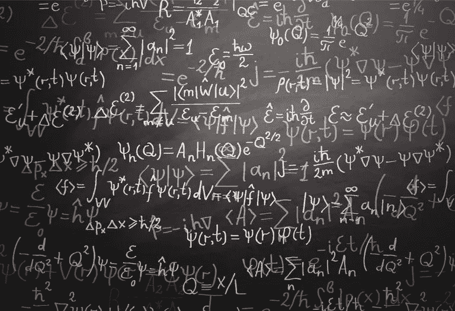

# 目录:

*   **0。简介**
*   **1。受限玻尔兹曼机器**
*   1.1 架构
*   1.2 基于能量的模型
*   1.3 概率模型
*   **2。使用受限玻尔兹曼机器的协同过滤**
*   2.1 识别数据中的潜在因素
*   2.2 利用潜在因素进行预测
*   **3。培训**
*   3.1 吉布斯采样
*   3.2 对比差异

## 如果你喜欢这篇文章，想分享你的想法，问问题或保持联系，请随时通过 LinkedIn 与我联系。

# 0.介绍

受限玻尔兹曼机器(RBM)是属于所谓的*基于能量的模型*的神经网络。这种类型的神经网络可能不像前馈或卷积神经网络那样为本文的读者所熟悉。然而，这种神经网络近年来在 Netflix 奖的背景下大受欢迎，RBM 在协同过滤方面取得了最先进的表现，并击败了大多数竞争对手。

# 1.受限玻尔兹曼机器

## **1.1 架构**

在我看来，RBM 是所有神经网络中最简单的架构之一。如图 1 所示，RBM 由一个输入/可见层(v1，…，v6)、一个隐藏层(h1，h2)和相应的偏置向量 Bias *a* 和 Bias *b* 组成。输出层的缺失是明显的。但是正如后面可以看到的，输出层是不需要的，因为预测的方式与常规前馈神经网络不同。

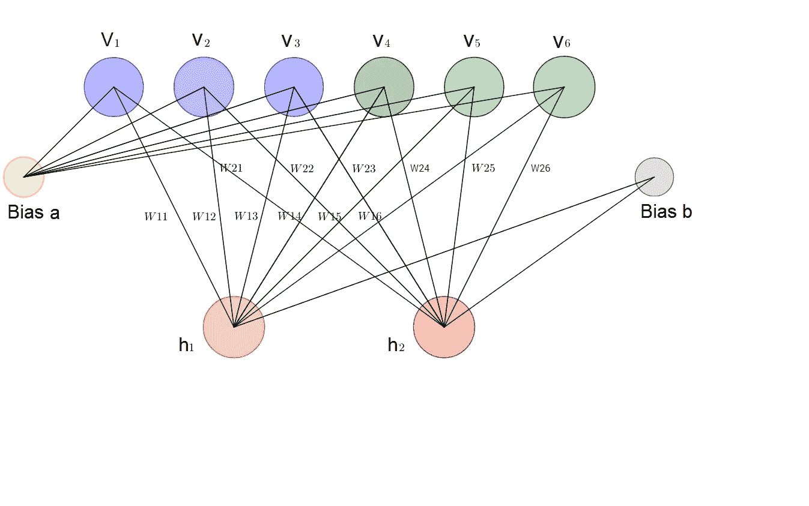

## **1.2 基于能源的模型**

能量是一个可能一开始就不会与深度学习联系在一起的术语。相反，能量是物理学的一个定量属性。重力能量描述了一个有质量的物体由于重力而相对于另一个大质量物体的势能。然而，一些深度学习架构使用能量的概念作为衡量模型质量的指标。

Fig. 2\. Gravitational energy of two body masses.

深度学习模型的一个目的是编码变量之间的依赖关系。通过将标量能量与变量的每个配置相关联来捕获依赖性，这用作兼容性的度量。高能量意味着差的兼容性。基于能量的模型总是试图最小化预定义的能量函数。RBMs 的能量函数定义为:

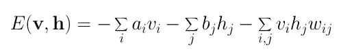

Eq. 1\. Energy function of a Restricted Boltzmann Machine

可以注意到，能量函数的值取决于可见/输入状态、隐藏状态、权重和偏差的配置。RBM 的训练在于寻找给定输入值的参数，使得能量达到最小。

## **1.3 一个概率模型**

受限玻尔兹曼机器是概率性的。与分配离散值相反，该模型分配概率。在每个时间点，RBM 都处于特定的状态。状态是指可见层和隐藏层的神经元的值 **v** 和 **h** 。可以观察到 **v** 和 **h** 的某一状态的概率由以下联合分布给出:

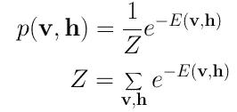

Eq. 2\. Joint Distribution for **v** and **h**.

这里 **Z** 被称为“配分函数”,它是所有可能的可见和隐藏向量对的总和。

这是受限玻尔兹曼机器第二次与物理学相遇的地方。这种联合分布在物理学中被称为[玻尔兹曼分布](https://en.wikipedia.org/wiki/Boltzmann_distribution)，它给出了在能量为 *E* 的状态下可以观察到粒子的概率。正如在物理学中我们分配一个概率来观察一个状态 **v** 和 **h，**这取决于模型的总能量。不幸的是，由于配分函数 **Z** 中 **v** 和 **h** 的大量可能组合，计算联合概率非常困难。给定状态 **v** 时状态 **h** 的条件概率以及给定状态 **h** 时状态 **v** 的条件概率的计算要容易得多:

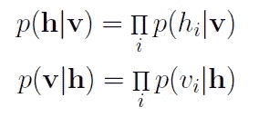

Eq. 3\. Conditional probabilities for **h** and **v**.

应该事先注意到(*在实际例子*上证明这个事实之前)RBM 中的每个神经元只能以 0 或 1 的二进制状态存在。最有趣的因素是隐藏或可见层神经元处于状态 1 的概率——因此被激活。给定输入向量 **v** ，单个隐藏神经元 *j* 被激活的概率为:

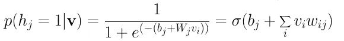

Eq. 4\. Conditional probability for one hidden neuron, given **v**.

这是 Sigmoid 函数。这个等式是通过将贝叶斯规则应用于等式 3 并进行大量扩展而得到的，这里不做介绍。

类似地，可见神经元 *i* 的二进制状态被设置为 1 的概率为:

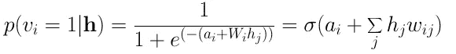

Eq. 5\. Conditional probability for one visible neuron, given **h**.

# **2。使用受限玻尔兹曼机器的协同过滤**

## **2。1 识别数据中的潜在因素**

让我们假设一些人被要求对一组电影进行 1-5 颗星的评分。在经典因素分析中，每部电影都可以用一组潜在因素来解释。例如，像《哈利·波特》*、《速度与激情》*、*这样的电影可能与*奇幻*和*动作*的潜在因素有很强的关联。另一方面，喜欢*玩具总动员*和*瓦力*的用户可能会对潜在的*皮克斯*因素产生强烈的联想。成果管理制被用来分析和找出这些潜在的因素。在训练阶段的一些时期之后，神经网络已经多次看到每个用户的训练数据集中的所有评级。此时，该模型应该已经基于用户偏好和所有用户的相应协作电影品味学习了潜在的隐藏因素。*

隐藏因素的分析以二进制方式进行。用户不是给模型用户连续的评级(例如 1-5 颗星)，而是简单地告诉他们是否喜欢(评级 1)特定的电影(评级 0)。二进制等级值表示输入/可见图层的输入。给定输入，人民币然后试图发现数据中的潜在因素，可以解释电影的选择。每个隐藏的神经元代表一个潜在的因素。给定一个由成千上万部电影组成的大数据集，很确定用户只观看和评价了其中的一小部分。有必要给尚未分级的电影也赋予一个值，例如-1.0，以便网络可以在训练时间期间识别未分级的电影，并忽略与它们相关联的权重。

让我们考虑下面的例子，其中用户喜欢*指环王*和*哈利波特*，但是不喜欢*黑客帝国*、*搏击俱乐部*和*泰坦尼克号*。《霍比特人》还没有被看过，所以它的评级是-1。给定这些输入，玻尔兹曼机器可以识别对应于电影类型的三个隐藏因素*戏剧*、*幻想*和*科幻*。

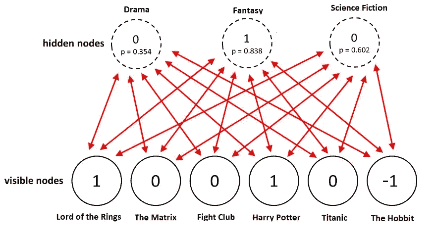

Fig. 3\. Identification of latent factors.

给定电影，人民币分配一个概率 **p(h|v)** (等式。4) 为每个隐藏神经元。神经元的最终二进制值是通过使用概率 **p** 从[伯努利分布](https://en.wikipedia.org/wiki/Bernoulli_distribution)中采样获得的。

在这个例子中，只有代表流派*幻想*的隐藏神经元被激活。给定电影分级，受限玻尔兹曼机器正确地识别出用户最喜欢幻想。

## **2.2 利用潜在因素进行预测**

在训练阶段之后，目标是预测尚未看过的电影的二进制评级。给定特定用户的训练数据，网络能够基于该用户的偏好识别潜在因素。由于潜在因素由隐藏的神经元表示，我们可以使用 **p(v|h)** (等式。5)并从伯努利分布中取样以找出哪些可见神经元现在变得活跃。

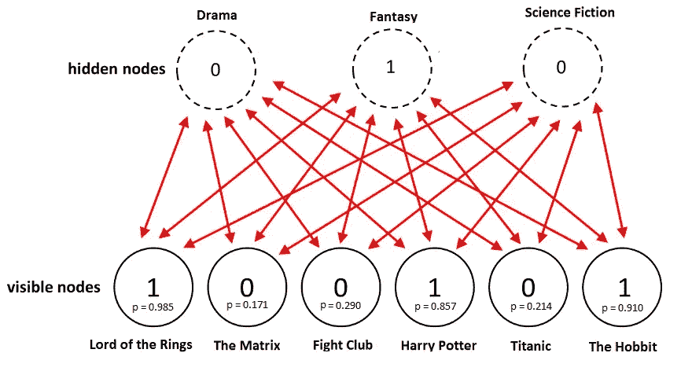

Fig. 4\. Using hidden neurons for the inference.

图 4 示出了在使用隐藏神经元值进行推断之后的新评级。电视网的确将《T32》奇幻片《T33》确定为首选电影类型，并将《霍比特人》评为用户喜欢的电影。

总之，从训练到预测阶段的过程如下:

1.  根据所有用户的数据训练网络
2.  在推理期间，获取特定用户的训练数据
3.  使用这些数据来获得隐藏神经元的激活
4.  使用隐藏神经元值获得输入神经元的激活
5.  输入神经元的新值显示了用户对尚未看过的电影的评价

# 3.培养

受限玻尔兹曼机器的训练不同于通过随机梯度下降的常规神经网络的训练。RBM 训练程序的偏差不在这里讨论。相反，我将给出两个主要训练步骤的简要概述，并建议本文的读者查阅关于[受限玻尔兹曼机器](https://www.cs.toronto.edu/~rsalakhu/papers/rbmcf.pdf)的原始论文。

## 3.1 吉布斯采样

训练的第一部分叫做*吉布斯采样*。给定输入向量 **v** ，我们使用 **p(h|v)** (等式 4)来预测隐藏值 **h.** 已知隐藏值，我们使用 **p(v|h)** (等式 5)来预测新的输入值 **v** 。这个过程重复 *k* 次。在 *k 次*迭代之后，我们获得了另一个输入向量 **v_k** ，它是从原始输入值 **v_0** 重新创建的。

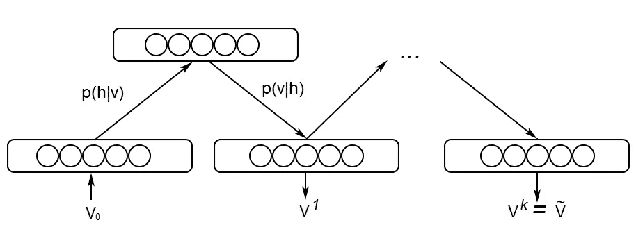

## 3.2 对比分歧

权重矩阵的更新发生在*对比发散*步骤期间。向量 **v_0** 和 **v_k** 用于计算隐藏值 **h_0** 和 **h_k** 的激活概率(等式 4)。这些概率的[外积](https://en.wikipedia.org/wiki/Outer_product)与输入向量 **v_0** 和 **v_k** 之间的差导致更新矩阵:

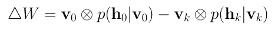

Eq. 6\. Update matrix.

使用更新矩阵，可以用梯度**上升、**计算新的权重，由下式给出:

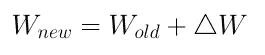

Eq. 7\. Update rule for the weights.

# 参考

1.  [https://www.cs.toronto.edu/~rsalakhu/papers/rbmcf.pdf](https://www.cs.toronto.edu/~rsalakhu/papers/rbmcf.pdf)
2.  【https://www.cs.toronto.edu/~hinton/absps/guideTR.pdf 