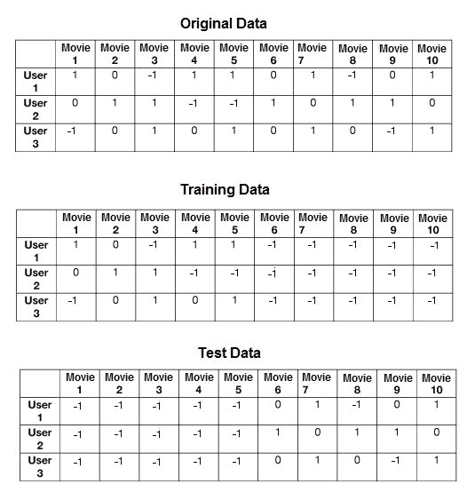
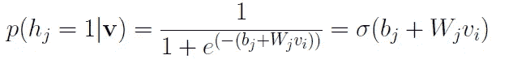
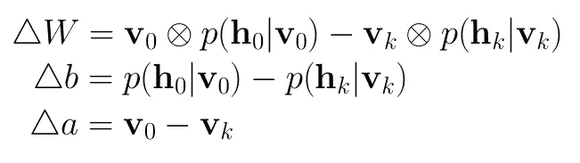
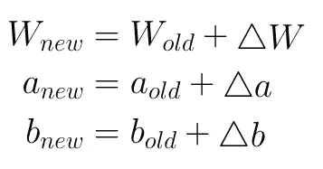

# 深度学习遇上物理学:受限玻尔兹曼机器第二部分

> 原文：<https://towardsdatascience.com/deep-learning-meets-physics-restricted-boltzmann-machines-part-ii-4b159dce1ffb?source=collection_archive---------5----------------------->

## 建造你自己的受限玻尔兹曼机器

**本文是****[**的续篇，第一部分**](/deep-learning-meets-physics-restricted-boltzmann-machines-part-i-6df5c4918c15) **在这里我介绍了受限玻尔兹曼机背后的理论。该第二部分包括通过受限玻尔兹曼机器的实际实现的逐步指导，该受限玻尔兹曼机器用作推荐系统，并且可以基于用户的喜好来预测用户是否喜欢电影。****

****

> **(1)在本文中，我不会涉及我所做的步骤背后的理论，我将只解释实际的部分。请务必通过复习本系列第一部分来更新您的理论知识。**
> 
> **(2)我在本文中展示的代码来自我在 GitHub 上的[项目资源库。因为我只关注模型的实现，所以我跳过了一些预处理步骤，比如将数据分成训练/测试集以及构建输入管道。可以在存储库中检查这些步骤。](https://github.com/artem-oppermann/Restricted-Boltzmann-Machine)**

## **先决条件**

*   ***Python* 3.6**
*   ***张量流* 1.5 或更高**
*   **1.11 或更高版本**

## **资料组**

**我们使用的是 [MovieLens 1M 数据集](https://grouplens.org/datasets/movielens/)。该集合包含由大约 6000 个用户制作的大约 4000 部电影的 100 万个评级。该模型将在这个数据集上进行训练，并将学习预测用户是否喜欢随机电影。数据集需要一些重新处理步骤。因为通常的受限玻尔兹曼机器只接受二进制值，所以有必要给等级 1-2 一个 0 值——因此用户不喜欢这部电影。相应地，等级 3-5 的值为 1。尚未分级的电影的值为-1。**

**在下一步中，转换后的原始数据被分成两个独立的训练和测试数据集。这是必要的两个完全相同的用户在两个数据集，但不同的电影评级。图 1 示出了将原始数据集划分成训练和测试数据的简单示例。在此示例中，前 5 个评级被放入训练集，而其余的用-1 屏蔽，表示尚未评级。相应地，测试集接收剩余的 5 个等级。**

**在训练时间期间，受限的 Boltzmann 机器学习每个用户的前 5 部电影评级，而在推断时间期间，该模型试图预测后 5 部电影的评级。然后，将这些预测的评级与放入测试集的实际评级进行比较。**

**两个数据集都以二进制 *TFRecords* 格式保存，这使得数据输入管道非常高效。**

****

**Fig. 1\. Partitioning of the data into training and test datasets.**

## **模型架构**

**该模型以面向对象的方式实现。受限玻尔兹曼机器是一个具有所有必要操作的类，如训练、丢失、精确、推理等。在里面。一些助手功能被外包到一个单独的脚本中。**

**构造函数为权重和偏差设置内核初始化器。在下一步中，网络中的所有权重和偏差都被初始化。权重呈正态分布，平均值为 0.0，方差为 0.02，而偏差在开始时都设置为 0.0。可以注意到，网络仅由一个隐藏层组成。结果，只需要一个权重矩阵。**

## ****采样隐藏的**状态**

****

**Eq. 1\. Probability that a hidden neuron is activated.**

**给定二进制输入 **v** ，下面的函数`_sample_h(self)` 获得隐藏神经元被激活的概率(等式 1)。这是通过将输入 **v** 乘以权重矩阵、添加偏置并应用 s 形激活来实现的。获得的概率用于从伯努利分布中采样。采样值 1.0 或 0.0 是隐藏神经元的状态。**

## ****可视状态的采样****

****

**Eq. 2\. Probability that a visible neuron is activated.**

**给定隐藏状态 **h** ，我们可以使用这些来获得可见神经元活动的概率(等式 2)以及相应的状态值。这是在`_sample_v(self)`中实现的。**

## **吉布斯采样**

****

**Fig.2\. Gibbs Sampling.**

**训练的第一部分是一个叫做*吉布斯采样*的操作。简而言之，我们取一个输入向量 **v_0** 并用它来预测隐藏状态 **h_0** 的值。另一方面，隐藏状态用于预测新的输入状态 **v** 。这个过程重复 *k* 次。这个过程如图 2 所示。**

***吉布斯采样*在下面截取的代码中实现。迭代发生在 while 循环体中。体内重要的一步是`Vk=tf.where(tf.less(V,0),V,Vk)`。该操作确保在每次迭代中，对于每个 **v_k** ，为-1 的 **v** 中的评级(意味着还没有看过的电影)保持为-1。在 *k* 迭代之后，我们得到 **v_k** 和相应的概率 **p(h_k|v_k)。**连同 **v_0** 和 **h_0** 这些值可用于在下一个训练步骤中计算梯度矩阵。**

## **计算梯度**

**在前一步骤中获得的值可以用于计算梯度矩阵和梯度向量。根据等式计算梯度。3 是直截了当的。请注意，这个等式中的符号 **a** 和 **b** 分别代表隐藏的可见偏差，与我在代码中使用的不同符号形成对比。**

**唯一棘手的是 *TensorFlow* 1.5 不支持外积。但是这个问题可以通过临时整形和应用通常的点乘来解决。**

****

**Eq. 3\. Computation of gradients for the weights and biases.**

**注意，梯度的计算发生在 while 循环中。这仅仅是因为培训是小批量进行的。这意味着循环为小批量中的每个数据样本计算梯度，并将它们添加到先前定义的梯度占位符中。最后，梯度的总和除以小批量的大小。**

## **更新步骤**

**在计算梯度之后，所有的权重和偏差可以根据等式通过梯度上升来更新。4.对于这个过程，我们必须在`_update_parameter(self).`中创建一个赋值操作**

****

**Eq. 4\. Update step of the parameters through gradient ascent.**

**整个训练操作在名称范围“操作”下用`optimize(self)`方法计算。在此之下，执行更复杂的训练精度操作。基本上，该操作从*吉布斯采样* **期间获得的 **v_k** 中减去原始输入值 **v_0** 。**减法只发生在 **v_0** ≥ 0 时。在此之后，相减之和除以所有等级数≥ 0。准确度给出了训练期间正确预测的二进制电影分级的比率。**

## **推理**

**在推理时间期间，方法`inference(self)`接收输入 **v.** 该输入是特定用户的一个**训练**样本，用于激活隐藏的神经元(用户电影品味的潜在特征)。隐藏的神经元再次用于预测新的输入 **v** 。在最好的情况下，这种新的输入包括对已经存在的评级以及尚未评级的电影的评级的重新创建。**

**在 *TensorFlow* 会话之外，将做出的预测与相应的测试数据进行比较，以进行验证。**

****网络图****

**为了概述前面的步骤，这里是主网络图的定义和执行训练和推理步骤的会话的开始。**

## **模型的性能**

**在训练过程中，我们可以在训练集和测试集上检查准确性的进展。准确度给出了正确预测的二进制电影分级的比率。可以看出，在 6 个时期之后，如果用户喜欢或不喜欢随机电影，该模型正确预测的时间为 78%。**

```
epoch_nr: 0, batch: 50/188, acc_train: 0.721, acc_test: 0.709
epoch_nr: 1, batch: 50/188, acc_train: 0.767, acc_test: 0.764
epoch_nr: 2, batch: 50/188, acc_train: 0.772, acc_test: 0.773
epoch_nr: 3, batch: 50/188, acc_train: 0.767, acc_test: 0.725
epoch_nr: 4, batch: 50/188, acc_train: 0.768, acc_test: 0.717
epoch_nr: 5, batch: 50/188, acc_train: 0.772, acc_test: 0.769
epoch_nr: 6, batch: 50/188, acc_train: 0.774, acc_test: 0.771
epoch_nr: 7, batch: 50/188, acc_train: 0.779, acc_test: 0.780
```

## **参考**

**[https://github . com/artem-opper Mann/Restricted-Boltzmann-Machine/blob/master/readme . MD](https://github.com/artem-oppermann/Restricted-Boltzmann-Machine/blob/master/README.md)**