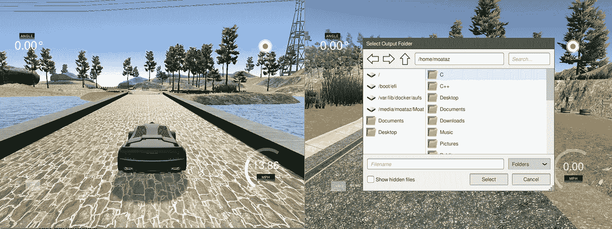
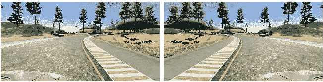
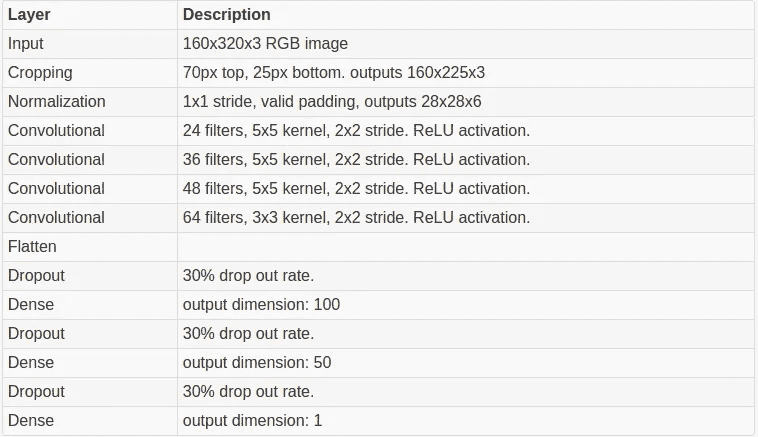
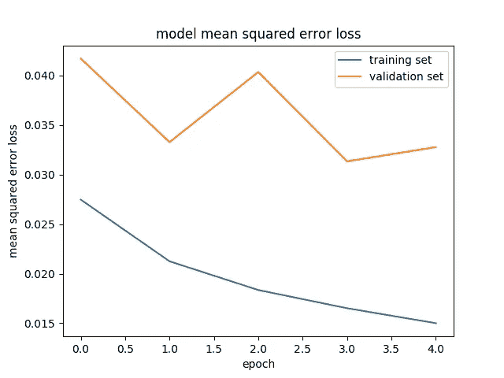

# 汽车模拟器上的深度学习

> 原文：<https://towardsdatascience.com/deep-learning-on-car-simulator-ff5d105744aa?source=collection_archive---------6----------------------->

这个项目的代码可以在: [Github](https://github.com/Moataz-E/nvidia-network-deeplearning) 上找到。
这篇文章也可以在我的网站[这里](http://www.moatazelmasry.com/projects/nvidia-deep-learning-car-simulator/)找到。

在 [udacity 自动驾驶汽车工程师课程](https://eu.udacity.com/course/self-driving-car-engineer-nanodegree--nd013)的第三个项目中，我使用了课程组织者提供的汽车模拟器来收集预期驾驶行为的数据，然后使用这些数据来训练深度学习 CNN 模型( [NVIDIA 卷积神经网络架构](https://devblogs.nvidia.com/deep-learning-self-driving-cars/))在模拟环境中驾驶汽车。

该项目包括以下几个阶段:

1.  通过在模拟器周围驾驶汽车来收集训练数据。
2.  实现 NVIDIA 神经网络。
3.  训练和测试模型性能。

# 收集培训数据

模拟器可以在两种模式下运行:训练模式和自主模式。

在训练模式中，用户使用转向角、油门和刹车来控制汽车的移动。你可以用键盘或鼠标控制汽车。在训练模式下，你可以点击记录键，模拟器将开始保存驾驶数据到一个特定的位置。行驶数据包括来自汽车左、右和前摄像机(160x320x3 尺寸)的每幅图像，以及相应的转向、油门和刹车测量值。

Figure 1\. Left: center lane driving on simulator. Right: record mode in simulator.

为了收集训练数据，汽车在训练模式下使用中心车道驾驶行为绕赛道行驶两圈。然后，通过在弯道周围的选择性驾驶行为进一步加强数据，以解决转向过度和转向不足的问题，这使得模型能够学习在这些弯道周围行驶所需的更大转向角度。

从训练运行中总共收集了 7，098 个数据点。通过水平翻转图像并找到转向角的附加倒数来执行进一步的增强。扩充后，数据点的总数增加了一倍，达到 14，196 点。

Figure 2\. Left: view from right side camera. Right: flipped image.

# 实施 NVIDIA 神经网络

对于这个项目，使用了 [Keras](https://keras.io/) 深度学习库。

作为初始模型，我实现了一个只有一个卷积层和一个密集连接层的神经网络。转向角是作为模型输出的唯一测量值；油门和制动测量的增加增加了驾驶行为的噪音。这种基本模型能够在赛道的直道段保持汽车在道路上行驶，但无法在弯道处正确驾驶汽车。

为了改进我的解决方案，我决定使用他们的开发者博客上描述的 NVIDIA 神经网络架构。引自[他们的文章](https://devblogs.nvidia.com/deep-learning-self-driving-cars/):

> *在一项新的汽车应用中，我们使用卷积神经网络(CNN)将来自前置摄像头的原始像素映射到自动驾驶汽车的转向命令。这种强大的端到端方法意味着，通过最少的人类训练数据，系统可以在当地道路和高速公路上学习驾驶，无论有没有车道标志。*

以下是取自他们博客的 NVIDIA 神经网络架构图:

Figure 3\. NVIDIA’s CNN Architecture (source: [link](https://devblogs.nvidia.com/deep-learning-self-driving-cars/))

上面的 NVIDIA 神经网络由 9 层组成:1 个归一化层，5 个卷积层，3 个全连接层。

**我对 CNN 的实现略有不同，我总共有 12 层:1 个裁剪层，1 个归一化层，4 个卷积层，3 个分离层，3 个全连接层。**

裁剪图层被用来移除场景(树、水等)..)从输入数据中提取，以便模型可以关注道路特征。输入图像从顶部裁剪 70 像素，从底部裁剪 25 像素。此外，根据多伦多大学研究员 Nitish Srivastava 题为 [dropout:一种防止神经网络过度拟合的简单方法](http://jmlr.org/papers/volume15/srivastava14a.old/srivastava14a.pdf)的论文的建议，添加了 Dropout 层以减少过度拟合。

下面是每一层的详细描述:

Figure 4\. Description of layers used in neural network.

而下面是以上各层在 Keras 中的代码实现:

# 培训和测试性能

训练数据被拆分，80%的数据用于训练，20%的数据用于验证。数据在分割前被打乱。所用的性能指标是均方误差损失，目的是尽可能将其最小化。

经过实验，我发现训练模型的理想时期数是 5 个时期，大于 10 个时期会过度拟合模型。

使用 [adam 优化器](https://arxiv.org/pdf/1412.6980v8.pdf)对模型进行拟合，因此不必手动调整学习速率。

下图显示了每个历元的训练集和验证集的均方误差损失:

Figure 5\. model mean squared error loss for deep learning model.

正如预期的那样，训练集和验证集的均方误差损失随着模型被训练的次数(时期)而降低。

在训练过程结束时，该模型能够在不离开道路的情况下，在赛道上自主驾驶车辆。以下是模型运行的视频: