# 边缘的深度学习

> 原文：<https://towardsdatascience.com/deep-learning-on-the-edge-9181693f466c?source=collection_archive---------5----------------------->

## 在移动和边缘设备上执行深度学习的概述。

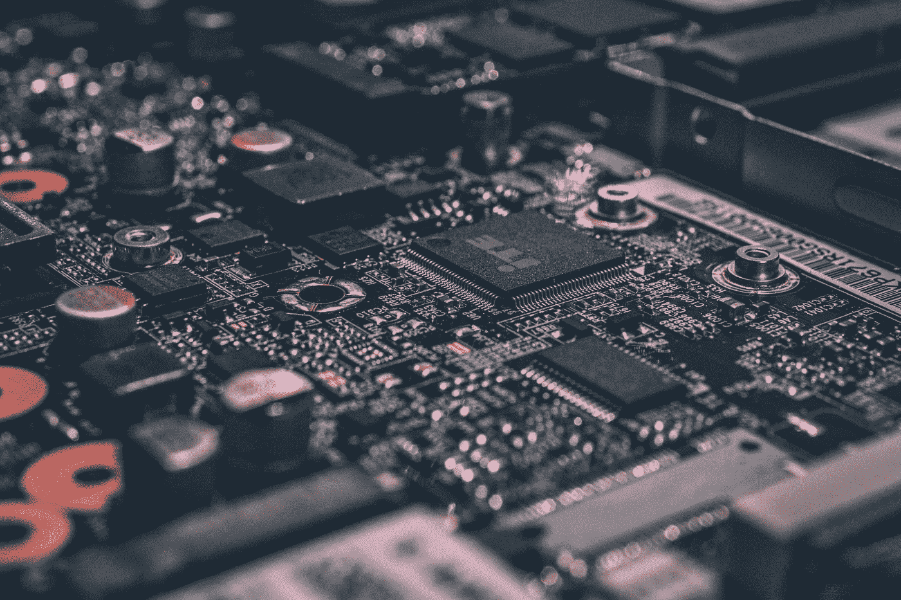

Photo by [Alexandre Debiève](https://unsplash.com/photos/FO7JIlwjOtU?utm_source=unsplash&utm_medium=referral&utm_content=creditCopyText) on [Unsplash](https://unsplash.com/search/photos/electronics?utm_source=unsplash&utm_medium=referral&utm_content=creditCopyText)

可扩展的深度学习服务取决于几个约束。根据您的目标应用，您可能需要低延迟、增强的安全性或长期成本效益。在这种情况下，将深度学习模型托管在云上可能不是最佳解决方案。

Computing on the Edge ([Source](https://www.ptgrey.com/edge-computing))

**边缘深度学习**缓解了上述问题，并提供了其他好处。这里的 Edge 指的是在消费者的产品上本地执行的计算。这篇博客探讨了使用边缘计算进行深度学习的**好处**，以及与之相关的**问题**。

# 为什么是 edge？为什么不用云呢？

有太多令人信服的理由支持边缘计算而不是云计算。

## 1.带宽和延迟

毫无疑问，对远程服务器的 API 调用有一个有形的往返时间(RTT)。要求近乎即时推断的应用程序无法在这种延迟下正常运行。

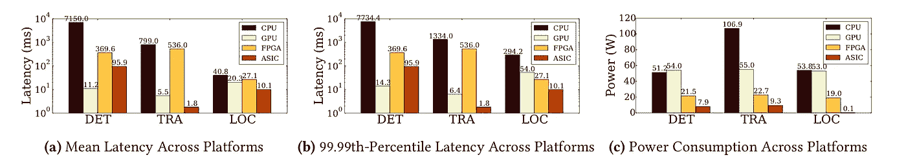

Latency and Power consumption stats for Object Detection (DET), Tracking (TRA) and Localization (LOC) on four different edge devices ([Source](https://blog.acolyer.org/2018/04/20/the-architectural-implications-of-autonomous-driving-constraints-and-acceleration/))

以**自动驾驶汽车**为例。足够大的**潜伏期**会显著增加事故的**风险**。此外，意外事件，如动物穿越或 jay walking 可能发生在短短几帧。在这些情况下，响应时间极其重要。这就是为什么 Nvidia 让他们定制的[板载计算设备](https://www.nvidia.com/en-us/self-driving-cars/drive-platform/)在边缘执行推理。

此外，当大量设备连接到同一个网络时，有效带宽会减少。这是因为使用通信信道的固有竞争。如果在边缘上进行计算，这可以显著减少。

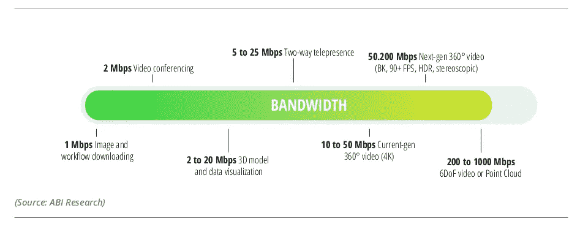

Bandwidth requirement for various applications. ([Source](https://siliconupdates.blogspot.com/2017/07/augmented-reality-and-virtual-reality.html))

以在多台设备上处理 4K 高清视频为例。在本地处理它们将大大节省带宽的使用。这是因为我们不需要将数据上传到云中进行推断。因此，我们可以相对容易地扩展这个网络。

## 2.安全和权力下放

商业服务器容易受到攻击和黑客攻击。当然，如果您使用可信的供应商，风险可以忽略不计。但是，为了您收集的数据和您的知识产权(IP)的安全，您需要信任第三方。边缘设备让你对你的 IP 拥有绝对的控制权。

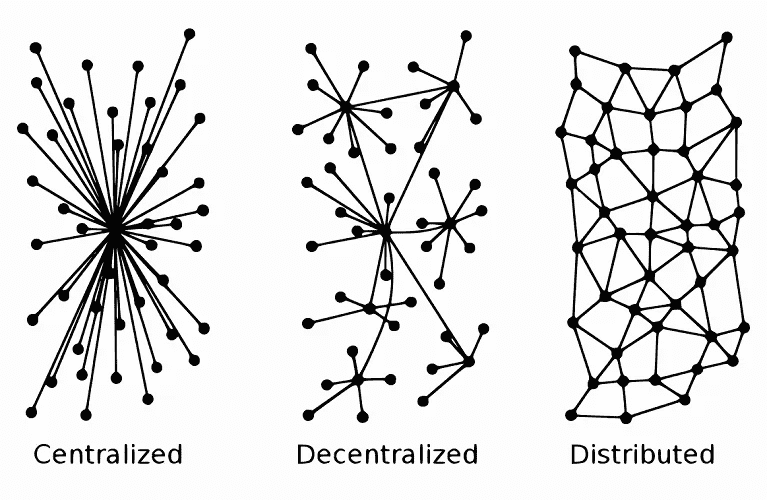

Centralized vs Decentralized vs Distributed. ([Source](https://blog.ethfinex.com/the-significance-of-decentralisation-b7f72655484e))

如果你听说过区块链，你可能对分权或分配很熟悉。尽管如此，在边缘拥有几个设备可以获得去中心化的所有好处。使用**单一 DDoS 攻击**来摧毁整个隐藏设备网络**比中央服务器更难**。这对于使用无人机进行边境巡逻等应用尤其有用。

## 3.特定于工作的用途(定制)

想象一下，你有一个生产玩具的工厂。它有几百个工作站。每个工作站都需要图像分类服务。问题是，每个工作站都有一组不同的对象，训练单个分类器可能是无效的。此外，在**云**上托管**多分类器**将会**昂贵**。

成本有效的解决方案是训练针对云上每个部分的分类器，并将**训练的模型**运送到**边缘设备**。现在，这些设备是为他们的工作站定制的。它们将比在所有工作站上预测的分类器具有更好的性能。

## 4.群体智能

继续上面提到的想法，边缘设备也可以帮助训练机器学习模型。这对于**强化学习**特别有用，你可以在**并行**中模拟大量的“情节”。

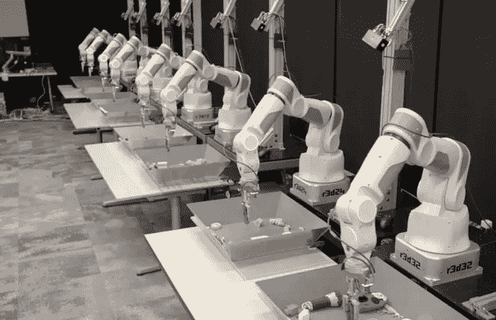

Multiple agents trying to grasp objects. ([Source](http://robohub.org/deep-learning-in-robotics/))

此外，边缘设备可用于收集数据，用于**在线学习**(或**继续学习**)。例如，我们可以使用多架无人机来勘测一个区域进行分类。使用诸如异步 SGD 之类的优化技术，可以在所有边缘设备中并行**训练单个模型**。它也可以仅仅用于聚集和处理来自各种来源的数据。

## 5.裁员

冗余对于强健的内存和网络架构极其重要。网络中一个节点的故障会对其他节点产生严重影响。在我们的例子中，边缘设备可以提供很好的冗余度。如果我们的一个边缘设备(这里是一个节点)发生故障，它的邻居可以暂时接管。这极大地确保了可靠性，并大大减少了停机时间。

## 6.从长远来看，成本效益高

从长远来看，云服务将比拥有一套专用的推理设备更加昂贵。如果您的设备具有较大的占空比(也就是说，它们大部分时间都在工作)，这一点尤其正确。此外，如果批量生产，边缘设备会便宜得多，从而显著降低成本。

# 边缘深度学习的限制

**深度学习**模型以**大**和**计算昂贵**而闻名。将这些模型安装到通常具有节省内存的边缘设备中是一个挑战。有许多方法可以解决这些问题。

## 1.参数有效的神经网络

神经网络的一个显著特征是其庞大的规模。边缘设备通常不能处理大型神经网络。这促使研究人员在保持准确性的同时，最小化神经网络的规模。两种流行的参数高效神经网络是 [MobileNet](https://arxiv.org/abs/1704.04861) 和 [SqueezeNet](https://arxiv.org/abs/1602.07360) 。

**SqueezeNet** 采用了许多策略，如后期下采样和滤波器数量减少，以在低参数数量下获得高性能。他们引入了具有“挤压”和“扩展”层的“点火模块”,优化了网络的参数效率。

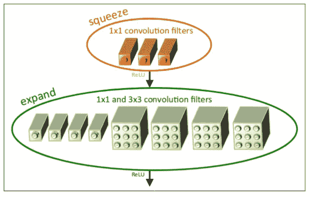

Fire module in the SqueezeNet. ([Source](https://arxiv.org/pdf/1602.07360.pdf))

**MobileNet** 将普通卷积分解为深度方向卷积和 1x1 卷积的组合。这种安排大大减少了所涉及的参数数量。

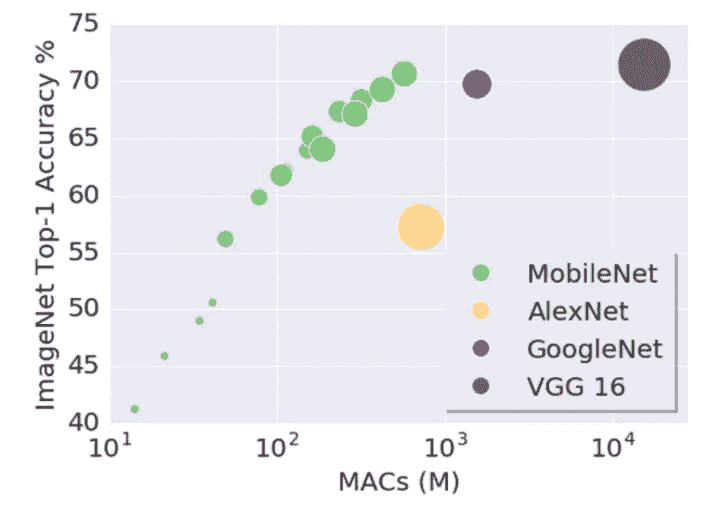

Top 1 accuracy in the ImageNet dataset with respect to number of Multiply-Accumulates (MACs). ([Source](https://ai.googleblog.com/2017/06/mobilenets-open-source-models-for.html))

## 2.修剪和截断

经过训练的网络中的大量神经元是良性的，对最终的准确性没有贡献。在这种情况下，我们可以**修剪**这样的神经元来节省一些空间。谷歌的 [Learn2Compress](https://ai.googleblog.com/2018/05/custom-on-device-ml-models.html) 发现，我们可以通过因子 2 获得**大小** **缩减，同时保留 97%的准确率。**

而且，大多数神经网络参数都是 32 位浮点值。另一方面，边缘设备可以被设计为在 8 位值或更少的值上工作。降低精度可以显著减小模型大小。例如，将 **32 位型号**减少到 **8 位型号**理想情况下会将型号大小减少到**的 4 倍**。

## 3.蒸馏

蒸馏是使用更大的“教师”网络来教授更小的网络的过程。谷歌的 [Learn2Compress](https://ai.googleblog.com/2018/05/custom-on-device-ml-models.html) 在他们的尺寸缩减过程中融入了这一点。结合迁移学习，这成为一种在不损失太多准确性的情况下减少模型大小的强大方法。

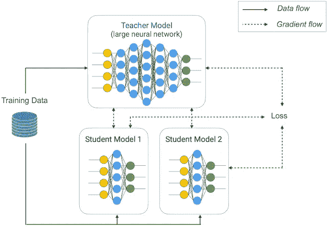

Joint training and distillation approach to learn compact student models. ([Source](https://ai.googleblog.com/2018/05/custom-on-device-ml-models.html))

## 4.优化的微处理器设计

到目前为止，我们已经讨论了缩小神经网络以适应我们的边缘设备的方法。一种替代(或补充)方法是提升微处理器的性能。

最简单的解决方案是在微处理器上安装 GPU，比如广受欢迎的 Nvidia Jetson T1。然而，当大规模部署时，这些设备可能不具有成本效益。

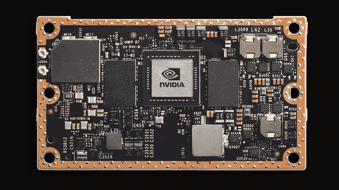

Nvidia Jetson ([Source](https://developer.nvidia.com/embedded/buy/jetson-tx2))

一个更有趣的解决方案是使用视觉处理单元(vpu)。英特尔声称他们的 Movidius VPUs 具有“超低功耗的高速性能”。谷歌的 [AIY 套件](https://www.movidius.com/news/google-launches-aiy-vision-kit-featuring-intel-movidius-vpu)和英特尔的[神经计算棒](https://www.movidius.com/news/intel-movidius-neural-compute-stick-honored-with-ces-best-of-innovation-award-2018)内部使用这种 VPU。

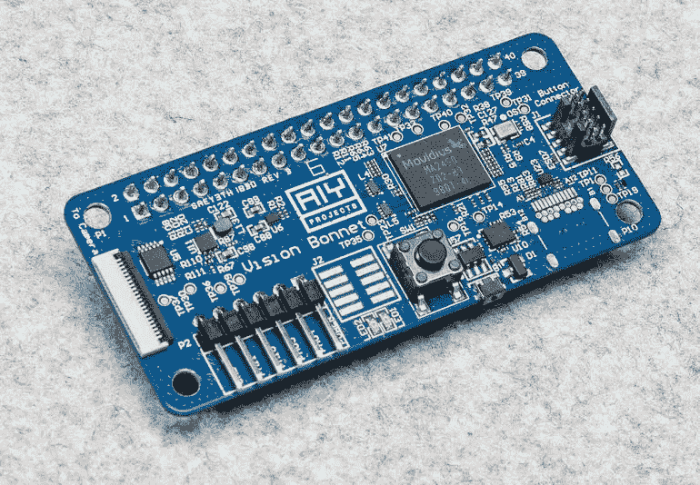

Google AIY’s Vision Bonnet using a Movidius VPU. ([Source](https://www.zdnet.com/article/google-offers-raspberry-pi-owners-this-new-ai-vision-kit-to-spot-cats-people-emotions/))

或者，我们可以使用 FPGAs。它们比 GPU 具有更低功耗，且可以适应更低位(< 32 位)的架构。然而，由于其较低的 FLOPs 等级，与 GPU 相比，性能可能会略有下降。

对于大规模部署，定制 ASICs 将是最佳解决方案。制造类似 Nvidia V100 的微架构来加速矩阵乘法可以大大提高性能。

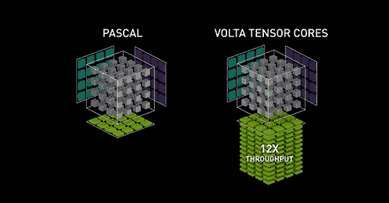

Pascal vs Volta architecture; Nvidia. ([Source](https://www.nvidia.com/en-us/data-center/tensorcore/))