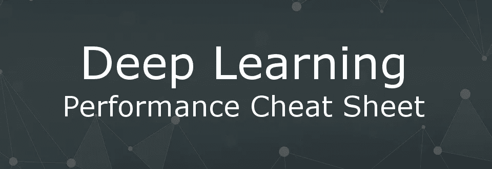
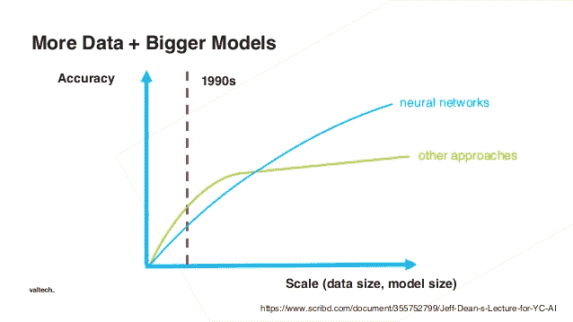

# 深度学习性能备忘单

> 原文：<https://towardsdatascience.com/deep-learning-performance-cheat-sheet-21374b9c4f45?source=collection_archive---------5----------------------->

## 简单和复杂的技巧可以帮助您提高深度学习模型的准确性

我从新的和有经验的机器学习工程师那里得到最多的问题是“我如何才能获得更高的准确性？”

很有意义，因为机器学习对商业最有价值的部分通常是它的预测能力。提高预测的准确性是从现有系统中获取更多价值的简单方法。

该指南将分为四个不同的部分，每个部分都有一些策略。

*   数据优化
*   算法调整
*   超参数优化
*   全体，全体，全体

并不是所有的这些想法都会提高性能，你将会看到你对同样的问题应用的越多，回报就越有限。试了几个之后还是卡住了？这表明你应该重新思考你的业务问题的核心解决方案。这篇文章只是一个备忘单，所以我将在每一节中为您链接更详细的信息来源。

# 数据优化

## 平衡您的数据集

对于表现不佳的深度学习模型，提高性能的最简单方法之一是平衡数据集，如果你的问题是分类。现实世界的数据集往往是倾斜的，如果你想要最好的准确性，你就希望你的深度学习系统学习如何根据特征在两个类别之间进行选择，而不是通过复制其分布

常见的方法包括:

*   **二次抽样多数类:**您可以通过二次抽样多数类来平衡类分布。
*   **过采样少数民族:**替换采样可以用来增加你的少数民族比例。

[这里有一篇很好的文章，更详细地介绍了这个问题](http://amsantac.co/blog/en/2016/09/20/balanced-image-classification-r.html)

## 更多数据

我们很多人都熟悉这个图表。它显示了深度学习和经典机器学习方法的数据量和性能之间的关系。如果你不熟悉这个图表，那么这个教训是清楚而直接的。如果您希望模型具有更好的性能，则需要更多的数据。根据您的预算，您可能会选择创建更多的标记数据或收集更多的未标记数据，并更多地训练您的特征提取子模型。

**开源贴标软件**

*   [图片](https://github.com/Labelbox/Labelbox)
*   [音频](http://www.fon.hum.uva.nl/praat/)
*   [视频](http://www.anvil-software.org/)

## 生成更多数据

或者假装，直到你成功。一个经常被忽视的提高准确性的方法是从你已经有的数据中创建新的数据。以照片为例；工程师通常会通过旋转和随机移动现有图像来创建更多图像。这种变换还增加了训练集的减少的过拟合。

[为图像问题创建更多数据的优秀资源](https://medium.com/nanonets/how-to-use-deep-learning-when-you-have-limited-data-part-2-data-augmentation-c26971dc8ced)

# 算法调整

## 复制研究人员

你正在解决一个背后有大量研究的问题吗？你很幸运，因为 100 个工程师可能已经对如何获得这个问题的最佳精度进行了大量思考。

阅读一些关于这个主题的研究论文，记下他们用来获得结果的不同方法！他们甚至可能有一个代码的 git-hub 供您使用。

[谷歌学术](https://scholar.google.com/)是开始搜索的绝佳地点。他们还提供许多工具来帮助你找到相关的研究。

对于研究论文的存储和组织，我使用[门德利](https://www.mendeley.com/)

接收每周人工智能研究论文，资源和趋势。免费订阅 [AI 书生](https://www.getrevue.co/profile/educateAI)

## 算法抽查

不要让你的自负战胜你。不可能知道哪种机器学习算法最适合你的问题。每当我着手解决一个新问题时，在没有太多研究的情况下，我会寻找一些可用的方法，并尝试所有的方法。深度学习(CNN 的，RNN 的等等。)和经典的机器学习方法(随机森林、梯度推进等)。)

对你所有实验的结果进行排序，对表现最好的算法加倍下注。

[看看选择机器学习算法的数据驱动方法](https://machinelearningmastery.com/a-data-driven-approach-to-machine-learning/)

# 超参数优化

## 学习率

亚当优化算法是可靠的。经常在所有深度学习问题上给出惊人的结果。即使它有极好的性能，它仍然会使你陷入问题的局部最小值。一个更好的算法是[带热重启的随机梯度下降](https://medium.com/38th-street-studios/exploring-stochastic-gradient-descent-with-restarts-sgdr-fa206c38a74e)，它具有 Adam 的优点，有助于消除陷入局部最小值的机会。

[这里有关于学习率的精彩报道](/estimating-optimal-learning-rate-for-a-deep-neural-network-ce32f2556ce0)

## 批次大小和时期数

一个标准的程序是对现代深度学习实现使用具有大量时期的大批量大小，但是共同的策略产生共同的结果。试验你的批次的大小和训练时期的数量。

## 提前停止

这是减少你的深度学习系统的泛化错误的一个极好的方法。持续训练可能会提高数据集的准确性，但在某个点上，它会开始降低模型对模型尚未看到的数据的准确性。要提高实际性能，请尝试提前停止。

[提前停车的例子](https://stats.stackexchange.com/questions/231061/how-to-use-early-stopping-properly-for-training-deep-neural-network)

## 网络体系结构

如果你想尝试一些更有趣的东西，你可以试试[高效神经架构搜索(ENAS)](https://github.com/carpedm20/ENAS-pytorch) 。该算法将创建一个定制的网络设计，最大限度地提高数据集的准确性，并且比 cloud ML 使用的标准神经架构搜索更有效。

## 正规化

停止过度拟合的一个健壮方法是使用正则化。

有几种不同的方法来使用正则化，你可以在你的深度学习项目中进行训练。如果你还没有尝试过这些方法，我会开始把它们包含在你做的每个项目中。

*   [**辍学**](https://www.quora.com/How-does-the-dropout-method-work-in-deep-learning-And-why-is-it-claimed-to-be-an-effective-trick-to-improve-your-network) **:** 他们在训练过程中随机关闭一定比例的神经元。辍学有助于防止神经元群体过度适应自己。
*   **重量惩罚 L1 和 L2:** 重量爆炸式增长可能是深度学习中的一个真正问题，并降低准确性。解决这个问题的一个方法是给所有的权重增加衰减。这些方法试图使网络中的所有权重尽可能小，除非有大的梯度来抵消它。除了经常提高性能之外，它还有使模型更容易解释的好处。

# 全体，全体，全体

在选择最佳型号时遇到困难？通常，您可以组合不同模型的输出，从而获得更高的准确性。每种算法都有两个步骤。

*   在原始数据的子集上产生简单 ML 模型的分布
*   将分布组合成一个“聚合”模型

## [组合模型/视图(Bagging)](https://hackernoon.com/how-to-develop-a-robust-algorithm-c38e08f32201)

在这种方法中，您对相同的数据训练几个不同的模型，这些模型在某些方面是不同的，然后对输出进行平均以创建最终输出。

装袋具有减少模型中方差的效果。你可以直观地把它想成是让不同背景的多个人思考同一个问题，但出发点不同。就像在团队中一样，这可能是获得正确答案的有力工具。

## [堆叠](https://en.wikipedia.org/wiki/Ensemble_learning#Stacking)

这类似于装袋，不同的是，你没有一个综合产量的经验公式。您创建了一个元级学习器，它基于输入数据选择如何权衡来自不同模型的答案，以产生最终输出。

# 还是有问题吗？

## 重构你的问题

停下来看看你的屏幕，喝杯咖啡。这个解决方案就是从头开始重新思考你的问题。我发现坐下来集思广益，找出解决问题的不同方法会有所帮助。也许从问自己一些简单的问题开始:

*   我的分类问题会变成回归问题还是反过来？
*   你能把你的问题分解得更小吗？
*   您收集的数据中是否有任何可能改变问题范围的观察结果？
*   你的二进制输出能变成 softmax 输出吗，反之亦然？
*   你是用最有效的方式来看待这个问题的吗？

反思你的问题可能是提高绩效的最难的方法，但它通常是产生最佳结果的方法。与在深度学习方面有经验的人聊天会有所帮助，可以让你对你的问题有新的看法。

***如果你想找人聊天，*** *我将在下个月抽出时间与你就你的项目进行 30 分钟的交谈。我对这 30 分钟的通话收取 5 美元，以此作为屏障，阻止那些不认真的人浪费我们的时间。*

## [报名一个时间段](https://calendly.com/cdossman/reframe-your-deep-learning-problem-with-chris)

# 感谢阅读:)如果你喜欢它，尽可能多的点击下面的按钮！这对我意义重大，鼓励我写更多这样的故事

*咱们也连线上* [*推特*](https://twitter.com/cdossman) *或者*[*LinkedIn*](https://www.linkedin.com/in/christopherdossman/)