# 深度学习；个人笔记 Part 1 第三课:CNN 理论；卷积过滤器，最大池，激活，softmax，sigmoid &提交结果给 Kaggle。

> 原文：<https://towardsdatascience.com/deep-learning-personal-notes-part-1-lesson-3-cnn-theory-convolutional-filters-max-pooling-dbe68114848e?source=collection_archive---------17----------------------->

随着我对快速人工智能[课程的第二次尝试，这个博客系列将会更新。](http://www.fast.ai/)以上是我的个人笔记；a 努力把事情理解清楚，解释好。没什么新意，只活出了这个 [*博客*](https://medium.com/@itsmuriuki/why-i-will-be-writing-about-machine-learning-and-deep-learning-57c68090f201) *。*

**快狗 Vs 猫**

这里是一个端到端的过程，以获得狗与猫的最先进的结果:

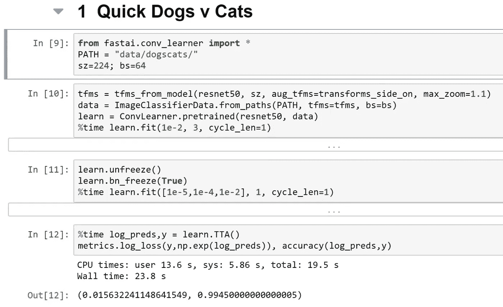

```
PATH = "data/dogscats/"
```

我们假设您的数据在`data`文件夹中。但是你可能想把它们放在别的地方。在这种情况下，你可以使用符号链接或简称符号链接。

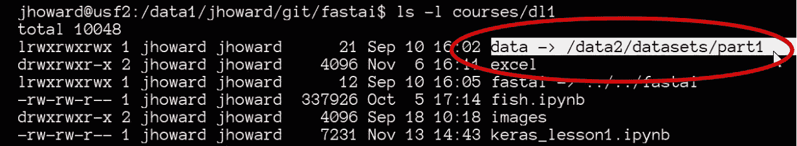

注意:我们没有设置`pre_compue=True`。这是一种快捷方式，可以缓存一些中间步骤，不必每次都重新计算，也可以省去。当`pre_compute=True`时，数据增强不起作用。

```
learn.unfreeze() 
learn.**bn_freeze**(**True**) 
%time learn.fit([1e-5, 1e-4,1e-2], 1, cycle_len=1)
```

`bn_freeze` —如果您正在使用更大更深的模型，如 ResNet50 或 ResNext101，即在与 ImageNet 非常相似的数据集上编号大于 34 的任何东西，即尺寸在 200-500 像素之间与 ImageNet 相似的标准对象的侧面照片，您应该添加此行。*它导致批量标准化移动平均值不被更新。*

## 使用其他库— Keras

就像 fast ai 坐在 pytorch 上面，keras 坐在 TensorFlow，MXNet，CNTK 等上面。

您需要安装 Keras 或 tensorflow 作为后端:

`pip install tensorflow-gpu keras`

进口:

```
import numpy as np
from keras.preprocessing.image import ImageDataGenerator
from keras.preprocessing import image
from keras.layers import Dropout, Flatten, Dense
from keras.applications import ResNet50
from keras.models import Model, Sequential
from keras.layers import Dense, GlobalAveragePooling2D
from keras import backend as K
from keras.applications.resnet50 import preprocess_input
```

数据路径:

```
PATH = "data/dogscats/"
sz=224
batch_size=64train_data_dir = f'{PATH}train'
validation_data_dir = f'{PATH}valid'
```

Keras 使用 train 文件夹和 validation 文件夹的概念，子文件夹带有标签名称。

Keras 需要更多的代码和设置更多的参数。

```
train_datagen = ImageDataGenerator(preprocessing_function=preprocess_input,
    shear_range=0.2, zoom_range=0.2, horizontal_flip=True)test_datagen = ImageDataGenerator(preprocessing_function=preprocess_input)train_generator = train_datagen.flow_from_directory(train_data_dir,
    target_size=(sz, sz),
    batch_size=batch_size, class_mode='binary')validation_generator = test_datagen.flow_from_directory(validation_data_dir,
    shuffle=False,
    target_size=(sz, sz),
    batch_size=batch_size, class_mode='binary')
```

不是创建一个单一的数据对象，而是在 Keras 中定义`DataGenerator`，它指定如何生成数据，还指定我们希望它做什么样的数据扩充(`shear_range=0.2, zoom_range=0.2, horizontal_flip=True)`以及做什么样的规范化(`preprocessing_function=preprocess_input)`)。换句话说，在 Fast.ai 中，我们可以只说“无论 ResNet50 需要什么，请为我这样做”，但在 Keras 中，您需要知道期望什么。没有标准的扩充集。

`train_generator` —通过从目录中查找、设置图像的大小以及小批量和小类的大小来生成图像。当训练时，你随机地重新排序图像，显示它们以不同的顺序显示，通过混洗使它们随机。

`class_mode= ‘binary’`——如果你有两个可能的输出，就用二进制，如果是倍数，就用`‘categorical’`

`train_generator` —通过从目录中查找、设置图像大小和小批量的大小来生成图像。

然后创建一个验证数据生成器`validation_generator`，这个生成器没有数据扩充。还要告诉它不要为了验证而打乱数据集，因为否则你无法跟踪你做得有多好。

## 创建模型

```
base_model = ResNet50(weights='imagenet', include_top=False)
x = base_model.output
x = GlobalAveragePooling2D()(x)
x = Dense(1024, activation='relu')(x)
predictions = Dense(1, activation='sigmoid')(x)
```

我们使用 ResNet50，因为 keras 没有 ResNet34。对于 keras，您不能告诉它创建一个适合特定数据集的模型。你必须用手来做。

首先创建一个`base_model`，然后构建你想要添加的层，即`x`，在这种情况下，我们添加 3 层。

## 冻结图层并编译模型

```
model = Model(inputs=base_model.input, outputs=predictions)for layer in base_model.layers: layer.trainable = Falsemodel.compile(optimizer='rmsprop', loss='binary_crossentropy', metrics=['accuracy'])
```

`layer.trainable=False` —循环浏览各层，并使用`.trainable = False`冻结

通过传递您想要使用的`optimizer`、要查找的`loss`和要使用的`metric`来编译模型。

## 适合的

```
%%time
model.fit_generator(train_generator, train_generator.n // batch_size, epochs=3, workers=4,
        validation_data=validation_generator, validation_steps=validation_generator.n // batch_size)
```

调用 fit_generator 并传递`train_generator` 和`validation _generator`

因为 keras 希望您告诉它每个时期有多少批，所以 bathes 的数量=大小是生成器除以批大小，告诉它有多少个时期，以及有多少个工人，即处理器。

## 微调

解冻一些层，编译，然后再次适合。

没有层组或差异学习率或部分取消冻结的概念，你必须打印出所有的层，并决定有多少你想要微调。我们从`140` 开始微调。

```
split_at = 140**for** layer **in** model.layers[:split_at]: layer.trainable = **False**
**for** layer **in** model.layers[split_at:]: layer.trainable = **True**model.compile(optimizer='rmsprop', loss='binary_crossentropy',
    metrics=['accuracy'])%%time
model.fit_generator(train_generator, train_generator.n // batch_size, epochs=1, workers=3,
        validation_data=validation_generator, validation_steps=validation_generator.n // batch_size)
```

微调后，你必须重新编译模型，然后拟合。

# 向 Kaggle 提交结果

在 kaggle 竞赛中，有一个称为评估的部分描述了如何对竞赛进行评估:

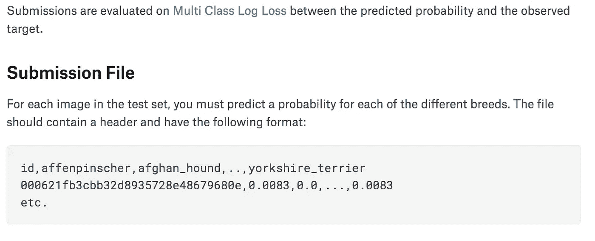

对于标签位于不同文件夹的数据集，使用`ImageClassifierData.from_paths`。如果您有带标签的 aCSV 文件，您可以使用`ImageClassifierData.from_csv`。

要创建提交，您需要使用:

`data.classes`:包含所有不同的类

`data.test_ds.fnames`:包含测试文件名

使用测试时间增加(TTA)是一个好主意。通过使用`is_test=True`,它将给出测试集的预测，而不是验证集的预测。

```
log_preds, y = learn.TTA(is_test=True) 
probs = np.exp(log_preds)
```

大多数 PyTorch 模型会给你返回预测的日志，所以你需要做`np.exp(log_preds)`来得到概率。

```
probs.shape #(n_images, n_classes(breeds))
(10357, 120)
```

将矩阵转换成 kaggle 格式，我们使用熊猫数据帧:

```
df = pd.DataFrame(probs)
df.columns = data.classes
```

创建一个熊猫数据框架并传递矩阵(`probs`)。将列名设置为`data.classes`

```
df.insert(0, 'id', [o[5:-4] for o in data.test_ds.fnames])
```

在零位置插入一个名为`id`的包含文件名的新列。这是文件名的样子。`test/ab2520c527e61f197be228208af48191.jpg’`。删除前 5 个和最后 4 个字母以获得 id。

查看数据帧:

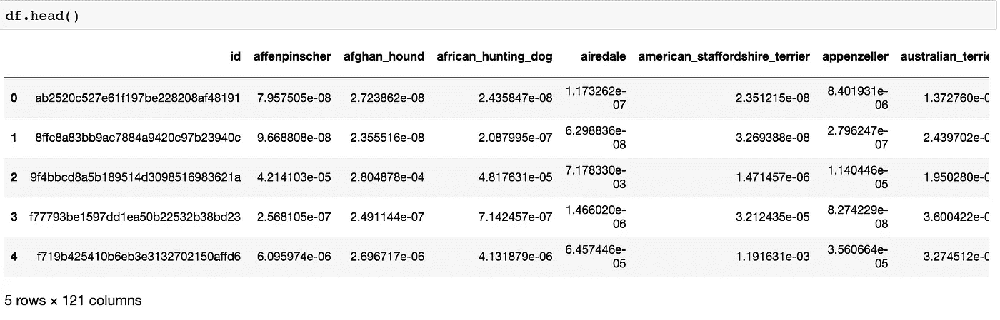

```
SUBM = f'{PATH}/subm/'
os.makedirs(SUBM, exist_ok=True)
df.to_csv(f'{SUBM}subm.gz', compression='gzip', index=False)
```

调用`df.to_csv`创建一个 CSV 文件，并使用`compression=’gzip’`对其进行压缩。这将文件保存到服务器。您可以使用 kaggle CLI 通过使用此命令`$ kg submissions`进行提交，或者使用`FileLink(f’{SUBM}subm.gz’)`将其下载到您的计算机并上传到 kaggle。这将为您提供一个链接，将文件从服务器下载到您的计算机上。

## 个体预测

通过模型运行单个图像以获得预测。

打开验证集中的第一个文件:

```
fn = data.val_ds.fnames[0]
fn
'train/000bec180eb18c7604dcecc8fe0dba07.jpg'
Image.open(PATH + fn).resize((150, 150))
```


运行预测:

```
trn_tfms, val_tfms = tfms_from_model(arch, sz)
im = val_tfms(open_image(PATH + fn)) # open_image() returns numpy.ndarray
preds = learn.predict_array(im[None])
np.argmax(preds)
```

这个形象必须改变。`tfms_from_model`返回定型转换和验证转换。在这种情况下，我们将使用验证转换。

传递给模型或从模型返回的所有东西通常都被认为是小批量的。这里我们只有一个图像，但是我们必须把它变成一个小批量的单个图像。换句话说，我们需要创建一个不只是`[rows, columns, channels]`而是`[number of images, rows, columns, channels]`的张量。通过使用`im[None]`索引到一个数组，在开始处添加一个额外的单位轴，从而将其从一个图像转换为一个小批量的图像。

# 卷积神经网络理论

这是一个卷积神经网络可视化视频，由 Word Lens 的优秀创作者奥塔维奥制作。

如果你输入一幅图像，计算机会把它们识别为数字(像素)。

## 输入层

7 号图像数据来自 [MNIST](http://yann.lecun.com/exdb/mnist/) 数据库，我们假设您使用[预训练模型](https://medium.com/coinmonks/deep-learning-personal-notes-part-1-lesson-1-f134cc8a7f2e)进行分类。

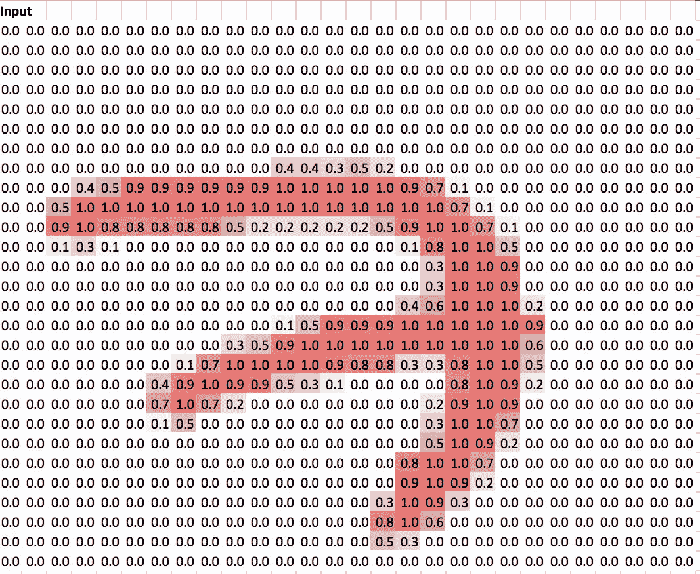

## 隐藏层 1

隐藏图层是对输入进行转换，以便从输出图层的数据中识别更复杂的要素，从而做出更好的评估。

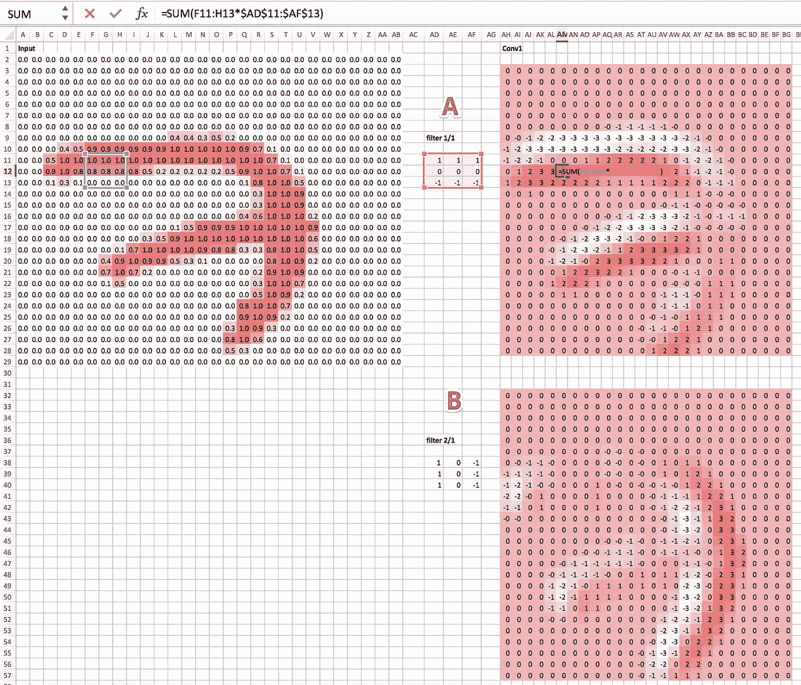

我们应用一个**过滤器/内核**来检测大部分 3×3 的水平边缘。注意，内核`A`顶部的`1’s`和中间的`0’s`以及底部的`-1’s`:

```
 1,   1,   1
 0,   0,   0
-1,  -1,  -1
```

如果滤波器与输入相乘，我们将为高数值分配高数值，因为它们与 1 相乘，而对低数值几乎不分配任何数值，因为它们与 0 或-1 相乘。因此，我们得到了称为 ***激活*** *的第一卷积的输出，它基本上是一个通过从输入中取出某个数字，然后应用某种线性运算(即卷积核)来计算输出(激活)的数字。*

Conv1 显示了对输入的 3x3 部分进行处理并乘以卷积内核后两者的激活情况。

我们假设网络经过训练，在训练结束时，它创建了一个[卷积滤波器](http://setosa.io/ev/image-kernels/)，其中有 9 个数字。

**卷积**在深度学习中，我们几乎总是有一个 3×3 的小矩阵，并将该矩阵的每个元素乘以图像的 3×3 部分的每个元素，然后将它们加在一起，以在一个点上获得卷积的结果。

让我们应用第二个卷积滤波器`B`，它也有 9 个数。滤镜`B`找到垂直边缘，作为隐藏层输出。

```
1,   0,  -1
1,   0,  -1
1,   0,  -1
```

Pytorch 不会将它们存储为两个独立的 9 位数组，而是将其存储为[张量](https://en.wikipedia.org/wiki/Tensor)。这是多维数组。额外的轴允许我们将额外的过滤器堆叠在一起。*滤镜和内核意思相同它指的是 3x3 矩阵。*


How convolution work: Activation -3 equals the sum of matrix product of the kernel and input

隐藏层(conv1)的大小为 2，因为它有 2 个过滤器/内核。

接下来，我们将应用另一个过滤器，即隐藏层 2 中的过滤器`C`，它是两个 2x3x3 内核，然后应用**校正线性单元(ReLu)** 来消除负像。从而创建第二隐藏层 conv2。

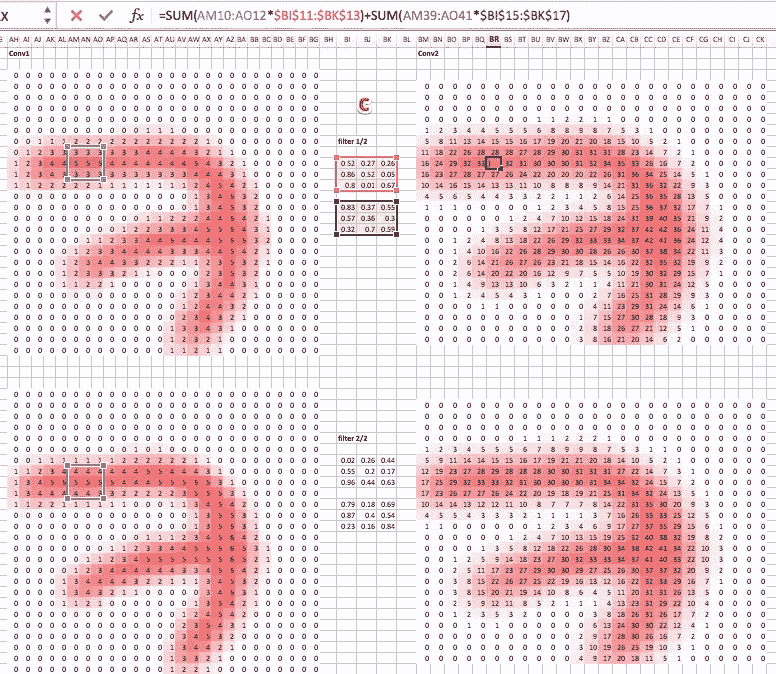

**整流线性单元(ReLU)**-是一种非线性，即扔掉底片。


**建筑**

架构意味着第一层的内核有多大，第一层的内核中有多少滤波器，第一层有一个 3x3，第二层有一个 3x3，这种架构从两个 3x3 卷积内核开始。第二层有两个 2x3x3 内核。

***最大统筹***


convolved feature vs pooled feature

这意味着用最大值替换输出矩阵中的最大值。例如最大 2x2 池。注意:它是不重叠的，因此会降低分辨率。

下面是最大池层:

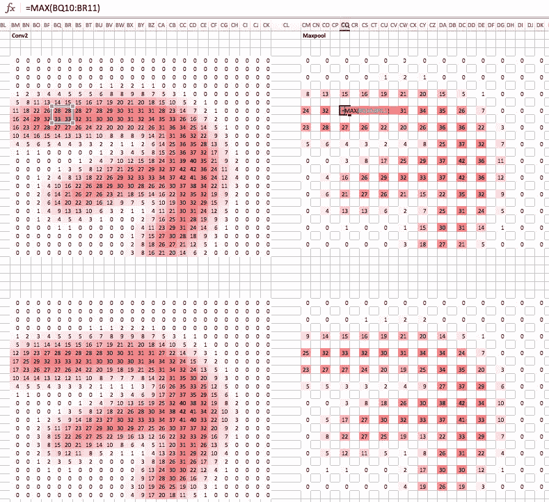

最大池的结果得到适合密集权重一个完全连接的层。

**全连接层**挑选每一个最大汇集激活，给它们一个权重，并挑选最大汇集激活和 3 维张量的 2 级权重的和积。向外放一个**密集激活**

这与卷积不同，在卷积中，我们使用 3×3 内核一次激活几次。但是在完全连接的层中，我们创建了一个相当于整个输入的大权重矩阵。

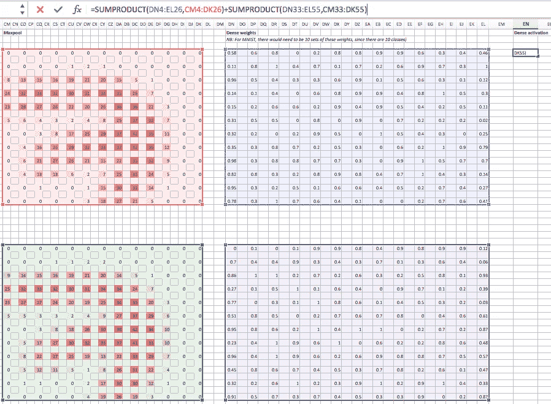

大量使用全连接层的架构可能会有很多权重，因此可能会有过度拟合和速度慢的问题。例如，VGG 有多达 19 层，包含一个完全连接的层，4096 个权重连接到 4096 个隐藏层激活，因此(4096 x 4096 x 内核数)，这几乎是 3 亿个权重。

*如果我们有 3 个输入通道，滤波器会是什么形状？*如果我们有 3 个输入通道，它看起来就像 conv1，它有 2 个通道，因此有 2 个滤波器，因此每个通道有 2 个滤波器。

当我们从零开始训练时，我们不是从精心训练的过滤器开始，而是从随机数开始，并使用随机梯度下降来改善这些数字，使它们不那么随机。

实际上，我们必须为十位数计算不止一个数。我们会有十次密集激活。

**Softmax**

预测图像是猫、狗、飞机、鱼还是建筑物。

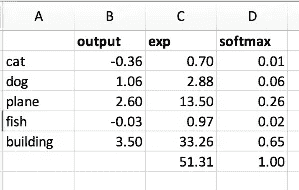

在全连接层之外，我们将有 5 个数字。请注意，在最后一层没有 Relu，所以我们可以有底片。你想把 5 个数字转换成从 0 到 1 的概率，如果是猫、狗、飞机、鱼或建筑物，就匹配它。这 5 个类别的概率应该在 0 和 1 之间，并且它们的总和应该为 1。为此，我们使用一个 ***激活函数*** *这是一个应用于激活的函数。它接受一个数字，吐出另一个数字。*

我们需要把线性和非线性函数叠加在一起做深度学习。我们在每个隐藏层之后使用的非线性是一个 ReLu。激活函数是非线性函数。

**Softmax** *激活发生在最后一层。softmax 吐出介于* `*0*` *和* `*1*` *之间的数字，这些数字加起来就是* `*1*` *。*

为了让 softmax 发挥作用，我们需要消除所有负面因素。我们将使用对数和指数。他们出现了很多机器和深度学习。

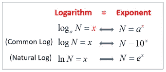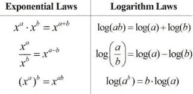

我们做`e^-0.36`得到`exp`，然后把它们加起来得到`51.31`。为了得到`softmax`，我们除以`51.31`，得到`0.01`。softmax 的总和应该等于`1.`

`exp`的一个特点是，如果一个数字(`output`)比另一个稍大，它会使`exp`变得更大。softmax 倾向于选择一个强有力的东西，也就是说，它将一个高概率分配给一个类。

*如果要把图片归类为猫和狗，我们用什么样的激活函数？Softmax 不喜欢预测多个事物。它想挑一样东西。我们可能想要这样做的一个原因是进行多标签分类。*

# 星球竞赛:从太空了解亚马逊

对于猫和狗比赛的单标签分类，图像要么是猫，要么是狗，不是两者都是。对于[卫星竞赛](https://www.kaggle.com/c/planet-understanding-the-amazon-from-space)来说，图像按照天气(阴霾和晴朗)、农业、原始雨林和水(河流)进行分类。在这种情况下，我们需要预测多种情况，softmax 不会很好，因为它想选择一种情况。

*拟人化你的激活功能(赋予个性)* softmax 倾向于挑选一个特定的东西。

如果有多个标签，Fast.ai 库将自动切换到多标签模式。所以你什么都不用做。但这是幕后发生的事情:

```
**from** **planet** **import** f2 metrics=[f2] 
f_model = resnet34label_csv = f'**{PATH}**train_v2.csv'
n = len(list(open(label_csv)))-1
val_idxs = get_cv_idxs(n)**def** get_data(sz):
    tfms = tfms_from_model(f_model, sz,aug_tfms=transforms_top_down,
max_zoom=1.05)
    **return** ImageClassifierData.from_csv(PATH, 'train-jpg',label_csv, tfms=tfms,suffix='.jpg', val_idxs=val_idxs, test_name='test-jpg')data = get_data(256) #gets images of 256x256
```

我们使用`from_csv`,因为多标签分类不能使用 Keras 风格的方法，其中子文件夹是标签的名称。

`transform_top_down`:它不仅仅是一个垂直翻转。正方形有八种可能的对称。它可以旋转 0 度、90 度、180 度和 270 度，并且可以翻转( [***二面角*** *八组*](https://en.wikipedia.org/wiki/Dihedral_group) )

```
x,y = next(iter(data.val_dl))
```

使用`ds`(数据集)我们可以得到一个单独的图像*。*

`dl`是一个*数据加载器，它会给你一个小批量*，特别是*转换的*小批量。使用数据加载器，您不能请求特定的小批量，您只能取回`next`小批量。在 Python 中，它被称为“生成器”或“迭代器”。

PyTorch 真正利用了现代 Python 方法。如果你很了解 python，PyTorch 来的很自然。如果你不太了解 python，PyTorch 是学好 python 的一个很好的理由。

`x`是小批量的图像，`y`是小批量的标签。打印 y:

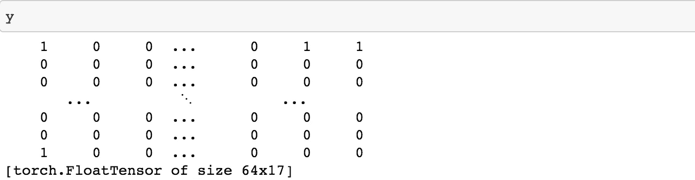

默认情况下，批大小为 64，可能的类为 17。

让我们看看`0`的图片标签:

```
list(zip(data.classes, y[0]))

*[('agriculture', 1.0),
 ('artisinal_mine', 0.0),
 ('bare_ground', 0.0),
 ('blooming', 0.0),
 ('blow_down', 0.0),
 ('clear', 1.0),
 ('cloudy', 0.0),
 ('conventional_mine', 0.0),
 ('cultivation', 0.0),
 ('habitation', 0.0),
 ('haze', 0.0),
 ('partly_cloudy', 0.0),
 ('primary', 1.0),
 ('road', 0.0),
 ('selective_logging', 0.0),
 ('slash_burn', 1.0),
 ('water', 1.0)]*
```

这是农业，清晰，主要刀耕火种和水。

PyTorch 和 fast.ai 是把标签变成***one-hot-encoded***标签。如果实际标签是 dog，它看起来会像这样:

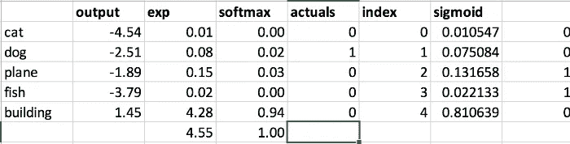

我们采用`softmax`并与`actuals`进行比较来实际预测。`actuals`和`softmax`之差加在一起给出了误差，即**损失函数。**

One-hot-encoding 对于排序来说效率非常低，所以我们将存储一个`index`值(单个整数)，而不是目标值的 0 和 1(`y`)。如果您查看狗品种竞赛的`y`值，您实际上不会看到一个由 1 和 0 组成的大列表，但是您会看到一个单一的整数。

PyTorch 在内部将索引转换为 one-hot-encoded vector(尽管您实际上永远看不到它)。PyTorch 对于热编码的和非热编码的有不同的损失函数——但是这些细节被 fast.ai 库隐藏了，所以你不必担心。但要意识到的一件很酷的事情是，我们正在为单标签分类和多标签分类做完全相同的事情。

*为 softmax 更改 log 的基数有意义吗？*不，改变基底只是神经网络可以轻松学习的线性缩放:

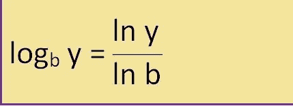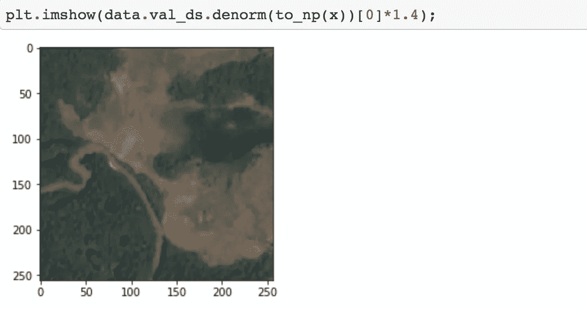

注意:图像只是数字的矩阵。图像被洗掉了，所以为了让它更明显(“亮一点”)我们乘以`*1.4`。

像这样试验图像是很好的，因为这些图像一点也不像 ImageNet。你所做的绝大多数涉及卷积神经网络的事情实际上不会像 ImageNet 一样，它们将是医学成像，对不同种类的钢管、卫星图像等进行分类

```
sz=64data = get_data(sz)data = data.resize(int(sz*1.3), 'tmp')
```

我们不会用`sz=64`来进行猫和狗的比赛，因为我们是从预先训练的 ImageNet 网络开始的，它开始时近乎完美。如果我们用 64 乘 64 的图像重新训练整个集合，我们会破坏已经非常好的权重。请记住，大多数 ImageNet 模型都是用 224×224 或 299×299 的图像训练的。

image net 中没有与上面的卫星图像相似的图像。imageNet 唯一有用的部分是发现边缘和渐变的第一层，发现纹理和重复图案的第二层。

当使用卫星图像时，首先用小图像进行训练效果很好。

```
learn = ConvLearner.pretrained(f_model, data, metrics=metrics)lrf=learn.lr_find()
learn.sched.plot()
```

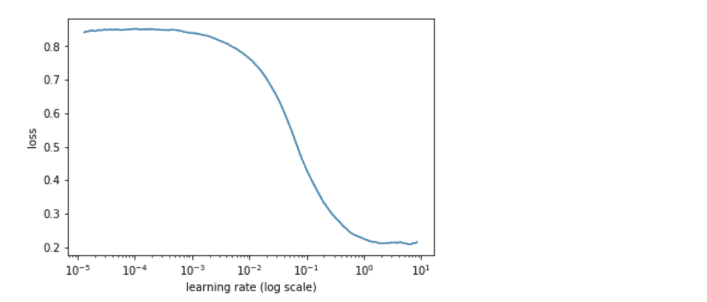

## 适合的

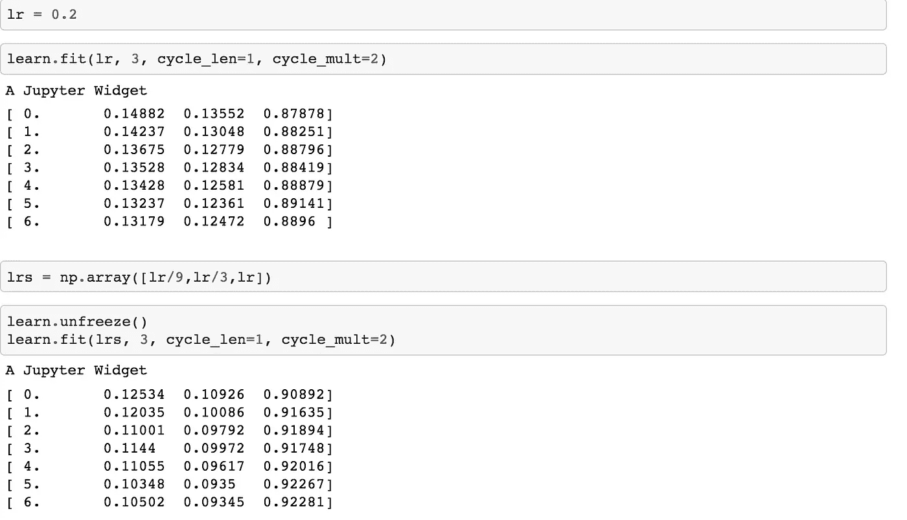

使用`[lr/9, lr/3, lr]`是因为图像不同于 ImageNet 图像，并且早期的图层可能没有接近它们需要的样子。

绘制损失图:

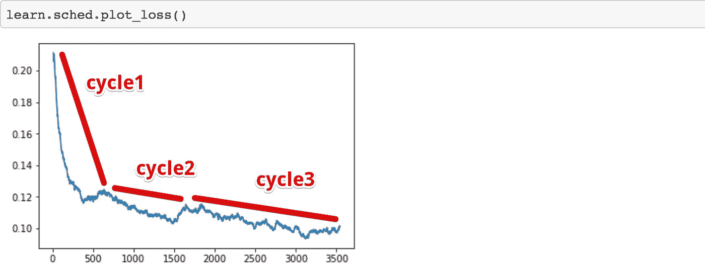

让我们先将图像尺寸翻倍至 128，然后调整，再翻倍至 256，这样可以达到 93.5%的准确率:

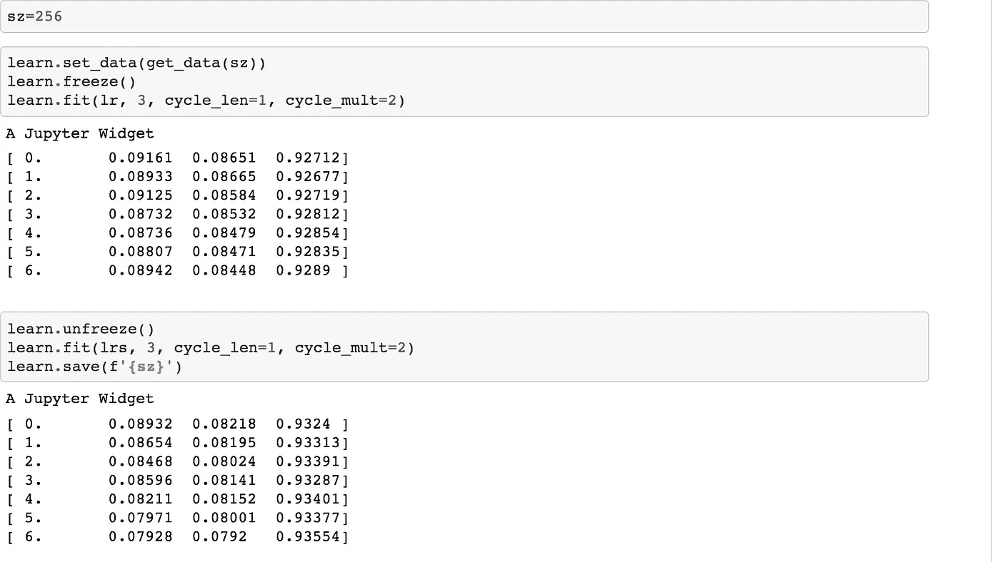

测试时间增加使我们达到 93.6%；

```
data = data.resize(int(sz*1.3), 'tmp')
```

*这是做什么的？*

当我们指定要应用什么转换时，我们传递一个大小:

```
tfms = tfms_from_model(f_model, sz,
        aug_tfms=transforms_top_down, max_zoom=1.05)
```

数据加载器做的一件事是按需调整图像的大小。这与`data.resize`无关。如果初始输入图像是 1000 乘 1000，读取 JPEG 并将其调整为 64 乘 64 比训练卷积网络花费更多的时间。

`data.resize`告诉它我们不会使用比`sz*1.3`更大的图像，所以遍历一次并创建这个大小的新 JPEG，它是矩形的，所以最小边的新 JPEG 的大小是`sz*1.3`中心裁剪的。这类似于循环调整图像大小的批处理脚本。这会节省你很多时间。`data.resize`是加速便利功能。

```
metrics=[f2]
```

我们没有使用`accuacy`，而是使用了 [F-beta](http://scikit-learn.org/stable/modules/generated/sklearn.metrics.fbeta_score.html) ，这是一种衡量假阴性和假阳性的方法。我们使用它的原因是因为这个特别的 Kaggle 比赛想要使用它。查看 planet.py，了解如何使用 Skitlearn 创建自己的度量函数。这是最后打印出来的。在每个时期之后`[ 0\. 0.08932 0.08218 **0.9324** ]`

## 多标签分类的激活函数

Fast.ai 检查标签以查看一个图像是否有多个标签，并自动选择激活功能。

多标签分类的激活函数称为 **sigmoid。**


为了找到乙状结肠，选择`exp`除以`1+exp`，即:

```
0.01/1+0.01 = 0.01
0.08/1+0.08 = 0.07 
```

这使得可以一次预测多种情况。如果某个值小于 0，则其 sigmoid 小于 0.5，如果大于 0，则其大于 0.5。

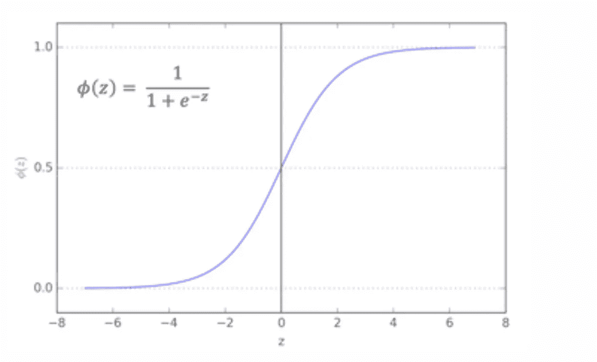

*与其单独训练最后几层，不如从差别学习率开始训练？你可以跳过最后一层的训练，直接学习不同的学习率，但你可能不想这样做。卷积层都包含预先训练好的权重，所以不是随机的——对于接近 ImageNet 的东西，真的很好；对于不接近 ImageNet 的东西，有总比没有好。然而，我们所有完全连接的层都是完全随机的。因此，您总是希望通过先对它们进行一点训练，使完全连接的权重优于随机权重。否则，如果你直接去解冻，那么你实际上是在摆弄那些早期的层权重，而后面的层权重仍然是随机的——这可能不是你想要的。*

*解冻时，你想改变什么？内核(过滤器)和权重。训练的意思是设置过滤器和密集权重。密集权重用于完全连接的层，过滤器/内核权重用于卷积。*另一方面，激活*是根据权重和先前层激活或输入计算的。*

*如何获得 64 乘 64 的图像尺寸？这取决于变换。默认情况下，我们的变换采用最小的边缘，将其缩小，并为其拍摄中心裁剪，但当使用数据增强时，它会随机选择。*

准确性不是模型试图优化的。它优化了损失函数，例如交叉熵，这个指标是打印出来的，让我们可以看到发生了什么。

*当您使用差异学习率时，这三个学习率是否在各层之间均匀分布？* fast.ai 库有一个“图层组”的概念。在类似 ResNet50 的东西中，有数百个层，您可能不希望编写数百个学习率，因此库为您决定如何拆分它们，最后一个总是指的是我们随机初始化并添加的完全连接的层，其余的学习率在层之间拆分。

## 可视化图层

```
learn.summary()*[('Conv2d-1',
  OrderedDict([('input_shape', [-1, 3, 64, 64]),
               ('output_shape', [-1, 64, 32, 32]),
               ('trainable', False),
               ('nb_params', 9408)])),
 ('BatchNorm2d-2',
  OrderedDict([('input_shape', [-1, 64, 32, 32]),
               ('output_shape', [-1, 64, 32, 32]),
               ('trainable', False),
               ('nb_params', 128)])),
 ('ReLU-3',
  OrderedDict([('input_shape', [-1, 64, 32, 32]),
               ('output_shape', [-1, 64, 32, 32]),
               ('nb_params', 0)])),
 ('MaxPool2d-4',
  OrderedDict([('input_shape', [-1, 64, 32, 32]),
               ('output_shape', [-1, 64, 16, 16]),
               ('nb_params', 0)])),
 ('Conv2d-5',
  OrderedDict([('input_shape', [-1, 64, 16, 16]),
               ('output_shape', [-1, 64, 16, 16]),
               ('trainable', False),
               ('nb_params', 36864)]))*
 ...
```

`conv2d-1`是层的名称。

`‘input_shape’, [-1, **3, 64, 64**]` — PyTorch 在图像尺寸`64, 64`前列出频道`3`。按照这个顺序，一些 GPU 计算会运行得更快。这是一个 4 维的小批量。

`-1`是指无论批量有多大，都可以改变。Keras 使用`None`

`‘output_shape’ , [-1, **64**, **32, 32**]` 64 是内核数，32 乘 32 是**步距。**像 maxpooling 一样改变大小。

*一个非常小的数据集的学习率查找器返回奇怪的数字，图为空*。学习率查找器将一次完成一个小批量。如果你有一个很小的数据集，就没有足够的小批量。所以诀窍是让你的批量非常小。

# 结构化和时间序列数据

有两种类型的数据集。

**非结构化** —音频、图像、自然语言文本，其中一个对象内部的所有东西都是同一种东西——像素、波形幅度或单词。

**结构化** —损益表，关于脸书用户的信息，其中每一列在结构上不同。“结构化”指的是列数据，您可能会在数据库或电子表格中找到，其中不同的列代表不同种类的事物，每行代表一个观察值。

结构化数据在学术界经常被忽视，因为如果你有一个更好的物流模型，它很难在花哨的会议记录中发表。但它让世界运转，让每个人都赚钱，提高效率。我们不会忽视它，因为我们正在进行实用的深度学习，Kaggle 也不会，因为人们把奖金放在 Kaggle 上，以解决现实世界的问题。

探索这种架构背后的动机是它与现实世界应用的相关性。工业中用于日常决策的大多数数据是结构化或时间序列数据。我们将通过实际的结构化数据问题来探索使用神经网络的端到端过程。

示例:

预测大型杂货连锁店的销售额。[此处](https://www.kaggle.com/c/favorita-grocery-sales-forecasting)

使用商店、促销和竞争对手数据预测销售。[此处](https://www.kaggle.com/c/rossmann-store-sales)

## 罗斯曼商店销售

进口:

```
**from** **fastai.structured** **import** *
**from** **fastai.column_data** **import** *
np.set_printoptions(threshold=50, edgeitems=20)

PATH='data/rossmann/'
```

`structured` —不特定于 PyTorch，也用于机器学习课程中，在完全没有 PyTorch 的情况下进行随机森林。它可以在没有 Fast.ai 库的任何其他部分的情况下单独使用。

`fastai.column_data` —允许我们用柱状结构化数据做 Fast.ai 和 PyTorch 之类的东西。

对于结构化数据，我们需要大量使用熊猫。不熟悉熊猫，这里的(用于数据分析的 Python)是熊猫作者写的一本好书。

# 创建数据集

除了提供的数据，我们还将使用 Kaggle 竞赛参与者收集的外部数据集，例如 google trends 和 weather。你可以在这里下载所有的[。](http://files.fast.ai/part2/lesson14/rossmann.tgz)

有大量的数据预处理，这个笔记本包含了第三名获胜者的整个管道([分类变量的实体嵌入](https://arxiv.org/abs/1604.06737))。本课程不涉及数据处理，但机器学习课程会详细介绍，因为特征工程非常重要。

查看 CSV 文件:


`StoreType` —你经常会得到一些列包含“代码”的数据集。代码是什么意思并不重要。远离了解太多，先看看数据怎么说。然后稍后查看经常随数据一起提供的数据字典。

## 连接表格

这是一个关系数据集，您已经将相当多的表连接在一起——这对于使用`merge`的 Pandas 来说很容易做到:

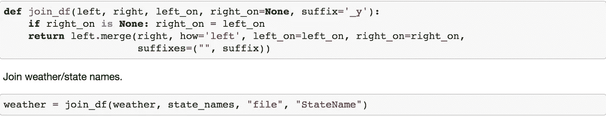

fast.ai 还提供以下功能:

```
add_datepart(train, "Date", drop=False)
```

获取一个日期，提取一系列列，如“星期几”、“季度初”、“一年中的月份”等，并将它们全部添加到数据集中。

持续时间部分将计算距离下一个假期还有多长时间，距离上一个假期还有多长时间，等等。

保存包含数据的整个结构化文件:

```
joined.to_feather(f'{PATH}joined')
```

`to_feather`:将一个熊猫的数据帧保存为“羽毛”格式，这种格式将它保存在 RAM 中，并将其转储到磁盘中。所以它真的真的很快。厄瓜多尔杂货比赛有 3.5 亿条记录，所以你会关心用羽毛节省多长时间，它需要 6 秒。

该数据包含特定日期商店中特定商品的销售数量。我们的目标是预测在未来的某一天，在某个特定的商店里会卖出多少这样的商品。

## 下一课

我们将列分为两种类型:分类的和连续的。

**分类变量**:是`store_id` 1 和`store_id` 2 在数值上没有关系。它们是类别。一周中的每一天；周一(第 0 天)和周二(第 1 天)的电子贸易条件分类数据将被热编码，并且

**连续变量:**像到最近的竞争对手的公里距离这样的东西是我们用数字处理的数字。连续数据将按原样馈入全连接层。

步骤:

1.  创建验证集。
2.  `ColumnarModelData.from_data_frame`是我们加载列数据的方式。基本的 API 概念与图像识别相同。
3.  `.get_learner`
4.  找出我们的最佳学习率并画出来。
5.  `.fit`带着一个`metric`
6.  `.fit` 同一个`cycle_len`

感谢阅读！*跟随*[*@ itsmuriuki*](https://twitter.com/itsmuriuki)*。*

回归学习！