# 深度学习；个人笔记第 1 部分第 4 课:结构化学习，自然语言处理，协同过滤。辍学，嵌入，通过时间支持。

> 原文：<https://towardsdatascience.com/deep-learning-personal-notes-part-1-lesson-4-structured-learning-natural-language-processing-26188d744ece?source=collection_archive---------12----------------------->

随着我对快速人工智能[课程的第二次尝试，这个博客系列将会更新。](http://www.fast.ai/)以上是我的个人笔记；a 努力把事情理解清楚，解释好。没什么新意，只活出了这个 [*博客*](https://medium.com/@itsmuriuki/why-i-will-be-writing-about-machine-learning-and-deep-learning-57c68090f201) *。*

Fast.ai 采取的方法是“这里是如何使用软件做一些事情，然后通过查看细节来查看幕后。”

## 拒绝传统社会的人

```
learn = ConvLearner.pretrained(arch, data, ps=0.5, precompute=True)
```

预计算来自最后一个卷积层的激活。激活是基于一些权重计算的数字，这些权重也被称为构成应用于先前层激活的核心或过滤器的参数，否则这些权重可能是其他计算的输入或结果。

通过键入学员对象的名称，您可以实际看到其中的层:

```
learn*Sequential(
  (0): BatchNorm1d(1024, eps=1e-05, momentum=0.1, affine=True)
  (1): Dropout(p=0.5)
  (2): Linear(in_features=1024, out_features=512)
  (3): ReLU()
  (4): BatchNorm1d(512, eps=1e-05, momentum=0.1, affine=True)
  (5): Dropout(p=0.5)
  (6): Linear(in_features=512, out_features=120)
  (7): LogSoftmax()
)*
```

`*Linear(in_features=1024, out_features=512)*` 一个线性层意味着一个矩阵乘数。在这种情况下，我们有一个 1024 行 512 列的矩阵。它接收 1024 个激活，并发出 512 个激活。

`ReLu`。用零代替负数。

`*Linear(in_features=512, out_features=120)*` 第二线性层获取第一线性层激活 512 个激活，并将它们通过新矩阵乘以 120 并输出 120 个激活。

`*Softmax*` —一个激活函数，返回加起来为 1 的数字，每个数字都在 0 和 1 之间。由于较小的数值精度原因，直接取 softmax 的对数比 softmax 更好。这就是为什么当我们从模型中获得预测时，我们必须做`np.exp(log_preds)`。

## `*Dropout(p=0.5)*` *是做什么的？*

应用 dropout 意味着在层中选择激活并删除它们。`p`是删除一个激活的概率。输出激活变化不大。

随机丢弃一个层中的一半激活有一个有趣的效果，它迫使它不要过度拟合。如果一个特定的激活已经学习了确切的狗或猫，它迫使模型找到一个没有随机一半激活的表示。

如果你已经完成了所有的数据扩充，或者为模型提供了足够的数据，那么你能做的事情就很少了，但在很大程度上，你会陷入困境。Geofrey Hinton 等人提出了辍学，这完全是受大脑工作方式的启发。

你放弃了 1%的激活，这根本不会改变什么，因此它不会防止过度拟合，也就是说，不会一般化。

`p=0.99` 你会丢掉 99%的激活。它也不会过度拟合，因此对概括来说很好，但会杀死你的准确性。

*高* `*p*` *值可以很好地概括，但会降低您的训练精度，低* `*p*` *值将不能很好地概括，但会提高您的精度。*

在训练的早期，为什么验证损失比训练损失好，因为它没有看到数据集，你不希望损失好得多？这是因为当我们查看验证集时，我们关闭了辍学。当进行推理时，即预测时，我们希望尽可能使用最好的模型。训练中会出现辍学现象。

你需要做些什么来适应你丢弃激活的事实吗？我们不(fast.ai)当我们说`p=0.5`在幕后 pytorch 扔掉一半的激活，并使激活加倍，因此平均激活没有变化。

在 Fast.ai 中，您可以传入`ps`，这是所有添加层的`p`值。它不会改变预训练网络中的辍学，因为它应该已经以某种适当的辍学水平被训练:

```
learn = ConvLearner.pretrained(arch, data, **ps=0.5**, precompute=True)
```

我们可以通过设置`ps=0`来去除掉音。但是过了几个时代后，我们开始过度适应。训练损失小于验证损失。With `ps=0` dropout 根本没有添加到模型中。

你可能已经注意到了，它已经增加了两个`Linear`层。我们不必这样做。您可以设置`xtra_fc`(额外全连接层)参数。你可以传递一个列表，告诉它你希望每个额外的全连接层有多大。您确实需要至少一个将卷积层的输出(本例中为 1096)转换为 120 个狗品种的类数，即由您的问题定义的类数:

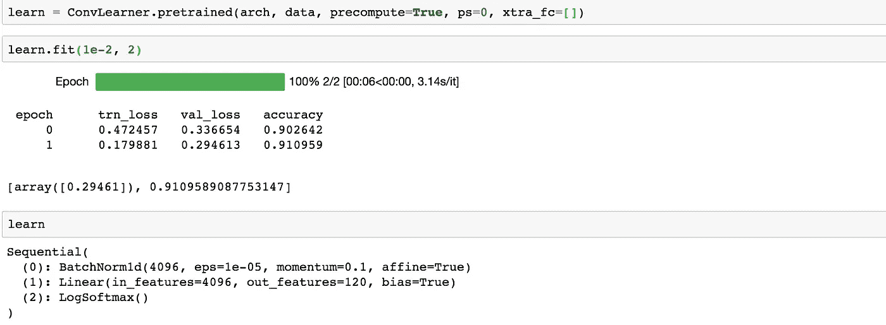

如果`xtra_fc`是空的，这意味着不要添加任何额外的线性层，只是我们必须有一个，从而给我们一个最小的模型。

默认情况下，我们是否应该使用特定的 p 值？对于第一层，我们有`p=0.25`，对于第二层，我们有`p=0.5`，这似乎适用于大多数情况。如果你发现它过量，继续增加，比如 0.2。如果不合适，减少它。

ResNet34 的参数较少，因此不会过度拟合，但对于像 ResNet50 这样的大型架构，通常需要增加压差。

有没有一种特别的方法可以确定它是否过度装配？是的，您可以看到培训损失远低于验证损失。你看不出是不是*太过*过度。零过拟合通常不是最佳的。您唯一要做的事情是降低验证损失，所以您需要尝试一些东西，看看是什么使验证损失降低。

*为什么平均激活很重要？*如果我们删除一半的激活，那么下一个将它们作为输入的激活也将减半，以及之后的所有激活。比如蓬松耳朵激活大于 0.6 就蓬松，现在大于 0.3 才蓬松，就是改了意思。这里的目标是在不改变含义的情况下删除激活。

*我们可以逐层设置不同的退学等级吗？*是的，这就是它被称为`ps`的原因，我们可以传递一个数组:`ps =[0.1,0.2]`

还没有经验法则来确定何时前一层或后一层应该具有不同的漏失量。如果有疑问，对每个完全连接的层使用相同的压差。人们通常只在最后一个线性图层上放置 dropout。

*为什么显示器损耗而不是准确度？*对于验证集和训练集来说，损失是我们唯一可以看到的，我们能够对它们进行比较。我们将在后面了解到，损失是我们实际上正在优化的东西，因此更容易监控和理解这意味着什么。

*通过添加辍学，我们似乎添加了一些随机噪声，这意味着我们没有做太多的学习，我们需要调整学习率吗？它对学习速度的影响似乎不足以引起注意。理论上，它可能会影响我们，但还不足以影响我们。*

# 结构化和时间序列数据

数据中有两种类型的列:

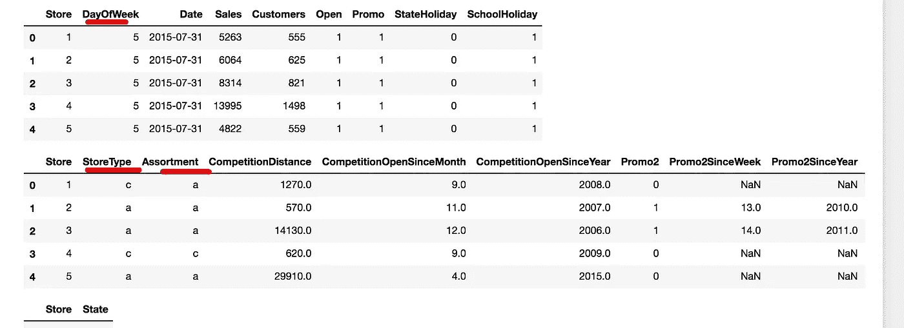

分类—它有多个“级别”，例如`StoreType`、`Assortment`

连续——它有一个数，该数的差或比有某种意义。例如`CompetitionDistance`

我们不会涵盖数据清理和功能工程，我们将假设已经完成。我们需要转换成与神经网络兼容的输入。

这包括将分类变量转换成连续的整数或一键编码，将连续特征标准化为标准常态，等等…

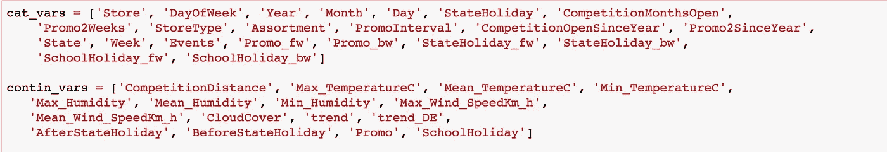

像`year`、`month`和`day`这样的数字虽然我们可以把它们看作是连续的，但我们不必这样。当我们决定将一些事情分类时，我们是在告诉神经网络不同地对待每一个层次。但是，当说它是连续的时，我们是在告诉它用一个光滑的函数来拟合它们。

很多时候，事物实际上是连续的，但没有很多不同的层次(例如`Year`、`DayOfWeek`)，把它们看作是分类的会更好。因为每一天都可能表现出不同的性质。

我们要说哪些变量是分类的，哪些是连续的，这是你必须做出的建模决定。

如果在你的数据中某个东西被编码为“a，b，c ”,你必须称它为分类的，如果它开始是连续的，你必须选择是分类的还是连续的。

注意，连续变量是实际的浮点数。浮点数有许多级别，即它有很高的基数，例如`DayOfWeek`的基数是 7。

*你曾经 bin 过连续变量吗？*目前没有，但我们可以做的一件事，比如说`Max_Temperature`，是分组为 0-10，10-20，20-30，称之为分类。一组研究人员发现，有时宁滨是有帮助的。

*如果你是用年份作为一个范畴，当一个模型遇到一个它从未见过的年份会发生什么？*将被视为未知类别。熊猫有一个特殊的类别叫做未知，如果它看到一个以前没有见过的类别，它会被视为未知。

*如果我们的训练数据集没有类别，但我们的测试不知道模型会做什么，它会预测吗？*它将是未知类别的一部分，它仍将预测它将处理 seen 后面的值 0，如果训练集中有未知，它将学会预测它们，如果没有，它将有一个随机向量。

```
n = len(joined); n
844338
```

我们有 844338 行，这是每个商店的日期。

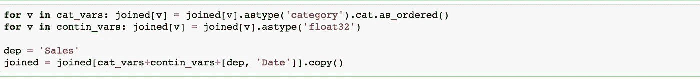

通过`cat_vars`循环，将适用的数据框列转换为分类列。

循环遍历`contin_vars`并将它们设置为`float32` (32 位浮点)，因为这是 PyTorch 所期望的。例如`Promo`、`SchoolHoliday`

## 从样本开始

我们倾向于从数据集的小样本开始。对于图像，这意味着将图像大小调整为 64 x 64 或 128 x 128。但是对于结构化数据，我们从随机的行样本开始。


因此给我们`150000`行数据作为开始。

查看数据:

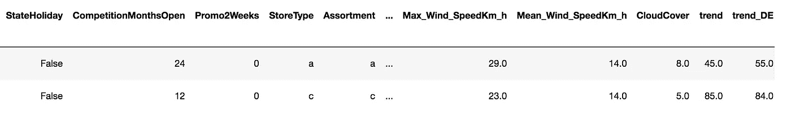

即使我们将一些列设置为“类别”，例如内部保存的`‘StoreType’`、`‘Year’.`，熊猫在笔记本中仍然显示为字符串。

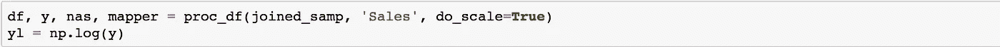

`proc_df`(处理数据帧)是一个快速人工智能功能，它:

取一个数据框，告诉它你的因变量是什么，把它放入一个单独的变量，并从原始数据框中删除它。换句话说，`df`没有`Sales`列，而`y`包含了`Sales`列。

`do_scale`神经网络确实希望输入数据都在零附近，标准偏差在 1 左右。为了做到这一点，我们取数据，减去平均值，然后除以标准差。它返回一个特殊的对象`mapper`,该对象跟踪它用于标准化的平均值和标准偏差，因此您可以在以后对测试集做同样的事情。

`nas`它还处理缺失值，对于分类变量，它变成 ID: 0，其他类别变成 1、2、3 等等。对于连续变量，它用中值替换缺失值，并创建一个新的布尔值列，表明它是否缺失。

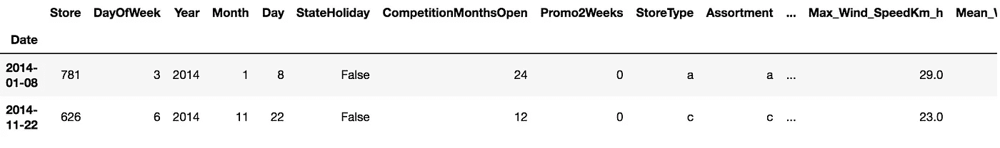

Before preprocessing

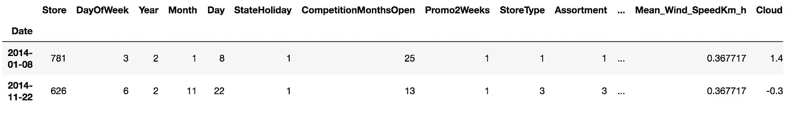

After preprocessing

例如，2014 年变为 2，因为分类变量已被从零开始的连续整数替换。原因是，我们稍后会将它们放入一个矩阵中，我们不希望矩阵有 2014 行长，因为它可能只有两行。

我们现在有一个不包含因变量的数据框架，其中所有内容都是一个数字。这就是我们需要进行深度学习的地方。

在这种情况下，我们需要预测接下来两周的销售额，因此我们应该创建一个验证集，它是我们训练集的最后两周。

在时间序列数据中，交叉验证不是随机的。相反，我们的维持数据通常是最新的数据，就像在实际应用中一样。这个问题在[这里](http://www.fast.ai/2017/11/13/validation-sets/)详细讨论。一种方法是将最后 25%的行(按日期排序)作为我们的验证集。

## 组装我们的模型

重要的是，你要对自己的衡量标准有一个很好的理解，即别人会如何评价你。在[这场比赛](https://www.kaggle.com/c/rossmann-store-sales#evaluation)中，我们将接受均方根百分比误差(RMSPE)的评判。

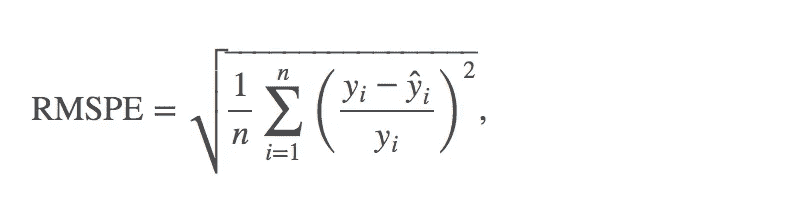

这意味着我们将实际销售额减去单个预测的预测值，求出其百分比，然后求出平均值。

当你取数据的对数时，得到均方根误差实际上会得到均方根百分比误差:

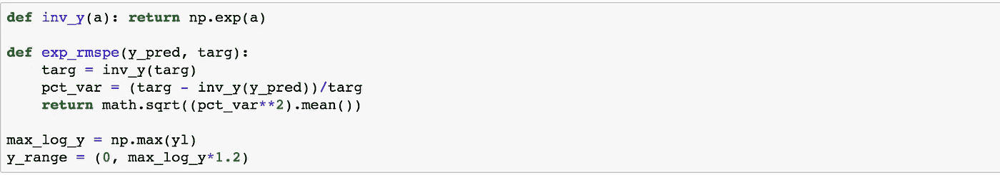

我们可以直接从外部数据框创建模型数据对象:

```
md = **ColumnarModelData.from_data_frame**(PATH, val_idx, df, 
         yl.astype(np.float32), cat_flds=cat_vars, bs=128, 
         test_df=df_test)
```

我们将从创建模型数据对象`md`开始，它内置了验证集、训练集和可选测试集。从那里，我们将得到一个学习者，然后我们可以选择调用`lr_find`，然后调用`learn.fit`，以此类推。

这里的不同之处在于，我们没有使用`ImageClassifierData.from_csv`或`from_paths`，我们需要一种不同的模型数据，称为`ColumnarModelData`，我们称之为`from_data_frame`。

`Path`指定存储模型文件的位置

`val_idx`我们将放入验证集中的行的索引列表。

`df` 数据框是自变量。

`yl`因变量，是`proc_df`即`yl = np.log(y)`返回的`y`的日志

`cat_flds`指定您希望被视为分类的事物。一切都变成了数字，除非我们指定，它会把它们都视为连续的。通过名单`cat_vars`

`bs`批量大小

现在我们有了一个包含`train_dl`、`val_dl`、`train_ds`、`val_ds`等的标准模型数据对象。

创建适合我们模型数据的学习者:

```
m = md.get_learner(emb_szs, len(df.columns)-len(cat_vars),
                   0.04, 1, [1000,500], [0.001,0.01], 
                   y_range=y_range)
```

*   `0.04`:一开始要用多少退学者
*   `[1000,500]`:每层有多少激活
*   `[0.001,0.01]`:在后面的层使用多少个漏失
*   emb_szs 嵌入

## 嵌入

让我们暂时撇开分类变量，看看连续变量:

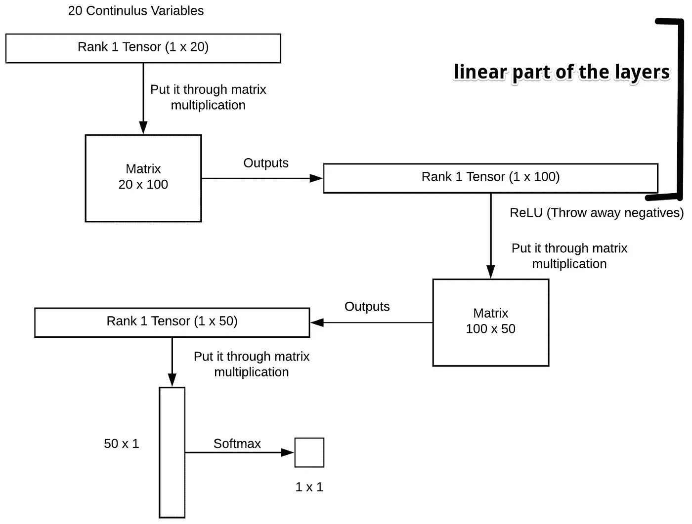

你永远不要把 ReLU 放在最后一层，因为 softmax 需要负数来创造低概率。

完全连接层的简单视图:

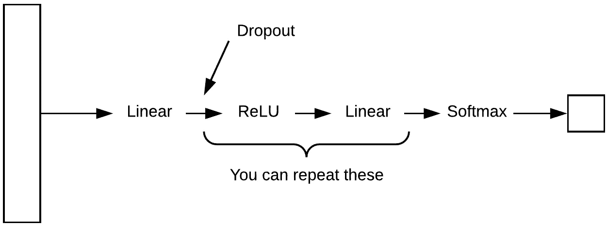

以秩 1 张量的形式接收输入，将其通过线性层(矩阵乘积)，通过激活(ReLu)，再次通过线性层，然后是 softmax，最后是输出。我们可以添加更多的线性层或辍学。

对于回归问题，跳过 softmax。

## 分类变量

例如，我们创建一个 7 行和 4 列的新矩阵，并用浮点数填充它。为了将“Sunday”添加到我们的具有连续变量的秩 1 张量中，我们查找这个矩阵，它将返回 4 个浮点数，我们将它们用作“Sunday”。

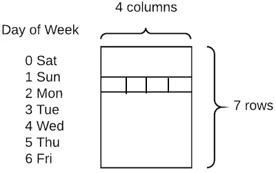

最初，这些数字是随机的。但是我们可以把它们放入神经网络，用梯度下降法更新它们，以减少损失。这个矩阵只是我们的神经网络中的另一组权重，称为**嵌入矩阵**

**嵌入矩阵**是指我们从零到该类别最大层数之间的整数开始。我们对矩阵进行索引以找到一个特定的行，并将它附加到我们所有的连续变量上，之后的一切都和之前一样(线性→ ReLU →线性等)。

那 4 个数字代表什么？它们只是我们正在学习的参数，碰巧最终会给我们带来好的损失。我们稍后会发现，这些特定的参数通常是人类可以解释的，而且非常有趣，但这是一个副作用。它们是我们正在学习的一组 4 个随机数。

*你对嵌入矩阵的维数有好的启发吗？*我们使用每个变量的*基数*(即其唯一值的数量)来决定其*嵌入的大小*。

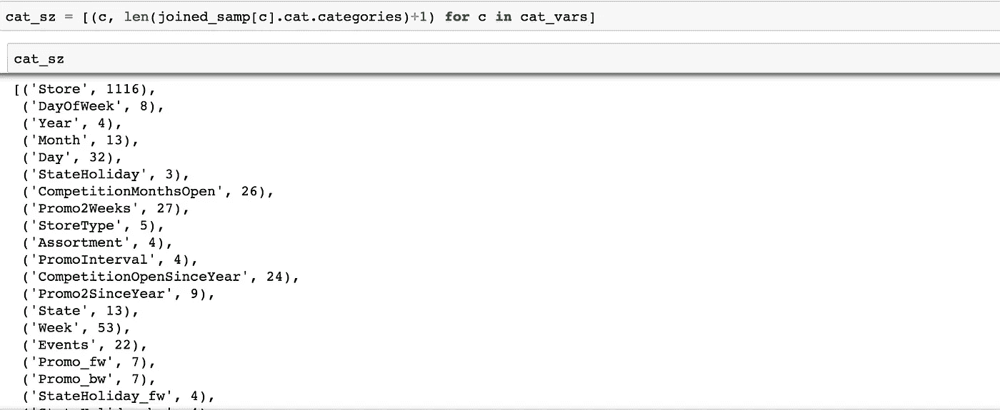

上面是每个分类变量及其基数的列表。

我们一周有 7 天，但是看起来基数是 8，额外的基数是为了防止在测试集中有一个未知数，除以 2，因此有 4 个随机数。即使原始数据中没有缺失值，也应该留出一个值以备不时之需。年份也是 3，但我们为未知的 e.t.c .加 1

*确定嵌入大小的经验法则是基数大小除以 2，但不大于 50。*

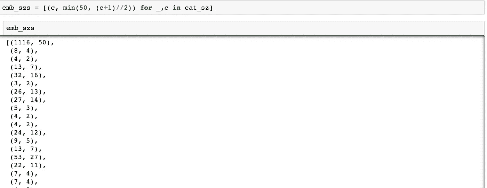

查看存储，我们将有`1116`个存储用于查找，返回长度为`50`的秩 1 张量。我们必须为每个分类变量建立一个嵌入矩阵。

然后，我们将嵌入大小`emb_szs`传递给`get_learner`，这告诉学习者对于每个分类变量，该变量使用哪种嵌入。

```
m = md.get_learner(emb_szs, len(df.columns)-len(cat_vars),
 0.04, 1, [1000,500], [0.001,0.01], y_range=y_range)
m.summary()
```

*除了 random 还有初始化嵌入矩阵的方法吗？*基本想法是，如果 Rossmann 的其他人已经训练了一个神经网络来预测奶酪销售，你也可以从他们嵌入的商店矩阵开始预测酒类销售。举例来说，Pinterest 和 Instacart 就是如此。Instacart 使用这种技术为他们的购物者选择路线，Pinterest 使用这种技术决定在网页上显示什么。他们有产品/商店的嵌入矩阵，在组织中共享，因此人们不必培训新的产品/商店。

*使用嵌入矩阵比一次热编码有什么优势？*对于上面的星期几示例，我们可以轻松地传递 7 个数字，而不是 4 个数字，例如[0，1，0，0，0，0，0]，表示星期天。这也是一个浮动列表，将完全工作，这就是如何，一般来说，分类变量已被用于统计多年所谓的“虚拟变量”。问题是，星期天的概念只能与一个浮点数相关联。所以它得到了这种线性的行为，它说星期天或多或少是一件单一的事情。有了嵌入，星期天就是一个四维空间的概念。所发生的是这些嵌入向量倾向于得到这些丰富的语义概念。例如，如果发现周末有不同的行为，您会看到周六和周日会有一些特定的数字较高，或者例如一周中的某些天往往与较高的销售额相关联，例如在周五购买酒。

通过拥有更高维度的向量而不仅仅是单个数字，它给了深度学习网络学习这些丰富表示的机会。

嵌入的想法就是所谓的“分布式表示”——神经网络最基本的概念。这是一种想法，即神经网络中的概念具有难以解释的高维表示。这个向量中的这些数字不一定只有一个意义。如果这个是低的，那个是高的，这可能意味着一件事，如果那个是高的，那个是低的，这可能意味着另一件事，因为它经历了这个丰富的非线性函数。正是这种丰富的表征让它能够学习到如此有趣的关系。

*嵌入适合某些类型的变量吗？*嵌入适用于任何范畴变量。唯一不能很好工作的是基数太高的东西。如果你有 600，000 行，一个变量有 600，000 个级别，那就不是一个有用的分类变量。但总的来说，这场比赛的第三个获胜者真的决定了所有不太高的基数，他们把它们都定为绝对的。好的经验法则是，如果你能制造一个分类变量，你也可以，因为这样它就能学习丰富的分布式表示；如果你让它保持连续，它最多能做的就是尝试找到一个适合它的单一函数形式。

## 矩阵代数如何在幕后工作:

进行查找等同于在独热编码向量和嵌入矩阵之间进行矩阵乘积。

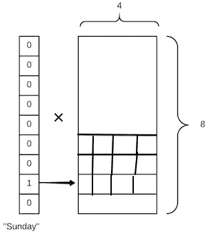

相乘后，你只剩下一个向量。现代的库实现这一点的方式是取一个整数并在数组中查找。

*你能谈谈使用日期和时间作为分类，以及这如何影响季节性吗？*以下代码从一个完整的日期时间中提取特定的日期字段，用于构造类别。在处理日期-时间时，您应该*始终*考虑这个特征提取步骤。如果不将您的日期-时间扩展到这些额外的字段中，您就无法在任何这些粒度上捕捉任何趋势/周期行为作为时间的函数。我们将为每个表添加一个日期字段。

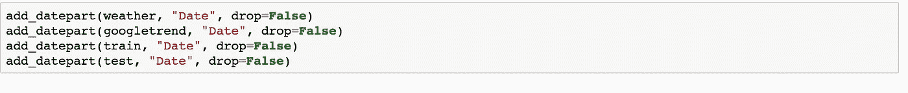

`add_datepart`函数接受一个数据框和一个列名。它可选地从数据框中移除该列，并用表示关于该日期的所有有用信息的许多列来替换它，例如星期几、月几、月几、是四分之一开始还是四分之一结束等等。我们最后列出了我们的功能:

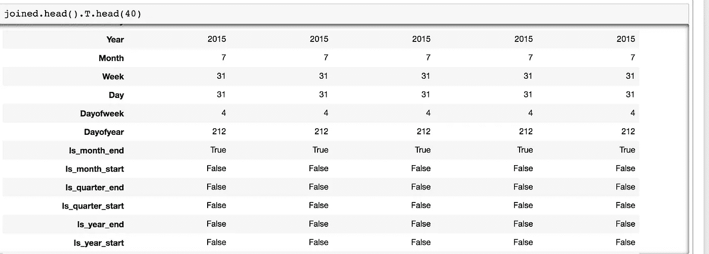

例如，`DayOfWeek`现在变成了 8 行乘 4 列的嵌入矩阵。从概念上讲，这允许我们的模型创建一些有趣的时间序列模型。如果有一个七天周期的东西，在周一上升，在周三下降，但只在柏林，它完全可以做到这一点，它有它需要的所有信息。

这是一个处理时间序列的绝妙方法。*您只需确保您的时间序列中的周期指标以列的形式存在。*如果没有一个名为星期几的列，神经网络将很难学会进行除法 mod 并在嵌入矩阵中查找。这不是不可能，但真的很难。

例如，如果您预测三藩市的饮料销售，您可能想要美国电话电报公司公园的球赛何时开始的列表，因为这将影响到索玛有多少人在喝啤酒。*所以你需要确保基本指标或周期性在你的数据中，只要它们在，神经网络就要学会使用它们。*

## 学习者

```
m = md.get_learner(emb_szs, len(df.columns)-len(cat_vars),
                   0.04, 1, [1000,500], [0.001,0.01], y_range=y_range)
m.summary()
```

`emb_szs`嵌入尺寸

`len(df.columns)-len(cat_vars)`数据帧中连续变量的数量。

`0.04`嵌入矩阵有自己的漏失，这就是漏失率。

`1`我们想要创造多少产出，即销售这一最后线性层的产出。

`[1000, 500]`第一线性层和第二线性层的激活次数。

`[0.001,0.01]`第一线性层和第二线性层的脱落。

我们有一个 leaner，让我们找出学习率(`lr = 1e-3`):

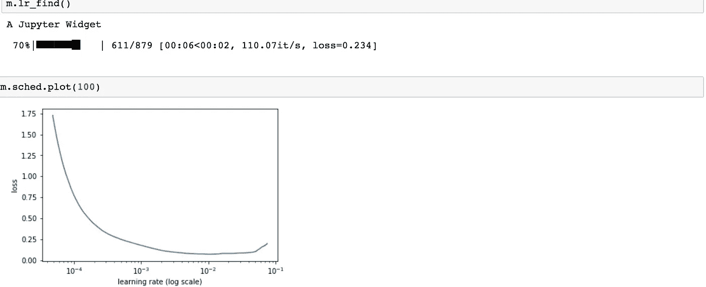

## 合适的

从样本数据开始:

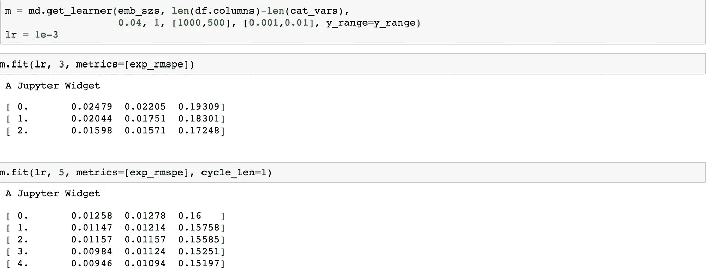

`metrics`这是一个自定义指标，它指定了一个函数`exp_rmspe`，该函数在每个时期结束时被调用并打印出结果。

拟合所有数据:

```
m.fit(lr, 1, metrics=[exp_rmspe], cycle_len=1)*[ 0\.       0.00676  0.01041  0.09711]*
```

通过使用所有的训练数据，我们得到 0.09711 的 RMSPE。这会让我们在排行榜上名列前茅。

所以这是一种处理时间序列和结构化数据的技术。有趣的是，与使用这种技术的小组[分类变量的实体嵌入](https://arxiv.org/abs/1604.06737)相比，第二名获胜者做了更多的特征工程。这场比赛的获胜者实际上是物流销售预测方面的专家，所以他们有自己的代码来创建大量的功能。

Pinterest 的人们建立了一个非常相似的推荐模型，他们也说*当他们从梯度推进机器转向深度学习时，他们做了更少的特征工程，这是一个更简单的模型，需要更少的维护。*所以这是使用这种方法进行深度学习的一大好处，你可以获得最先进的结果，但工作量要少得多。

*我们是否使用了任何时间序列？*间接的，是的。正如我们刚刚看到的，我们的列中有一个`DayOfWeek`、`MonthOfYear`等，它们中的大多数被视为类别，因此我们正在构建一月、星期日等的分布式表示。我们没有使用任何经典的时间序列技术，我们所做的只是神经网络中两个完全连接的层。与任何标准的时间序列技术相比，嵌入矩阵能够以更丰富的方式处理诸如星期几的周期性之类的事情。

*图像模型和这个模型有什么区别？我们称呼`get_learner`的方式有所不同。在成像中，我们只是做了`Learner.trained`并传递数据:*

```
learn = ConvLearner.pretrained(arch, data, ps=0., precompute=True)
```

对于这些类型的模型，事实上对于很多模型，我们建立的模型依赖于数据。在这种情况下，我们需要知道我们有什么嵌入矩阵。所以在这种情况下，数据对象创建了学习者:

```
m = md.get_learner(emb_szs, len(df.columns)-len(cat_vars), 0.04, 1,
                   [1000,500], [0.001,0.01], y_range=y_range)
```

# 步伐

**第一步**。列出分类变量名称，列出连续变量名称，并将它们放入 Pandas 数据帧中:

```
cat_vars = ['Store', 'DayOfWeek', 'Year', 'Month', 'Day', 'StateHoliday', 'CompetitionMonthsOpen',
    'Promo2Weeks', 'StoreType', 'Assortment', 'PromoInterval', 'CompetitionOpenSinceYear', 'Promo2SinceYear',
    'State', 'Week', 'Events', 'Promo_fw', 'Promo_bw', 'StateHoliday_fw', 'StateHoliday_bw',
    'SchoolHoliday_fw', 'SchoolHoliday_bw']contin_vars = ['CompetitionDistance', 'Max_TemperatureC', 'Mean_TemperatureC', 'Min_TemperatureC',
   'Max_Humidity', 'Mean_Humidity', 'Min_Humidity', 'Max_Wind_SpeedKm_h', 
   'Mean_Wind_SpeedKm_h', 'CloudCover', 'trend', 'trend_DE',
   'AfterStateHoliday', 'BeforeStateHoliday', 'Promo', 'SchoolHoliday']
```

**第二步**。创建您希望在验证集中包含哪些行索引的列表:

```
val_idx = np.flatnonzero(
    (df.index<=datetime.datetime(2014,9,17)) & (df.index>=datetime.datetime(2014,8,1)))
```

**第三步**。调用这一行代码:

```
md = ColumnarModelData.from_data_frame(PATH, val_idx, df, 
         yl.astype(np.float32), cat_flds=cat_vars, bs=128, 
         test_df=df_test)
```

**第四步**。创建一个列表，列出您希望每个嵌入矩阵有多大:

```
emb_szs = [(c, min(50, (c+1)//2)) for _,c in cat_sz]
emb_szs
[(1116, 50),
 (8, 4),
 (4, 2),
 (13, 7),
 (32, 16),
 (3, 2),
 (26, 13),
 (27, 14),
 (5, 3),
 (4, 2),
 (4, 2),
 (24, 12),
 (9, 5),
 (13, 7),
 (53, 27),
 (22, 11),
 (7, 4),
 (7, 4),
 (4, 2), ...
```

**第五步**。打电话给`get_learner`——你可以用这些精确的参数开始，如果它不合适，你可以摆弄它们。

```
m = md.get_learner(emb_szs, len(df.columns)-len(cat_vars), 0.04, 1,
                   [1000,500], [0.001,0.01], y_range=y_range)
```

**第六步**。呼叫`m.fit`

```
m.fit(lr, 3, metrics=[exp_rmspe])
```

*如何对这种类型的数据使用数据扩充，以及 dropout 是如何工作的？不知道。可能它必须是特定领域的，但他(杰里米)从未见过任何论文或行业中的任何人使用结构化数据和深度学习进行数据增强。他认为这是可以做到的，但还没有看到它的实现。dropout 实际上是抛出了一阶张量的一半激活。这也适用于嵌入矩阵。*

*有什么坏处？几乎没有人在用这个。为什么不呢？基本上答案是，学术界没有人在研究这个，因为这不是人们发表的东西。因此，还没有真正伟大的例子，人们可以看着并说“哦，这里有一种技术工作得很好，让我们的公司实现它吧”。但也许同样重要的是，直到现在有了这个 Fast.ai 库，还没有任何方法可以方便地做到这一点。如果您想要实现这些模型中的一个，您必须自己编写所有的定制代码。现在是 6 步流程。有很多巨大的商业和科学机会来利用这一点，解决以前没有很好解决的问题。*

# 自然语言处理

这是深度学习最有前途的领域，比计算机视觉落后两三年。软件的状态和一些概念远没有计算机视觉成熟。

你在 NLP 中发现的一件事是你可以解决特定的问题，它们有特定的名字。在自然语言处理中有一种特殊的问题叫做**“语言建模”——**这意味着给定一个句子中的几个单词，建立一个模型来预测下一个单词会是什么。

例如，当你输入时，按下空格键，下一个单词是一个语言模型。

为了这个练习，我们从 arXiv.org 下载了 18 个月的论文

数据:

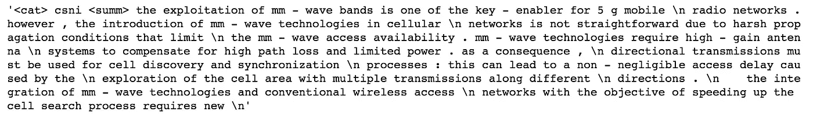

`<cat>` —纸张的类别。CSNI 是计算机科学和网络。

`<summ>` —论文摘要。

让我们看看一个经过训练的语言模型的输出，我们传递了类别，在这种情况下是 csni(计算机科学和网络)和一些启动文本:

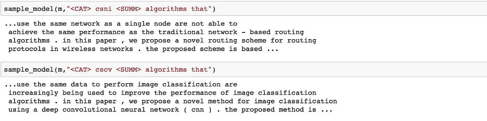

该模型通过阅读 arXiv 论文了解到，某个写计算机网络的人会这样说话。记住，一开始根本不懂英语。它从随机的每个英语单词的嵌入矩阵开始。通过阅读大量的 arXiv 论文，它学会了跟随他人的是什么样的单词。

该模型不仅学会了如何很好地书写英语，而且在你说出类似“卷积神经网络”的东西后，它会使用括号来指定一个缩写词“(CNN)”。

我们将尝试创建一个预训练模型，用于执行其他一些任务。例如，给定 IMDB 电影评论，我们将计算出它们是正面的还是负面的。这是一个分类问题。

我们想使用一个预先训练的网络，至少知道如何阅读英语。因此，我们将训练一个预测句子下一个单词的模型，即语言模型，就像在计算机视觉中一样，在末尾添加一些新层，并要求它预测某事是积极的还是消极的。

基本上，创建一个语言模型，并使其成为分类模型的预训练模型。

*为什么直接做自己想做的事不会更好？*事实证明，它的表现并不理想。有几个原因。首先，我们知道微调一个预先训练好的网络是非常强大的。因此，如果我们能让它先学习一些相关的任务，那么我们就可以利用所有的信息来帮助它完成第二项任务。另一个原因是 IMDB 电影评论长达 1000 字。因此，在阅读了 1000 个单词(整数)后，你对英语的结构或单词或标点符号的概念一无所知，你得到的只是 1 或 0(肯定或否定)。试图学习英语的整个结构，然后用一个数字来表达积极和消极的情绪，这实在是太难了。通过建立语言模型，我们首先建立了一个理解电影评论英语的神经网络，然后我们希望它学习的东西将有助于决定评论是积极还是消极。

*这与卡帕西的夏尔-RNN 相似吗？*这有点类似于夏尔-RNN，它在给定多个前一个字母的情况下预测下一个字母。语言模型通常在单词级工作，但它们不是必须，我们将集中在单词级建模上。

*这些生成的单词和句子在多大程度上是它在训练数据集中找到的内容的实际副本？这些单词肯定是它以前见过的单词，因为它不在字符级别，所以它只能给我们它以前见过的单词。句子，有几种严格的方法，但最简单的方法是看上面的例子，它创建了两个类别，看着它们，它创建了相似的概念。*

最重要的是，当我们训练语言模型时，我们将有一个验证集，以便我们试图预测从未见过的东西的下一个单词。

文本分类示例:

1.  对冲基金，可能会在文章或 Twitter 中找出过去导致市场大幅下跌的原因。
2.  识别客户服务查询，这些查询往往与下个月取消订阅的人有关。
3.  将 if 文档分类为它们是否属于法律查询的一部分。

# IMDB

## 进口

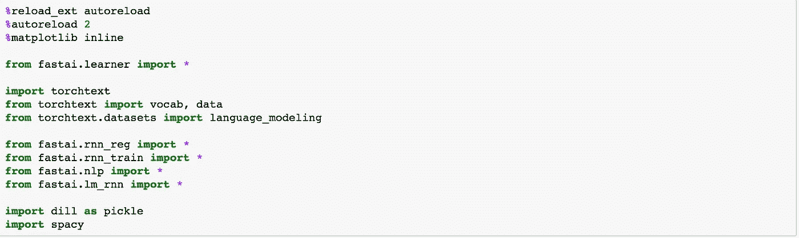

PyTorch 的 NLP 图书馆。

## 数据

[大型电影观看数据集](http://ai.stanford.edu/~amaas/data/sentiment/)包含来自 IMDB 的 50，000 条评论。数据集包含偶数个正面和负面评论。作者只考虑了高度两极分化的评论。负面评价得分≤ 4 分(满分 10 分)，正面评价得分≥ 7 分(满分 10 分)。中立评论不包括在数据集中。数据集分为训练集和测试集。训练集是同样的 25，000 个带标签的评论。

**情感分类任务**包括预测给定文本的极性(积极或消极)。

然而，在我们尝试对*情感*进行分类之前，我们将简单地尝试创建一个*语言模型*；也就是可以预测句子下一个单词的模型。为什么？因为我们的模型首先需要理解英语的结构，然后我们才能期望它识别积极情绪和消极情绪。

因此，我们的攻击计划与我们用于狗对猫的计划相同:预训练一个模型来做一件事(预测下一个单词)，并微调它来做其他事情(对情绪进行分类)。

不幸的是，没有好的预训练语言模型可供下载，所以我们需要创建自己的模型。

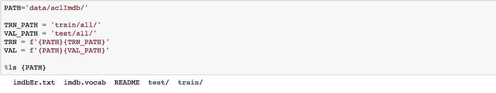

在这种情况下，我们没有单独的测试和验证。培训目录中有许多代表电影评论的文件:

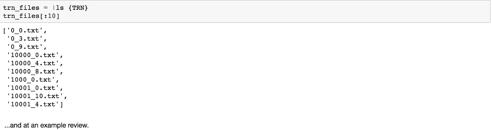

看一个电影评论的例子:

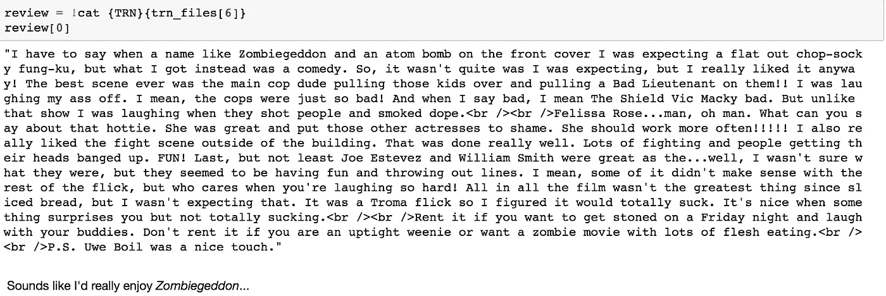

让我们分别检查训练数据集和测试数据集中有多少个单词:

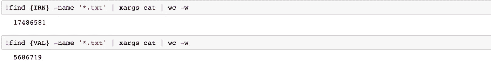

在我们分析文本之前，我们必须先对它进行 ***标记化*** 。这指的是将一个句子拆分成一个单词数组，或者更一般地说，拆分成一个*记号*数组的过程。

一个好的标记器会很好的识别你句子中的片段。每个分隔的标点符号都将被分隔，多部分单词的每个部分也将被适当分隔。下面是标记化的一个示例:

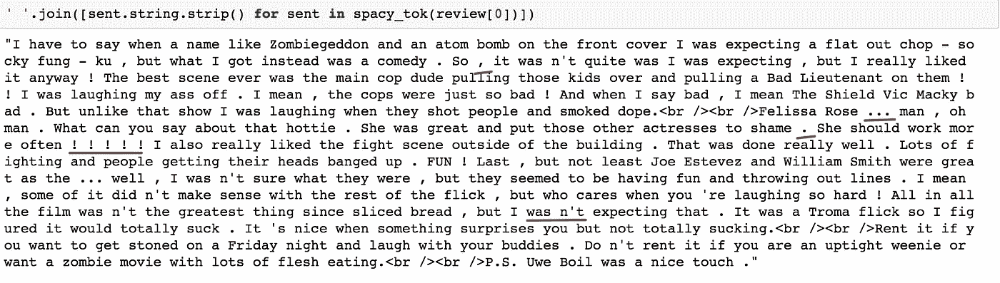

我们使用 Pytorch 的 [torchtext](https://github.com/pytorch/text) 库来预处理我们的数据，告诉它使用 [spacy](https://spacy.io/) 库来处理标记化。

## 创建一个字段

首先，我们创建一个 torchtext *字段*，它描述了如何预处理一段文本——在本例中，我们告诉 torchtext 将所有内容都变成小写，并用 spacy 对其进行标记。

```
TEXT = data.Field(lower=True, tokenize="spacy")
```

`lower=True` —小写文本

`tokenize=spacy_tok` —用`spacy_tok`来标记

我们利用`LanguageModelData`为语言建模创建一个 ModelData 对象，向它传递我们的 torchtext 字段对象，以及我们的训练、测试和验证集的路径。在这种情况下，我们没有单独的测试集，所以我们也将使用`VAL_PATH`。

```
bs=64; bptt=70FILES = dict(train=TRN_PATH, validation=VAL_PATH, test=VAL_PATH)
md = LanguageModelData.from_text_files(PATH, TEXT, **FILES, bs=bs, bptt=bptt, min_freq=10)
```

`PATH`数据在哪里，模型就保存在哪里

`TEXT` torchtext 关于如何预处理文本的字段定义。

我们拥有的所有文件的列表:培训、验证和测试

`bs`批量大小

`bptt` **背道具穿越时间**。意思是我们一次在 GPU 上贴多长的句子

`min_freq=10`:一会儿，我们将把单词替换成整数，即每个单词都有一个唯一的索引。如果有什么单词出现次数少于 10 次，就叫不认识。

在构建了我们的`ModelData`对象之后，它会自动为`TEXT`对象填充一个非常重要的属性:`TEXT.vocab`。这是一个*词汇表*，它存储了文本中出现过的单词(或*记号*)，以及每个单词将如何映射到一个唯一的整数 id。我们以后还需要使用这些信息，所以我们保存了这些信息。

*(技术说明:python 的标准* `*Pickle*` *库无法正确处理这个，所以在这个笔记本的顶部我们用了* `*dill*` *库代替，导入为* `*pickle*` *)* 。

这是从整数 id 到唯一令牌的映射的开始:

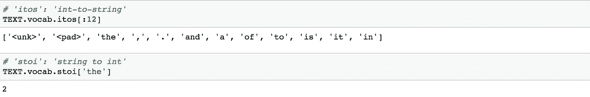

`vocab`让我们将一个单词与一个整数匹配，一个整数与一个单词匹配。我们将使用整数。

做词干分析或词干分析很常见吗？不完全是，不。一般来说，标记化是我们想要的。为了尽可能地概括，我们想知道接下来会发生什么，所以不管它是将来时还是过去式，是复数还是单数，我们都不知道哪些事情会变得有趣，哪些事情不会，所以似乎最好是尽可能不去管它。

*在处理自然语言的时候，语境不重要吗？为什么我们要标记和查看单个单词？不，我们不是在看单个单词，它们仍然是有序的。只是因为我们用数字 12 代替了 I，它们还是那个顺序。*

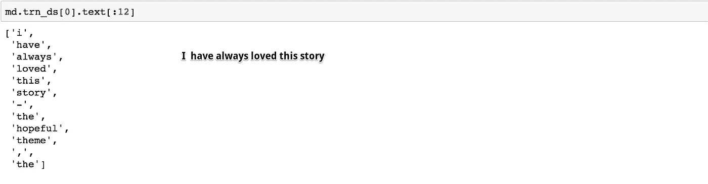

有一种不同的处理自然语言的方式叫做“单词袋”，他们确实抛弃了顺序和上下文。在机器学习课程中，我们将学习如何使用单词包表示法，但它们不再有用或即将变得不再有用。我们开始学习如何使用深度学习来恰当地使用上下文。

## 批量大小和**回柱通过时间(** BPTT)

在语言模型中发生的事情是，即使我们有许多电影评论，它们都被连接在一起成为一大块文本。因此，我们预测这个巨大的东西的下一个词是所有的 IMDB 电影评论串联在一起。

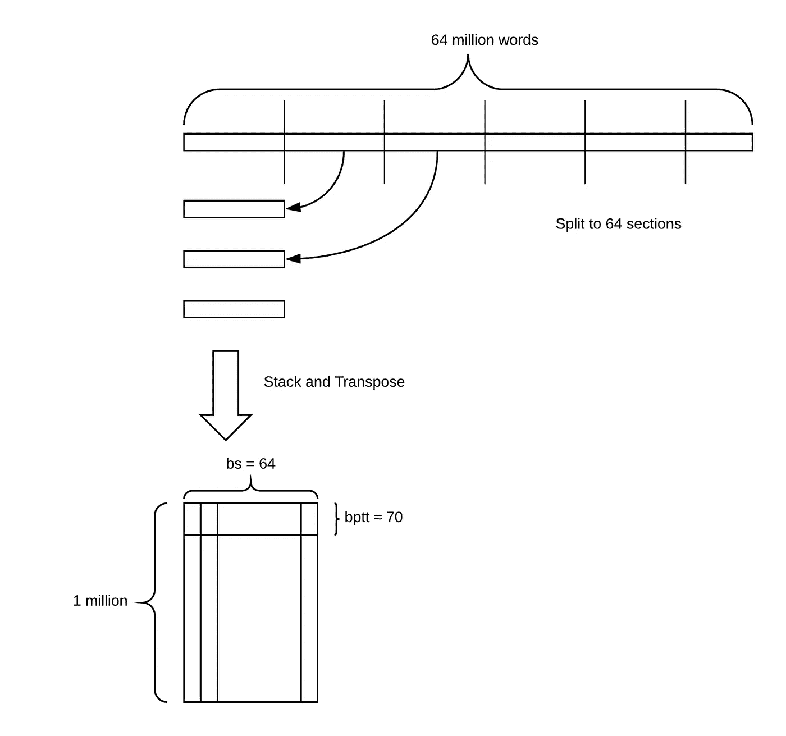

我们从一大块文本开始，例如 6400 万字。我们将串联的评论分成批次。在这种情况下，我们将把它分成 64 个部分。然后，我们将每个部分移动到前一部分的下方，并对其进行移调。我们最终得到一个 100 万乘 64 的矩阵。然后，我们在时间上抓取一个小块，这些块的长度*大约*等于 BPTT(这随着每个时期而变化)。我们抓取一个 70 长的小片段，这是我们第一次放入 GPU，也就是批处理。

我们的`LanguageModelData`对象将创建具有 64 列的批处理(这是我们的批处理大小)，以及大约 80 个令牌的不同序列长度(这是我们的`bptt`参数- *通过时间*反向传播)。

每个批次还包含与标签完全相同的数据，但在文本中晚了一个单词，因为我们总是试图预测下一个单词。标签被展平成一维数组。

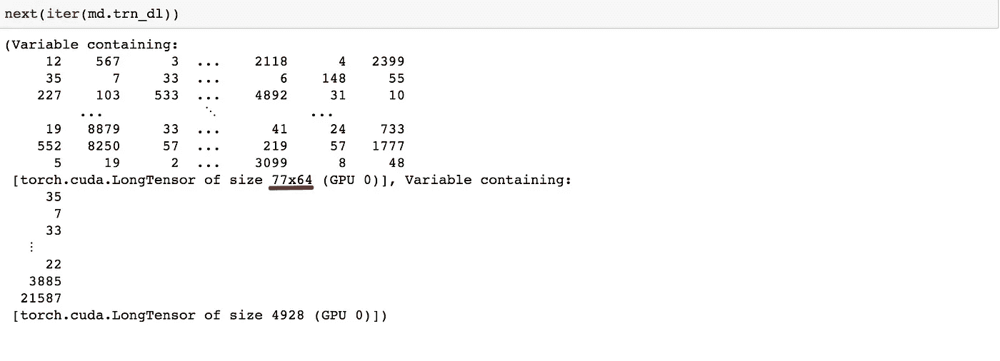

我们通过用`iter`包装数据加载器(`md.trn_dl`)然后调用`next`来获取第一批训练数据

我们得到一个 77 乘 64 的张量，大约有 70 行，但不完全是。

Torchtext 每次都会随机改变`bptt`的数字，因此每个时期它都会获得稍微不同的文本比特——类似于计算机视觉中的混洗图像。我们不能随机打乱单词的顺序，因为它们需要有正确的顺序，所以相反，我们随机地移动它们的断点一点点。

77 代表第一篇影评的前 77 个字。

*为什么不按句子拆分？不尽然。记住，我们使用的是列。所以我们的每一列都有大约一百万的长度，虽然这些列并不总是以句号结尾，但是它们太长了，我们并不在乎。每列包含多个句子。*

## 创建模型

现在，我们有了一个模型数据对象，它可以为我们提供批处理，我们可以创建一个模型。首先，我们要创建一个嵌入矩阵。

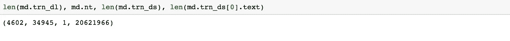

`4602`批次数量

`34945`在`vocab`中唯一令牌的数量(唯一字必须至少出现 10 次`min_freq=10`，否则它们将被替换为`Unk`)

`1`数据集的长度，即整个语料库

`20621966`语料库中的字数。

34945 用于创建嵌入矩阵:

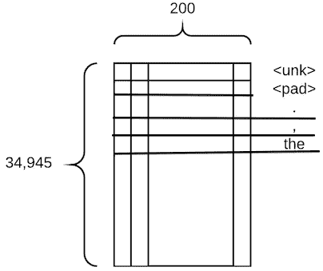

每个单词都有一个嵌入向量。这是一个分类变量，它是一个基数很高的分类变量。这是 34945 分类变量，这就是为什么我们为它创建一个嵌入矩阵。

我们需要设置许多参数:

```
em_sz = 200  *# size of each embedding vector*
nh = 500     *# number of hidden activations per layer*
nl = 3       *# number of layers*
```

嵌入大小为 200，比我们之前的嵌入向量大得多。这并不奇怪，因为一个词比星期天的概念有更多的细微差别。

> 一般来说，一个单词的嵌入大小在 50 到 600 之间。

研究人员发现，大量的*动量*不能很好地与这些类型的 *RNN(递归神经网络)*模型一起工作，因此我们创建了一个版本的 *Adam* 优化器，其动量小于默认的`0.9`。

```
opt_fn = partial(optim.Adam, betas=(0.7, 0.99))
```

Fastai 使用了由 Stephen Merity 开发的最新的 AWD·LSTM 语言模型的变体。该模型的一个关键特征是，它通过[退出](https://en.wikipedia.org/wiki/Convolutional_neural_network#Dropout)提供了出色的正则化。没有已知的简单方法(还没有！)要找到以下辍学参数的最佳值，您只需进行实验…

然而，其他参数(`alpha`、`beta`和`clip`)通常不需要调整

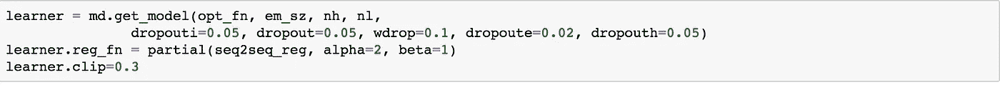

如果你试图建立一个 NLP 模型，并且你是欠拟合的，那么减少所有这些漏失，如果是过拟合的，那么大约以这个比例增加所有这些漏失。

还有其他方法可以避免过度拟合。目前，`learner.reg_fn = partial(seq2seq_reg, alpha=2, beta=1)`工作可靠，所以所有的 NLP 模型可能都需要这条特别的线。

`learner.clip=0.3`当你查看你的梯度，将它们乘以学习率，决定你的权重更新多少，这不会让它们超过 0.3。防止我们迈出太大的步伐(高学习率)。

有一些单词嵌入其中，例如 Word2vec 或 GloVe。它们和这个有什么不同？为什么不一开始就用这些来初始化权重呢？人们在做各种其他任务之前已经预先训练了这些嵌入矩阵。它们不被称为预训练模型；它们只是一个预先训练好的嵌入矩阵，你可以下载。我们没有理由不下载它们。以这种方式建立一个完整的预训练模型似乎不会从使用预训练的单词向量中受益太多；在其他地方，使用整个预先训练的语言模型会产生更大的差异。也许我们可以把两者结合起来，使它们更好一点。

*模型的架构是什么？*它是一个 ***递归神经网络*** 使用一种叫做 ***LSTM* (长短期记忆)**的东西。

## 拟合模型

```
learner.fit(3e-3, 4, wds=1e-6, cycle_len=1, cycle_mult=2)
learner.save_encoder('adam1_enc')
learner.load_encoder('adam1_enc')learner.fit(3e-3, 1, wds=1e-6, cycle_len=10) 
```

在情感分析部分，我们只需要语言模型的一半——***编码器*** ，所以我们保存这部分:

```
learner.save_encoder('adam3_10_enc')
learner.load_encoder('adam3_10_enc')
```

语言建模精度一般用度量 ***困惑*** 来衡量，简单来说就是我们使用的损失函数的`exp()`。

```
math.exp(4.165)*64.3926824434624*pickle.dump(TEXT, open(f'**{PATH}**models/TEXT.pkl','wb'))
```

## 测试

我们可以对我们的语言模型进行一些试验，以检查它是否工作正常。首先，让我们创建一小段文本来“启动”一组预测。我们将使用 torchtext 字段对其进行数值化，这样我们就可以将其输入到我们的语言模型中。

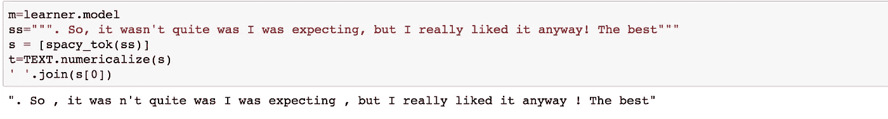

我们还没有添加方法来简化语言模型的测试，所以我们需要手动完成以下步骤:

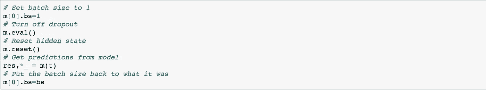

让我们看看短文后的下一个单词的十大预测是什么:

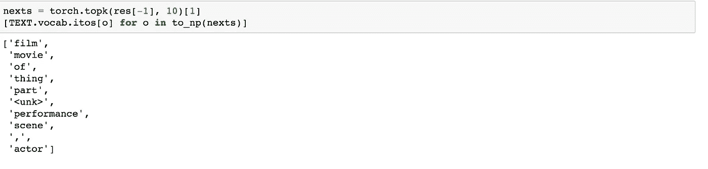

让我们看看我们的模型是否可以自己生成更多的文本:

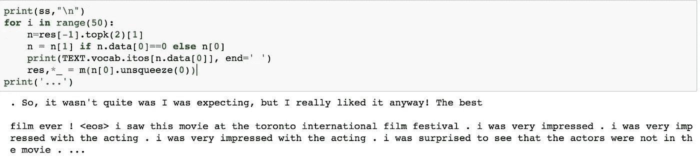

**情感分析**

我们有一个预训练的语言模型，现在我们想对它进行微调，以进行情感分类。我们需要从语言模型中保存 vocab，因为我们需要确保相同的单词映射到相同的 id。

```
TEXT = pickle.load(open(f'{PATH}models/TEXT.pkl','rb'))
```

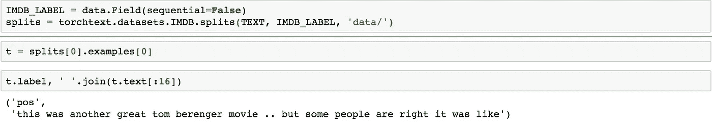

`sequential=False`告诉 torchtext 应该对文本字段进行标记化(在这种情况下，我们只想存储‘正’或‘负’单个标签)。

我们不需要把整件事当作一大段文字，但每篇评论都是独立的，因为每篇评论都有不同的情感。

`splits`是一个创建训练集、测试集和验证集的 torchtext 方法。IMDB 数据集内置于 torchtext 中，因此我们可以利用这一点。看一看`lang_model-arxiv.ipynb`，了解如何定义自己的 fastai/torchtext 数据集。

Splits 允许我们查看单个标签`t.label`和一些文本`t.text`

fastai 可以直接从 torchtext 分割中创建一个 ModelData 对象，我们可以在`md2`上训练它:

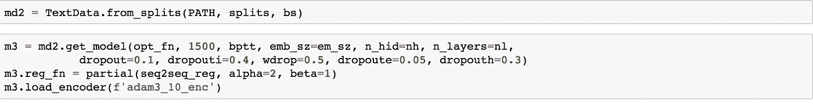

`get_model`获取我们的学习者，然后我们可以将预先训练好的语言模型`m3.load_encoder(f’adam3_10_enc’)`加载到其中。

因为我们正在微调一个预训练的模型，我们将使用不同的学习率，并增加剪辑的最大梯度，以使 SGDR 更好地工作。

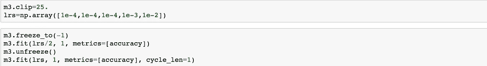

我们要确保除了最后一层之外的都被冻结了。然后我们训练一下，解冻它，训练一下。好的一面是，一旦你有了一个预先训练好的语言模型，它实际上训练得非常快。

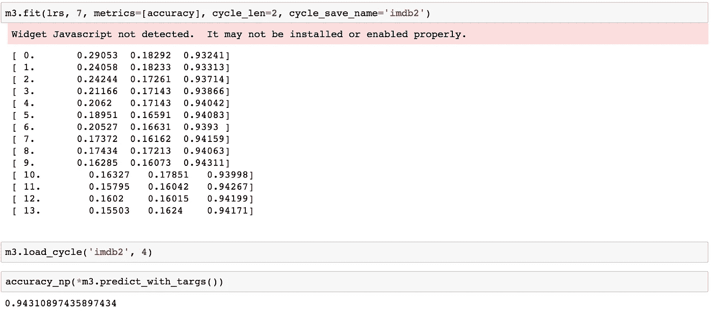

Bradbury 等人最近的一篇论文，[在翻译中学习:语境化的词向量](https://einstein.ai/research/learned-in-translation-contextualized-word-vectors)，对解决 IMDB 情感分析问题的最新学术研究进行了方便的总结。这里展示的许多最新算法都是针对这个特定问题进行调整的。

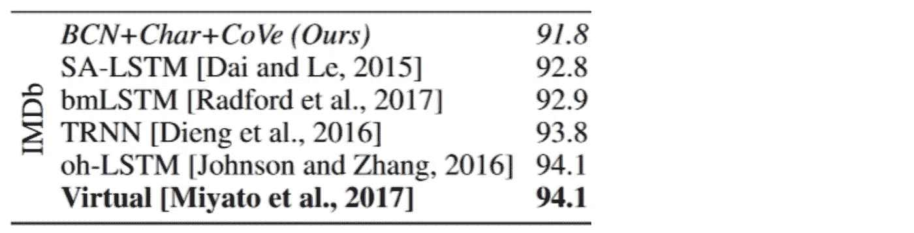

正如你所看到的，我们刚刚在情感分析中获得了一个新的最先进的结果，将误差从 5.9%降低到了 5.5%！使用相同的基本步骤，您应该能够在其他 NLP 分类问题上获得类似的世界级结果。

有很多机会可以进一步改善这一点:

例如，我们可以开始训练查看大量医学期刊的语言模型，然后制作一个可下载的医学语言模型，然后任何人都可以使用它来微调医学文献的前列腺癌子集。

我们也可以将这与预先训练的单词向量相结合。

我们可以预先训练维基百科语料库语言模型，然后将其微调为 IMDB 语言模型，然后将其微调为 IMDB 情感分析模型，我们会得到比这更好的结果。

# 协同过滤

## 数据:

电影镜头数据

[http://files . group lens . org/datasets/movie lens/ml-latest-small . zip](http://files.grouplens.org/datasets/movielens/ml-latest-small.zip)

```
path='data/ml-latest-small/'
```

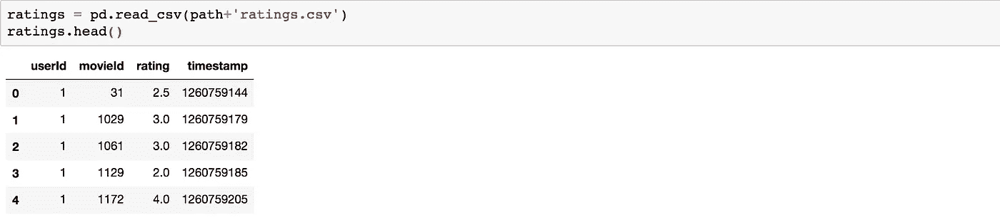

它包含了`userId`电影`movieId` `rating` 和`timestamp`

我们的目标将是一些我们以前没有见过的用户-电影组合，我们必须预测他们是否会喜欢它。这就是推荐引擎的构建方式。

让我们也来读一下电影名:

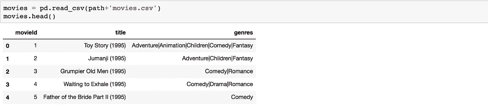

我们将(在下一课中)创建一种电影用户交叉标签:

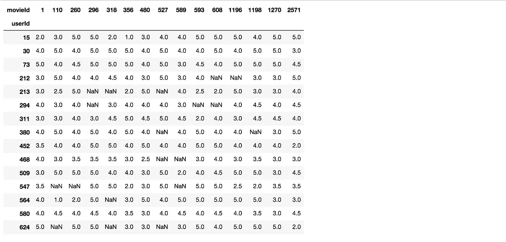

感谢阅读！*跟随*[*@ itsmuriuki*](https://twitter.com/itsmuriuki)*。*

回归学习！