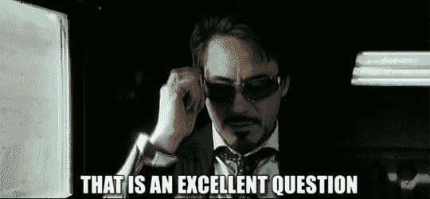
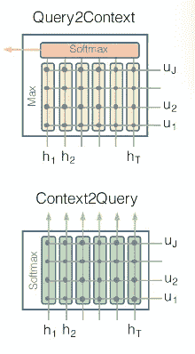

# 深度学习问题—带演示的答案模型

> 原文：<https://towardsdatascience.com/deep-learning-question-answer-model-with-demo-e21e43f60dd5?source=collection_archive---------4----------------------->

用数据做很酷的事情！

question-answer gif

如果一个模型可以通过从段落中提取最相关的单词来回答任何段落中的问题，那该有多神奇。深度学习让这一切成为可能！

下面看一个[演示](http://www.deeplearninganalytics.org/demos)这样的问答超级模型。在这个[演示中](http://www.deeplearninganalytics.org/demos)，你可以在任何语境中输入多达 300 个单词，并从中提出任何类型的问题。模型托管在 AWS 上，从那里返回结果。我很抱歉演示有点慢，因为我还没有机会优化这个模型的部署。

试玩链接:【http://www.deeplearninganalytics.org/demos 

这个模型非常通用，可以有很多实际应用。例如，作为一个机器人，它可以链接到任何网页，所以用户可以问问题，它可以在页面上搜索答案。另一个我个人认为非常有用的想法是链接到大多数人不看就点击我同意的合同条款。如果用户可以问一些重要的问题，而不需要阅读一大堆法律术语，那会怎么样？请看下面的一个小例子:

> 背景:转换条款经常出现在军火合同中。该功能允许您在指定时间将 ARM 转换为固定利率抵押贷款。条款和条件因贷款人而异。不过，一般来说，你必须在转换前提前 30 天通知你的贷款人。你还必须支付一笔费用，通常是 250 到 500 美元。一些贷款人指定何时可以进行转换，而其他人则允许在贷款的前三至五年内的任何时间进行转换。
> 
> 问:转换条款的相关费用是多少？
> 
> 模型的答案:250 到 500 美元

看看这个模型是如何将最后一句关于费用的话与转换条款联系起来的，尽管确切的术语“转换条款”在开头只提到过一次。它可以进行共指解析，这意味着它可以将像它/他们这样的代词正确地关联到实体。

这个模型有几个惊人之处:

*   它已经接受了维基百科数据的训练，在它能理解的文本类型方面非常灵活。我已经尝试了各种各样的主题，从新闻，体育，合同条款，财产数据，它真的工作
*   研究不同类型的问题——谁、何时、做什么、如何等等
*   它返回的答案来自段落，因为它被编码为在段落中找到最相关的单词子集

但它并不完美。主要缺点是:

*   目前，即使问了一个完全随机的问题，它也会返回一个答案。一种可能的增强是训练它在与答案相关联的置信度低时不返回答案
*   模型准确性虽然相当好，但并不完美，随着深度学习研究产生最稳健的方法，模型将随着时间的推移而改进

你可以在我的 [Github](https://github.com/priya-dwivedi/cs224n-Squad-Project) 上找到模型的代码。

如果你对这种模式的运作方式感到好奇，我已经在我的博客[这里](/nlp-building-a-question-answering-model-ed0529a68c54)分享了它的细节。

一个简短的总结是:

# 资料组

这个模型建立在**S**tanford**Qu**estion**A**nswering**D**ataset([SQuAD](https://rajpurkar.github.io/SQuAD-explorer/)1.1)数据集上，该数据集由一组维基百科文章上的众包工作者提出的问题组成，其中每个问题的答案都是相应阅读文章中的一段文字，或 *span* 。SQuAD 拥有 500+篇文章上的 100，000+问答对，比以前的阅读理解数据集大得多。

[小队的主要特征](https://rajpurkar.github.io/SQuAD-explorer/):

I)它是一个封闭的数据集，意味着问题的答案总是上下文的一部分，也是上下文的连续跨度

ii)因此找到答案的问题可以简化为找到对应于答案的上下文的开始索引和结束索引

iii) 75%的答案长度小于等于 4 个单词

# 模型

这个模型的实现使用了 [BiDAF](https://allenai.github.io/bi-att-flow/) 注意模块，并做了一些改进。模型中的主要层是:

1.  输入上下文和问题被预处理，转换成原始单词，并且这些单词使用预先训练的手套模型被转换成单词嵌入
2.  双向 LSTM 层对上下文和问题分别进行编码，创建隐藏的表示，查看给定单词前后的单词，以创建对文本的理解
3.  现在我们有了上下文和问题的表示，我们需要一起看它们来找到答案。这是通过注意力来完成的。该模型使用 BiDAF 注意力，允许注意力从上下文到问题和从问题到上下文的双向流动。并且这两个注意被连接以创建最终向量。见下面截图

BiDAF attention

4.我们还从 [BiDAF](https://allenai.github.io/bi-att-flow/) 借鉴了建模层的思想，使用双向 LSTM 来学习来自关注层的查询感知
上下文单词表示之间的交互

5.模型的最后一层是 softmax 输出层，帮助我们决定答案范围的开始和结束索引。我们结合上下文隐藏状态和来自前一层的注意力向量来创建混合代表。这些混合代表成为全连接层的输入，该全连接层使用 softmax 来预测开始和结束索引的概率

如果你喜欢这个帖子，请给我一个掌声:)希望你自己拉代码试试。另外，请试玩一下[演示](http://www.deeplearninganalytics.org/demos)，并分享您的任何反馈。

我有自己的深度学习咨询公司，喜欢研究有趣的问题。我已经帮助许多初创公司部署了基于人工智能的创新解决方案。请前往 http://deeplearninganalytics.org/的[酒店查看我们的酒店。](http://deeplearninganalytics.org/)

你也可以在[https://medium.com/@priya.dwivedi](https://medium.com/@priya.dwivedi)看到我的其他作品

如果你有一个我们可以合作的项目，请通过我的网站或 info@deeplearninganalytics.org 联系我

**参考文献:**

*   [小队数据集](https://rajpurkar.github.io/SQuAD-explorer/)
*   [BiDAF 型号](https://arxiv.org/abs/1611.01603)