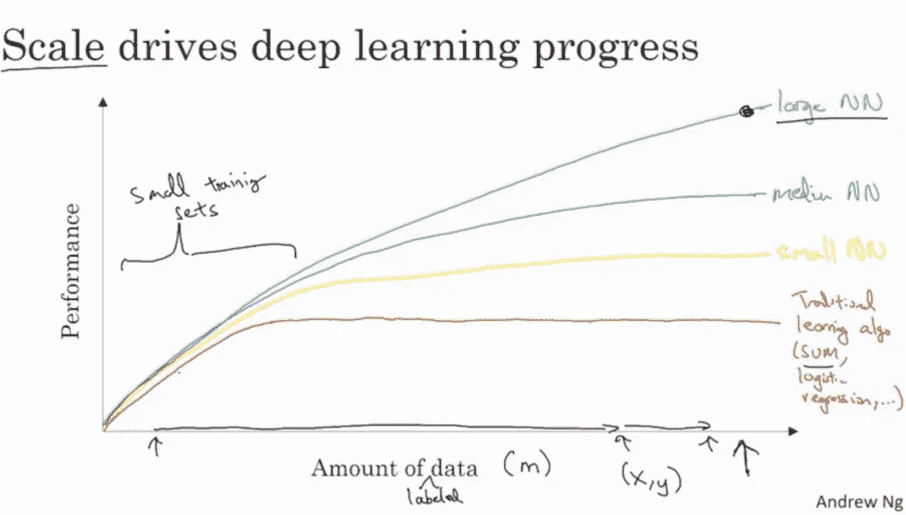
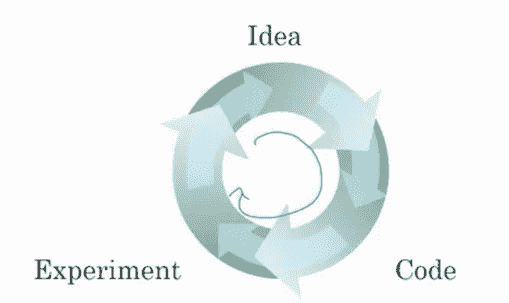
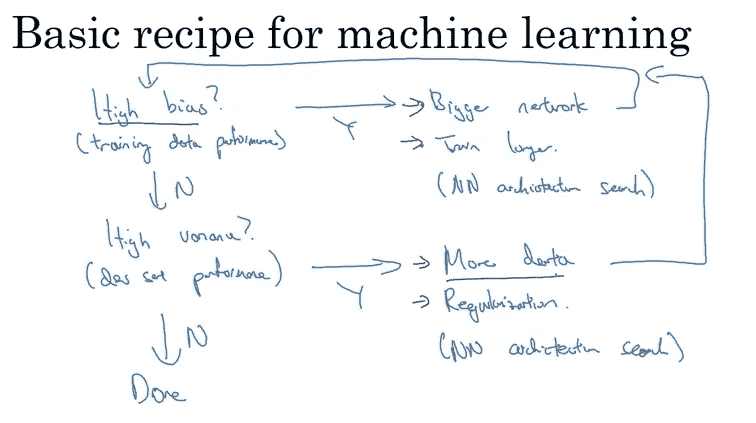
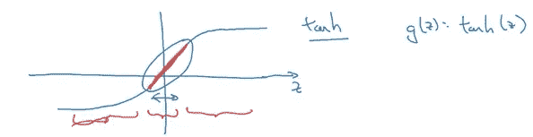
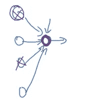
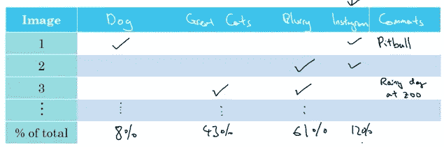

# 吴恩达深度学习专业化— 21 个经验教训

> 原文：<https://towardsdatascience.com/deep-learning-specialization-by-andrew-ng-21-lessons-learned-15ffaaef627c?source=collection_archive---------1----------------------->

Photo by [Charles Deluvio](https://unsplash.com/@charlesdeluvio?utm_source=medium&utm_medium=referral) on [Unsplash](https://unsplash.com?utm_source=medium&utm_medium=referral)

我最近完成了吴恩达在 Coursera 上的新深度学习课程的所有可用材料(截至 2017 年 10 月 25 日)。该专业目前有 3 门课程可供选择:

1.  神经网络和深度学习
2.  改进深度神经网络:超参数调整、正则化和优化
3.  构建机器学习项目

我发现这 3 门课都非常有用，并从吴恩达老师那里学到了大量的实用知识。Ng 出色地过滤了流行词汇，并以清晰简洁的方式解释了概念。例如，Ng 明确表示，受监督的深度学习只不过是一个多维曲线拟合过程，任何其他代表性的理解，如对人类生物神经系统的共同参考，充其量是松散的。

专门化只需要基本的线性代数知识和 Python 中的基本编程知识。然而，在我看来，你也应该了解向量微积分，以理解最优化过程的内部工作原理。如果你不关心内部工作，只关心获得高水平的理解，你可以跳过微积分视频。

## 第一课:为什么深度学习正在兴起？

90%的数据是在过去 2 年中收集的。深度神经网络(DNN 的)能够利用大量的数据。因此，DNN 氏症可以主宰较小的网络和传统的学习算法。

Shows how scale drives performance in DNN’s

此外，有许多算法上的创新使得 DNN 的训练速度大大提高。例如，从 sigmoid 激活函数切换到 RELU 激活函数对诸如梯度下降的优化过程具有巨大的影响。这些算法上的改进让研究人员可以更快地迭代整个想法->实验->代码周期，从而带来更多的创新。

Deep Learning Development Cycle

## 第 2 课:深度学习中的矢量化

在学习本课程之前，我并不知道可以在没有任何显式 for 循环的情况下实现神经网络(除了在层上)。Ng 在传达 Python 中矢量化代码设计的重要性方面做得非常好。家庭作业为你提供了一个样板矢量化代码设计，你可以很容易地将它转移到你自己的应用程序中。

## 第三课:深刻理解 DNN 的

第一个课程实际上让您从头开始实现 numpy 中的向前和向后传播步骤。通过这样做，我对 TensorFlow 和 Keras 等更高级框架的内部工作有了更深入的理解。Ng 解释了计算图背后的想法，这使我能够理解 TensorFlow 似乎如何执行“神奇的优化”。

## 第四课:为什么是深层表现？

Ng 对 DNN 作品的层次感有着直观的理解。例如，在面部检测中，他解释说早期的层用于将面部的边缘组合在一起，然后后期的层使用这些边缘来形成面部的部分(例如，鼻子、眼睛、嘴等)。)然后使用进一步的层将各部分放在一起并识别人。他还解释了电路理论的思想，电路理论基本上认为，存在需要指数数量的隐藏单元来适应浅层网络中的数据的函数。指数问题可以简单地通过增加有限数量的附加层来缓解。

## 第 5 课:解决偏差和差异的工具

Ng 解释了研究人员识别和解决偏差和方差问题的步骤。他描绘的画面给出了解决这些问题的系统方法。

Cookbook for addressing bias and variance problems

他还提出了普遍引用的偏差和方差之间的“权衡”。他解释说，在现代深度学习时代，我们有工具来分别解决每个问题，因此权衡不再存在。

## 第六课:正规化的直觉

为什么在成本函数中加入惩罚项会减少方差效应？在参加这个课程之前，我的直觉是，它迫使权重矩阵更接近于零，从而产生一个更“线性”的函数。Ng 给出了涉及 tanh 激活功能的另一种解释。其思想是较小的权重矩阵产生较小的输出，这将输出集中在双曲正切函数的线性部分周围。

tanh activation function

他还对辍学给出了一个有趣的直观解释。在参加这个课程之前，我认为辍学基本上是在每次迭代中杀死随机的神经元，所以这就好像我们在用一个更小的网络工作，这是更线性的。他的直觉是从单个神经元的角度看待生命。

Perspective from a single neuron

由于辍学是随机杀死连接，神经元被激励在它的父母之间更均匀地分配它的重量。通过展开权重，它往往具有缩小权重的平方范数的效果。他还解释说，辍学只不过是 L2 正则化的一种适应性形式，两种方法具有相似的效果。

## 第 7 课:为什么规范化有效？

Ng 演示了为什么归一化往往通过绘制等值线图来提高优化过程的速度。他明确地给出了一个在标准化和非标准化等高线图上迭代梯度下降的例子。

## 第 8 课:初始化的重要性

Ng 表明，参数的不良初始化会导致渐变消失或爆炸。他演示了几种解决这些问题的方法。基本思想是确保每层的权重矩阵的方差约为 1。他还讨论了 Xavier 初始化 tanh 激活函数。

## 第 9 课:为什么使用小批量梯度下降？

利用等高线图，ng 解释了小批量和大批量之间的权衡。基本的想法是，较大的规模会使每次迭代变得缓慢，而较小的规模允许您更快地取得进展，但是不能保证收敛。最好的方法是在两者之间做一些事情，这样可以比一次处理整个数据集的速度更快，同时还可以利用矢量化技术。

## 第十课:对高级优化技术的直观理解

Ng 解释了 momentum 和 RMSprop 等技术如何允许梯度下降来抑制其向最小值的路径。他还用一个球滚下山坡的过程给出了一个极好的物理解释。他将这些方法联系在一起，解释了著名的亚当优化过程。

## 第 11 课:基本的后端张量流理解

Ng 解释了如何使用 TensorFlow 实现神经网络，还解释了优化过程中使用的一些后端过程。其中一个家庭作业练习鼓励你使用张量流实现辍学和 L2 正则化。这进一步加强了我对后端流程的理解。

## 第 12 课:正交化

Ng 讨论了正交化在机器学习策略中的重要性。基本思想是，您希望实现一次只影响算法性能的单个组件的控件。例如，要解决偏差问题，您可以使用更大的网络或更强大的优化技术。您希望这些控件只影响偏差，而不影响其他问题，如泛化能力差。缺乏正交化的控制的一个例子是提前停止优化过程(提前停止)。这是因为它同时影响模型的偏差和方差。

## 第 13 课:单一数字评估指标的重要性

Ng 强调了选择一个单一数字评估指标来评估您的算法的重要性。如果您的目标发生了变化，那么您应该只在稍后的模型开发过程中更改评估指标。Ng 举了一个在猫分类应用中识别色情照片的例子！

## 第 14 课:测试/开发发行版

始终确保开发和测试集具有相同的分布。这确保了您的团队在迭代过程中瞄准了正确的目标。这也意味着，如果您决定纠正测试集中的标签错误的数据，那么您也必须纠正开发集中的标签错误的数据。

## 第 15 课:处理不同的培训和测试/开发发行版

Ng 给出了为什么一个团队对训练集和测试/开发集没有相同的分布感兴趣的原因。这个想法是，您希望评估度量是基于您真正关心的例子来计算的。例如，您可能希望使用与您的问题不相关的示例进行训练，但是您不希望根据这些示例来评估您的算法。这使得你的算法可以用更多的数据来训练。经验表明，这种方法在许多情况下会给你带来更好的性能。缺点是您的培训和测试/开发集有不同的发行版。解决方案是省去一小部分训练集，只确定训练集的泛化能力。然后，您可以将这个错误率与实际的开发错误进行比较，并计算一个“数据不匹配”度量。然后，Ng 解释了解决这种数据不匹配问题的方法，如人工数据合成。

## 第 16 课:培训/开发/测试规模

在深度学习时代，设置训练/开发/测试分离的指导方针发生了巨大的变化。在参加课程之前，我知道通常的 60/20/20 比例。Ng 强调，对于非常大的数据集，应该使用大约 98/1/1 甚至 99/0.5/0.5 的分割。这是因为开发和测试集只需要足够大，以确保团队提供的置信区间。如果您正在处理 10，000，000 个训练样本，那么 100，000 个样本(或 1%的数据)就足以保证您的开发和/或测试集有一定的置信度。

## 第 17 课:近似贝叶斯最优误差

Ng 解释了在某些应用中，如何将人的水平表现作为贝叶斯误差的代理。例如，对于视觉和音频识别等任务，人类水平的误差将非常接近贝叶斯误差。这允许你的团队量化你的模型中可避免的偏差的数量。如果没有贝叶斯误差这样的基准，就很难理解网络中的方差和可避免的偏差问题。

## 第十八课:错误分析

Ng 展示了一种显而易见的技术，通过使用误差分析来显著提高算法性能的有效性。基本思想是手动标记你的错误分类的例子，并把你的努力集中在对你的错误分类数据贡献最大的错误上。

Cat Recognition App Error Analysis

例如，在 cat 识别中，Ng 确定模糊图像是导致错误的最主要原因。这种敏感性分析可以让你看到在减少总误差上你的努力值多少钱。可能的情况是，修复模糊的图像是一项非常艰巨的任务，而其他错误是显而易见的，很容易修复。敏感性和近似工作量都将被纳入决策过程。

## 第 19 课:何时使用迁移学习？

转移学习允许您将知识从一个模型转移到另一个模型。例如，您可以将图像识别知识从猫识别应用程序转移到放射诊断。实施迁移学习包括用更多的数据重新训练用于类似应用领域的网络的最后几层。这个想法是，网络中早期的隐藏单元有更广泛的应用，它通常不特定于你使用网络的确切任务。总的来说，当两个任务有相同的输入特征，并且你试图学习的任务比你试图训练的任务有更多的数据时，迁移学习就起作用了。

## 第二十课:何时使用多任务学习？

多任务学习迫使单个神经网络同时学习多个任务(而不是每个任务都有一个单独的神经网络)。Ng 解释说，当一组任务可以从共享低级功能中受益，并且每个任务的数据量在数量上相似时，这种方法很有效。

## **第 21 课:何时使用端到端深度学习？**

端到端深度学习需要多个阶段的处理，并将它们合并到单个神经网络中。这允许数据自己说话，而没有在优化过程中人工工程步骤中显示的偏差。相反，这种方法需要更多的数据，可能会排除潜在的手工设计的组件。

## 结论

Ng 的深度学习课程让我对深度学习模型开发流程有了一个基础的直观认识。我上面解释的课程仅仅代表了本课程中材料的一个子集。完成课程后，你不会成为深度学习的专家。我对这门课唯一的不满是家庭作业太简单了。我写这篇文章没有得到 deeplearning.ai 的背书。

—

这就是所有人——如果你已经做到了这一步，请在下面评论并在 [LinkedIn](https://www.linkedin.com/in/ryanshrott/) 上加我。

我的 Github 是这里的。