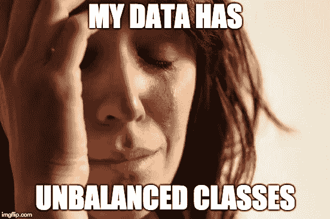
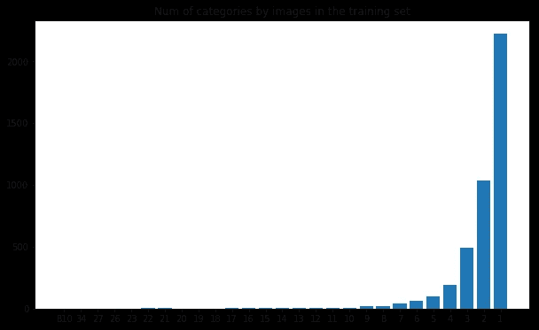
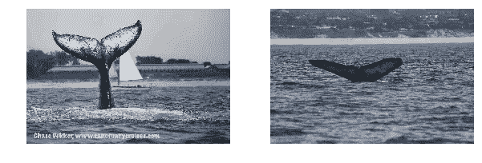
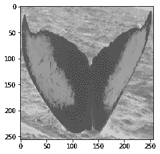
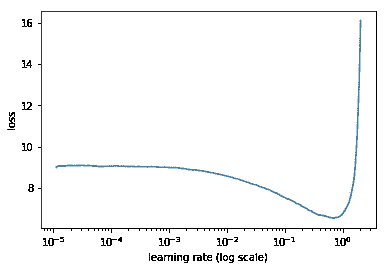
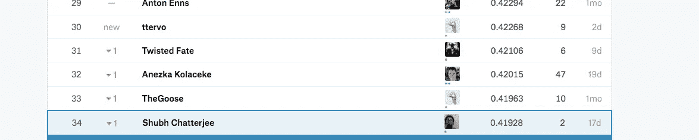

# 深度学习不平衡训练数据？这样解决。

> 原文：<https://towardsdatascience.com/deep-learning-unbalanced-training-data-solve-it-like-this-6c528e9efea6?source=collection_archive---------0----------------------->



当我们处理任何机器学习问题时，我们面临的最大问题之一是不平衡的训练数据问题。不平衡数据的问题是这样的，学术界对其定义、含义和可能的解决方案存在分歧。我们将在这里尝试使用图像分类问题来揭开训练数据中不平衡类的秘密。

# **阶层不平衡的问题是什么？**

在分类问题中，当在您想要预测的所有类别中，如果一个或多个类别的样本数量极低，您可能会面临数据中类别不平衡的问题。

**例句**

1.  欺诈预测(欺诈数量将远低于真实交易)
2.  自然灾害预测(坏事件会比好事件低很多)
3.  在图像分类中识别恶性肿瘤(在训练样本中具有肿瘤的图像将比没有肿瘤的图像少得多)

**为什么这是个问题？**

由于两个主要原因，不平衡的类产生了一个问题:

1.  对于实时不平衡的类，我们得不到优化的结果，因为模型/算法从未充分观察到底层的类
2.  这就产生了一个制作验证或测试样本的问题，因为在少数类别的观察数量非常少的情况下，很难获得跨类别的表示

**有哪些不同的方法可以解决这个问题？**

提出了三种主要方法，各有利弊:

1.  **欠采样** -随机删除具有足够观察值的类别，以便两个类别的比较比率在我们的数据中是显著的。虽然这种方法非常简单，但是我们删除的数据很有可能包含关于预测类的重要信息。
2.  **过采样-** 对于不平衡类，随机增加现有样本副本的观察值数量。理想情况下，这为我们提供了足够数量的样本。过采样可能导致过拟合训练数据
3.  **综合采样(SMOTE)——**该技术要求综合制造不平衡类的观测值，这类似于使用最近邻分类的现有观测值。**问题是当的观测数是一个极其稀少的类时该怎么办。例如，我们可能只有一张稀有物种的图片，我们想使用图像分类算法**对其进行识别

尽管每种方法都有自己的优点，但是对于何时使用哪种技术并没有特别的启发。我们现在将使用一个**深度学习特定图像分类问题**来详细研究这个问题。

# 图像分类中的不平衡类

在这一节中，我们将提出一个图像分类的问题，它有一个不平衡的分类问题，然后我们将使用一个简单有效的技术来解决它。

**问题**-我们在 kaggle 上发现了**“座头鲸识别挑战”**，我们预计这将是一个解决不平衡类别的挑战(因为理想情况下，分类的鲸鱼数量将少于未分类的鲸鱼数量，也将有一些稀有的鲸鱼物种，我们将有更少的图像数量)

来自 kaggle: **“在这场比赛中，你面临的挑战是构建一个算法来识别图像中的鲸鱼种类。您将分析 Happy Whale 的超过 25，000 张图片的数据库，这些图片是从研究机构和公共贡献者那里收集的。通过做出贡献，你将有助于打开对全球海洋哺乳动物种群动态的丰富理解领域。”**

# 让我们开始看数据

由于这是一个多标签图像分类问题，我首先想检查数据是如何跨类分布的。



上图表明，在 4251 幅训练图像中，超过 2000 幅的**每类只有一幅图像**。也有包含大约 2–5 个图像的类。现在，这是一个严重的阶级不平衡问题。我们不能期望 DL 模型只使用每类一个图像来训练(虽然有算法可以做到这一点，例如一个镜头分类，但我们现在忽略了这一点)。这也产生了如何在训练样本和验证样本之间创建分割的问题。理想情况下，您会希望每个类都在训练和验证样本中出现。

# 我们现在应该做什么？

我们特别考虑了两个选项:

**选项 1**-对训练样本进行严格的数据扩充(我们可以做到这一点，但由于我们只需要特定类别的数据扩充，这可能无法完全解决我们的目的)。因此我选择了选项 2，它看起来很简单，值得一试。

**选项 2-** 类似于我上面提到的过采样选项。我只是使用不同的图像增强技术将不平衡类的图像复制回训练数据中 15 次。这是受[杰瑞米·霍华德](https://medium.com/u/34ab754f8c5e?source=post_page-----6c528e9efea6--------------------------------)的启发，我猜他在 part-1 [*fast.ai 课程*](http://www.fast.ai/) *的一个深度学习讲座中提到过。*

在我们开始选项-2 之前，让我们先来看看训练样本中的一些图像。



这些图像是鲸鱼的福禄克所特有的。因此，识别可能会非常具体的方式，图像将被定向。

我还注意到数据中有许多图像是 B&W 特有的或者只是 R/B/G 频道的。

基于这些观察，我决定编写以下代码，对来自训练样本中不平衡类的图像进行小的更改，然后保存它们:

```
import os
from PIL import Imagefrom PIL import ImageFilterfilelist = train['Image'].loc[(train['cnt_freq']<10)].tolist()for count in range(0,2):

  for imagefile in filelist:
    os.chdir('/home/paperspace/fastai/courses/dl1/data/humpback/train')
    im=Image.open(imagefile)
    im=im.convert("RGB")
    r,g,b=im.split()
    r=r.convert("RGB")
    g=g.convert("RGB")
    b=b.convert("RGB")
    im_blur=im.filter(ImageFilter.GaussianBlur)
    im_unsharp=im.filter(ImageFilter.UnsharpMask)

    os.chdir('/home/paperspace/fastai/courses/dl1/data/humpback/copy')
    r.save(str(count)+'r_'+imagefile)
    g.save(str(count)+'g_'+imagefile)
    b.save(str(count)+'b_'+imagefile)
    im_blur.save(str(count)+'bl_'+imagefile)
    im_unsharp.save(str(count)+'un_'+imagefile)
```

上述代码块对不平衡类(频率小于 10)中的每个图像执行以下操作:

1.  将每个图像的增强副本保存为 R/B& G
2.  保存每个模糊图像的增强副本
3.  保存每个图像的放大副本

我们在这个练习中严格使用 pillow(一个 python 图像库),如上面的代码所示

现在我们有了所有不平衡类的至少 10 个样本。我们继续训练。

图像增强- 我们保持简单。我们只是想确保我们的模型能够获得鲸爪的详细视图。为此，我们将变焦纳入图像放大。



**学习率查找器-** 我们决定学习率为 0.01，标识为 lr find。



我们使用 Resnet50(首先冻结和解冻)进行了几次迭代。事实证明，冷冻模型也非常适合这个问题陈述，因为 imagenet 中有鲸豚的图像。

```
epoch      trn_loss   val_loss   accuracy                     
    0      1.827677   0.492113   0.895976  
    1      0.93804    0.188566   0.964128                      
    2      0.844708   0.175866   0.967555                      
    3      0.571255   0.126632   0.977614                      
    4      0.458565   0.116253   0.979991                      
    5      0.410907   0.113607   0.980544                      
    6      0.42319    0.109893   0.981097
```

**这在测试数据上看起来如何？**

终于到了卡格尔排行榜的关键时刻了。提出的解决方案在本次竞赛中排名第 34 位，平均精度为 0.41928:)



**结论**

有时，最符合逻辑的简单方法(如果没有更多数据，只需稍微修改一下现有数据，假装大部分课堂观察在模型的同一行上)是最有效的方法，可以更容易、更直观地完成工作。