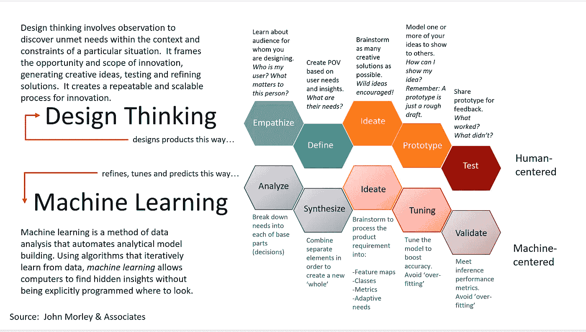

# 使用设计思维的深度学习

> 原文：<https://towardsdatascience.com/deep-learning-using-design-thinking-f0d20c8f0994?source=collection_archive---------7----------------------->

太多人认为人工智能是我们今天面临的许多问题的商业解决方案。

对于足够大的数据集，可能有一个神经网络可以帮助我们对问题做出决定，并影响用户。但是，为了有效地利用这些数据来创造产品，我们需要了解问题是否真的存在。我们需要理解人们，因为归根结底，消费产品驱动的公司会解决人们面临的问题。

首先，我们需要问自己，这个问题是一个真正的问题，还是只是创造性地应用人工智能的一个理由。在更广泛的范围内，我们需要问一问，将以人为中心的方法应用于数据科学是否是解决人工智能问题的一种方式。

许多行业领袖正成为这一想法的坚定支持者，

> “我担心对人工智能的热情会阻止我们考虑它对社会的潜在影响，”李在文章中说。尽管它的名字，这项技术没有任何“人工”的成分——它是由人类制造的，旨在表现得像人类一样，并影响人类。因此，如果我们希望它在未来的世界中发挥积极作用，它必须以人类的关切为指导。”斯坦福大学的费·李非说
> 
> “一场人工智能革命正在进行中，但我认为它需要一场设计革命来补充，”德勤咨询 LLP 公司首席数据科学家 Jim Guszcza 说。

在感同身受和进行用户研究后，我们可以知道一个问题是否足够可行，可以使用人工智能来解决。在理解问题并研究其用例后，我们需要提出进一步的问题，以了解与常规预测算法相比，深度学习算法是否是一种方法。了解这一点的一些方法有:

*   如果这是一个神经网络超越传统算法的问题
*   如果很明显有足够的数据来训练。
*   如果问题足够复杂。
*   如果你有合适的神经网络来解决这个问题。

一旦我们确定人工智能是一个可行的解决方案，那么创建**神经网络管道**的步骤是:

*   找出并定义最适合所需问题的神经网络架构
*   将数据分成批次
*   使用图像处理对数据进行预处理
*   扩充数据以增加大小
*   将批次输入神经网络进行训练
*   测试您的模型，并保存它以供将来使用

可以认为这个管道使用了大卫·m·凯利提出的非常创新的 5 步设计思维方法。设计思维的过程，一种提供基于解决方案的方法来解决问题的设计方法。这些是使用设计思维进行深度学习可以遵循的步骤。

## **利用设计思维的深度学习**

Source: [https://infocus.dellemc.com/william_schmarzo/design-thinking-future-proof-yourself-from-ai/](https://infocus.dellemc.com/william_schmarzo/design-thinking-future-proof-yourself-from-ai/)

## 第一步:同情和分析

设计思维过程的第一步是获得对你试图解决的问题和你的用户的移情理解。

**设计思维**:通过与人/用户交谈，咨询相关专家，或者深入问题以更好地理解问题，从而更好地理解你希望解决的问题。

**深度学习**:理解现实世界的消费者问题，其中神经网络的应用将对问题产生重大影响。神经网络并不能解决所有问题。我们需要从用户那里了解现实世界的问题，以便利用人工智能创造一些有意义的东西。我们可以从理解用户的关键决策开始，并捕捉能够更好地预测这些决策的变量和指标。

## 步骤 2:定义和综合

定义将移情步骤中获得的所有信息整合在一起，并分析数据以创建有意义的挑战陈述的方法。

**设计思维**:以人为中心，将问题定义为问题陈述。

**深度学习**:

1.  根据正在解决的问题查找或综合数据集。
2.  将数据加载到合适的位置。
3.  准备数据—随机化、可视化以查看不平衡或关系、预处理、分割和扩充要发送用于训练的数据。
4.  将数据分为训练、评估和测试。

## 第三步:构思

构思阶段是你设计过程中的一个阶段，在这个阶段你的目标是产生激进的设计方案。针对上一步中想到的问题，想出尽可能多的解决方案。

**设计思维:**利用前几个阶段的信息产生想法，集思广益，找出尽可能多的潜在解决方案。

**深度学习:**这一步为你的具体问题选择一个模型。已经为图像、诸如文本或音乐的序列、数字数据或基于文本的数据创建了许多模型。如果没有，您甚至可以通过一次添加一层来定义您自己的模型架构，直到您对您的网络满意为止。

## 步骤 4:原型和调整

原型制作生产出许多廉价的、按比例缩小的产品版本或产品中的特定功能。该团队将致力于创造一些具有特定功能的廉价产品。这允许设计思考者调查在设计思考过程的早期阶段识别的问题的可能解决方案。

**设计思维:**设计模型是基于前一阶段产生的所有想法而创建的。这些是实现构思概念的低保真度或高保真度线框。

**深度学习**:在这一步，我们使用训练数据来训练模型，然后我们开始操纵数据，并根据训练的结果来调整超参数。

## 步骤 5:测试和验证

测试是获得对你的解决方案的反馈，改进解决方案使之更好，并继续迭代概念的机会。

**设计思维:**我们使用用户测试技术测试我们的原型，看看它们在多大程度上解决了我们在前面阶段最初分析的问题。

**深度学习:**我们使用测试数据集测试模型，该数据集提供了用于评估模型的黄金标准。基于测试和验证的结果，我们迭代超参数调整的过程，以提高模型的准确性。

# 这可以总结为 3 个主要步骤:

1.  研究和原型制作
2.  为实际终端用户生产模型
3.  现实世界中系统的改进

使用深度学习的设计思维为一些事情提供了一个框架和一个过程，否则会有许多步骤，并且是一个具有许多阶段的复杂过程。设计思维观有助于整合人工智能中以人为中心的解决问题的方式，并强调建立神经网络的迭代方式，就像设计师如何创造设计一样。