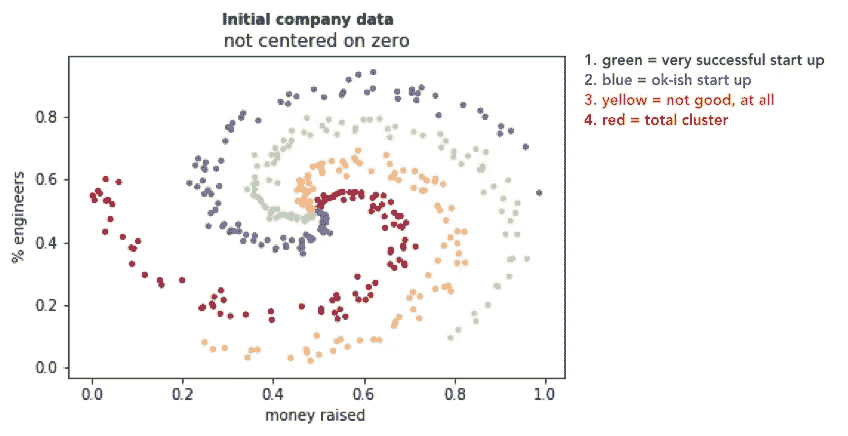
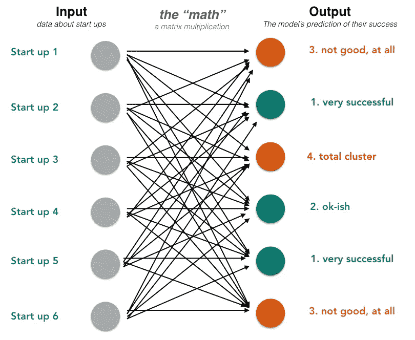
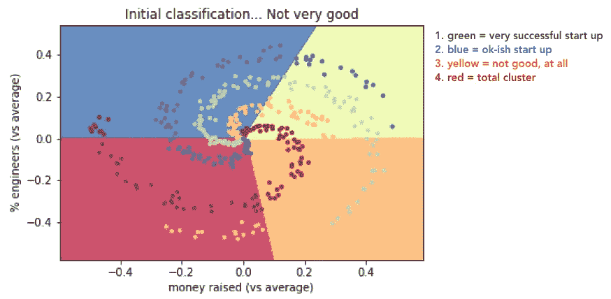
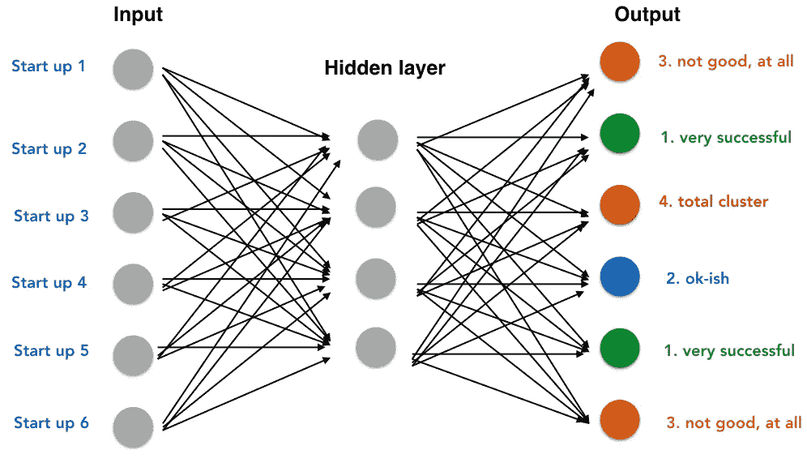
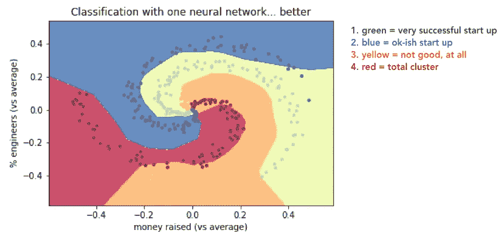
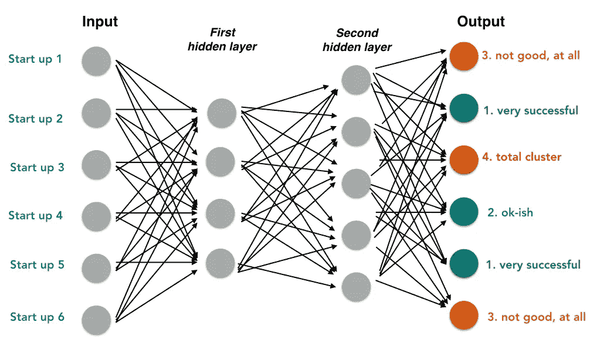
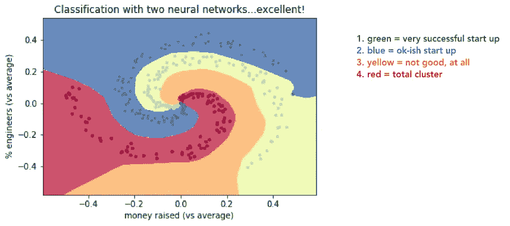

# 深度学习周刊:什么是神经网络？

> 原文：<https://towardsdatascience.com/deep-learning-weekly-piece-whats-a-neural-network-aa0df888d8a2?source=collection_archive---------3----------------------->

对于本周的文章，我想通过我收集的一个简单的例子来阐明什么是神经网络。我还对它进行了编码，因为我想向大家展示代码输出的各个部分——这是理解神经网络功能的重要部分。

# **例子:一个困惑的投资者的问题**

假设你是一名风险投资家，想知道你应该投资哪些初创企业。你看了数百家初创企业，对每一家都写下:

1.  他们已经筹集了多少钱
2.  他们的员工中有百分之多少是工程师
3.  他们最终是否成功，从 1(最成功)到 4(整个集群)

然后，您决定将这些信息放在一个图表中，在 x 轴上绘制(1)金钱，在 y 轴上绘制(2) %工程师。每个标记的颜色代表他们有多成功。你会发现:

x-axis = money raised (as a percentile of all companies you’ve seen), and y-axis = % of start up that are engineers, also normalized. DISCLAIMER: THIS IS ENTIRELY MADE UP DATA FOR ILLUSTRATIVE PURPOSES.

好吧…😕但是你从中学到了什么呢？不多。数据显示成功的初创企业总是筹集到更多的资金吗？不，不总是…成功的初创企业有更多的工程师吗？不，不总是…

因此，接下来你可以试着画线来区分成功创业和不成功创业的“区域”。你试着去做，但结果发现*真的很难。*这是你徒劳的尝试之一:

虽然你的数据显示，一般来说，拥有最多资金和工程师的公司更成功，但你应该把界限划在哪里？线下面有一堆绿色/蓝色的点，所以很明显这不是一条非常准确的线。

所以你有点卡住了…

# **“进来”神经网络**

(请原谅投资者的双关语……)

上述问题被称为*分类:*给定一家初创公司的数据，你如何系统地对其成功进行分类。

神经网络只是模型，它接受关于“事物”的各种属性，然后对“事物”进行分类。例如,“事物”可以是一个初创企业(属性是筹集的资金和%的工程师),并对其成功程度进行分类。或者“东西”可以是美国选民(属性是她居住的城市和家庭收入)，分类是她将投票给民主党还是共和党。

我不会深入讨论它们如何工作的血淋淋的细节，因为我想把重点放在这里的结果上，但是在一个高层次上，这就是你的启动分类示例的神经网络的样子:

The investor’s neural network, to **predict** the start ups’ success from 1 (very successful) to 4 (a total cluster). Only the first 6 rows are shown, but you’ll generally have thousands of rows / start ups.

这是一个*全连接神经网络*的例子，因为每个输入都连接到每个输出。输入中的每一行(即启动)都有两个值:筹集的资金和工程师百分比。输出是模型对创业成功的预测**。**

你可以在你的原始图表上想象这个神经网络，来显示你成功的“区域”:

Here we’ve centered both axes on zero, to compare to average.

这当然比你第一次尝试画的直线要好。但还是不太好，因为红色区域有一堆黄色点，蓝色区域有一堆绿色点，等等。

这就是“T2”隐藏层“T3”概念的由来。这意味着在输入和输出层之间附加一层节点(数学函数)。这些改进了模型，也允许*非线性*，这意味着这些区域不一定会被直线分割。下面是你的*神经网络和一个单独的隐藏层*的样子:

Your *neural network with one hidden layer. The output is the model’s* ***prediction*** *about the start ups’ success level*

同样，你可以在你的原始图表上看到这一点:

这是*方式*更好！你看到隐藏层是如何添加一些非线性的了吗？这个模型现在是一个更好的初创企业分类器。但是…它仍然不是完美的，因为一些蓝色的点延伸到绿色区域(在右边)，一些红色的点进入橙色区域。因此，你可以通过在你的神经网络中添加第二个隐藏层*来进一步改进这个，这意味着它看起来会像:*

Your neural network with two hidden layers. Please don’t make me draw any more lines…

同样，我们可以在图表上直观地看到这一点，看看我们的模型对数据的分类有多好:

如你所见，这几乎是对你的初创企业的完美分类！一旦你*验证并测试了*这个模型(见下面的警告)，你就可以使用这个神经网络来预测一家初创公司是否会成功，只需测量他们已经筹集了多少资金，以及初创公司的下属中有多少是工程师。

(如果你感兴趣，这里的[是我上面的代码。)](https://github.com/ophir11235813/Medium/blob/master/confused_investor.ipynb)

# 重要警告

这篇文章的目的是向你展示神经网络是如何创建和工作的。我故意没有深入两个非常重要的概念:*培训和验证*。如果你想确保你的神经网络不是只对你给它的数据进行*和*操作，这些是绝对重要的。

换句话说，你的神经网络只在你已经见过的初创企业中训练过。只有在你验证了它之后，你才能相信它在新公司(你还没见过的)上的结果。

*如果你对神经网络的工作方式感兴趣，[这里有一个很棒的概述](https://techcrunch.com/2017/04/13/neural-networks-made-easy/)