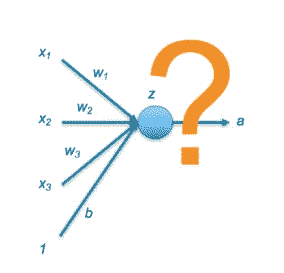
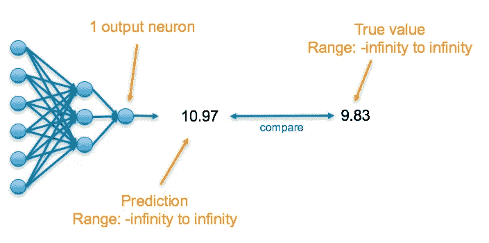
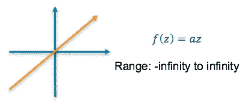
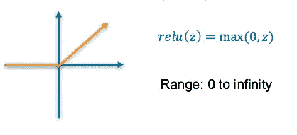
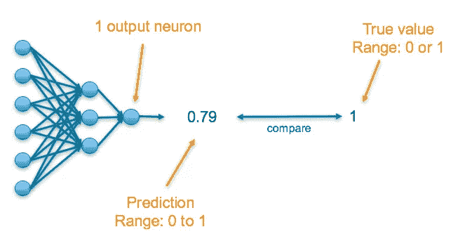
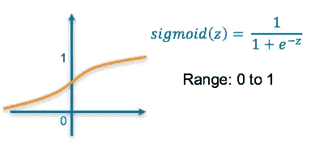
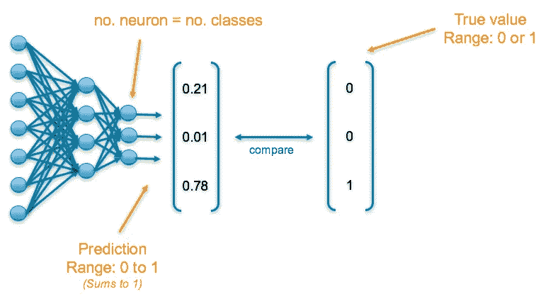
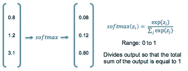
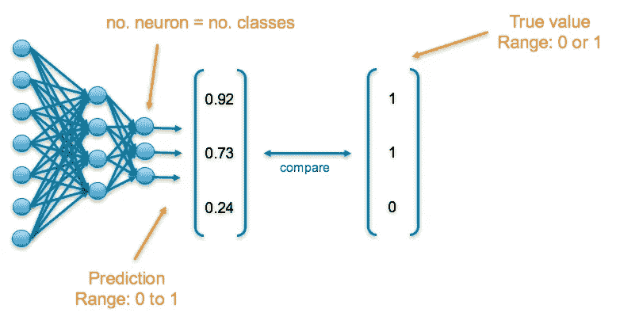
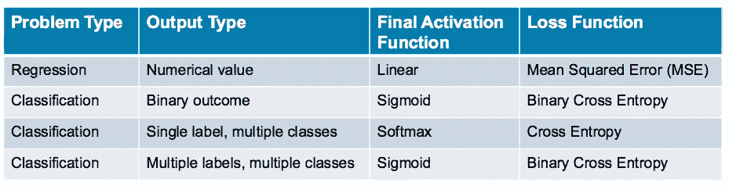

# 深度学习:应该使用哪些损失和激活函数？

> 原文：<https://towardsdatascience.com/deep-learning-which-loss-and-activation-functions-should-i-use-ac02f1c56aa8?source=collection_archive---------1----------------------->

这篇文章的目的是根据商业目标，为神经网络中最终层激活函数和损失函数的组合提供指导。

这篇文章假设读者了解激活函数。关于这些的概述可以在之前的帖子中看到:[深度学习:神经元和激活功能概述](https://medium.com/@srnghn/deep-learning-overview-of-neurons-and-activation-functions-1d98286cf1e4)

# 你想解决什么？

像所有机器学习问题一样，业务目标决定了你应该如何评估它的成功。

## 你是想预测一个数值吗？

*例子:预测产品的合适价格，或者预测每天的销售数量*

如果是这样，参见**回归:预测数值**一节

## 你想预测一个明确的结果吗？

*例子:预测图像中看到的物体，或者预测对话的主题*

如果是这样，接下来您需要考虑有多少个类以及您希望找到多少个标签。

如果您的数据是二进制的，它是或不是一个类(例如，欺诈、诊断、可能购买)，请参见**分类:预测二进制结果**一节

如果你有多个类别(例如图像中的对象、电子邮件中的主题、适合做广告的产品)并且它们是排他性的——每个项目只有一个标签——参见**分类:从多个类别中预测单个标签**。如果您的数据中有多个标签，那么您应该查看章节**分类:从多个类中预测多个标签**。

# 回归:预测数值

*例如，预测产品价格*

神经网络的最后一层将有一个神经元，它返回的值是一个连续的数值。

为了了解预测的准确性，将其与真实值进行比较，真实值也是一个连续的数字。

## 最终激活函数

**线性** —这产生了我们需要的数值

或者

**ReLU** —这导致一个大于 0 的数值

## 损失函数

**均方误差(MSE)** —这是预测值和真实值之间的均方差

# 分类:预测二元结果

*例如，预测交易是否属于欺诈*

神经网络的最后一层将有一个神经元，并将返回一个介于 0 和 1 之间的值，可以推断为一个大概值。

为了了解预测的准确性，将其与真实值进行比较。如果数据是该类，则真值为 1，否则为 0。

## 最终激活函数

**Sigmoid** —这导致一个介于 0 和 1 之间的值，我们可以推断该模型对该类中的示例有多确信

## 损失函数

**二元交叉熵** —交叉熵量化两个概率分布之间的差异。我们的模型预测{p，1-p}的模型分布，因为我们有一个二元分布。我们使用二进制交叉熵将其与真实分布{y，1-y}进行比较

# 分类:从多个类别中预测单个标签

*例如预测文档的主题*

神经网络的最后一层将为每个类别提供一个神经元，它们将返回一个介于 0 和 1 之间的值，可以推断为一个可能值。输出结果是一个概率分布，其总和为 1。

为了了解预测的准确性，将每个输出与其对应的真实值进行比较。真值已经过一次热编码，意味着 1 出现在对应于正确类别的列中，否则出现 0

## 最终激活函数

**Softmax** —这导致每个输出的值在 0 和 1 之间，总和为 1。因此，这可以推断为一个概率分布

## 损失函数

**交叉熵** —交叉熵量化两个概率分布之间的差异。我们的模型预测了{p1，p2，p3}的模型分布(其中 p1+p2+p3 = 1)。我们使用交叉熵将其与真实分布{y1，y2，y3}进行比较

# 分类:从多个类别预测多个标签

*例如，预测图像中动物的存在*

神经网络的最后一层将为每个类别提供一个神经元，它们将返回一个介于 0 和 1 之间的值，可以推断为一个可能值。

为了了解预测的准确性，将每个输出与其对应的真实值进行比较。如果“真值”列中出现 1，则它对应的类别存在于数据中，否则出现 0。

## 最终激活函数

**Sigmoid** —这导致一个介于 0 和 1 之间的值，我们可以推断出它在该类中的置信度

## 损失函数

**二元交叉熵** —交叉熵量化两个概率分布之间的差异。我们的模型预测每个类别的{p，1-p}(二元分布)的模型分布。我们使用二进制交叉熵将它们与每个类别的真实分布{y，1-y}进行比较，并总结它们的结果

# 一览表

下表总结了上述信息，以便您快速找到适合您的使用案例的最终层激活函数和损失函数

我希望这篇文章是有价值的！关于神经网络和最终激活函数的更多信息，请参见之前的帖子:

[深度学习:神经元和激活功能概述](https://medium.com/@srnghn/deep-learning-overview-of-neurons-and-activation-functions-1d98286cf1e4)