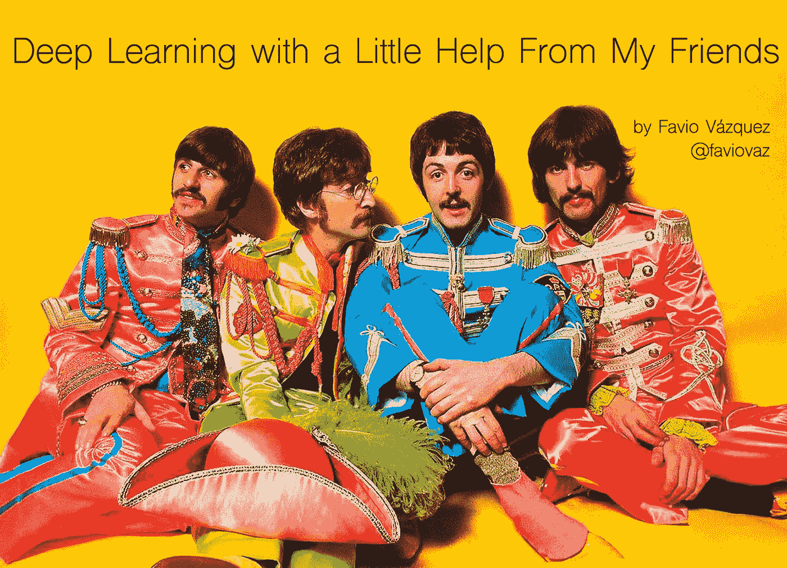

# 在朋友的帮助下进行深度学习

> 原文：<https://towardsdatascience.com/deep-learning-with-a-little-help-from-my-friends-596ee10fd934?source=collection_archive---------7----------------------->

## 当你开始一个新的领域时，最好是从能回答你问题的好公司、朋友或好社区开始。[深度认知](https://deepcognition.ai/)的社区是一个学习和谈论深度学习的好地方，在这里我就和大家说说。

如果你在这里，很可能你正在开始学习深度学习或相关领域，或者你只是好奇。他们两个都很好。好了，我们的主题是在社区中学习，特别是深度学习。

深度学习是一个令人惊叹的领域，几乎渗透到我们周围的一切。谷歌正在使用它，脸书正在使用它，如果你使用智能手机、Instagram 或 Snapchat，你就是这个伟大领域的用户之一。

# 学习深度学习

现在学习一些东西可能是令人生畏的；这就是为什么我们相信我们的学校系统或大学系统能够帮助我们应对这一挑战。但是，如果你想学一些普通教室里没有的东西，会发生什么呢？

如果你停留在“常规”的学习方式中，那就没那么容易了。从这篇文章中你将学到的最重要的事情之一是，这是可能的，如果你遵循我将要告诉你的，它可能会更有趣或更容易。

深度学习是使用不同种类的神经网络和优化网络的超参数的表示学习，以获得(学习)我们数据的最佳表示。如果你觉得这听起来很奇怪，请阅读这些介绍:

 [## 我的深度学习之旅

### 在这篇文章中，我将分享我如何研究深度学习并使用它来解决数据科学问题。这是一个…

towardsdatascience.com](/my-journey-into-deep-learning-c66e6ef2a317)  [## 深度学习的“怪异”介绍

### 有关于深度学习的惊人介绍、课程和博文。但这是一种不同的介绍。

towardsdatascience.com](/a-weird-introduction-to-deep-learning-7828803693b0) 

# 在朋友的帮助下学习

互联网给了我们与世界各地的人们一起学习的工具。我们有像 [StackOverflow](https://stackoverflow.com/) 、 [Quora](https://www.quora.com/) 、 [LinkedIn](https://www.linkedin.com/feed/) 等许多很棒的平台，让我们可以和其他人见面、交谈、提问、获得答案，以及获得对几乎任何主题的观点。

我们也有 MOOCs，在那里我们可以与成千上万的人一起注册不同的课程，分享我们的学习经验和问题。

而学习深度学习的社区呢？

嗯，这就是 Deep Cognition 的人不久前创建的东西:一个结合了 StackOverflow、Quora 等最佳技术的平台，但其中的一切都是针对机器和深度学习的。

你现在要做的第一件事就是去那里注册:

 [## 深度认知社区

### 一个活跃的社区，共同努力通过人工智能推动增长和创新。

community.deepcognition.ai](https://community.deepcognition.ai/) 

好的，如果你现在在那里，你会在一个论坛中看到不同的主题。这些是像你我这样的人问的问题，整个社区都在努力帮助你。

# 深度认知社区

在社区内，你会发现不同的类别，在那里你可以看到关于计算机视觉、自然语言处理、数据准备，甚至如何在深度学习或机器学习中做 *x* 或 *y* 的线程。

这是一个非常酷的地方来分享你的想法，并找到那些让你夜不能寐的问题的答案。

您还可以找到针对深度学习工作室(DLS)用户的几个不同主题的讨论。如果你不知道 DLS 是什么，看看我不久前制作的视频:

 [## 深度认知的视频漫游

### 大家好！在本文中，我将与您分享几个视频，带您浏览深度认知的平台…

towardsdatascience.com](/a-video-walkthrough-of-deep-cognition-fd0ca59d2f76) 

它基本上是一个 web IDE，在这里您可以使用非常棒的工具来创建深度学习模型、读取数据、调整参数以及部署模型。你也有深度学习笔记本，里面安装了所有的东西，所以你可以很快开始工作。

你还可以找到关于该公司正在创造的过去和新挑战的帖子，如令人敬畏的汽水瓶识别挑战。你可以在这里看到这条线索:

 [## 汽水瓶识别挑战

### 这个挑战的目标是识别图像中出现的是哪一个汽水瓶。我们为您提供预先标记的…

community.deepcognition.ai](https://community.deepcognition.ai/t/soda-bottle-identification-challenge/267) 

# TL；速度三角形定位法(dead reckoning)

如果你没有时间在一个简单的帖子中阅读 100 个答案，有一个快速的方法来完成它。在社区中，他们有一个很酷的功能，叫做“总结这个话题”。

点击该按钮后，您将只能看到社区评为最有趣的帖子。你还想要什么？

所以不要再浪费时间了，去那里吧，开始和你的新朋友一起学习，玩得开心点:)。

感谢你阅读这篇文章。希望你在这里发现了一些有趣的东西:)

如果您有任何问题，请在 twitter 上添加我:

 [## 法维奥·巴斯克斯(@法维奥·巴斯克斯)|推特

### Favio Vázquez 的最新推文(@FavioVaz)。数据科学家。物理学家和计算工程师。我有一个…

twitter.com](https://twitter.com/FavioVaz) 

和 LinkedIn:

 [## Favio Vázquez —首席数据科学家— OXXO | LinkedIn

### 查看 Favio Vázquez 在世界上最大的职业社区 LinkedIn 上的个人资料。Favio 有 15 个工作职位列在…

linkedin.com](http://linkedin.com/in/faviovazquez/) 

那里见:)