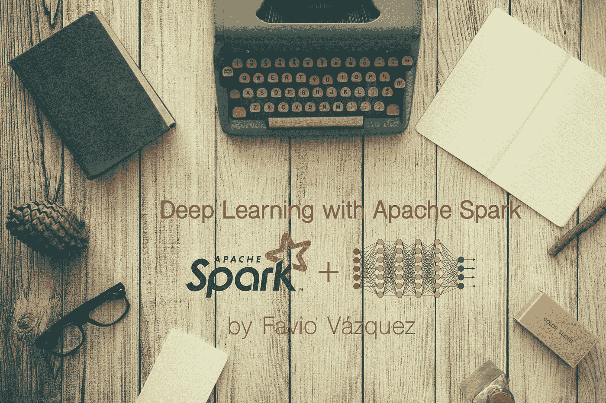
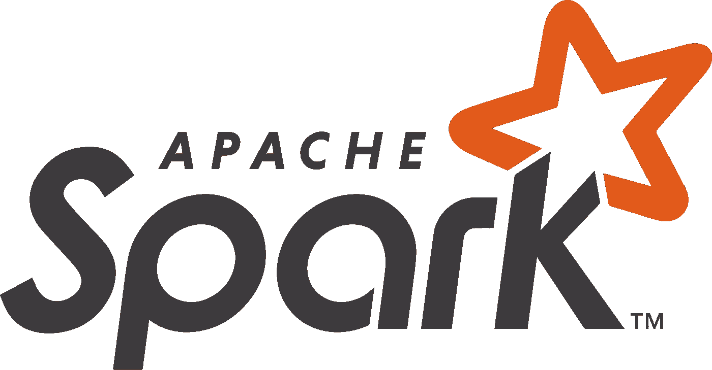
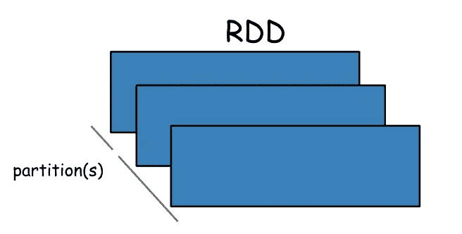
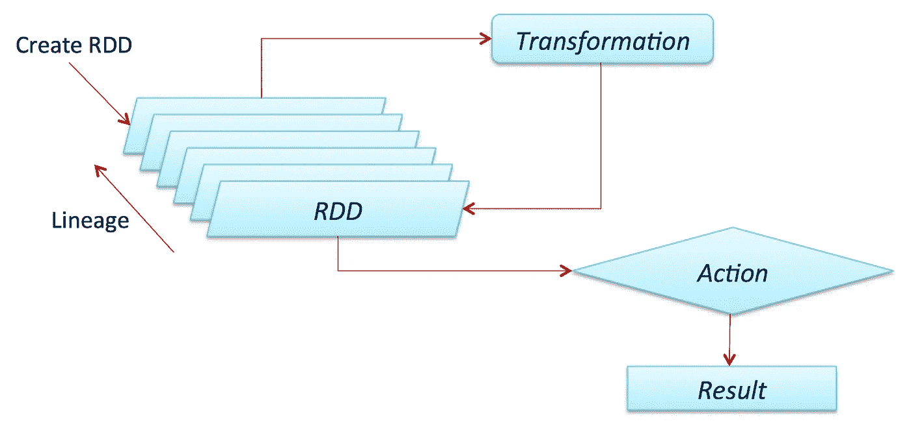
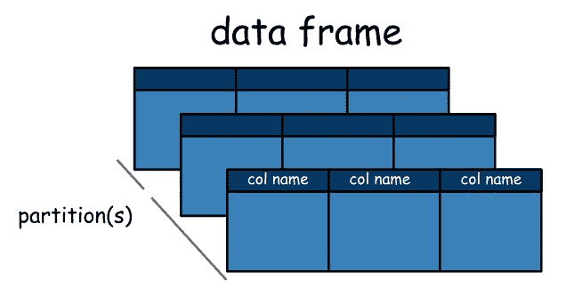
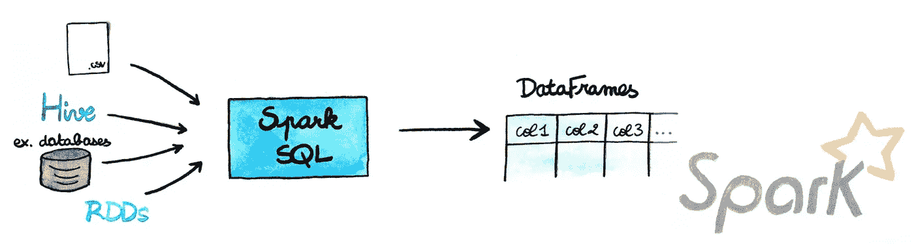
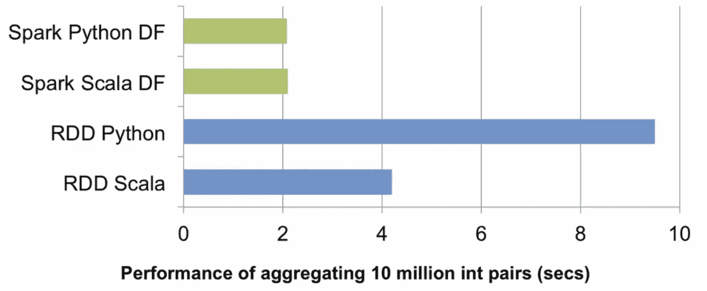
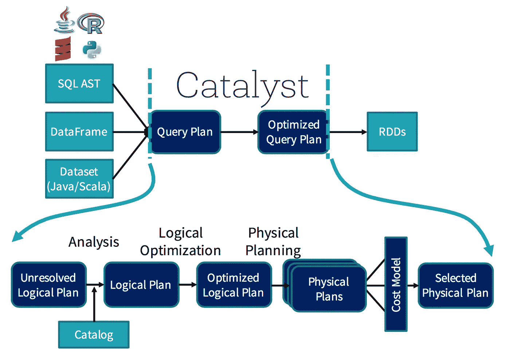
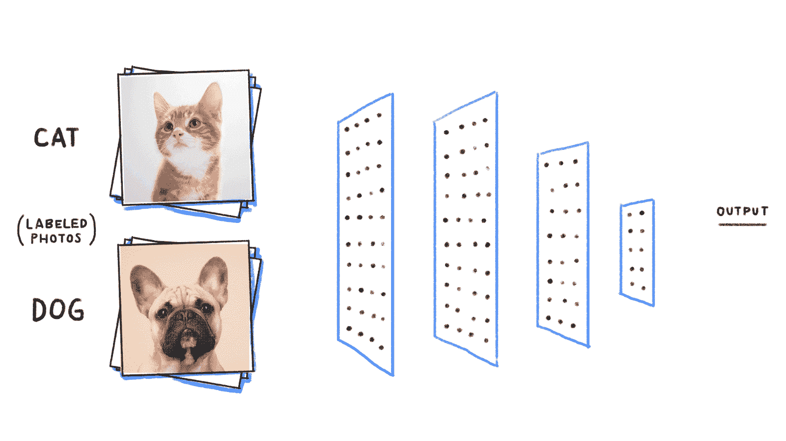
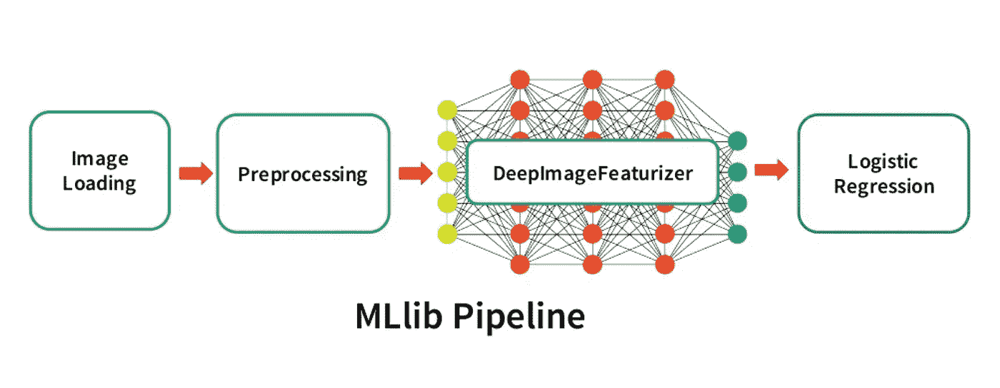

# 使用 Apache Spark 进行深度学习—第 1 部分

> 原文：<https://towardsdatascience.com/deep-learning-with-apache-spark-part-1-6d397c16abd?source=collection_archive---------0----------------------->

## 第一部分全面讨论了如何使用 Apache Spark 进行分布式深度学习。这部分:什么是 Spark，关于 Spark+DL 的基础知识以及更多。你可以在这里阅读第二部分:[用 Apache Spark 进行深度学习——第二部分](/deep-learning-with-apache-spark-part-2-2a2938a36d35)。

第二部分可以在这里找到:[用 Apache Spark 进行深度学习——第二部分](/deep-learning-with-apache-spark-part-2-2a2938a36d35)。

# Apache Spark 入门

如果您在数据领域工作，您很可能知道 Apache Spark 是什么。如果你没有，那也没关系！我来告诉你是什么。

Apache Spark TM.

Spark，被它的创造者定义为一个用于大规模数据处理的**快速**和**通用**引擎。

**快速**部分意味着它比以前处理大数据的方法(如经典的 MapReduce)更快。更快的秘密是 Spark 在内存(RAM)上运行，这使得处理速度比在磁盘上快得多。

**通用**部分意味着它可以用于多种用途，比如运行分布式 SQL、创建数据管道、将数据接收到数据库中、运行机器学习算法、处理图形、数据流等等。

## RDD

From PySpark-Pictures by Jeffrey Thompson.

Apache Spark 的主要抽象和开端是弹性分布式数据集(RDD)。

RDD 是可以并行操作的容错元素集合。您可以在驱动程序中并行化现有集合，或者引用外部存储系统中的数据集来创建它们，例如共享文件系统、HDFS、HBase 或任何提供 Hadoop InputFormat 的数据源。

关于 Spark，需要知道的非常重要的一点是，所有的**转换**(我们将很快定义它)都是懒惰的，这意味着它们不会立即计算出结果。相反，他们只记得应用于某个基本数据集(如文件)的转换。仅当**动作**需要将结果返回给驱动程序时，才会计算转换。

默认情况下，每次对变换后的 RDD 执行操作时，都会对其进行重新计算。然而，您也可以*使用持久化(或缓存)方法在内存中持久化*一个 RDD，在这种情况下，Spark 会将元素保留在集群上，以便下次查询时可以更快地访问。还支持在磁盘上持久化 rdd，或者跨多个节点复制 rdd。

如果您想了解 Spark 中 rdd 的转换和操作的更多信息，请查看官方文档:

 [## RDD 编程指南- Spark 2.3.0 文档

### Java、Scala 和 Python 中的 Spark 2.3.0 编程指南

spark.apache.org](https://spark.apache.org/docs/latest/rdd-programming-guide.html#transformations) 

## 数据框架

From PySpark-Pictures by Jeffrey Thompson.

从 Spark 2.0.0 a 开始，数据帧就是一个组织成指定列的数据集。它在概念上相当于关系数据库中的一个表或 R/Python 中的一个数据框，但是在底层有更丰富的优化。

我们不会在这里讨论数据集，但是它们被定义为一个分布式的数据集合，可以从 JVM 对象中[构造](https://spark.apache.org/docs/latest/sql-programming-guide.html#creating-datasets)，然后使用函数转换进行操作。它们只在 Scala 和 Java 中可用(因为它们是类型化的)。

数据帧可以由各种各样的[源](https://spark.apache.org/docs/latest/sql-programming-guide.html#data-sources)构建，例如:结构化数据文件、Hive 中的表、外部数据库或现有的 rdd。

[https://aspgems.com/blog/big-data/migrando-de-pandas-spark-dataframes](https://aspgems.com/blog/big-data/migrando-de-pandas-spark-dataframes)

简而言之，Dataframes API 是 Spark 创造者简化框架中数据处理的方式。它们非常类似于 Pandas 数据帧或 R 数据帧，但有几个优点。首先，它们可以分布在一个集群中，因此可以处理大量数据；其次，它们经过了优化。

这是社区迈出的非常重要的一步。到 2014 年，将 Spark 与 Scala 或 Java 一起使用要快得多，因为性能的原因，整个 Spark 世界都变成了 Scala(顺便说一句，这是一种非常棒的语言)。但是有了 DF API，这不再是一个问题，现在您可以在 R、Python、Scala 或 Java 中使用它获得相同的性能。

负责这种优化的是[催化剂](https://databricks.com/blog/2017/08/31/cost-based-optimizer-in-apache-spark-2-2.html)。你可以把它想象成一个向导，他会接受你的询问(哦，是的！，您可以在 Spark 中运行类似 SQL 的查询，在 DF 上运行它们，它们也会被并行化)和您的操作，并创建一个优化的计划来分配计算。

过程没那么简单，但是作为程序员的你根本不会注意到。现在它一直在那里帮助你。

# 深度学习和 Apache Spark

[https://becominghuman.ai/building-an-image-classifier-using-deep-learning-in-python-totally-from-a-beginners-perspective-be8dbaf22dd8](https://becominghuman.ai/building-an-image-classifier-using-deep-learning-in-python-totally-from-a-beginners-perspective-be8dbaf22dd8)

如果你想了解更多关于深度学习的知识，请在继续之前阅读这些帖子:

 [## 深度学习的“怪异”介绍

### 有关于深度学习的惊人介绍、课程和博文。但这是一种不同的介绍。

towardsdatascience.com](/a-weird-introduction-to-deep-learning-7828803693b0)  [## 我的深度学习之旅

### 在这篇文章中，我将分享我如何研究深度学习并使用它来解决数据科学问题。这是一个…

towardsdatascience.com](/my-journey-into-deep-learning-c66e6ef2a317) 

为什么要在 Apache Spark 上做深度学习？

这是我在开始研究这个课题之前问自己的问题。对我来说，答案分为两部分:

1.  Apache Spark 是一个惊人的框架，它以一种简单的声明式方式在集群中分布计算。正在成为各行各业的标准，因此将深度学习的惊人进步加入其中将是一件好事。
2.  深度学习有些部分计算量很大，非常大！分发这些进程可能是解决这个和其他问题的方法，Apache Spark 是我能想到的分发它们的最简单的方法。

使用 Apache Spark 进行深度学习有几种方法，我之前讨论过，我在这里再次列出(不详尽):

1.[大象](http://maxpumperla.github.io/elephas/):分布式 DL 带 Keras & PySpark:

 [## maxpumperla/elevas

### elephas——使用 Keras & Spark 的分布式深度学习

github.com](https://github.com/maxpumperla/elephas) 

[2**。雅虎！Inc.**](https://www.linkedin.com/company/1288/) : TensorFlowOnSpark:

 [## 雅虎/tensorflownspark

### TensorFlowOnSpark 将 TensorFlow 程序引入 Apache Spark 集群

github.com](https://github.com/yahoo/TensorFlowOnSpark) 

[**3。CERN**](https://www.linkedin.com/company/157302/) 分布式 Keras (Keras + Spark):

 [## cerndb/dist-keras

### dist-keras——分布式深度学习，侧重于分布式培训，使用 Keras 和 Apache Spark。

github.com](https://github.com/cerndb/dist-keras) 

[**4。Qubole**](https://www.linkedin.com/company/2531735/) (教程 Keras + Spark):

 [## 基于 Apache Spark | Qubole 的 Keras 分布式深度学习

### 深度学习已经被证明可以在不同的领域产生高效的机器学习模型。一些…

www.qubole.com](https://www.qubole.com/blog/distributed-deep-learning-keras-apache-spark/) 

[**5。英特尔公司**](https://www.linkedin.com/company/1053/):BigDL(Apache Spark 分布式深度学习库)

 [## 英特尔分析/BigDL

### BigDL:Apache Spark 的分布式深度学习库

github.com](https://github.com/intel-analytics/BigDL) 

# 深度学习管道

Databricks

但是我将在这些文章中重点关注的是**深度学习管道。**

 [## 数据砖块/火花深度学习

### Spark-深度学习 Apache Spark 的深度学习管道

github.com](https://github.com/databricks/spark-deep-learning) 

深度学习管道(Deep Learning Pipelines)是一个由 Databricks 创建的开源库，它使用 Apache Spark 为 Python 中的可扩展深度学习提供了高级 API。

这是一个令人敬畏的努力，它不会很久，直到被合并到官方的 API，所以值得一看。

与我之前列出的相比，这个库的一些优点是:

*   本着 Spark 和 [Spark MLlib](https://spark.apache.org/mllib/) 的精神，它提供了易于使用的 API，可以在很少的几行代码中实现深度学习。
*   它侧重于易用性和集成，而不牺牲性能。
*   它是由 Apache Spark 的创建者(也是主要贡献者)构建的，因此它比其他 API 更有可能被合并为一个官方 API。
*   它是用 Python 编写的，所以它将与所有著名的库集成，现在它使用 TensorFlow 和 Keras 这两个目前主要的库来做 DL。

在下一篇文章中，我将完全关注 DL pipelines 库以及如何从头开始使用它。您将看到的一件事情是在简单的管道上转移学习，如何使用预先训练的模型处理“少量”数据并能够预测事情，如何通过在 SQL 中提供您创建的深度学习模型来增强公司中每个人的能力，等等。

此外，我将创建一个环境，在深度认知平台中使用这个库在笔记本上工作，这样您就可以测试一切。如果您还没有帐户，请创建一个免费帐户:

 [## 深度认知——今天就成为一个人工智能驱动的组织

### 无需编码即可设计、训练和部署深度学习模型。深度学习工作室简化并加速了…

deepcognition.ai](http://deepcognition.ai) 

哦！！顺便说一句，如果你想了解更多关于 Python 数据科学中的管道的知识，可以看看 Matthew Mayo 写的这些好文章:

 [## 用 Scikit-learn 管道管理机器学习工作流第 1 部分:简介

### 你熟悉 Scikit-learn 管道吗？它们是管理机器的一个非常简单但非常有用的工具…

www.kdnuggets.com](https://www.kdnuggets.com/2017/12/managing-machine-learning-workflows-scikit-learn-pipelines-part-1.html)  [## 使用 Scikit-learn 管道管理机器学习工作流第 2 部分:集成网格搜索

### 在我们的上一篇文章中，我们将 Scikit-learn 管道视为简化机器学习工作流程的一种方法。

www.kdnuggets.com](https://www.kdnuggets.com/2018/01/managing-machine-learning-workflows-scikit-learn-pipelines-part-2.html)  [## 使用 Scikit 管理机器学习工作流-学习管道第 3 部分:多模型，管道…

### 首先，我知道我承诺过我们会在上一篇文章中讨论玩具数据集，但是为了便于比较，我们会…

www.kdnuggets.com](https://www.kdnuggets.com/2018/01/managing-machine-learning-workflows-scikit-learn-pipelines-part-3.html) 

关于 Spark 管道的简介，请查看:

 [## ML 管道- Spark 2.3.0 文档

### 估计器抽象了学习算法或任何适合或训练数据的算法的概念。技术上…

spark.apache.org](https://spark.apache.org/docs/latest/ml-pipeline.html) 

一会儿见:)

如果您想联系我，请务必在 twitter 上关注我:

 [## 法维奥·巴斯克斯(@法维奥·巴斯克斯)|推特

### Favio Vázquez 的最新推文(@FavioVaz)。数据科学家。物理学家和计算工程师。我有一个…

twitter.com](https://twitter.com/faviovaz) 

和 LinkedIn:

 [## Favio Vázquez -数据科学家/工具经理 MX - BBVA 数据&分析| LinkedIn

### 查看 Favio Vázquez 在世界上最大的职业社区 LinkedIn 上的个人资料。Favio 有 13 个工作职位列在…

www.linkedin.com](https://www.linkedin.com/in/faviovazquez/)