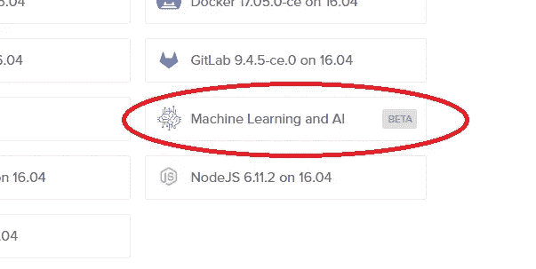
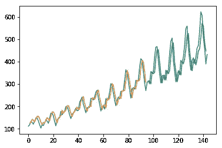

# 用数字海洋进行深度学习:Redux

> 原文：<https://towardsdatascience.com/deep-learning-with-digitalocean-redux-e6f447e64c75?source=collection_archive---------6----------------------->


这篇文章会和我平时的商务类文章有点不一样。在[最近的一篇文章](https://medium.com/towards-data-science/deep-learning-on-the-digitalocean-stack-not-quite-yet-5c408e7d1a41)中，我给人的印象是数字海洋不是部署深度学习系统的好地方。[然而](https://en.wikipedia.org/wiki/Redux_(literary_term))，有一些部署到 DigitalOcean 的良好用例可以节省成本和复杂性。

最近，一个客户让我们在云中部署一个回归模型。训练是在 K20 GPU 上进行的。



This is what the 1-click install button looks like in DigitalOcean

我们尝试在一个 2GB 内存的新 droplet 上使用 DigitalOcean 的“机器学习和人工智能”一键安装。结果相当惊人。

首先，我们用这个升级了 tensorflow:

```
**pip install --upgrade tensorflow** #to resolve *ImportError: 'load_weights' requires h5py.*
pip3 install --upgrade h5py
```

要升级 keras(可选),请使用以下命令:

```
**pip install keras --upgrade**
```

让代码在 Keras 2 上工作的现成问题。阅读文档的正确版本:【https://faroit.github.io/keras-docs/2.0.8/，用这个检查你的版本:

```
import keras
print(keras.__version__)
```

# 数字海洋的执行时间结果

一个**DNN(**[**MLP**](https://keras.io/getting-started/sequential-model-guide/)**)**在 **11.4 秒**内训练 7 层(针对 10000 个样本，20 个输入，10 个输出类)。对 1000 个样本的测试花费了 **968 毫秒**。真快。代码如下:

要计算 1000 个模型预测的时间，只需像这样:

一个**【LSTM】(**[**用于序列预测**](https://machinelearningmastery.com/time-series-prediction-lstm-recurrent-neural-networks-python-keras/) **)** 走得也真快。我们用这种模型来预测股票价格之类的东西。LSTMs 的另一个有趣的用途是回归，但让我们坚持这个例子。该示例对于 144 个数据点花费了 33.5 秒。**但是，**模型预测(不包括训练)只用了 **16 毫秒！**



The prediction output looks as expected for the LSTM. The real data (ground truth) is in blue, while the training result is in orange, and testing result is in green.

一个**CNN(**[**vgg 19**](https://keras.io/applications/#vgg19)**)**2GB 的内存不足以运行模型，所以我在 8GB 的实例上这样做。对于其他一些 2GB 的 CNN，我同样得到了 ResourceExhaustedError 和其他垃圾。没什么大不了的。在 8GB 内存的情况下，它的工作非常出色。加载模型并获得一个结果需要 8.6 秒，但模型预测本身要快得多。

处理 100 张图像并对每张图像进行模型预测需要 4 分 23 秒。所以，以秒计，就是 240+23 = 263 秒。除以图像的数量，就是 2.63 秒。不太好。下面是时间代码:

我的下一步是在 word2vec (Google news)中嵌入一个单词模型，但是，唉，我必须回到真正的工作中去了。嵌入模型有一个类似 CNN 的内存大小问题。

**数字海洋的成本结果**

在 AWS 上，在 2 个 20 美元/月的实例上运行 DNN 和 LSTM 要比 1 千美元/月的 p2 或 p3 实例便宜得多。对于这些较小的模型来说，这很有意义。对于更大的 CNN 和 word2vec 模型，没有足够的计算(没有 GPU)或 RAM(对于大型嵌入模型)来使 DigitalOcean 具有吸引力。这可能会改变，例如，如果有一种方法可以从 SSD 而不是 RAM 加载 word2vec 模型。我是说，为什么不呢？它基本上只是一个大的记忆垫。这就解决了单词嵌入的问题，但是 CNN 呢？那是一个更难的问题。我认为对于图像处理来说，GPU 在未来很长一段时间内仍将是顶级产品。

如果你喜欢这篇关于云中深度学习的文章，那么请尝试一下 **clap 工具**。轻点那个。跟着我们走。分享这篇文章的链接。去吧。我也很高兴在评论中听到你的反馈。你怎么想呢?

如果你喜欢这篇文章，可以看看我过去读过最多的文章，比如“[如何给人工智能项目定价](https://medium.com/towards-data-science/how-to-price-an-ai-project-f7270cb630a4)”和“[如何聘请人工智能顾问](https://medium.com/towards-data-science/why-hire-an-ai-consultant-50e155e17b39)”除了与业务相关的文章，我还准备了一些关于寻求采用深度机器学习的公司所面临的其他问题的文章，如“[没有云和 API 的机器学习](https://medium.com/@lemaysolutions/locked-in-a-box-machine-learning-without-cloud-or-apis-76cc54e391c8)”

编码快乐！

-丹尼尔
[丹尼尔@lemay.ai](mailto:daniel@lemay.ai) ←打个招呼。
[LEMAY . AI](https://lemay.ai)
1(855)LEMAY-AI

您可能喜欢的其他文章:

*   [人工智能和不良数据](/artificial-intelligence-and-bad-data-fbf2564c541a)
*   [人工智能:超参数](/artificial-intelligence-hyperparameters-48fa29daa516)
*   [人工智能:让你的用户给你的数据贴上标签](https://medium.com/towards-data-science/artificial-intelligence-get-your-users-to-label-your-data-b5fa7c0c9e00)