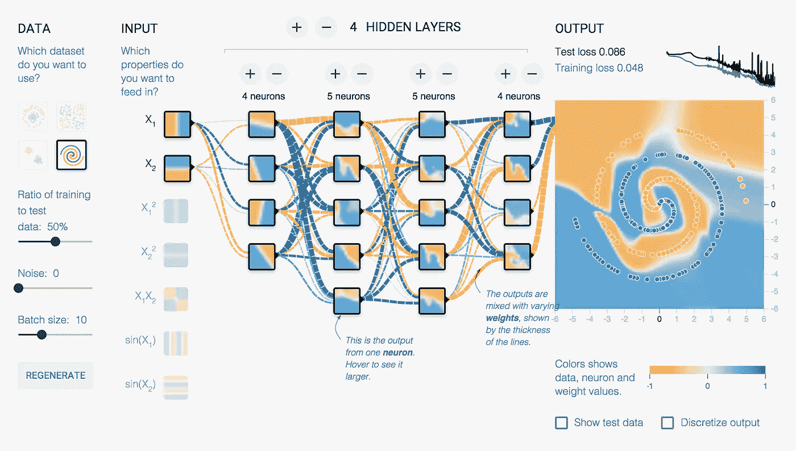
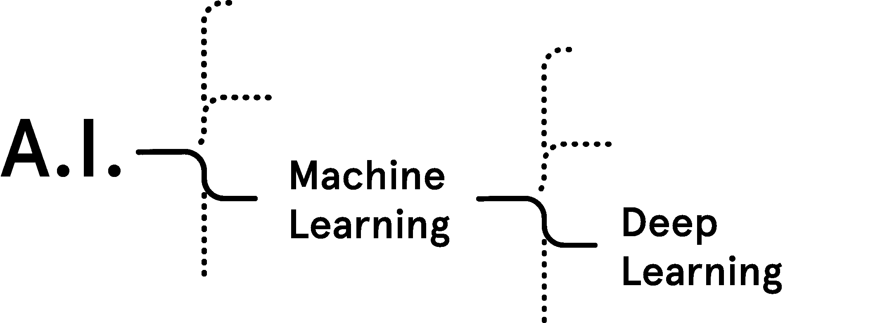

# Tensorflow 深度学习:第 1 部分—理论和设置

> 原文：<https://towardsdatascience.com/deep-learning-with-tensorflow-part-1-b19ce7803428?source=collection_archive---------6----------------------->


how does a deep learning network work?

大家好，欢迎来到这个关于 Tensorflow 的博客系列。在第 1 部分中，我会给你一些关于框架的基本信息，我会向你展示如何在 Windows 10 上设置你的编码环境。让我们深入研究一下。

# Tensorflow 是最受欢迎的，显然也是最好的深度学习框架。这是为什么呢？


TensorFlow 是 Google 为创建深度学习模型而创建的框架。深度学习是一种使用多层神经网络的机器学习模型(=算法)。

机器学习使我们能够非常准确地构建复杂的应用程序。无论是与图像、视频、文本甚至音频有关，机器学习都可以从广泛的范围解决问题。Tensorflow 可以用来实现所有这些应用。

它受欢迎的原因是开发人员可以轻松地构建和部署应用程序。由于接下来的部分，我们将更仔细地研究 GitHub 项目，这些项目非常强大，但也很容易使用。此外，Tensorflow 是在考虑处理能力限制的情况下创建的。该图书馆可以在各种电脑上运行，甚至可以在智能手机上运行(是的，甚至可以在那种上面有半个苹果的高价电脑上运行)。我可以向你保证，使用 8 GB 内存的英特尔酷睿 i3 处理器，你不会遇到性能问题。



Deep learning concept of Tensorflow

# 但是在学习 Tensorflow 之前，我们要了解一个基本原理。如何才能让我们的机器“思考”？

人脑由数十亿个神经元组成，这些神经元通过突触相互连接。如果对神经元的“足够”突触输入触发，那么神经元也将触发。这个过程叫做思考。为了在计算机上复制这一过程，我们需要机器学习和神经网络。如果你对这些条款不满意，我会解释给你听。



## 机器学习:

很简单，机器学习让计算机‘学习’。传统上，我们总是通过提供一组严格的指令来让计算机做事情。机器学习使用一种非常不同的方法。我们不是给计算机一套如何做某事的指令，而是给它如何学习做某事的指令。例如:想象一个系统，它可以将动物的图片分类为“猫”、“狗”或“老鼠”。机器学习不是从这些动物的图像中手动找到独特的特征，然后将其编码，而是接受这些动物的图像，并自己找到特征和差异。这个教计算机的过程被称为训练。

## 深度学习:

深度学习是一种实现机器学习的技术。它使用神经网络进行学习，有时，使用决策树也可以称为深度学习，但在大多数情况下，深度学习涉及到神经网络的使用。

## 神经网络:

那么，什么是神经网络？这里有一个类比:把神经网络想象成一系列一个接一个的门，把你自己想象成神经网络的“输入”。每次你打开一扇门，你就变成了不同的人。当你打开最后一扇门的时候，你已经变成了一个完全不同的人。当你从最后一扇门出去时，你就成了神经网络的“输出”。在这种情况下，每扇门代表一层。因此，神经网络是以某种方式转换输入以产生输出的层的集合。

如果想了解更多，可以试试下面这篇文章:
[https://medium . com/forward-data-science/tensor flow-for-absolute-初学者-28c1544fb0d6](https://medium.com/towards-data-science/tensorflow-for-absolute-beginners-28c1544fb0d6)

# 足够的理论，让我们做设置和安装

本手册适用于使用 Python 3.6 的 Tensorflow 1.2.1。在跟随它之前，你可能也想看一看[官方安装](http://www.tensorflow.org/install/)指南。

## 计算机编程语言

Tensorflow 程序是用 Python 写的，你可以在[https://www.python.org/downloads/](https://www.python.org/downloads/)下载

您可以在 Python 3 和 Python 2 之间进行选择，但是我强烈建议您安装一个比 3.5 更新的版本，因为这些版本已经附带了一个集成的 PIP-Package。否则，您也必须安装它。

## 张量流

下一步是安装 Python。以管理员身份打开命令行。)，并写下下面一行:

```
pip3 install --upgrade tensorflow
```

如果您想测试安装，请这样写:

```
python 
>>> import tensorflow as tf
>>> hello = tf.constant('Hello, Tensorflow')
>>> sess = tf.Session()
>>> print(sess.run(hello))
```

您现在应该会看到一个“Hello，Tensorflow”输出。

# 结论

恭喜你！您刚刚学习了 Tensorflow 的理论基础，并设置了一切来更深入地研究这个问题。下一部分将是关于盗梦空间的图像处理和识别。敬请关注，直到下次！

__

第二部分链接:[https://medium . com/@ m _ ko/deep-learning-with-tensor flow-Part-2-image-classification-58 fcdffa 7b 84](https://medium.com/@m_ko/deep-learning-with-tensorflow-part-2-image-classification-58fcdffa7b84)