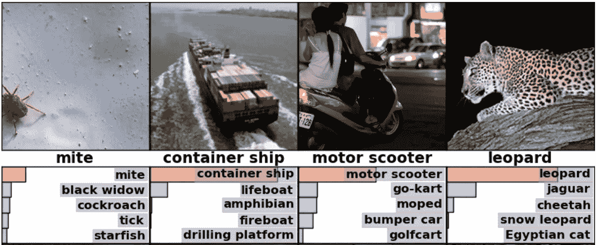
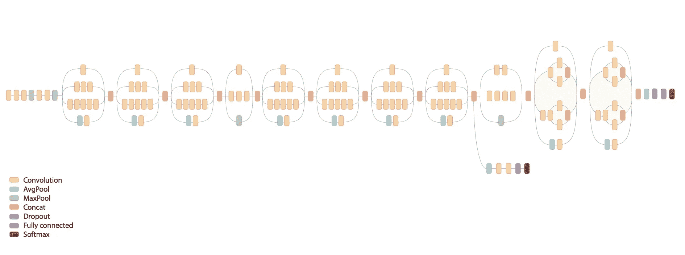
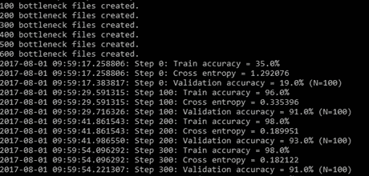
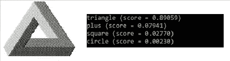
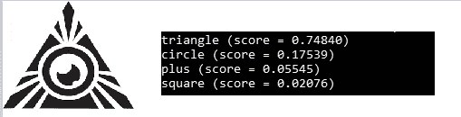

# 张量流深度学习:第二部分——图像分类

> 原文：<https://towardsdatascience.com/deep-learning-with-tensorflow-part-2-image-classification-58fcdffa7b84?source=collection_archive---------5----------------------->



image classification

大家好，欢迎回到我的紧张流系列，这是第二部分。
我已经在第一部分描述了神经网络和 Tenserflow 的逻辑和功能，也向你展示了如何建立你的编码环境。如果你还没有检查过，在这里找到它[。](https://medium.com/@m_ko/deep-learning-with-tensorflow-part-1-b19ce7803428)

图像识别和分类是这一部分的主题。使用 Inception-v3 模型，我们将开始使用 Google 预先训练的 ImageNet 数据集对图像进行分类，然后继续构建我们自己的分类器。我们开始吧。

## 什么是 inception-v3 模型？

[Inception v3](https://github.com/tensorflow/models/tree/master/inception) 模型是一个[深度卷积神经网络](https://ujjwalkarn.me/2016/08/11/intuitive-explanation-convnets/)，它已经使用 2012 年的数据为 [ImageNet](http://image-net.org/) 大型视觉识别挑战进行了预训练，它可以区分 1000 个不同的类别，像“猫”、“洗碗机”或“飞机”。

TensorFlow 团队已经准备了关于如何在你的机器上执行图像分类的[教程](https://www.tensorflow.org/tutorials/image_recognition)。不过，我还是会给你看的。

# 基于预训练 ImageNet 数据集的图像分类

因为我们不是从零开始，所以从克隆 GitHub 的 [Tensorflow 模型 repo](https://github.com/tensorflow/models) sitory 开始。运行以下命令:

```
git clone https://github.com/tensorflow/models.git
cd models/tutorials/image/imagenet
python classify_image.py
```

如果你还没有安装 Git，在这里下载[。](https://git-scm.com/download/win)

当程序第一次运行时，从谷歌的后端下载训练好的模型。您的硬盘上需要大约 200 MB 的可用空间。


上述命令将对提供的熊猫图像进行分类。

如果模型正确运行，脚本将产生以下输出:

```
giant panda, panda, panda bear, coon bear, Ailuropoda melanoleuca (score = 0.88493)
indri, indris, Indri indri, Indri brevicaudatus (score = 0.00878)
lesser panda, red panda, panda, bear cat, cat bear, Ailurus fulgens (score = 0.00317)
custard apple (score = 0.00149)
earthstar (score = 0.00127)
```

如果您希望提供其他图像，您可以通过编辑`--image_file`参数来实现:

```
python classify_image.py --iAmAdifferentImage.jpg
```

这并不难，是吗？但是不要担心，它会变得更有挑战性。上面的脚本允许我们在 Google 团队预先训练的课程上对图像进行分类。但是如果你想为我们自己的课程重新培训盗梦空间呢？

# 针对特定类别重新培训 Inception 的最终层



Inception’s layer model

## 设置

我们将向初始模型添加四个新的类，称为“圆形”、“正方形”、“加号”和“三角形”。

首先从 GitHub 克隆我的存储库，键入:

```
git clone [https://github.com/koflerm/tensorflow-image-classifier.git](https://github.com/koflerm/tensorflow-image-classifier.git)
```

在您克隆了提到的存储库之后，我们必须以某种方式告诉 Inception 每个图像的正确标签是什么。

因为我们要对一个对象是三角形、正方形、加号还是圆形进行分类，所以我们需要添加一个“training_dataset”目录，并用四个子文件夹填充它，并以“class”标签命名。这些文件夹将包含要进行分类的受试者的数据集(图像)。

```
/
--- /training_dataset
|    |
|    --- /circle
|    |    circle1.jpg
|    |    circle_small_red.png
|    |    ...
|    |
|    --- /square
|         square.jpg
|         square3.jpg
|         ...
```

接下来，我们必须实际获取用于训练过程的数据集。由于手动下载每张图片非常耗时，我们使用了一个名为“ [Fatkun 批量下载图片](https://chrome.google.com/webstore/detail/fatkun-batch-download-ima/nnjjahlikiabnchcpehcpkdeckfgnohf)”的 Chrome 扩展。它允许我们从谷歌图片搜索中自动下载前 50 张图片。只需将它们复制到文件夹中(图像格式并不重要！)


exemplary training images for class “plus”

## 执行

设置好所有目录和数据集后，开始训练吧！双击执行`train.sh`脚本。该脚本安装初始模型(如果还没有安装的话),并为指定的图像数据集启动重新训练过程。



re-training process

一旦这个过程完成，它将返回大约 90%的训练准确率。

重新培训的标签、图表和培训总结将保存在名为`tf_files`的文件夹中，以备您查看。

在重新训练模型之后，现在是在我们自己的图像上测试模型的时候了。下载或绘制另一个图像，并将其复制到根目录。我下载了另一张“三角形”图片。通过键入以下命令执行测试:

```
python classify.py downloadedImage.jpg
```



left: downloadedImage.jpg | right: score for each class

太好了，我的三角形居然被归为三角形！

(可选):如果您已经为新类添加了一些图像或子文件夹，但是您不想调用`train.sh`和`classify.sh`，您可以通过键入以下命令来合并输入:

```
python retrain.py — bottleneck_dir=tf_files/bottlenecks — how_many_training_steps=500 — model_dir=inception — summaries_dir=tf_files/training_summaries/basic — output_graph=tf_files/retrained_graph.pb — output_labels=tf_files/retrained_labels.txt — image_dir=training_dataset — eval_step_interval=100 & python classify.py image.jpg
```

> 注意:image.jpg 是您想要测试的图像

## 分类问题

尽管分类在大多数情况下确实有效，但还是有一些问题:


Gets recognized as a plus



Again, not recognized as a circle

Inception 是为单标签图像分类而训练的，这意味着多标签分类是不可能的。如果我仍然想将上面的图像归类为圆形，我只需为该类使用更准确的训练集。这实际上有点费时，单靠 Chrome 扩展无法为你提供所有最好的结果。

## 好了，我们已经看到程序做了它应该做的事情(至少大部分时间)。但是再培训过程是如何进行的呢？

基本上，该脚本加载预训练的 Inception v3 模型，移除旧的顶层，并在您想要添加的几何形状类上训练新的顶层。这就是所谓的迁移学习。再培训分为两个阶段——瓶颈和培训:

第一阶段分析磁盘上的所有映像，并计算每个映像的瓶颈值。“瓶颈”是一个非正式的术语，指的是实际进行分类的最终输出层之前的层。它将图像处理成有意义且简洁的图像摘要。

第二阶段是网络顶层的实际训练。您可以看到一系列的步骤输出，每个输出都显示了训练精度、验证精度和交叉熵。训练准确度显示了在训练中使用的图像的百分比被标记为正确的类别。验证准确度是从不同组中随机选择的一组图像的精确度。交叉熵是一个损失函数，它给出了学习过程进展如何的一瞥。

如果你想深入了解，请往这边走

# 结论

恭喜，你现在能够使用 Tensorflow 对图像进行分类。在第三部分，我将向您展示 Tensorflow 的一些其他用例。所以请继续关注，直到下一篇文章！

__

链接到第三部分:[https://medium . com/forward-data-science/deep-learning-with-tensor flow-Part-3-music-and-text-generation-8 a3 FB FDC 5 e 9 b](https://medium.com/towards-data-science/deep-learning-with-tensorflow-part-3-music-and-text-generation-8a3fbfdc5e9b)