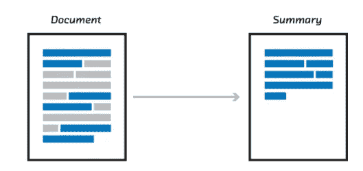
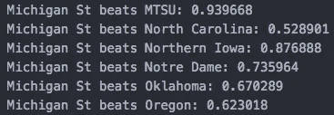
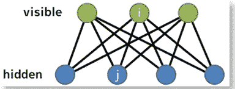
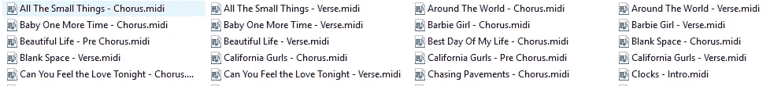
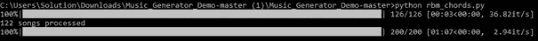
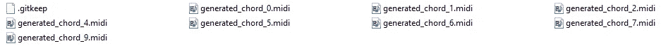
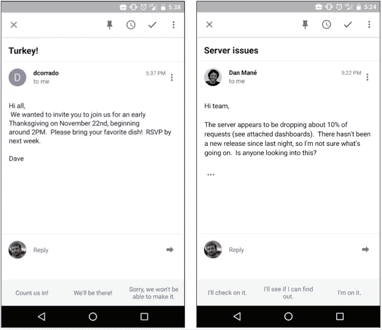
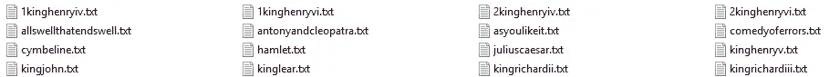
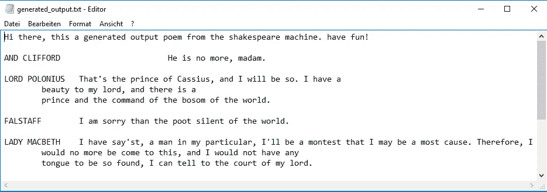

# 使用 Tensorflow 进行深度学习:第 3 部分—音乐和文本生成

> 原文：<https://towardsdatascience.com/deep-learning-with-tensorflow-part-3-music-and-text-generation-8a3fbfdc5e9b?source=collection_archive---------3----------------------->



text summarization: one example of generating text using Tensorflow

大家好，欢迎回到我的紧张流系列，这是第三部分。
我已经在[的第一部分](https://medium.com/towards-data-science/deep-learning-with-tensorflow-part-1-b19ce7803428)中描述了神经网络和 Tenserflow 的逻辑和功能，并在[的第二部分向你展示了如何进行图像分类。](https://medium.com/towards-data-science/deep-learning-with-tensorflow-part-2-image-classification-58fcdffa7b84)在这一部分，我将向您概述 Tensorflow 应用程序，并向您展示如何生成音乐和文本。

Tensorflow 允许我们构建复杂的应用程序。在处理多个输入源时，几乎所有事情都可以用 Tensorflow 来实现，甚至特斯拉的自动驾驶仪也可以用它来制作。为了更好地了解 Tensorflow 的可能性，我收集了人们已经用它制作的例子的简短摘要:



Predicting college basketball results through the use of Deep Learning

*   处理文本:[垃圾邮件过滤器](http://jrmeyer.github.io/tutorial/2016/02/01/TensorFlow-Tutorial.html)，[电子邮件自动回答](https://research.googleblog.com/2015/11/computer-respond-to-this-email.html)，[聊天机器人](https://chatbotsmagazine.com/contextual-chat-bots-with-tensorflow-4391749d0077)，[体育预测](https://blog.coast.ai/this-is-how-i-used-machine-learning-to-accurately-predict-villanova-to-win-the-2016-march-madness-ba5c074f1583)
*   处理图像:[自动癌症检测](https://blog.insightdatascience.com/automating-breast-cancer-detection-with-deep-learning-d8b49da17950) n，[街道检测](https://hackernoon.com/building-an-insanely-fast-image-classifier-on-android-with-mobilenets-in-tensorflow-dc3e0c4410d4)
*   处理音频和语音:[声音生成](https://magenta.tensorflow.org/nsynth-fastgen)，[语音识别](https://medium.com/towards-data-science/detecting-bats-by-recognising-their-sound-with-tensorflow-cdd5e1c22b14)

接下来，我将更详细地解释音乐生成和文本生成。我们将开始研究音乐生成，今天生成音乐的可能性，我们将编写自己的流行音乐生成器。稍后，我们将看看文本生成，一个具体的例子，并建立我们自己的诗歌生成器。让我们开始吧。

# [🎵](https://emojipedia.org/musical-note/)音乐一代

## 介绍

亲爱的歌曲作者，
我很抱歉地告诉你，但在未来几年内，你将被机器学习算法取代。为什么？因为现在音乐可以由电脑生成。想象一下这种工具的威力。与创作一首歌所需的数百个小时相比，在一个程序中点击“开始”根本不算什么。

我想这对一些人来说可能听起来有点奇怪，考虑到音乐通常被称为“情感”和“感觉”的东西，而不是“事实”或“数学”的东西，但机器学习使这成为可能。但是它是如何工作的呢？

所以，假设你想做一首特别的歌，一首“快乐”和“有趣”的歌。第一步是获得一组带有情感标签的歌曲数据。这个程序会把语音转换成文本。对于每个单词，程序会创建向量并训练模型。完成训练后，程序会找到你输入的相关向量(“快乐”和“有趣”)，并将它们与之前创建的向量进行比较。输出将是一组代表你想要的情感的和弦。

## 生成音乐的可能性

Example song, generated with Magenta

[Magenta](https://magenta.tensorflow.org/) 是目前最先进的机器学习音乐生成技术，但你自己听听。这是一个来自谷歌大脑团队的项目，它问:我们可以使用机器学习来创作引人注目的艺术和音乐吗？Magenta 建立在 TensorFlow 之上，使用 CNN 系统。

## 建造我们自己的音乐发电机

虽然 Magenta 非常强大，但我们将使用*受限玻尔兹曼机器(RBM)* 构建我们自己的简单音乐生成器来生成短序列的流行音乐。

我们将收到多个文件，如果您将它们链接在一起，听起来会像这样:

Transistions between the files aren’t smooth, that’s not because of the generated music itself!

我们的训练数据将在一百个流行歌曲的 MIDI 文件左右( *MIDI* 是一种直接编码音符的格式)。为了简单起见，我们不会像介绍中描述的那样给它们贴上情绪的标签，我们的输出将是另一种流行旋律，就像我们的训练文件一样。



*RBM* 是一个有两层的神经网络，可见层和隐藏层。每个可见节点都连接到每个隐藏节点(反之亦然)，但没有可见-可见或隐藏-隐藏连接(节点只是进行计算的地方)。这就是*限制*。每个可见节点取一个弦。每个和弦乘以一个*权重*，然后是隐藏层节点的输出。与大多数神经网络不同，RBM 是直接对数据的概率分布建模的生成模型。为了从 RBM 采样，我们执行一种称为 [*吉布斯采样*](https://stats.stackexchange.com/questions/10213/can-someone-explain-gibbs-sampling-in-very-simple-words) *的算法。如果你想了解更多关于 RBM 氏症的知识，请走这条路。*

理论谈得够多了，让我们从从 GitHub 克隆我的 repo 开始构建吧。打开终端并键入:

```
git clone [https://github.com/koflerm/tensorflow-music-generator.git](https://github.com/koflerm/tensorflow-music-generator.git)
```

接下来，我们必须安装几个库:

```
pip3 install pandas
pip3 install msgpack-python
pip3 install glob2
pip3 install tqdm
pip3 install py-midi
```

我们将按如下方式使用它们:

*   熊猫是我们的数据分析库
*   Midi 作为我们音乐文件的辅助库
*   TQDM，用于在进程中打印进度条。



set of pop song sequences

歌曲存储在`Pop_Music_Midi`文件夹中。你也可以使用你自己的训练数据，但是歌曲必须是 MIDI 格式的。).在这里找到一些。

基本上，这就是准备工作，你现在可以执行程序了。要运行该脚本，只需编写:

```
python rbm_chords.py
```



Training process

培训将需要 5-10 分钟。输出将是`out`文件夹中 MIDI 文件的集合，每个文件大约 10 秒长。如果你只想听“一首歌”，你也可以写一个脚本把它们连接起来。



output

就是这样，你成功创作了音乐。如果你没有理解我写的所有内容(对不起…)，我强烈推荐你分别阅读和聆听这两个帖子:

*   [https://www.youtube.com/watch?v=ZE7qWXX05T0&feature = youtu . be](https://www.youtube.com/watch?v=ZE7qWXX05T0&feature=youtu.be)
*   [http://danshiebler . com/2016-08-10-musical-tensor flow-part-one-the-RBM/](http://danshiebler.com/2016-08-10-musical-tensorflow-part-one-the-rbm/)

# [✍](https://emojipedia.org/writing-hand/) 文字生成

## 介绍

如前所述，在不久的将来，算法可能会取代歌曲作者。嗯，这也适用于诗人。我们将编写一个程序，根据威廉·莎士比亚的戏剧生成一首诗。训练数据(诗歌)存储为文本文件，文件名也是标签。首先，我将向您展示另一个使用 Tensorflow 生成文本的示例。

## 谷歌收件箱中的智能回复



Smart Reply System, integrated in the Inbox app on Android

用手机回复电子邮件是一件非常痛苦的事情，即使是简短的回复。这就是谷歌在其收件箱应用中实现*智能回复*的原因。他们希望建立一个系统，可以自动确定电子邮件是否可以用简短的回复来回答(文本识别)，并为其撰写一些合适的回复(文本生成)。

他们需要建立一个机器学习系统，因为想象一下使用一个依赖于手工制作的常见回复场景规则的系统。任何工程师发明“规则”的能力都会很快被大量不同的写作风格超越。相比之下，机器学习系统可以自己捕捉不同的情况。它比基于规则的系统更好地概括和处理新输入。

谷歌选择在一对[循环神经网络](https://en.wikipedia.org/wiki/Recurrent_neural_network) (RNN)的基础上建立智能回复系统，一个用于编码收到的电子邮件，一个用于预测可能的回复。编码网络一次提取一个新邮件的单词，并生成一个向量。这种所谓的“[思维向量](http://www.extremetech.com/extreme/206521-thought-vectors-could-revolutionize-artificial-intelligence)”抓住了所说内容的核心，而不会纠结于它是如何说的(例如，向量“你明天有空吗？”应该与“明天你方便吗？”的向量相同).第二个网络从这个思维向量开始，一次一个单词地做出语法正确的回复，就像在打字一样。每个网络的详细操作完全是通过训练模型来预测可能的反应而学习的。

对智能回复系统感兴趣？在这里阅读更详细的解释[。](https://research.googleblog.com/2015/11/computer-respond-to-this-email.html)

## 建造我们自己的诗歌生成器

是时候在威廉·莎士比亚的作品上建立我们的文本生成器了。我们将使用递归神经网络来训练我们的模型。在对它进行训练之后，我们的脚本将会生成一首诗，它既可以在终端中查看，也可以在文本文件中查看。

首先，我知道诗歌一点也不有趣。但是不用担心，你可以很容易地改变数据集；).让我们深入研究一下。

从从 GitHub 克隆我的库开始:

```
git clone [https://github.com/koflerm/tensorflow-shakespeare-poem-generator.git](https://github.com/koflerm/tensorflow-shakespeare-poem-generator.git)
```



data set consisting of multiple poems

你可以看到，有一个`Shakespeare`文件夹，里面有多首诗。简单地把你自己的 TXT 文件放在那里，如果你想改变话题。

现在是时候训练我们的语言模型了。

```
> python3 rnn_train.py
```

这需要几个小时，所以要小心！如果你没有那么多时间，你可以[下载](https://drive.google.com/file/d/0B5njS_LX6IsDc2lWTmtyanRpOHc/view)检查点文件(最终模型)。不用先训练模型！只需将文件解压到`checkpoints`文件夹中。

一切都设置好了，是时候生成一些文本了。键入以下行:

```
> python3 rnn_play.py
```

脚本 rnn_play.py 使用我们训练好的检查点生成一个新的“莎士比亚”剧本。你可以在终端和文件`output_generated.txt`中看到输出



这就是你自己的诗，用莎士比亚的方式写的。

# 结论

恭喜你，你现在可以创作你自己的音乐，也可以创作你自己版本的莎士比亚戏剧了。在下一部分，我可能会更深入地研究图像分类和物体检测。所以请继续关注，直到下一篇文章！

___

链接到第四部分:[https://medium . com/forward-data-science/deep-learning-with-tensor flow-Part-4-face-class ification-and-video-inputs-fa 078 f 22 C1 e 5](https://medium.com/towards-data-science/deep-learning-with-tensorflow-part-4-face-classification-and-video-inputs-fa078f22c1e5)