# Tensorflow 深度学习:第 4 部分—人脸分类和视频输入

> 原文：<https://towardsdatascience.com/deep-learning-with-tensorflow-part-4-face-classification-and-video-inputs-fa078f22c1e5?source=collection_archive---------1----------------------->

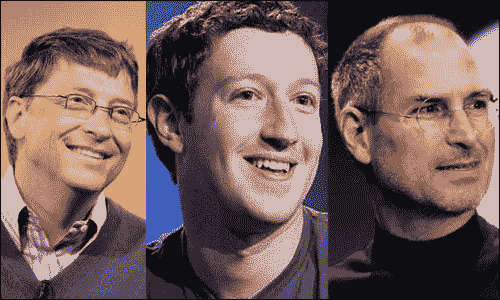

Can we classify different people?

大家好，欢迎回到我的紧张流系列，这是第 4 部分。这可能是这个系列的最后一部分，因为我们已经学到了很多:

*   [第 1 部分](https://medium.com/towards-data-science/deep-learning-with-tensorflow-part-1-b19ce7803428)全是理论，我们看了神经网络和张量流的逻辑和功能。
*   在[第二部分，我们用几何形状进行图像分类。](https://medium.com/towards-data-science/deep-learning-with-tensorflow-part-2-image-classification-58fcdffa7b84)
*   在 [part 3](https://medium.com/towards-data-science/deep-learning-with-tensorflow-part-3-music-and-text-generation-8a3fbfdc5e9b) 中，我们成功生成了自己的音乐和文字。

由于图像分类是神经网络最有趣的部分(至少在我看来)，我们将在这一部分再次进行。但是，在我们继续重建分类器以接收视频输入之前，我们将对人的图像进行分类，而不是几何形状。让我们去争取吧。

# 回顾我们在第 2 部分中构建的分类器


how did our classifier work?

你可能不记得第二部分是关于什么的，所以这里有一个简短的总结:

我们构建了一个程序，它加载了来自 Google 的预训练的 Inception v3 模型，移除了旧的顶层，并在我们想要添加的几何形状类上训练了一个新的顶层。再培训分为两个阶段——瓶颈阶段和培训阶段。瓶颈将我们的图像处理成一个有意义的和紧凑的摘要，训练实际上训练了我们神经网络的顶层。如果还是不清楚，请阅读[第二部分](https://medium.com/towards-data-science/deep-learning-with-tensorflow-part-2-image-classification-58fcdffa7b84)；)

# 给人分类

上次，我们在初始模型中添加了四类几何形状。这一次，我们将对三个不同的人进行分类:“史蒂夫·乔布斯”、“比尔·盖茨”和“马克·扎克伯格”。让我们看看《盗梦空间》是否足以区分这些人的面孔:

首先从 GitHub 克隆我的存储库，键入:

```
git clone [https://github.com/koflerm/tensorflow-image-classifier.git](https://github.com/koflerm/tensorflow-image-classifier.git)
```

接下来，我们需要添加我们的训练图像并给它们贴上标签。建立一个这样的结构:

```
/
--- /training_dataset
|    |
|    --- /billgates
|    |    billy.jpg
|    |    bill_gates.png
|    |    ...
|    |
|    --- /stevejobs
|         stevejobs.jpg
|         jobs.jpg
|         ...
|    |
|    --- /markzuckerberg
|         zuckerberg46.jpg
|         zuckerberg2020.jpg
|         ...
```

为了下载图片，我使用了一个名为“[批量下载图片](http://chrome-extension://gfjhimhkjmipphnaminnnnjpnlneeplk)”的 Chrome 扩展。这个扩展允许你自动下载谷歌图片到你的电脑上。图像格式不重要！

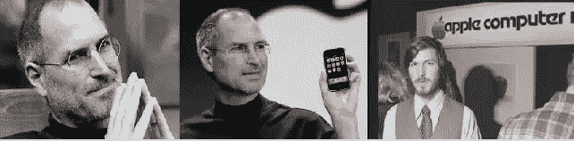

how images for the Steve-Jobs-class could look like

## 是时候训练我们的模型了

设置好数据后，让训练开始！双击执行`train.sh`脚本。该脚本安装初始模型，并为指定的图像数据集启动重新训练过程。


re-training process

一旦这个过程完成，我们的训练准确率应该在 90%左右。

在重新训练模型之后，现在是用其他图像测试模型的时候了。下载并复制到根目录，然后键入:

```
python classify.py downloadedBillGates.jpg
```

## 好吧，很好。但是我们的模型表现如何呢？


model works!

比尔·盖茨直视镜头，光线还不错，所以没问题。

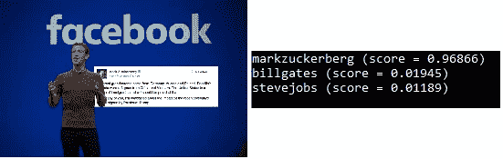

success!

令人惊讶的是，合适的人又得到了认可。图像分辨率很差(300x300)，扎克伯格甚至不在图像的中心。干得好，盗梦空间！

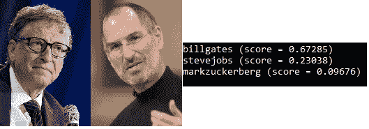

Both are recognized, but both can’t get a high score

这是一个棘手的问题！Inception 是为单标签图像分类而训练的，这意味着它的总得分为 1。多标签分类是不可能的，而且由于我们的两个类都显示在图像中，所以都不可能得到高分。如果我想让这张图片更像“史蒂夫·乔布斯”，我必须为他的班级使用更准确、更大的训练集。

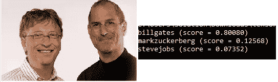

Again, Gates over Jobs

这张图片再次被归类为盖茨胜于乔布斯，这一次是以巨大的优势。我猜，在准确的照明条件下，更准确的训练集和更多的训练数据可能会让史蒂夫·乔布斯赢得这场决斗。

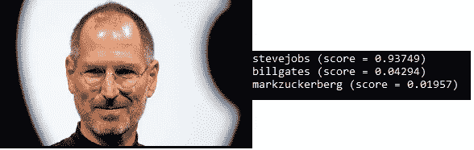

All about Steve Jobs this time

最后，这个人被认出来了！但这对我们的模特来说并不难，不是吗(很棒的灯光，他直视镜头，…)

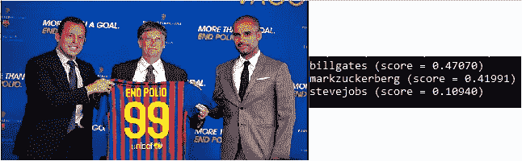

Testing on images with other, unknown people

盖茨被认出来了，马克·扎克伯格也是(尽管他不在照片上)。我猜《盗梦空间》把桑德罗·罗塞尔(左边)当成了马克·扎克伯格，但没错，肯定是不匹配！

(可选):如果您现在想要添加新的类，可以通过键入以下命令将培训和测试结合起来:

```
python retrain.py — bottleneck_dir=tf_files/bottlenecks — how_many_training_steps=500 — model_dir=inception — summaries_dir=tf_files/training_summaries/basic — output_graph=tf_files/retrained_graph.pb — output_labels=tf_files/retrained_labels.txt — image_dir=training_dataset — eval_step_interval=100 & python classify.py image.jpg
```

> 注意:image.jpg 是你想用来测试你的模型的图像

现在你知道了，我们可以用盗梦空间对人脸进行分类。但是现在，让我们继续为视频输入重建分类器。

# 重建我们的视频输入分类器

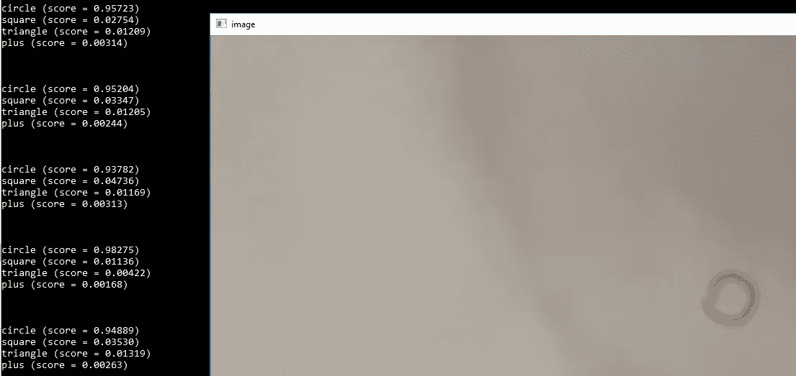

image classification using a video as input stream and analyzing it frame-by-frame

到目前为止，我们一张一张地下载了我们的测试数据，但是这很费力，不是吗？用视频输入来测试我们的模型会容易得多。我们只需要插入一个视频一次，但是分类是一帧一帧完成的。简单多了。因此，让我们建立这样一个系统:

## 我们的代码如何变化

基本上没什么变化。我们只需要触摸`classify.py`脚本。我将一步一步地引导你完成这些改变:

```
pip install opencv-py 
```

首先，打开一个终端并安装 OpenCV，一个用于视频处理和图像分析的库。

```
import cv2
import math
```

然后我们需要加载和处理我们的视频。我们通过导入 OpenCV 模块来做到这一点。数学包的导入实际上是可选的，只有当你不想处理每一帧时才需要它。

rewritten part of the code

这是代码的重要部分。如果你想更深入一点，请阅读评论，我认为他们自己说了算。原理很简单:当我们得到一个视频帧时，我们存储它并立即再次读取它用于分类目的，然后在一个单独的窗口中输出分数和帧本身。

## 现在，让我们用比尔·盖茨和史蒂夫·乔布斯的对话视频来测试我们的模型。

但首先，我认为你必须同时…执行`train.sh`并等待直到进程完成:)

然后，有趣的部分开始了。我将在下面的视频中测试我的模型:

Video does not contain Mark Zuckerberg

接下来，我们要等很长时间，直到比尔·盖茨第一次被拍摄。分类器有什么反应？

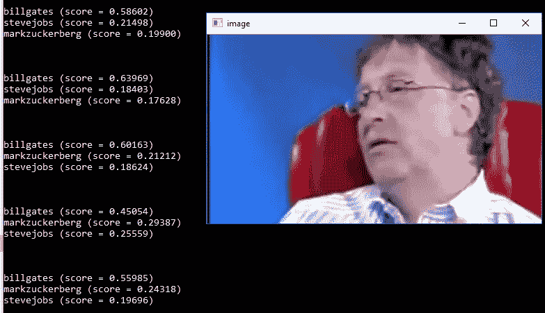

Gates gets recognized more or less

正如我们所看到的，模型实际上对他进行了正确的分类，尽管比尔·盖茨的头被切掉了一点。我们当然知道我们的模型现在确实适用于视频，但它也能识别史蒂夫·乔布斯吗？

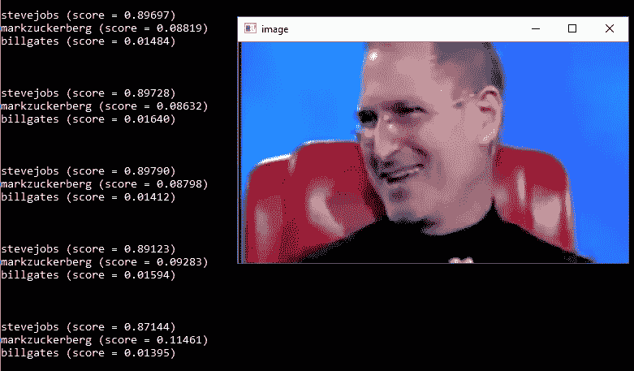

Perfect recognition

是的。用乔布斯的话其实更好，分数大概是 0.9。但是有一个问题仍然悬而未决:如果两个人都在同一个框架里会发生什么？

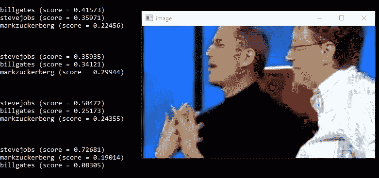

Jobs over Gates here

这个框架被归类为“工作”。前面解释过，分数加起来一个，两个人都拿不到高分。

现在是时候接受新的挑战了:手绘。我们的模型能识别手绘物体吗？
我们将再次添加四个几何类“圆”、“三角形”、“正方形”和“加号”来完成:

## 让我们用手绘视频作为输入来测试我们的模型

因此，首先我们必须再次将我们的类添加到模型中，以防您在第 2 部分中删除了它们。最终，培训文件夹中应该会有这样的结构。

```
/
--- /training_dataset
|    |
|    --- /billgates
|    --- /stevejobs
|    --- /markzuckerberg
|    --- /circle
|    --- /square
|    --- /plus
|    --- /triangle
```

用训练图像填充所有这些文件夹。我将用谷歌搜索的图像填充它们，尽管这些图像不会是手绘！看事情如何发展会很有趣。

接下来，训练。在拍摄你自己的几何图形定制视频之前，运行`train.sh`脚本来添加新的类到模型中。你也可以用我的，在 GitHub 上我的回购里找到的`math_own_old.mp4`。

那么，我们来对一些框架进行分类。在命令行输入`python classify.py math_own_old.mp4`，看看你的模型是否能够识别正确的形状。

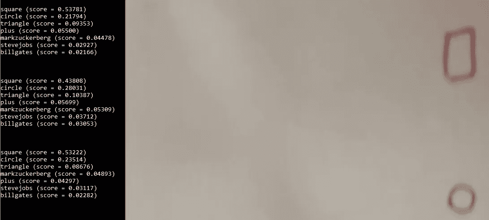

Square gets classified correctly

多好的开始啊！正方形是成功的，但是其他的物体呢？

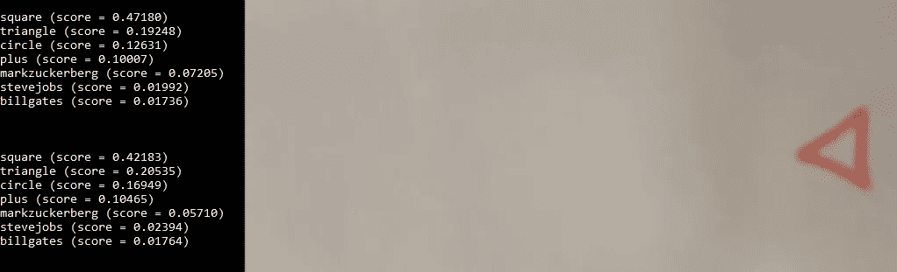

Our model mistakes triangle

好了，你知道了。我们的模型不识别手绘的三角形，它认为它是正方形。也许下一个…

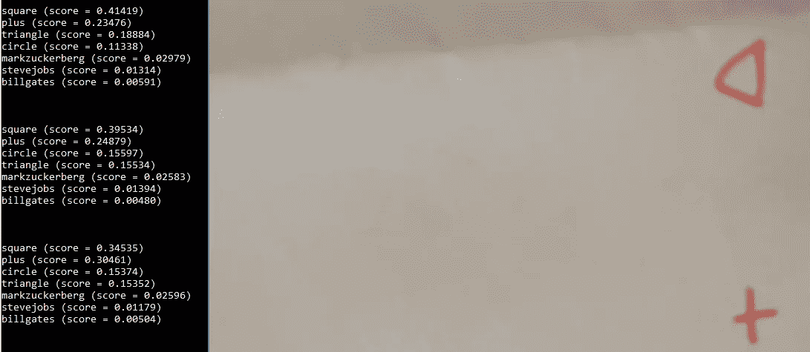

Again, triangle not recognized

这值得一试，但它再次认为它是一个正方形。奇怪的是，加号似乎对模型也是不可见的。秘社是我们最后的希望！

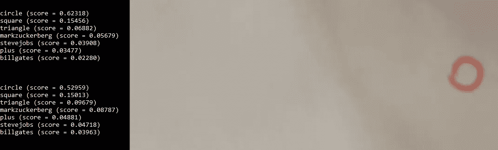

Success!

是的，圆得到正确分类！但正如所见，对于一个由计算机生成的图像训练的模型来说，识别分辨率很差的手绘图片是非常困难的。

# 结论

所以，现在你知道了，用盗梦空间和张量流对人进行分类是可能的。此外，您还学习了如何重写一些代码来使用视频作为输入源。这是这个系列的最后一部分，我希望你喜欢这个旅程。我自己肯定学到了很多。如果你有任何类型的反馈给我，我会很感激的 [✌](https://emojipedia.org/victory-hand/)