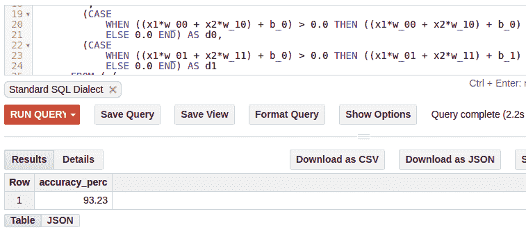
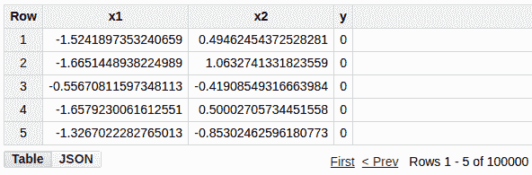
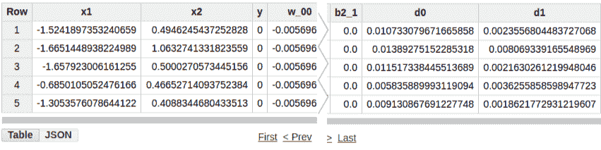
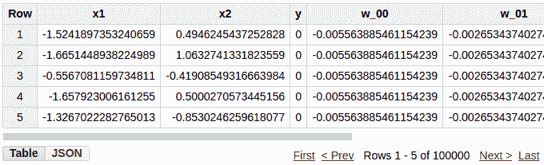
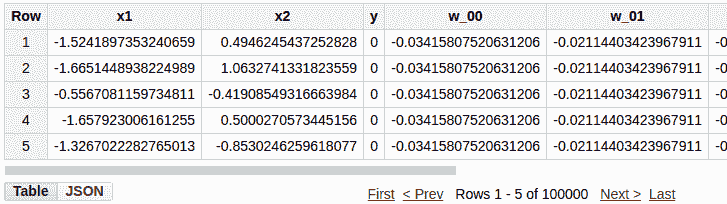

# 在 BigQuery 上用纯 SQL 实现的深度神经网络

> 原文：<https://towardsdatascience.com/deep-neural-network-implemented-in-pure-sql-over-bigquery-f3ed245814d3?source=collection_archive---------2----------------------->

在这篇文章中，我们将纯粹用 SQL 实现一个基本的深度神经网络。神经网络训练的端到端步骤(包括前向传递和反向传播)将作为 BigQuery 上的单个 SQL 查询来实现。由于它运行在 Bigquery 上，实际上我们是在 100 到 1000 台服务器上执行分布式神经网络训练。听起来很酷！对吗？

也就是说，请注意，这是一个有趣的项目，用来测试 SQL 和 BigQuery 的局限性，并从声明性数据转换的角度来看神经网络训练。这是在没有任何实际应用的情况下完成的，尽管我将在最后讨论一些实际的研究意义。让我们开始吧。

我们将从一个简单的基于神经网络的分类器开始。它的输入维数为 2，输出为二进制。我们将有一个 2 维的隐藏层和 ReLU 激活函数。输出层将有一个最终带有 softmax 函数的二维输出。我们在实现网络时将遵循的步骤是 Karpathy 的 CS231n [教程](https://cs231n.github.io/neural-networks-case-study/)中所示的 Python 示例的基于 SQL 的版本。

## 模型

该模型具有以下参数:

**输入隐藏**

*   `W` : 2x2 权重矩阵(元素:`w_00, w_01, w_10, w_11`)
*   `B` : 2x1 偏置矢量(元素:`b_0, b_1`)

**隐藏到输出**

*   `W2` : 2x2 权重矩阵(元素:`w2_00, w2_01, w2_10, w2_11`)
*   `B2` : 2x1 偏置矢量(元素:`b2_0, b2_1`)

训练数据存储在 BigQuery 表中，其中列`x1`和`x2`具有输入，y 具有输出，如下所示(表名:`example_project.example_dataset.example_table`)。

如前所述，我们将把整个训练作为一个 SQL 查询来实现。训练完成后，查询将返回参数值。正如您可能已经猜到的，这将是一个嵌套很深的查询。我们将逐步构建来准备这个查询。我们将从最里面的子查询开始，然后我们将一个接一个地添加嵌套的外层。

## 前进传球

最初，我们将为权重参数`W`和`W2`分配随机正常值，并为偏差参数`B`和`B2`分配零值。`W`和`W2`的随机值可以在 SQL 本身中生成。为简单起见，我们将在外部生成这些值，并在 SQL 查询中使用。用于初始化参数的内部子查询是:

请注意，表`example_project.example_dataset.example_table`已经包含列`x1`、 `x2`和`y`。模型参数将作为附加列添加到上述查询的结果中。

接下来，我们将计算隐藏层。我们将用包含元素`d0`和`d1`的矢量`D`来表示隐藏层。我们需要执行矩阵运算:`D = np.maximum(0, np.dot(X, W) + B)`，其中`X`表示输入向量(元素`x1`和`x2`)。该矩阵运算首先将`X`乘以`W`中的权重，然后加上偏置向量`B`。然后，结果通过非线性`ReLu`激活函数，该函数将负值设置为 0。SQL 中的等效查询是:

上面的查询在前一个内部子查询的结果中添加了两个新列`d0`和`d1`。上述查询的输出如下所示。

这就完成了输入到隐藏层的转换。现在我们将执行隐藏层到输出层的转换。

首先，我们将计算输出图层的分数。公式为:`scores = np.dot(D, W2) + B2`。然后，我们将对分数应用 softmax 函数，以获得每个类别的预测概率。SQL 中等效的内部子查询是:

这就完成了神经网络的正向传递。接下来，我们将基于预测输出(`probs`)与预期输出(`Y`)的比较，进行反向传播以调整模型参数。

首先，我们将计算当前预测导致的总损失。我们将使用交叉熵损失函数来计算损失。我们将首先计算每个例子中正确类别的预测概率的负对数。交叉熵损失只不过是在`X`和`Y`的所有实例中这些值的平均值。自然对数是一个[递增函数](http://mathworld.wolfram.com/IncreasingFunction.html)。因此，直观地将损失定义为正确类别的预测概率的对数的负值。如果正确类别的预测概率很高，则损失会很低。相反，如果正确类别的预测概率较低，丢失率将会较高。

为了减少过度拟合的机会，我们还将添加 L2 正则化。在总损失中，我们将包括`0.5*reg*np.sum(W*W) + 0.5*reg*np.sum(W2*W2)`，其中`reg`是一个超参数。在损失中包括这个函数将会惩罚权重向量中的高幅度值。

在查询中，我们还将统计训练示例的数量(`num_examples`)。这在以后计算平均值时会很有用。计算总损失的 SQL 查询是:

## 反向传播

接下来，对于反向传播，我们将计算每个参数相对于损耗的偏导数。我们将使用链式法则从最后一层开始逐层计算。首先，我们将通过使用交叉熵和 softmax 函数的导数来计算分数的梯度。与此对应的查询是:

回想一下，我们使用`scores = np.dot(D, W2) + B2`计算分数。因此，基于分数的导数(称为`dscores`，我们可以计算隐藏层 D 的梯度和模型参数`W2`和`B2`。相应的查询是:

以类似的方式进行，我们知道`D = np.maximum(0, np.dot(X, W) + B)`。因此，通过使用`D`的导数，我们可以计算`W`和`B`的导数。计算`X`的导数没有意义，因为它不是模型参数或使用任何模型参数计算。计算`W`和`B`的导数的查询是:

最后，我们将使用它们各自的梯度更新模型参数`W, B, W2`和`B2`。这可以通过`param -= learning_rate * d_param`来计算，其中`learning_rate`是一个参数。在`dW`和`dW2`中还将增加一个额外的因子`reg*weight`，以将`L2`正则化合并到梯度计算中。我们还将删除临时列，如`dw_00`、`correct_logprobs`等。它是我们在内部子查询中创建的，只保留训练数据(列`x1`、`x2`和`y`)和模型参数(权重和偏差)。相应的查询是:

这完成了正向传递和反向传播的一次迭代。上述查询将提供权重和偏差的更新值。样本结果如下所示:

为了进行更多的训练迭代，我们将递归地执行上述所有步骤。我们可以使用一个简单的 Python 函数来实现。该代码可在[链接](https://github.com/harisankarh/nn-sql-bq/blob/master/training.py)中找到。随着我们增加更多的迭代，查询得到了大量的嵌套。执行 10 次训练迭代的结果查询可在[链接](https://github.com/harisankarh/nn-sql-bq/blob/master/out.txt)中获得。

由于大量的嵌套和查询的复杂性，当我试图在 BigQuery 中执行它时，遇到了多个资源限制。与遗留的 SQL 方言相比，Bigquery 的标准 SQL 方言具有更好的伸缩性。即使使用标准 SQL，对于具有 100k 个实例的数据集，也很难执行 10 次以上的迭代。由于资源的限制，我们将在一个简单的决策边界上评估这个模型，这样我们就可以通过少量的迭代获得相当好的精度。

我们将使用一个简单的数据集，其输入`x1`和`x2`是从均值为 0、方差为 1 的正态分布中采样的。二进制输出 y 简单地检查`x1 + x2`是否大于零。为了在 10 次迭代内训练得更快，我们将使用 2.0 的高学习率(注意:在实践中不推荐这么高的值，因为学习可能会发散)。应用上述查询 10 次迭代，得到如下所示的学习模型参数。

我们将使用 Bigquery 的' [save to table](https://cloud.google.com/bigquery/docs/writing-results#saving_query_results_to_a_table) '功能将结果存储到一个新表中。现在，我们可以通过仅执行正向传递，然后比较预测结果和预期结果，来检查训练数据的准确性。这个查询片段在[链接](https://github.com/harisankarh/nn-sql-bq/blob/master/query_for_prediction.sql)中。我们能够通过 10 次迭代获得 93%的准确度(在单独的测试数据集上准确度是相似的)。

如果我们能进行大约 100 次迭代，我们将获得超过 99%的准确率。

## 最佳化

这就结束了在 BigQuery 中使用纯 SQL 实现深度神经网络的有趣项目。我们将何去何从？正如我们看到的，资源限制是限制数据集大小和我们可以执行的训练迭代次数的因素。除了希望谷歌放松资源限制，我们可以做多种优化来解决这个问题。

*   我们可以创建中间表和多个 SQL 查询来执行更多的迭代。例如，前 10 次迭代的结果可以存储在中间表中。现在可以在这个中间表上应用相同的训练查询来执行接下来的 10 次迭代。因此，实际上，我们已经执行了 20 次训练迭代。这可以重复多次，以执行大量的迭代。
*   我们可以尽可能使用函数的函数，而不是在每一步都添加外部查询。例如，我们可以在一个子查询中计算`scores`和`probs`，而不是两个嵌套的子查询。
*   在上面的例子中，我保留了所有的中间列，直到最后一个外部查询。其中一些，比如`correct_logprobs`，可以提前删除(尽管 SQL 引擎可能会自动执行这种优化)。
*   可以探索用户定义函数(UDF)的应用。如果感兴趣，您可以查看一个[项目](https://github.com/groovenauts/QueryItSmart/blob/master/whatisit.md)，其中使用 BigQuery UDF 进行模型服务(但是，不使用 SQL 或 UDF 进行训练)。

## 含义

现在，让我们看看深度学习环境中分布式 SQL 引擎的更深层含义。BigQuery 和 Presto 之类的仓库 SQL 引擎的一个局限性是查询处理是使用 CPU 而不是 GPU 来执行的。使用 GPU 加速的 SQL 数据库(如 blazingdb 和 mapd)检查结果会很有趣。一种简单的检验方法是使用分布式 SQL 引擎执行查询和数据分发，并使用 GPU 加速数据库执行本地计算。

退一步，我们可以看到，现在，执行分布式深度学习是很难的。几十年来，大量的研究工作已经深入到分布式 SQL 引擎中，从而产生了查询规划、数据分区、操作符放置、检查点、多查询调度等技术。其中一些可以纳入分布式深度学习。如果你对这些方面感兴趣，请看看这篇关于分布式数据库和深度学习的一般研究讨论的[论文](https://sigmodrecord.org/publications/sigmodRecord/1606/pdfs/04_vision_Wang.pdf)。

希望你和我一样开心！请在下面分享你的评论和想法。我很乐意回应。